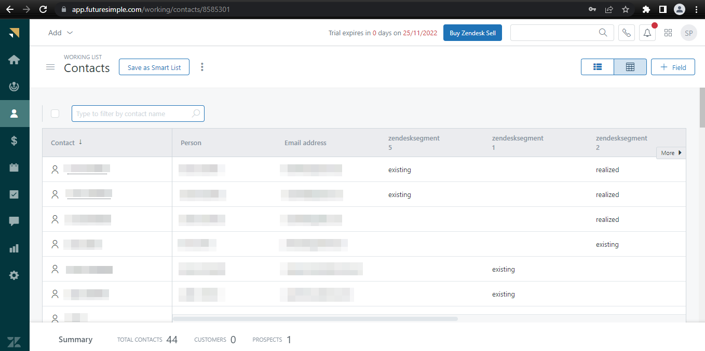

# [!DNL Zendesk]個連線

[[!DNL Zendesk]](https://www.zendesk.com)是客戶服務解決方案和銷售工具。

此[!DNL Adobe Experience Platform] [目的地](/help/destinations/home.md)利用[[!DNL Zendesk] 連絡人API](https://developer.zendesk.com/api-reference/sales-crm/resources/contacts/)在對象中&#x200B;**建立和更新身分識別**，作為[!DNL Zendesk]內的連絡人。

[!DNL Zendesk]使用持有人權杖作為驗證機制來與[!DNL Zendesk]連絡人API通訊。 [向目的地驗證](#authenticate)區段中進一步說明如何向您的[!DNL Zendesk]執行個體進行驗證。

## 使用案例 {#use-cases}

多管道B2C平台的客戶服務部門想要確保其客戶獲得順暢的個人化體驗。 部門可以從他們自己的離線資料建立對象，以建立新的使用者設定檔或更新不同互動（例如購買、退貨等）的現有設定檔資訊 並從Adobe Experience Platform將這些對象傳送至[!DNL Zendesk]。 在[!DNL Zendesk]中取得更新的資訊，可確保客戶服務代理程式能立即取得客戶的最新資訊，以更快的速度回應和解決問題。

## 先決條件 {#prerequisites}

### Experience Platform必要條件 {#prerequisites-in-experience-platform}

在啟用資料到[!DNL Zendesk]目的地之前，您必須在[!DNL Experience Platform]中建立[結構描述](/help/xdm/schema/composition.md)、[資料集](https://experienceleague.adobe.com/docs/platform-learn/tutorials/data-ingestion/create-datasets-and-ingest-data.html)和[區段](https://experienceleague.adobe.com/docs/platform-learn/tutorials/segments/create-segments.html)。

如果您需要對象狀態的指引，請參閱[對象成員資格詳細資料結構描述欄位群組](/help/xdm/field-groups/profile/segmentation.md)的Experience Platform檔案。

### [!DNL Zendesk]必要條件 {#prerequisites-destination}

若要將資料從Platform匯出至您的[!DNL Zendesk]帳戶，您必須擁有[!DNL Zendesk]帳戶。

#### 收集[!DNL Zendesk]認證 {#gather-credentials}

在驗證[!DNL Zendesk]目的地之前，請記下以下專案：

| 認證 | 說明 | 範例 |
| --- | --- | --- |
| `Bearer token` | 您已在您的[!DNL Zendesk]帳戶中產生的存取Token。  請依照檔案說明來[產生 [!DNL Zendesk] 存取權杖](https://developer.zendesk.com/documentation/sales-crm/first-call/#1-generate-an-access-token) （如果您沒有的話）。 | `a0b1c2d3e4...v20w21x22y23z` |

## 護欄 {#guardrails}

[定價和速率限制](https://developer.zendesk.com/api-reference/sales-crm/rate-limits/#pricing)頁面詳細說明與您的帳戶相關聯的[!DNL Zendesk] API限制。 您必須確保資料與承載皆符合這些限制。

## 支援的身分 {#supported-identities}

[!DNL Zendesk]支援下表中描述的身分更新。 深入瞭解[身分](/help/identity-service/features/namespaces.md)。

| 目標身分 | 範例 | 說明 | 強制 |
|---|---|---|---|
| `email` | `test@test.com` | 連絡人的電子郵件地址。 | 是 |

## 匯出型別和頻率 {#export-type-frequency}

請參閱下表以取得目的地匯出型別和頻率的資訊。

| 項目 | 類型 | 附註 |
---------|----------|---------|
| 匯出類型 | **[!UICONTROL 以設定檔為基礎]** | <ul><li>您正在匯出區段的所有成員，以及所需的結構描述欄位&#x200B;*（例如：電子郵件地址、電話號碼、姓氏）* （根據您的欄位對應）。</li><li> 根據[對象排程](#schedule-segment-export-example)步驟期間提供的&#x200B;**[!UICONTROL 對應ID]**&#x200B;值，[!DNL Zendesk]中的每個區段狀態都會以來自Platform的對應對象狀態更新。</li></ul> |
| 匯出頻率 | **[!UICONTROL 串流]** | <ul><li>串流目的地是「一律開啟」的API型連線。 一旦根據對象評估在Experience Platform中更新了設定檔，聯結器就會將更新傳送至下游的目的地平台。 深入瞭解[串流目的地](/help/destinations/destination-types.md#streaming-destinations)。</li></ul> |

{style="table-layout:auto"}

## 連線到目標 {#connect}

>[!IMPORTANT]
>
>若要連線到目的地，您需要&#x200B;**[!UICONTROL 檢視目的地]**&#x200B;和&#x200B;**[!UICONTROL 管理目的地]** [存取控制許可權](/help/access-control/home.md#permissions)。 閱讀[存取控制總覽](/help/access-control/ui/overview.md)或連絡您的產品管理員以取得必要的許可權。

若要連線到此目的地，請依照[目的地組態教學課程](../../ui/connect-destination.md)中所述的步驟進行。 在設定目標工作流程中，填寫以下兩個區段中列出的欄位。

在&#x200B;**[!UICONTROL 目的地]** > **[!UICONTROL 目錄]**&#x200B;內，搜尋[!DNL Zendesk]。 或者，您可以在&#x200B;**[!UICONTROL CRM]**&#x200B;類別下找到它。

### 驗證目標 {#authenticate}

填寫以下必填欄位。 如需任何指引，請參閱[收集 [!DNL Zendesk] 認證](#gather-credentials)區段。
* **[!UICONTROL 持有人權杖]**：您已在[!DNL Zendesk]帳戶中產生的存取權杖。

若要驗證到目的地，請選取&#x200B;**[!UICONTROL 連線到目的地]**。

如果提供的詳細資料有效，UI會顯示帶有綠色勾號的&#x200B;**[!UICONTROL 已連線]**&#x200B;狀態。 然後您可以繼續下一步驟。

### 填寫目標詳細資訊 {#destination-details}

若要設定目的地的詳細資訊，請填寫下方的必填和選用欄位。 UI中欄位旁的星號表示該欄位為必填欄位。

* **[!UICONTROL 名稱]**：您日後可辨識此目的地的名稱。
* **[!UICONTROL 描述]**：可協助您日後識別此目的地的描述。

### 啟用警示 {#enable-alerts}

您可以啟用警報以接收有關傳送到您目的地的資料流狀態的通知。 從清單中選取警報以訂閱接收有關資料流狀態的通知。 如需警示的詳細資訊，請參閱[使用UI訂閱目的地警示](../../ui/alerts.md)的指南。

當您完成提供目的地連線的詳細資訊後，請選取&#x200B;**[!UICONTROL 下一步]**。

## 啟動此目標的對象 {#activate}

>[!IMPORTANT]
> 
>* 若要啟用資料，您需要&#x200B;**[!UICONTROL 檢視目的地]**、**[!UICONTROL 啟用目的地]**、**[!UICONTROL 檢視設定檔]**&#x200B;和&#x200B;**[!UICONTROL 檢視區段]** [存取控制許可權](/help/access-control/home.md#permissions)。 閱讀[存取控制總覽](/help/access-control/ui/overview.md)或連絡您的產品管理員以取得必要的許可權。
>* 若要匯出&#x200B;*身分*，您需要&#x200B;**[!UICONTROL 檢視身分圖表]** [存取控制許可權](/help/access-control/home.md#permissions)。  {width="100" zoomable="yes"}

閱讀[將設定檔和對象啟用至串流對象匯出目的地](/help/destinations/ui/activate-segment-streaming-destinations.md)，以瞭解啟用此目的地對象的指示。

### 對應考量事項和範例 {#mapping-considerations-example}

若要將對象資料從Adobe Experience Platform正確傳送至[!DNL Zendesk]目的地，您必須完成欄位對應步驟。 對應包括在Platform帳戶中的Experience Data Model (XDM)結構描述欄位與來自目標目的地的對應對應專案之間建立連結。

在&#x200B;**[!UICONTROL 目標欄位]**&#x200B;中指定的屬性應完全依照屬性對應表格中的說明命名，因為這些屬性將構成要求內文。

在&#x200B;**[!UICONTROL Source欄位]**&#x200B;中指定的屬性未遵循任何此類限制。 您可以視需要加以對應，但如果資料格式在推送至[!DNL Zendesk]時不正確，則會導致錯誤。

若要將您的XDM欄位正確對應到[!DNL Zendesk]目的地欄位，請遵循下列步驟：

1. 在&#x200B;**[!UICONTROL 對應]**&#x200B;步驟中，選取&#x200B;**[!UICONTROL 新增對應]**。 您會在畫面上看到新的對應列。
1. 在&#x200B;**[!UICONTROL 選取來源欄位]**&#x200B;視窗中，選擇&#x200B;**[!UICONTROL 選取屬性]**&#x200B;類別並選取XDM屬性，或選擇&#x200B;**[!UICONTROL 選取身分名稱空間]**&#x200B;並選取身分。
1. 在&#x200B;**[!UICONTROL 選取目標欄位]**&#x200B;視窗中，選擇&#x200B;**[!UICONTROL 選取識別名稱空間]**&#x200B;類別並選取目標識別，或選擇&#x200B;**[!UICONTROL 選取屬性]**&#x200B;類別並選取其中一個支援的結構描述屬性。

   * 重複這些步驟以新增下列必要對應，您也可以新增任何其他要在XDM設定檔結構描述與[!DNL Zendesk]執行個體之間更新的屬性：

     | 來源欄位 | 目標欄位 | 強制 |
     |---|---|---|
     | `xdm: person.name.lastName` | `xdm: last_name` | 是 |
     | `IdentityMap: Email` | `Identity: email` | 是 |
     | `xdm: person.name.firstName` | `xdm: first_name` | |

   * 以下顯示使用這些對應的範例：
     

>[!IMPORTANT]
>
>此目的地必須有`Attribute: last_name`和`Identity: email`目標對應。 如果缺少這些對應，則會忽略任何其他對應，且不會傳送給[!DNL Zendesk]。

當您完成提供目的地連線的對應時，請選取&#x200B;**[!UICONTROL 下一步]**。

### 排程對象匯出和範例 {#schedule-segment-export-example}

在啟動工作流程的[[!UICONTROL 排程對象匯出]](/help/destinations/ui/activate-segment-streaming-destinations.md#scheduling)步驟中，您必須手動將Platform對象對應到[!DNL Zendesk]中的自訂欄位屬性。

若要這麼做，請選取每個區段，然後在&#x200B;**[!UICONTROL 對應ID]**&#x200B;欄位中輸入來自[!DNL Zendesk]的對應自訂欄位屬性。

範例如下：

## 驗證資料匯出 {#exported-data}

若要驗證您是否已正確設定目的地，請遵循下列步驟：

1. 選取&#x200B;**[!UICONTROL 目的地]** > **[!UICONTROL 瀏覽]**&#x200B;並導覽至目的地清單。
1. 接著，選取目的地並切換至&#x200B;**[!UICONTROL 啟用資料]**標籤，然後選取對象名稱。
   

1. 監控對象摘要，並確保設定檔計數與區段中的計數相對應。
   

1. 登入[!DNL Zendesk]網站，然後導覽至&#x200B;**[!UICONTROL 連絡人]**&#x200B;頁面，以檢查是否已新增對象中的設定檔。 此清單可設定為顯示使用audience**[!UICONTROL 對應ID]**和對象狀態所建立之其他欄位的欄。
   

1. 或者，您可以向下鑽研至個別&#x200B;**[!UICONTROL 人員]**&#x200B;頁面，並檢視&#x200B;**[!UICONTROL 其他欄位]**區段，其中顯示對象名稱和對象狀態。
   

## 資料使用與控管 {#data-usage-governance}

處理您的資料時，所有[!DNL Adobe Experience Platform]目的地都符合資料使用原則。 如需[!DNL Adobe Experience Platform]如何強制資料控管的詳細資訊，請參閱[資料控管概觀](/help/data-governance/home.md)。

## 其他資源 {#additional-resources}

[!DNL Zendesk]檔案中的其他實用資訊如下：
* [進行您的第一次通話](https://developer.zendesk.com/documentation/sales-crm/first-call/)
* [自訂欄位](https://developer.zendesk.com/api-reference/sales-crm/requests/#custom-fields)

### Changelog

本節擷取此目的地聯結器的功能和重要檔案更新。

+++ 檢視變更記錄檔

| 發行月份 | 更新型別 | 說明 |
|---|---|---|
| 2023 年 4 月 | 檔案更新 | <ul><li>我們已更新[使用案例](#use-cases)區段，針對客戶何時可受益於使用此目的地提供更清楚的範例。</li> <li>我們已更新[對應](#mapping-considerations-example)區段，以反映正確的必要對應。 此目的地必須有`Attribute: last_name`和`Identity: email`目標對應。 如果缺少這些對應，則會忽略任何其他對應，且不會傳送給[!DNL Zendesk]。</li> <li>我們已更新[對應](#mapping-considerations-example)區段，其中包含強制和選用對應的明確範例。</li></ul> |
| 2023 年 3 月 | 首次發行 | 初始目的地版本和檔案發佈。 |

{style="table-layout:auto"}

+++
