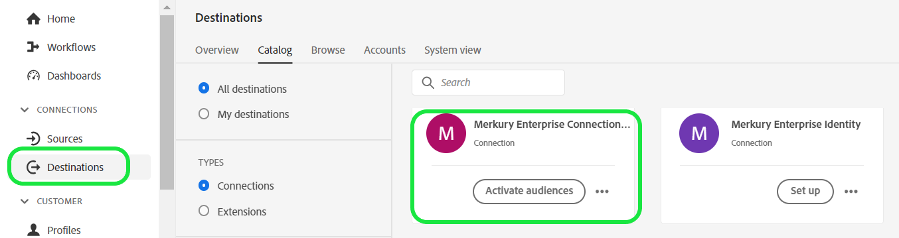
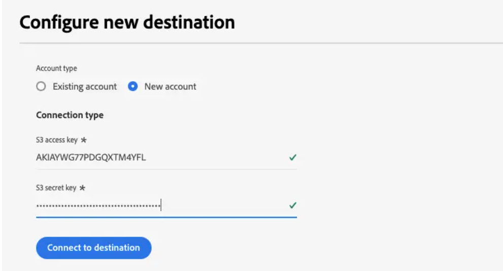

# Mercury Enterprise連線目的地

>[!NOTE]
>
>目的地聯結器和檔案頁面是由[!DNL Merkury]團隊建立和維護的。 若有任何查詢或更新要求，請連絡您的[!DNL Merkury]客戶代表。

## 概觀

使用 [!DNL Merkury Enterprise Connections] 目標將客群安全地傳送至 [!DNL Merkury]。[!DNL Merkury]可讓行銷人員輕鬆比對和傳送個人型對象至[!DNL Merkury]超過80個進階可定址電視/電視、發行者和廣告技術連線。 [!DNL Merkury] 由涵蓋超過 2.68 億人的全方位美國成人消費者身分識別圖提供支援。

依照本檔案頁面中的步驟，使用Adobe Experience Platform使用者介面建立[!DNL Merkury Connections]目的地連線並啟用對象。

>[!NOTE]
>
>如果您想要以您的[!DNL Merkury Connect]帳戶啟用媒體目的地的對象，請改用[!DNL Merkury Connections]目的地。

## 使用案例

* **數位媒體啟用**：輕鬆比對並傳送您的對象設定檔至[!DNL Merkury]的50多個進階定址發行者與廣告技術連線。
* **提升效率**：提升您的無Cookie、可定址媒體觸及率、提升鎖定目標效率及Advertising投資報酬率(ROAS)。

## 先決條件

>[!IMPORTANT]
>
>* 若要連線到目的地，您需要&#x200B;**檢視目的地**&#x200B;和&#x200B;**管理目的地**、**啟用目的地**、**檢視設定檔**&#x200B;和&#x200B;**檢視區段** [[存取控制許可權]](https://experienceleague.adobe.com/en/docs/experience-platform/access-control/home#permissions)。 閱讀[[存取控制總覽]](https://experienceleague.adobe.com/en/docs/experience-platform/access-control/ui/overview)或連絡您的產品管理員以取得必要的許可權。
>* 若要匯出&#x200B;*身分*，您需要&#x200B;**檢視身分圖表** [[存取控制許可權]](https://experienceleague.adobe.com/en/docs/experience-platform/access-control/home#permissions)。\！[選取工作流程中反白顯示的身分名稱空間，以啟用目的地的對象。](../../assets/catalog/data-partners/merkury-connections/media/image3.png)

## 支援的身分 {#supported-identities}

| 目標身分 | 說明 | 考量事項 |
|---|---|---|
| GAID | GOOGLE ADVERTISING ID | 當您的來源身分是GAID名稱空間時，請選取GAID目標身分。 |
| IDFA | 廣告商適用的Apple ID | 當您的來源身分是IDFA名稱空間時，請選取IDFA目標身分。 |
| ECID | Experience Cloud ID | 代表ECID的名稱空間。 此名稱空間也可以以下列别名表示：「Adobe Marketing Cloud ID」、「Adobe Experience Cloud ID」、「Adobe Experience Platform ID」。 如需詳細資訊，請參閱[ECID](/help/identity-service/features/ecid.md)上的下列檔案。 |
| phone_sha256 | 使用SHA256演演算法雜湊的電話號碼 | Adobe Experience Platform同時支援純文字和SHA256雜湊電話號碼。 當您的來源欄位包含未雜湊的屬性時，請核取&#x200B;**[!UICONTROL 套用轉換]**&#x200B;選項，讓[!DNL Experience Platform]在啟用時自動雜湊資料。 |
| email_lc_sha256 | 使用SHA256演演算法雜湊的電子郵件地址 | Adobe Experience Platform同時支援純文字和SHA256雜湊電子郵件地址。 當您的來源欄位包含未雜湊的屬性時，請核取&#x200B;**[!UICONTROL 套用轉換]**&#x200B;選項，讓[!DNL Experience Platform]在啟用時自動雜湊資料。 |
| extern_id | 自訂使用者ID | 當您的來源身分是自訂名稱空間時，請選取此目標身分。 |

{style="table-layout:auto"}

## 支援的對象

本節說明您可以將哪些型別的對象匯出至此目的地。

| **客群** | **支援** | **描述來源** |
|---|---|---|      
| 分段服務 | ✓ | 透過Experience Platform [[細分服務]](https://experienceleague.adobe.com/zh-hant/docs/experience-platform/segmentation/home)產生的對象。 |
| 自訂上傳 | X | 對象[[已將]](https://experienceleague.adobe.com/en/docs/experience-platform/segmentation/ui/overview#import-audience)從CSV檔案匯入Experience Platform。 |

{style="table-layout:auto"}

## 匯出型別和頻率

請參閱下表以取得目的地匯出型別和頻率的資訊。

| **專案** | **類型** | **附註** |
|---|---|---|  
| 匯出類型 | **以設定檔為基礎** | 您正在匯出區段的所有成員，以及所需的結構描述欄位（例如：電子郵件地址、電話號碼、姓氏），如[[目的地啟用工作流程]](https://experienceleague.adobe.com/en/docs/experience-platform/destinations/ui/activate/activate-batch-profile-destinations#select-attributes)的選取設定檔屬性畫面中所選。 |
| 頻率 | **批次** | 批次目的地會以三、六、八、十二或二十四小時的增量將檔案匯出至下游平台。 深入瞭解[[批次檔案型頻率目的地]](https://experienceleague.adobe.com/en/docs/experience-platform/destinations/destination-types#file-based)。 |

{style="table-layout:auto"}

## 連線到目標

>[!IMPORTANT]
>
>若要連線到目的地，您需要&#x200B;**檢視目的地**&#x200B;和&#x200B;**管理和啟用資料集目的地** [[存取控制許可權]](https://experienceleague.adobe.com/en/docs/experience-platform/access-control/home#permissions)。 閱讀[[存取控制總覽]](https://experienceleague.adobe.com/en/docs/experience-platform/access-control/ui/overview)或連絡您的產品管理員以取得必要的許可權。

若要連線到此目的地，請依照[[目的地設定教學課程]](https://experienceleague.adobe.com/en/docs/experience-platform/destinations/ui/connect-destination)中所述的步驟進行。 在目標設定工作流程中，填寫以下兩個區段中列出的欄位。

### 驗證目標

若要驗證到目的地，請填入必填欄位，然後選取&#x200B;**連線到目的地**。

若要在Experience Platform上存取貯體，您必須提供下列憑證的有效值：

| **認證** | **說明** |
|---|---|
| 存取金鑰 | 貯體的存取金鑰ID。 您可以從Merkury團隊擷取此值。 |
| 秘密金鑰 | 貯體的秘密金鑰ID。 您可以從Merkury團隊擷取此值。 |
| 貯體名稱 | 這是您的貯體，檔案將在此共用。 您可以從Merkury團隊擷取此值。 |

{style="table-layout:auto"}

### 填寫目標詳細資訊

若要設定目的地的詳細資訊，請填寫下方的必填和選用欄位。 UI中欄位旁的星號表示該欄位為必填欄位。

* **名稱（必要）** — 將目的地儲存於其下的名稱
* **描述** — 目的地的簡短說明
* **貯體名稱（必要）** — 在S3上設定的Amazon S3貯體的名稱
* **資料夾路徑（必要）** — 如果使用儲存貯體中的子目錄，則必須定義路徑，或使用&#39;/&#39;來參考根路徑。
* **檔案型別** — 選取Experience Platform用於匯出檔案的格式。 如需您帳戶的預期檔案型別，請洽詢您的Merkury團隊。

>[!NOTE]
>
>選取CSV選項時，將會顯示分隔符號、引號字元、逸出字元、空值、空值、壓縮格式以及包含資訊清單檔案選項，請洽詢您的Merkury團隊，以取得您帳戶的適當設定。

csv選項的

### 現有帳戶

已使用Merkury Enterprise連線目的地定義的帳戶會出現在清單快顯視窗中。 選取後，您可以在右側邊欄中檢視帳戶的詳細資料。 當您導覽至&#x200B;**目的地** > **帳戶**&#x200B;時，從UI檢視範例：

## 啟用警示

您可以啟用警報以接收有關傳送到您目的地的資料流狀態的通知。 從清單中選取警報以訂閱接收有關資料流狀態的通知。 如需警示的詳細資訊，請參閱[使用UI訂閱目的地警示](https://experienceleague.adobe.com/en/docs/experience-platform/destinations/ui/alerts)的指南。

當您完成提供目的地連線的詳細資訊後，請選取&#x200B;**下一步**。

## 啟動此目標的對象

>[!IMPORTANT]
>
>* 若要啟用資料，您需要&#x200B;**檢視目的地**、**啟用目的地**、**檢視設定檔**&#x200B;和&#x200B;**檢視區段**&#x200B;存取控制許可權。 請閱讀存取控制總覽或聯絡您的產品管理員以取得所需許可權。
>* 若要匯出身分，您需要&#x200B;**檢視身分圖表**&#x200B;存取控制許可權。

讀取[啟用批次設定檔匯出目的地的對象資料](https://experienceleague.adobe.com/en/docs/experience-platform/destinations/ui/activate/activate-batch-profile-destinations)，以取得啟用此目的地對象的指示。

## 對應建議

正確處理[!DNL Merkury]端的檔案需要名稱和位址元素。 雖然並非所有元素都需要，但儘可能提供有助於成功比對。

下表提供對應建議，列出目標端上客戶可對應設定檔屬性的[!DNL Merkury]處理所使用的屬性。 將這些元素視為建議，因為並非所有元素都是必要的，而來源值將視帳戶的需求而定。

| 目標欄位 | Source說明 |
|---|---|
| ID | 透過[!DNL Merkury Enterprise Identity] Source聯結器將[!DNL Merkury]資料對應至Experience Platform的身分欄位 |
| Input_First_Name | Experience Platform中的`person.name.firstName`值。 |
| Input_Last_Name | Experience Platform中的`person.name.lastName`值。 |
| Input_Address_Line_1 | Experience Platform中的`mailingAddress.street`值。 |
| 輸入城市 | Experience Platform中的`mailingAddress.city`值。 |
| Input_State_Province_Code | Experience Platform中的`mailingAddress.state`值。 如果狀態是兩個字元的程式碼形式，請使用。 |
| Input_State_Province_Name | Experience Platform中的`mailingAddress.state`值。 若狀態為完整的狀態名稱則使用 |
| Input_Postal_Code | Experience Platform中的`mailingAddress.postalCode`值。 |
| 輸入電子郵件地址 | 您希望對應為設定檔電子郵件地址的值。 |
| Input_Phone | 您要對應為設定檔電話號碼的值。 |

{style="table-layout:auto"}

## 驗證資料匯出

若要確認資料是否已成功匯出，請檢查Amazon S3儲存貯體，並確認匯出的檔案包含預期的設定檔母體。

## 資料使用與控管

處理您的資料時，所有Adobe Experience Platform目的地都符合資料使用原則。 如需Adobe Experience Platform如何強制資料控管的詳細資訊，請閱讀[資料控管概觀](https://experienceleague.adobe.com/en/docs/experience-platform/data-governance/home)。

## 後續步驟

依照本教學課程中的指示，您已成功建立資料流，以將設定檔資料從Experience Platform匯出至[!DNL Merkury]受管理的S3位置。 接下來，您需要連絡您的[!DNL Merkury]代表，提供帳戶名稱、檔案名稱以及儲存貯體路徑，以便設定處理作業。
