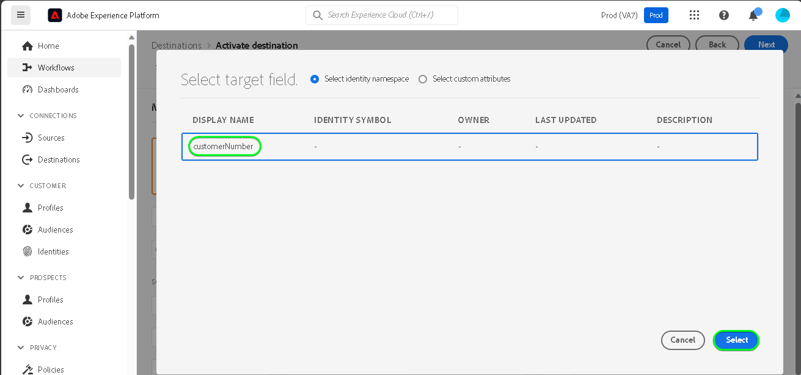

# [!DNL SAP Commerce] 連線

[!DNL SAP Commerce]，先前稱為 [[!DNL Hybris]](https://www.sap.com/india/products/acquired-brands/what-is-hybris.html)，是適用於B2B和B2C企業的雲端型電子商務平台解決方案，屬於SAP客戶體驗產品組合的一部分。 [[!DNL SAP] 訂閱帳單](https://www.sap.com/products/financial-management/subscription-billing.html) 是產品組合中的產品，可透過標準化的整合，透過簡化的銷售與付款體驗，啟用完整的訂閱生命週期管理。

這個 [!DNL Adobe Experience Platform] [目的地](/help/destinations/home.md) 使用 [[!DNL SAP Subscription Billing] 客戶管理API](https://api.sap.com/api/BusinessPartner_APIs/path/PUT_customers-customerNumber)，更新您的客戶詳細資料 [!DNL SAP Commerce] 從現有Experience Platform對象中移除專案。

向您的驗證指示 [!DNL SAP Commerce] 執行個體的詳細資訊如下： [驗證到目的地](#authenticate) 區段。

## 使用案例 {#use-cases}

為了協助您更清楚瞭解您應如何及何時使用 [!DNL SAP Commerce] 目的地，以下是Adobe Experience Platform客戶可以使用此目的地解決的範例使用案例。

[!DNL SAP Commerce] 客戶會儲存與您業務互動的個人或組織實體的相關資訊。 您的團隊使用中的現有客戶 [!DNL SAP Commerce] 以建置Experience Platform對象。 將這些對象傳送至後 [!DNL SAP Commerce]，會更新其資訊，並為每個客戶指派屬性，其值為指出客戶屬於哪個對象的對象名稱。

## 先決條件 {#prerequisites}

請參閱以下章節，瞭解您必須在Experience Platform中設定的任何先決條件，以及 [!DNL SAP Commerce] ，以瞭解在使用之前必須收集的資訊 [!DNL SAP Commerce] 目的地。

### Experience Platform必要條件 {#prerequisites-in-experience-platform}

在將資料啟用至 [!DNL SAP Commerce] 目的地，您必須擁有 [綱要](/help/xdm/schema/composition.md)， a [資料集](https://experienceleague.adobe.com/docs/platform-learn/tutorials/data-ingestion/create-datasets-and-ingest-data.html)、和 [對象](https://experienceleague.adobe.com/docs/platform-learn/tutorials/audiences/create-audiences.html) 建立於 [!DNL Experience Platform].

請參閱Experience Platform檔案，以瞭解 [對象成員資格詳細資料結構欄位群組](/help/xdm/field-groups/profile/segmentation.md) 如果您需要對象狀態的指引。

### 的先決條件 [!DNL SAP Commerce] 目的地 {#prerequisites-destination}

若要將資料從Platform匯出至您的 [!DNL SAP Commerce] 帳戶：

#### 您必須擁有 [!DNL SAP Subscription Billing] 帳戶 {#prerequisites-account}

為了將資料從Platform匯出至 [!DNL SAP Commerce] 帳戶，您必須擁有 [!DNL SAP Subscription Billing] 帳戶。 如果您沒有有效的帳單帳戶，請連絡您的 [!DNL SAP] 客戶經理。 請參閱 [[!DNL SAP] 平台組態](https://help.sap.com/doc/5fd179965d5145fbbe7f2a7aa1272338/latest/en-US/PlatformConfiguration.pdf) 其他詳細資料的檔案。

#### 產生服務金鑰 {#prerequisites-service-key}

* 此 [!DNL SAP Commerce] 服務金鑰可讓您存取 [!DNL SAP Subscription Billing] 透過Experience Platform的API。 請參閱 [!DNL SAP Commerce] [使用使用者端ID和使用者端密碼建立服務金鑰](https://help.sap.com/docs/CLOUD_TO_CASH_OD/1216e7b79c984675b0a6f0005e351c74/87c11a0f5dc3494eaf3baa355925c030.html#create-a-service-key-with-client-id-and-client-secret) 以建立服務金鑰。 [!DNL SAP Commerce] 需要下列項目:
   * 用戶端 ID
   * 用戶端密碼
   * URL。 URL模式如下： `https://subscriptionbilling.authentication.eu10.hana.ondemand.com`. 此值稍後將用於取得 `Region` 和 `Endpoint`.

+++選取以檢視服務金鑰的範例

```json
{ 
    "url": "https://eu10.revenue.cloud.sap/api",
    "uaa": {
        "clientid": "XXX",
        "clientsecret": "XXX",
        "url": "https://subscriptionbilling.authentication.eu10.hana.ondemand.com",
        "identityzone": "subscriptionbilling",
        "identityzoneid": "XXX",
        "tenantid": "XXX",
        "tenantmode": "dedicated",
        "sburl": "https://internal-xsuaa.authentication.eu10.hana.ondemand.com",
        "apiurl": "https://api.authentication.eu10.hana.ondemand.com",
        "verificationkey": "XXX",
        "xsappname": "XXX",
        "subaccountid": "XXX",
        "uaadomain": "authentication.eu10.hana.ondemand.com",
        "zoneid": "XXX",
        "credential-type": "binding-secret"
    },
    "vendor": "SAP"
}
```

+++

#### 在中建立自訂參考 [!DNL SAP Subscription Billing] {#prerequisites-custom-reference}

若要更新中的Experience Platform對象狀態 [!DNL SAP Subscription Billing]，您需要Platform中所選每個對象的自訂參考欄位。

若要建立自訂參考，請登入您的 [!DNL SAP Subscription Billing] 帳戶並導覽至 **[主要資料和設定]** > **[自訂參考]** 頁面。 接下來，選取 **[!UICONTROL 建立]** 為Platform中選取的每個對象新增參考。 在後續操作中，您將需要這些參考欄位名稱 [排程對象匯出和範例](#schedule-segment-export-example) 步驟。

如何建立自訂的範例 **[!UICONTROL 參考型別]** 範圍 [!DNL SAP Subscription Billing] 如下所示：


如需其他指引，請參閱 [!DNL SAP Subscription Billing] [自訂參考](https://help.sap.com/docs/CLOUD_TO_CASH_OD/80d121f216af43648e79664efe5595f7/85696a63c8d8453a934e86c9413a25cf.html?version=2023-11-27) 檔案。

### 收集必要的認證 {#gather-credentials}

若要連線 [!DNL SAP Commerce] 若要Experience Platform，您必須提供下列連線屬性的值：

| 認證 | 說明 |
| --- | --- |
| 用戶端 ID | 的值 `clientId` 服務金鑰中。 |
| 用戶端密碼 | 的值 `clientSecret` 服務金鑰中。 |
| 端點 | 的值 `url` 從服務金鑰，它類似於 `https://subscriptionbilling.authentication.eu10.hana.ondemand.com`. |
| 區域 | 您的資料中心位置。 區域存在於中 `url` 且其值類似於 `eu10` 或 `us10`. 例如，如果 `url` 是 `https://eu10.revenue.cloud.sap/api` 您需要 `eu10`. |

## 護欄 {#guardrails}

對的API請求 [!DNL SAP Cloud Management service] 受限於 [速率限制](https://help.sap.com/docs/btp/sap-business-technology-platform/account-administration-rate-limiting). 當超過速率限制時，您將會遇到 `HTTP 429 Too Many Requests` 回應狀態代碼。

## 支援的身分 {#supported-identities}

[!DNL SAP Commerce] 支援下表中描述的身分更新。 進一步瞭解 [身分](/help/identity-service/features/namespaces.md).

| 目標身分 | 說明 | 考量事項 |
| --- | --- | --- |
| `customerNumberSAP` | 您的中已存在的個人或企業客戶的客戶識別碼 [!DNL SAP Commerce] 帳戶。 | 強制 |

## 支援的對象 {#supported-audiences}

本節說明您可以匯出至此目的地的所有對象。

此目的地支援啟用透過Experience Platform產生的所有對象 [分段服務](../../../segmentation/home.md).

此目的地也支援下表所述的對象啟用。

| 客群類型 | 支援 | 說明 |
| ------------- | --------- | ----------- |
| [!DNL Segmentation Service] | ✓ (A) | 透過Experience Platform產生的對象 [分段服務](../../../segmentation/home.md). |
| 自訂上傳 | ✓ (A) | 受眾 [已匯入](../../../segmentation/ui/audience-portal.md#import-audience) 從CSV檔案Experience Platform為。 |

{style="table-layout:auto"}

## 匯出型別和頻率 {#export-type-frequency}

請參閱下表以取得目的地匯出型別和頻率的資訊。

| 項目 | 類型 | 附註 |
---------|----------|---------|
| 匯出類型 | **[!UICONTROL 以設定檔為基礎]** | <ul><li>您正在匯出對象的所有成員，以及所需的結構欄位 *（例如：電子郵件地址、電話號碼、姓氏）*，根據您的欄位對應。</li><li> 針對Platform中每個選取的對象，對應至 [!DNL SAP Commerce] 其他屬性會從Platform更新其對象狀態。</li></ul> |
| 匯出頻率 | **[!UICONTROL 串流]** | <ul><li>串流目的地是「一律開啟」的API型連線。 當根據對象評估在Experience Platform中更新設定檔時，聯結器會將更新傳送至下游的目標平台。 深入瞭解 [串流目的地](/help/destinations/destination-types.md#streaming-destinations).</li></ul> |

{style="table-layout:auto"}

## 連線到目標 {#connect}

>[!IMPORTANT]
>
>若要連線到目的地，您需要 **[!UICONTROL 管理目的地]** [存取控制許可權](/help/access-control/home.md#permissions). 閱讀 [存取控制總覽](/help/access-control/ui/overview.md) 或聯絡您的產品管理員以取得必要許可權。

若要連線至此目的地，請遵循以下說明的步驟： [目的地設定教學課程](../../ui/connect-destination.md). 在設定目標工作流程中，填寫以下兩個區段中列出的欄位。

範圍 **[!UICONTROL 目的地]** > **[!UICONTROL 目錄]**，搜尋 [!DNL SAP Commerce]. 或者，您可以在 **[!UICONTROL 電子商務]** 類別。

### 驗證目標 {#authenticate}

填寫以下必填欄位。 請參閱 [產生服務金鑰](#prerequisites-service-key) 區段以取得任何指引。

| 欄位 | 說明 |
| --- | --- |
| **[!UICONTROL 使用者端ID]** | 的值 `clientId` 服務金鑰中。 |
| **[!UICONTROL 使用者端密碼]** | 的值 `clientSecret` 服務金鑰中。 |
| **[!UICONTROL 端點]** | 的值 `url` 從服務金鑰，它類似於 `https://subscriptionbilling.authentication.eu10.hana.ondemand.com`. |
| **[!UICONTROL 地區]** | 您的資料中心位置。 區域存在於中 `url` 且其值類似於 `eu10` 或 `us10`. 例如，如果 `url` 是 `https://eu10.revenue.cloud.sap/api` 您需要 `eu10`. |

若要驗證目的地，請選取 **[!UICONTROL 連線到目的地]**.


如果提供的詳細資料有效，UI會顯示 **[!UICONTROL 已連線]** 帶有綠色勾號的狀態。 然後您可以繼續下一步驟。

### 填寫目標詳細資訊 {#destination-details}

若要設定目的地的詳細資訊，請填寫下方的必填和選用欄位。 UI中欄位旁的星號表示該欄位為必填欄位。


* **[!UICONTROL 名稱]**：您日後可辨識此目的地的名稱。
* **[!UICONTROL 說明]**：可協助您日後識別此目的地的說明。
* **[!UICONTROL 客戶型別]**：選取 ***個人*** 或 ***企業*** 視您對象中的實體而定。 此 [!DNL SAP Subscription Billing] [綱要](https://api.sap.com/api/BusinessPartner_APIs/schema) 根據對映至的選項切換必填欄位 `customerType` 屬性。 如果選取專案為 ***企業***，則強制對應如下 `firstName` 和 `lastName` 個別客戶的必要欄位將被忽略，並且 `company` 成為必要專案，反之亦然。

### 啟用警示 {#enable-alerts}

您可以啟用警報以接收有關傳送到您目的地的資料流狀態的通知。 從清單中選取警報以訂閱接收有關資料流狀態的通知。 如需警示的詳細資訊，請參閱以下指南： [使用UI訂閱目的地警報](../../ui/alerts.md).

當您完成提供目的地連線的詳細資訊時，請選取「 」 **[!UICONTROL 下一個]**.

## 啟動此目標的對象 {#activate}

>[!IMPORTANT]
> 
>* 若要啟用資料，您需要 **[!UICONTROL 檢視目的地]**， **[!UICONTROL 啟用目的地]**， **[!UICONTROL 檢視設定檔]**、和 **[!UICONTROL 檢視區段]** [存取控制許可權](/help/access-control/home.md#permissions). 閱讀 [存取控制總覽](/help/access-control/ui/overview.md) 或聯絡您的產品管理員以取得必要許可權。
>* 要匯出 *身分*，您需要 **[!UICONTROL 檢視身分圖表]** [存取控制許可權](/help/access-control/home.md#permissions). <br> {width="100" zoomable="yes"}

讀取 [將設定檔和受眾啟用至串流受眾匯出目標](/help/destinations/ui/activate-segment-streaming-destinations.md) 以取得啟用此目的地對象的指示。

### 對應屬性和身分 {#map}

若要正確將對象資料從Adobe Experience Platform傳送至 [!DNL SAP Commerce] 目的地，您必須完成欄位對應步驟。 對應包括在Platform帳戶中的Experience Data Model (XDM)結構描述欄位與來自目標目的地的對應對應專案之間建立連結。 若要正確將XDM欄位對應至 [!DNL SAP Commerce] 目的地欄位，請遵循下列步驟：

#### 對應 `customerNumberSAP` 身分

此 `customerNumberSAP` 身分是此目的地的必要對應。 請依照下列步驟進行對應：
1. 在 **[!UICONTROL 對應]** 步驟，選取 **[!UICONTROL 新增對應]**. 您現在可以在畫面上看到新的對應列。
   
1. 在 **[!UICONTROL 選取來源欄位]** 視窗，選擇 **[!UICONTROL 選取身分名稱空間]** 並選取 `customerNumberSAP`.
   
1. 在 **[!UICONTROL 選取目標欄位]** 視窗，選擇 **[!UICONTROL 選取身分名稱空間]** 並選取 `customerNumber` 身分。
   

| 來源欄位 | 目標欄位 | 強制 |
| --- | --- | --- |
| `IdentityMap: customerNumberSAP` | `Identity: customerNumber` | 是 |

具有身分對應的範例如下所示：


#### 對應屬性

新增任何其他要在XDM設定檔結構描述與 [!DNL SAP Subscription Billing] 帳戶，請重複下列步驟：
1. 在 **[!UICONTROL 對應]** 步驟，選取 **[!UICONTROL 新增對應]**. 您現在可以在畫面上看到新的對應列。
   
1. 在 **[!UICONTROL 選取來源欄位]** 視窗，選擇 **[!UICONTROL 選取屬性]** 類別並選取XDM屬性。
   
1. 在 **[!UICONTROL 選取目標欄位]** 視窗，選擇 **[!UICONTROL 選取自訂屬性]** 類別並輸入的名稱 [!DNL SAP Subscription Billing] 客戶清單中的屬性 [綱要](https://api.sap.com/api/BusinessPartner_APIs/schema) 屬性。
   

>[!IMPORTANT]
>
> 目標欄位名稱區分大小寫，且應符合 [!DNL SAP Subscription Billing] 屬性名稱。 唯一的例外是 `country` 您應使用的位置 `countryCode` 而非。 [!DNL SAP Subscription Billing] 支援alpha-2 (ISO 3166)國家/地區代碼。 值區分大小寫，且必須介於0到3個字元之間，因此請確定您所提供的內容與定義完全相同，否則您會遇到錯誤： `The country code {} does not exist` 或 `size must be between 0 and 3`.

#### 地圖 `mandatory` 所選客戶型別的屬性

強制屬性對應取決於 **[!UICONTROL 客戶型別]** 您已選取的專案。 若要對應必要屬性，請從下列選項中選取：

>[!BEGINTABS]

>[!TAB 個別客戶]

| 來源欄位 | 目標欄位 | 強制 |
| --- | --- | --- |
| `xdm: person.lastName` | `Attribute: lastName` | 是 |
| `xdm: workAddress.countryCode` | `Attribute: countryCode` | 是 |

>[!TAB 企業客戶]

| 來源欄位 | 目標欄位 | 強制 |
| --- | --- | --- |
| `xdm: b2b.companyName` | `Attribute: company` | 是 |
| `xdm: workAddress.countryCode` | `Attribute: countryCode` | 是 |

>[!ENDTABS]

#### 對應其他屬性

然後，您可以在XDM設定檔結構描述與 [!DNL SAP Subscription Billing] [綱要](https://api.sap.com/api/BusinessPartner_APIs/schema) 客戶的屬性，如下所示：

>[!BEGINTABS]

>[!TAB 個別客戶]

| 來源欄位 | 目標欄位 | 強制 |
| --- | --- | --- |
| `xdm: person.name.firstName` | `Attribute: firstName` | 無 |
| `xdm: workAddress.street1` | `Attribute: street` | 無 |
| `xdm: workAddress.city` | `Attribute: city` | 無 |

以下是客戶為個人的強制和選用屬性對應的範例：


>[!TAB 企業客戶]

| 來源欄位 | 目標欄位 | 強制 |
| --- | --- | --- |
| `xdm: workAddress.street1` | `Attribute: street` | 無 |
| `xdm: workAddress.city` | `Attribute: city` | 無 |

以下是客戶為公司的具有強制和選擇性屬性對應的範例：


>[!ENDTABS]

完成提供目的地連線的對應後，選取 **[!UICONTROL 下一個]**.

### 排程對象匯出和範例 {#schedule-segment-export-example}

執行 [排程對象匯出](/help/destinations/ui/activate-segment-streaming-destinations.md#scheduling) 步驟，您必須手動將平台對象對應至 [屬性](#prerequisites-attribute) 在 [!DNL SAP Subscription Billing].

排程對象匯出步驟的範例，其位置為 [!DNL SAP Commerce] **[!UICONTROL 對應ID]** 反白顯示，如下所示：


要執行此操作，請選取每個區段，然後輸入自訂參照的名稱 [!DNL SAP Subscription Billing] 在 [!DNL SAP Commerce] **[!UICONTROL 對應ID]** 目的地聯結器欄位。 如需建立自訂參考資料的指引，請參閱 [在中建立自訂參考 [!DNL SAP Subscription Billing]](#prerequisites-custom-reference) 區段。

>[!IMPORTANT]
>
> 請勿使用自訂參考標籤作為值。
>

例如，如果您選取的Experience Platform對象為 `sap_audience1` 而且您想要其狀態更新至 [!DNL SAP Subscription Billing] 自訂參考 `SAP_1`，請在 [!DNL SAP_Commerce] **[!UICONTROL 對應ID]** 欄位。

範例 **[!UICONTROL 參考型別]** 從 [!DNL SAP Subscription Billing] 如下所示：


「排程對象」匯出步驟的範例，其中已選取對象及其對應的對象 [!DNL SAP Commerce] **[!UICONTROL 對應ID]** 反白顯示，如下所示：


如「 」中的值所示 **[!UICONTROL 對應ID]** 欄位應完全符合 [!DNL SAP Subscription Billing] **[!UICONTROL 參考型別]** 值。

對每個已啟用的平台對象重複此章節。

根據上方顯示的影像，您已選取兩個對象，對應將會如下所示： | [!DNL SAP Commerce] 對象名稱 | [!DNL SAP Subscription Billing] **[!UICONTROL 參考型別]** | [!DNL SAP Commerce] **[!UICONTROL 對應ID]** 值 | | — | — | — | | sap_audience1 | `SAP_1` | `SAP_1` | | SAP對象2 | `SAP_2` | `SAP_2` |

## 驗證資料匯出 {#exported-data}

若要驗證您是否已正確設定目的地，請遵循下列步驟：

登入 [!DNL SAP Subscription Billing] 帳戶，然後導覽至 **[!UICONTROL 連絡人]** 頁面以檢查對象狀態。 清單可設定為顯示自訂參考的欄，並顯示對應的對象狀態。


## 資料使用與控管 {#data-usage-governance}

全部 [!DNL Adobe Experience Platform] 處理您的資料時，目的地符合資料使用原則。 如需如何操作的詳細資訊 [!DNL Adobe Experience Platform] 強制執行資料控管，請參閱 [資料控管概觀](/help/data-governance/home.md).

## 錯誤與疑難排解 {#errors-and-troubleshooting}

請參閱 [[!DNL SAP Subscription Billing] 錯誤型別](https://help.sap.com/docs/CLOUD_TO_CASH_OD/987aec876092428f88162e438acf80d6/1a6a0dd6129c48e8b235190a1b5409fa.html) 說明檔案頁面，以取得可能的錯誤型別及其回應代碼清單。

## 其他資源 {#additional-resources}

其他實用資訊來自 [!DNL SAP] 檔案如下：
* [上線SAP訂閱帳單](https://help.sap.com/docs/CLOUD_TO_CASH_OD/1216e7b79c984675b0a6f0005e351c74/e4b8badf7d124026991e4ab6b57d2a33.html)

### Changelog

本節擷取此目的地聯結器的功能和重要檔案更新。

+++ 檢視變更記錄檔

| 發行月份 | 更新型別 | 說明 |
|---|---|---|
| 2024 年 1 月 | 首次發行 | 初始目的地版本和檔案發佈。 |

{style="table-layout:auto"}

+++
