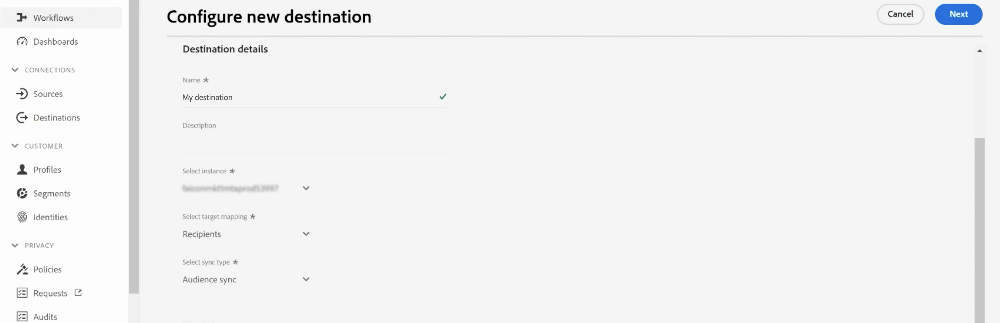

# Adobe Campaign Managed Cloud Services連線 {#adobe-campaign-managed-services}

>[!IMPORTANT]
>
>此整合適用於 [Adobe Campaign 8.4版或更高版本](https://experienceleague.adobe.com/docs/campaign/campaign-v8/new/release-notes.html?lang=en#release-8-4-1).

## 總覽 {#overview}

Adobe Campaign Managed Cloud Services提供設計跨管道客戶體驗的平台，以及視覺化行銷活動策劃、即時互動管理和跨管道執行的環境。 [開始使用Campaign](https://experienceleague.adobe.com/docs/campaign/campaign-v8/start/get-started.html)

使用 Campaign 可以：
* 透過單一可存取的客戶檢視，推動個人化和參與,
* 將電子郵件、行動裝置、線上和線下頻道整合至客戶歷程,
* 自動化有意義且即時的訊息和優惠方案傳遞.

>[!IMPORTANT]
>
>使用Adobe Campaign Managed Cloud Services連線時，請記住下列護欄：
>
>* 最多50個區段可以是 [啟動](#activate) 目的地，
>* 對於每個區段，您最多可新增20個欄位至 [地圖](#map) 到Adobe Campaign,
>* Azure Blob儲存資料登陸區域(DLZ)上的資料保留：7天，
>* 啟動頻率最低為3小時。

## 使用案例 {#use-cases}

為協助您更清楚了解您應如何及何時使用Adobe Campaign管理服務目的地，以下範例使用案例供Adobe Experience Platform客戶透過此目的地來解決。

Adobe Experience Platform會建立客戶設定檔，其中納入身分圖表、analytics的行為資料、合併離線和線上資料等資訊。 透過這項整合，您可以利用這些Adobe Experience Platform支援的受眾來增強Adobe Campaign中已存在的細分功能，因此，您可以在Campaign中啟用該資料。

例如，運動服飾公司想要運用Adobe Experience Platform支援的智慧型區段，並使用Adobe Campaign來啟用這些區段，以便透過Adobe Campaign支援的不同管道聯絡其客戶群。

傳送訊息後，他們會想要使用Adobe Campaign的體驗資料（例如傳送、開啟和點按）增強Adobe Experience Platform中的客戶設定檔。

如此一來，跨通道行銷活動在Adobe Experience Cloud生態系統中會更為一致，且擁有豐富的客戶個人檔案，可快速調整和學習。

[深入了解Adobe Campaign與Adobe Experience Platform的整合](https://experienceleague.adobe.com/docs/campaign/campaign-v8/connect/ac-aep.html)

## 支援的身分 {#supported-identities}

*Adobe Campaign Managed Cloud Services* 支援啟用下表所述的身分。 深入了解 [身分](/help/identity-service/namespaces.md).

| Target身分 | 說明 | 考量事項 |
|---|---|---|
| external_id | 自訂使用者ID | 當源標識為自定義命名空間時，選擇此目標標識。 建議您使用此身分，並對應至代表客戶(loyaty_ID、account_ID、customer_ID...)之促銷活動例項中的ID |
| ECID | Experience Cloud ID | 代表ECID的命名空間。 此命名空間也可由下列別名引用：&quot;Adobe Marketing Cloud ID&quot;、&quot;Adobe Experience Cloud ID&quot;、&quot;Adobe Experience Platform ID&quot;。 請參閱下列檔案，內容如下 [ECID](/help/identity-service/ecid.md) 以取得更多資訊。 |
| email_lc_sha256 | 使用SHA256演算法雜湊的電子郵件地址 | Adobe Experience Platform支援純文字和SHA256雜湊電子郵件地址。 當來源欄位包含未雜湊屬性時，請檢查 **[!UICONTROL 套用轉換]** 選項，必須 [!DNL Platform] 啟動時自動雜湊資料。 |
| phone_sha256 | 使用SHA256演算法雜湊的電話號碼 | Adobe Experience Platform支援純文字和SHA256雜湊電話號碼。 當來源欄位包含未雜湊屬性時，請檢查 **[!UICONTROL 套用轉換]** 選項，必須 [!DNL Platform] 啟動時自動雜湊資料。 |
| GAID | Google Advertising ID | 當源標識為GAID命名空間時，選擇GAID目標標識。 |
| IDFA | Apple ID for Advertisers | 如果來源識別為IDFA命名空間，請選取IDFA目標識別。 |

{style="table-layout:auto"}

## 匯出類型和頻率 {#export-type-frequency}

有關目標導出類型和頻率的資訊，請參閱下表。

| 項目 | 類型 | 附註 |
---------|----------|---------|
| 匯出類型 | **[!UICONTROL 設定檔]** | 您要匯出區段的所有成員，以及所需的結構欄位(例如：電子郵件地址、電話號碼、姓氏)，如「選取設定檔屬性」畫面中所選 [目的地啟動工作流程](/help/destinations/ui/activate-batch-profile-destinations.md#select-attributes). |
| 匯出頻率 | **[!UICONTROL 批次]** | 批次目的地會以3、6、8、12或24小時為增量將檔案匯出至下游平台。 深入了解 [批次檔案型目的地](/help/destinations/destination-types.md#file-based). |

{style="table-layout:auto"}

## 連接到目標 {#connect}

>[!IMPORTANT]
> 
>若要連線至目的地，您需要 **[!UICONTROL 管理目的地]** [存取控制權限](/help/access-control/home.md#permissions). 閱讀 [存取控制概觀](/help/access-control/ui/overview.md) 或聯絡您的產品管理員以取得所需的權限。

若要連線至此目的地，請依照 [目的地設定教學課程](../../ui/connect-destination.md). 在設定目標工作流程中，填寫下列兩節所列的欄位。

### 填寫目的地詳細資訊 {#destination-details}

若要設定目的地的詳細資訊，請填寫下方的必填和選填欄位。 UI中欄位旁的星號表示該欄位為必要欄位。

* **[!UICONTROL 名稱]**:日後您將透過此名稱識別此目的地。
* **[!UICONTROL 說明]**:未來可協助您識別此目的地的說明。
* **[!UICONTROL 選擇實例]**:您的 **[!DNL Campaign]** 行銷例項。
* **[!UICONTROL 目標對應]**:選取您在中使用的目標對應 **[!DNL Adobe Campaign]** 傳送。 [了解更多](https://experienceleague.adobe.com/docs/campaign/campaign-v8/profiles-and-audiences/add-profiles/target-mappings.html)。

### 啟用警報 {#enable-alerts}

您可以啟用警報，接收有關資料流到目標狀態的通知。 從清單中選擇要訂閱的警報，以接收有關資料流狀態的通知。 有關警報的詳細資訊，請參閱 [使用UI訂閱目的地警報](../../ui/alerts.md).

完成提供目標連接的詳細資訊後，請選擇 **[!UICONTROL 下一個]**.

### 治理政策和執法行動 {#governance}

選取適用於您要匯出至目的地之資料的行銷動作。 若為Adobe Campaign，建議您選取 **[!UICONTROL 電子郵件目標定位]** 行銷動作。

如需行銷動作的詳細資訊，請參閱 [資料使用原則概觀](/help/data-governance/policies/overview.md) 頁面。

## 啟用此目的地的區段 {#activate}

>[!IMPORTANT]
> 
>若要啟用資料，您需要 **[!UICONTROL 管理目的地]**, **[!UICONTROL 啟動目的地]**, **[!UICONTROL 檢視設定檔]**，和 **[!UICONTROL 檢視區段]** [存取控制權限](/help/access-control/home.md#permissions). 閱讀 [存取控制概觀](/help/access-control/ui/overview.md) 或聯絡您的產品管理員以取得所需的權限。

閱讀 [啟用受眾資料以批次設定檔匯出目的地](https://experienceleague.adobe.com/docs/experience-platform/destinations/ui/activate/activate-batch-profile-destinations.html) 以取得啟用受眾資料至此目的地的相關指示。

### 對應屬性和身分 {#map}

選取要與設定檔一起匯出的XDM欄位，並將它們對應至對應的Adobe Campaign欄位。[進一步了解電子郵件行銷目的地的身分和屬性選取](overview.md)

1. 選擇源欄位：

   * 選取 **識別碼** (例如：電子郵件欄位)，作為來源身分，可在Adobe Experience Platform和Adobe Campaign中唯一識別設定檔。

   * 選擇所有其他 **XDM來源設定檔屬性** 需要匯出至Adobe Campaign。
   >[!NOTE]
   >
   >「segmentMembershipStatus」欄位是反映segmentMembership狀態的必要對應。 預設會新增此欄位，且無法修改或移除。

1. 將每個欄位與其Adobe Campaign中的目標欄位對應。 可用的目標欄位由選取的目標對應決定，當 [建立目的地](#destination-details).

1. 識別強制屬性和重複資料刪除索引鍵。 請注意，標示為「強制」或「重複資料刪除索引鍵」之屬性中的值不能為null。

   * [強制屬性](../../ui/activate-batch-profile-destinations.md#mandatory-attributes) 請確定所有設定檔記錄都包含選取的屬性。 例如：所有匯出的設定檔都包含電子郵件地址。 建議將身分欄位和用作重複資料刪除索引鍵的欄位設為強制。
   * [重複資料刪除密鑰](../../ui/activate-batch-profile-destinations.md#mandatory-attributes) 是主要金鑰，可決定使用者要依哪個身分來刪除其設定檔的重複項目。

      >[!IMPORTANT]
      >
      >請確定重複資料刪除索引鍵屬性的名稱與所選目標映射的列名稱相符。
   

1. 執行對應後，您可以檢閱並完成目標設定，以開始將資料傳送至 **[!DNL Campaign]**.
   [了解如何檢閱及完成目的地設定](/help/destinations/destination-types.md#review).

## 匯出的資料/驗證資料匯出 {#exported-data}

目標啟動後，您就可以存取Campaign中對應的工作和匯出的資料。

### 監視資料導出作業 {#jobs}

導覽至 **[!UICONTROL 管理]** > **[!UICONTROL 稽核]** > **[!UICONTROL 對象載入工作]** 功能表，監控從Adobe Experience Platform啟動的所有匯出工作。

### 存取匯出的資料 {#data}

導覽至 **[!UICONTROL 設定檔與目標]** > **[!UICONTROL 清單]** > **[!UICONTROL AEP對象]** 功能表來存取在啟動目的地後建立的對象。

## 資料使用與控管 {#data-usage-governance}

全部 [!DNL Adobe Experience Platform] 處理資料時，目的地符合資料使用原則。 有關如何 [!DNL Adobe Experience Platform] 強制實施資料治理，讀取 [資料控管概觀](/help/data-governance/home.md).
