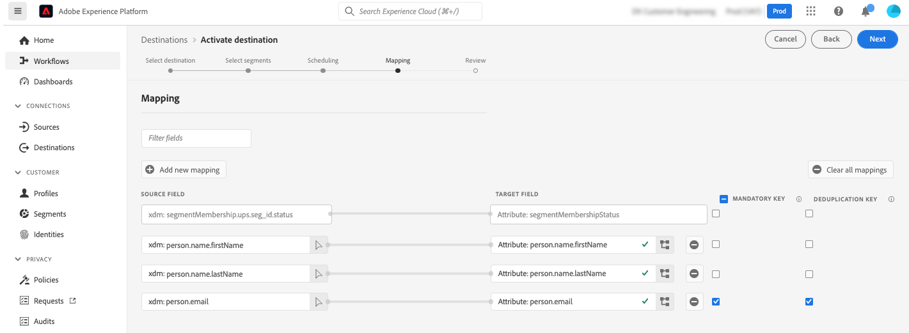

# Adobe Campaign Managed Cloud Services {#adobe-campaign-managed-services}

>[!IMPORTANT]
>
>此整合適用於 [Adobe Campaign版本8.4或更高版本](https://experienceleague.adobe.com/docs/campaign/campaign-v8/new/release-notes.html?lang=en#release-8-4-1)。

## 總覽 {#overview}

Adobe Campaign Managed Cloud Services公司為設計跨渠道客戶體驗提供了一個平台，並為視覺營銷協調，即時交互管理和跨渠道執行提供了一個環境。 [市場活動入門](https://experienceleague.adobe.com/docs/campaign/campaign-v8/start/get-started.html)

使用 Campaign 可以：
* 透過單一可存取的客戶檢視，推動個人化和參與,
* 將電子郵件、行動裝置、線上和線下頻道整合至客戶歷程,
* 自動化有意義且即時的訊息和優惠方案傳遞.

>[!IMPORTANT]
>
>使用Adobe Campaign Managed Cloud Services連接時，請記住以下護欄：
>
>* 最多可以是50個段 [激活](#activate) 目的地，
>* 對於每個段，最多可以將20個欄位添加到 [地圖](#map) Adobe Campaign,
>* Azure Blob儲存資料登錄區域(DLZ)上的資料保留：7天，
>* 激活頻率最小為3小時。

## 使用案例 {#use-cases}

為了幫助您更好地瞭解您應如何以及何時使用Adobe Campaign管理服務目標，以下是Adobe Experience Platform客戶可通過使用此目標解決的示例使用案例。

Adobe Experience Platform建立了一個客戶配置檔案，其中包含身份圖、分析中的行為資料等資訊，合併離線和線上資料等。 通過此整合，您可以增強Adobe Campaign內部已存在的細分能力，並增強那些Adobe Experience Platform支援的受眾，因此您可以在「活動」中激活該資料。

例如，一家運動服裝公司希望利用Adobe Experience Platform推動的智慧領域，並利用Adobe Campaign，通過Adobe Campaign支援的不同渠道與客戶群建立聯繫。

在發送消息後，他們希望利用Adobe Campaign提供的體驗資料（如發送、開啟和按一下）增強Adobe Experience平台中的客戶概要資訊。

結果是跨渠道的活動，這些活動在Adobe Experience雲生態系統中更加一致，並且擁有豐富的客戶資料，可快速調整和學習。

[瞭解有關Adobe Campaign與Adobe Experience Platform整合的更多資訊](https://experienceleague.adobe.com/docs/campaign/campaign-v8/connect/ac-aep.html)

## 支援的身份 {#supported-identities}

*Adobe Campaign Managed Cloud Services* 支援激活下表中描述的身份。 瞭解有關 [身份](/help/identity-service/namespaces.md)。

| 目標標識 | 說明 | 考量事項 |
|---|---|---|
| 外部ID | 自定義用戶ID | 如果源標識是自定義命名空間，請選擇此目標標識。 我們建議使用此標識並將其映射到市場活動實例中表示客戶(loyalty_ID、account_ID、customer_ID...)的ID |
| ECID | Experience Cloud ID | 表示ECID的命名空間。 以下別名也可以引用此命名空間：&quot;Adobe Marketing CloudID&quot;,&quot;Adobe Experience CloudID&quot;,&quot;Adobe Experience PlatformID&quot; 請參閱以下文檔 [ECID](/help/identity-service/ecid.md) 的子菜單。 |
| email_lc_sha256 | 使用SHA256算法散列的電子郵件地址 | 純文字檔案和SHA256散列電子郵件地址都受Adobe Experience Platform支援。 如果源欄位包含未散列的屬性，請檢查 **[!UICONTROL 應用轉換]** 選項 [!DNL Platform] 激活時自動對資料進行散列。 |
| phone_sha256 | 使用SHA256算法散列的電話號碼 | 純文字檔案和SHA256散列電話號碼都受Adobe Experience Platform支援。 如果源欄位包含未散列的屬性，請檢查 **[!UICONTROL 應用轉換]** 選項 [!DNL Platform] 激活時自動對資料進行散列。 |
| GAID | Google廣告ID | 當源標識為GAID命名空間時，選擇GAID目標標識。 |
| IDFA | Apple廣告商ID | 當源標識為IDFA命名空間時，選擇IDFA目標標識。 |

{style="table-layout:auto"}

## 導出類型和頻率 {#export-type-frequency}

有關目標導出類型和頻率的資訊，請參閱下表。

| 項目 | 類型 | 附註 |
---------|----------|---------|
| 導出類型 | **[!UICONTROL 基於配置檔案]** | 您正在導出段的所有成員以及所需的架構欄位(例如：電子郵件地址、電話號碼、姓氏)，在「選擇配置檔案屬性」螢幕中選擇 [目標激活工作流](/help/destinations/ui/activate-batch-profile-destinations.md#select-attributes)。 |
| 導出頻率 | **[!UICONTROL 批]** | 批處理目標將檔案以3、6、8、12或24小時的增量導出到下游平台。 閱讀有關 [基於批檔案的目標](/help/destinations/destination-types.md#file-based)。 |

{style="table-layout:auto"}

## 連接到目標 {#connect}

>[!IMPORTANT]
> 
>要連接到目標，您需要 **[!UICONTROL 管理目標]** [訪問控制權限](/help/access-control/home.md#permissions)。 閱讀 [訪問控制概述](/help/access-control/ui/overview.md) 或聯繫您的產品管理員以獲取所需權限。

要連接到此目標，請按照 [目標配置教程](../../ui/connect-destination.md)。 在配置目標工作流中，填寫下面兩節中列出的欄位。

### 填寫目標詳細資訊 {#destination-details}

要配置目標的詳細資訊，請填寫以下必需欄位和可選欄位。 UI中某個欄位旁邊的星號表示該欄位是必需的。

* **[!UICONTROL 名稱]**:您將來識別此目標的名稱。
* **[!UICONTROL 說明]**:將幫助您在將來確定此目標的說明。
* **[!UICONTROL 選擇實例]**:您 **[!DNL Campaign]** 市場營銷實例。
* **[!UICONTROL 目標映射]**:選擇您正在使用的目標映射 **[!DNL Adobe Campaign]** 發送交貨。 [了解更多](https://experienceleague.adobe.com/docs/campaign/campaign-v8/profiles-and-audiences/add-profiles/target-mappings.html)。

### 啟用警報 {#enable-alerts}

您可以啟用警報來接收有關目標資料流狀態的通知。 從清單中選擇要訂閱的警報以接收有關資料流狀態的通知。 有關警報的詳細資訊，請參閱上的指南 [使用UI訂閱目標警報](../../ui/alerts.md)。

完成提供目標連接的詳細資訊後，選擇 **[!UICONTROL 下一個]**。

### 治理政策和執法行動 {#governance}

選擇適用於要導出到目標的資料的市場營銷操作。 對於Adobe Campaign，我們建議您選擇 **[!UICONTROL 電子郵件目標]** 營銷活動。

有關市場營銷活動的詳細資訊，請參閱 [資料使用策略概述](/help/data-governance/policies/overview.md) 的子菜單。

## 將段激活到此目標 {#activate}

>[!IMPORTANT]
> 
>要激活資料，您需要 **[!UICONTROL 管理目標]**。 **[!UICONTROL 激活目標]**。 **[!UICONTROL 查看配置檔案]**, **[!UICONTROL 查看段]** [訪問控制權限](/help/access-control/home.md#permissions)。 閱讀 [訪問控制概述](/help/access-control/ui/overview.md) 或聯繫您的產品管理員以獲取所需權限。

閱讀 [將受眾資料激活到批配置檔案導出目標](https://experienceleague.adobe.com/docs/experience-platform/destinations/ui/activate/activate-batch-profile-destinations.html) 有關將觀眾資料激活到此目標的說明。

### 映射屬性和標識 {#map}

選擇XDM欄位以與配置檔案一起導出，並將它們映射到相應的Adobe Campaign欄位。[瞭解有關電子郵件營銷目標的身份和屬性選擇的更多資訊](overview.md)

1. 選擇源欄位：

   * 選擇 **標識符** (例如：電子郵件欄位)作為唯一標識Adobe Experience Platform和Adobe Campaign中配置檔案的源標識。

   * 選擇所有其他 **XDM源配置檔案屬性** 需要出口到Adobe Campaign。
   >[!NOTE]
   >
   >&quot;segmentMembershipStatus&quot;欄位是反映segmentMembership狀態的必需映射。 預設情況下，此欄位會添加，無法修改或刪除。

1. 將每個欄位與其目標欄位在Adobe Campaign映射。 可用目標欄位由選擇的目標映射確定 [建立目標](#destination-details)。

1. 確定強制屬性和重複資料消除鍵。 請注意，標為「強制」或「重複資料消除密鑰」的屬性中的值不能為null。

   * [必需屬性](../../ui/activate-batch-profile-destinations.md#mandatory-attributes) 確保所有配置檔案記錄都包含所選屬性。 例如：所有導出的配置檔案都包含電子郵件地址。 建議將標識欄位和用作重複資料消除鍵的欄位設定為強制。
   * [重複資料消除密鑰](../../ui/activate-batch-profile-destinations.md#mandatory-attributes) 是主鍵，它確定用戶希望其配置檔案通過哪個標識進行重複資料消除。

      >[!IMPORTANT]
      >
      >確保重複資料消除密鑰屬性的名稱與所選目標映射的列名匹配。
   

1. 執行映射後，您可以查看並完成目標配置以開始向 **[!DNL Campaign]**。
   [瞭解如何查看和完成目標配置](/help/destinations/destination-types.md#review)。

## 導出的資料/驗證資料導出 {#exported-data}

激活目標後，您就可以訪問市場活動中的相應作業和導出的資料。

### 監視資料導出作業 {#jobs}

導航到 **[!UICONTROL 管理]** > **[!UICONTROL 審計]** > **[!UICONTROL 受眾載入作業]** 菜單，以監視從Adobe Experience Platform激活的所有導出作業。

### 訪問導出的資料 {#data}

導航到 **[!UICONTROL 配置檔案和目標]** > **[!UICONTROL 清單]** > **[!UICONTROL AEP觀眾]** 菜單以訪問激活目標後建立的受眾。

## 資料使用和治理 {#data-usage-governance}

全部 [!DNL Adobe Experience Platform] 目標在處理資料時符合資料使用策略。 有關如何 [!DNL Adobe Experience Platform] 強制實施資料治理，讀取 [資料治理概述](/help/data-governance/home.md)。
