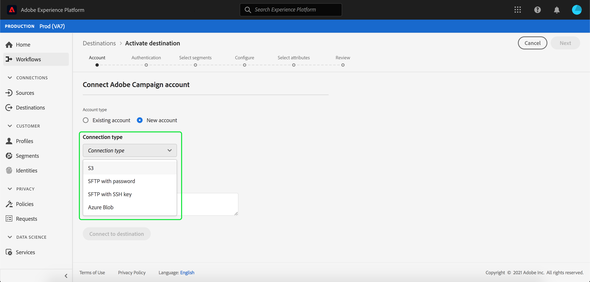

# Adobe Campaign連接

## 概述 {#overview}

Adobe Campaign是一套解決方案，可協助您跨所有線上及線下通道個人化並傳遞宣傳活動。 如需詳細資訊，請參閱[開始使用Campaign Classic](https://experienceleague.adobe.com/docs/campaign-classic/using/getting-started/starting-with-adobe-campaign/about-adobe-campaign-classic.html)。

若要傳送區段資料至Adobe Campaign，您必須先[連接Adobe Experience Platform的目的地](#connect-destination)，然後[設定從儲存位置匯入](#import-data-into-campaign)至Adobe Campaign的資料。

## 導出類型{#export-type}

**基於描述檔** -您要匯出區段的所有成員，以及所要的架構欄位(例如：電子郵件地址、電話號碼、姓氏)，如目標啟 **[!UICONTROL Select attributes]** 動工作流程 [中所選](../../ui/activate-destinations.md#select-attributes)。

## IP位址允許清單{#allow-list}

當使用SFTP儲存設定電子郵件行銷目標時，Adobe建議您將特定IP範圍新增至允許清單。

如果您需要將AdobeIP新增至允許清單，請參閱雲端儲存空間目標的[IP位址允許清單。](../cloud-storage/ip-address-allow-list.md)

## 連接目標{#connect-destination}

在&#x200B;**[!UICONTROL Connections]** > **[!UICONTROL Destinations]**&#x200B;中，選擇Adobe Campaign，然後選擇&#x200B;**[!UICONTROL Configure]**。

>[!NOTE]
>
>如果已存在與此目標的連接，則可以在目標卡上看到&#x200B;**[!UICONTROL Activate]**&#x200B;按鈕。 有關[!UICONTROL Activate]和[!UICONTROL Configure]之間差異的詳細資訊，請參閱目標工作區文檔的[目錄](../../ui/destinations-workspace.md#catalog)部分。

在連接目標工作流的&#x200B;**[!UICONTROL Account]**&#x200B;步驟中，為儲存位置選擇&#x200B;**[!UICONTROL Connection type]**。 對於Adobe Campaign，可以選擇&#x200B;**[!UICONTROL Amazon S3]**、**[!UICONTROL SFTP with Password]**、**[!UICONTROL SFTP with SSH Key]**&#x200B;和&#x200B;**[!UICONTROL Azure Blob]**。 傳送資料至Adobe Campaign的偏好方法是透過[!DNL Amazon S3]或[!DNL Azure Blob]。 根據您的連線類型，填寫下列資訊，然後選取&#x200B;**[!UICONTROL Connect]**。

- 對於&#x200B;**[!UICONTROL Amazon S3]**&#x200B;連接，必須提供[!UICONTROL Access Key ID]和[!UICONTROL Secret Access Key]。
- 對於&#x200B;**[!UICONTROL SFTP with Password]**&#x200B;連接，必須提供[!UICONTROL Domain]、[!UICONTROL Port]、[!UICONTROL Username]和[!UICONTROL Password]。
- 對於&#x200B;**[!UICONTROL SFTP with SSH Key]**&#x200B;連接，必須提供[!UICONTROL Domain]、[!UICONTROL Port]、[!UICONTROL Username]和[!UICONTROL SSH Key]。
- 對於&#x200B;**[!UICONTROL Azure Blob]**&#x200B;連接，必須提供連接字串。

或者，您可以將RSA格式的公鑰附加到&#x200B;**[!UICONTROL Key]**&#x200B;部分下的導出檔案中，以添加PGP/GPG加密。 您的公開金鑰必須寫入為[!DNL Base64]編碼字串。

在&#x200B;**[!UICONTROL Account authentication]**&#x200B;中，填寫您目的地的相關資訊，如下所示：
- **[!UICONTROL Name]**:為目的地選擇相關名稱。
- **[!UICONTROL Description]**:輸入目標的說明。
- **[!UICONTROL Bucket Name]**: *適用於S3連線*。輸入S3儲存貯體的位置，[!DNL Platform]會將匯出資料儲存為CSV或Tab分隔檔案。
- **[!UICONTROL Folder Path]**:在儲存位置中提供將匯出資 [!DNL Platform] 料儲存為CSV或Tab分隔檔案的路徑。
- **[!UICONTROL Container]**: *用於Blob連接*。保存資料夾路徑所在的Blob的容器。
- **[!UICONTROL File Format]**: **CSV** 或 **TAB_DELIMITED**。選擇要導出到儲存位置的檔案格式。
- **[!UICONTROL Marketing actions]**:行銷動作會指出將資料匯出至目的地的方式。您可以從Adobe定義的行銷動作中選擇，也可以建立自己的行銷動作。 如需行銷動作的詳細資訊，請參閱[資料使用政策概述](../../../data-governance/policies/overview.md)頁面。

填寫上述欄位後，請選取&#x200B;**[!UICONTROL Create destination]**。 您的目標現在已連線，您可以[啟動區段](../../ui/activate-destinations.md)至目標。

## 啟用區段{#activate-segments}

如需區段啟動工作流程的相關資訊，請參閱[啟用設定檔和區段至目標](../../ui/activate-destinations.md)。

## 目標屬性{#destination-attributes}

當[啟用區段](../../ui/activate-destinations.md)至Adobe Campaign目的地時，Adobe建議您從[union架構](../../../profile/home.md#profile-fragments-and-union-schemas)中選擇唯一識別碼。 選擇要導出到目標的唯一標識符和任何其他XDM欄位。 有關詳細資訊，請參閱[選擇在導出檔案中用作目標屬性的架構欄位](./overview.md#destination-attributes)。

## 導出資料{#exported-data}

對於[!DNL Adobe Campaign]目標，[!DNL Platform]會在您提供的儲存位置中建立以定位點分隔的`.txt`或`.csv`檔案。 如需檔案的詳細資訊，請參閱區段啟動教學課程中的[電子郵件行銷目標和雲端儲存目標](../../ui/activate-destinations.md#esp-and-cloud-storage)。

## 設定資料導入到Adobe Campaign{#import-data-into-campaign}

>[!IMPORTANT]
>
>- 執行此項整合時，請記住SFTP儲存限制、資料庫儲存限制和作用中的設定檔限制(依您的Adobe Campaign合約)。
>- 您需要使用[!DNL Campaign]工作流程，在Adobe Campaign排程、匯入和對應匯出的區段。 請參閱Adobe Campaign Classic文檔中的[設定循環導入](https://experienceleague.adobe.com/docs/campaign-classic/using/automating-with-workflows/use-cases/data-management/recurring-import-workflow.html)和Adobe Campaign Standard文檔中的[關於資料管理活動](https://experienceleague.adobe.com/docs/campaign-standard/using/managing-processes-and-data/data-management-activities/about-data-management-activities.html)。
>- 傳送資料至Adobe Campaign的偏好方法是透過[!DNL Amazon S3]或[!DNL Azure Blob]。

將[!DNL Platform]連接到[!DNL Amazon S3]或[!DNL Azure Blob]儲存後，必須將資料從儲存位置導入到Adobe Campaign。 要瞭解如何完成此任務，請參閱以下Adobe Campaign文檔頁：
- [開始使用Adobe Campaign Classic檔案](https://experienceleague.adobe.com/docs/campaign-classic/using/getting-started/importing-and-exporting-data/get-started-data-import-export.html) 中的 [資料匯入和匯](https://experienceleague.adobe.com/docs/campaign-classic/using/automating-with-workflows/action-activities/data-loading--file-.html) 出與資料載入（檔案）。
- [開始使用Adobe Campaign Standard檔案中](https://experienceleague.adobe.com/docs/campaign-standard/using/managing-processes-and-data/get-started-workflows.html) 的流程 [和](https://experienceleague.adobe.com/docs/campaign-standard/using/managing-processes-and-data/data-management-activities/load-file.html) 資料管理與載入檔案。
