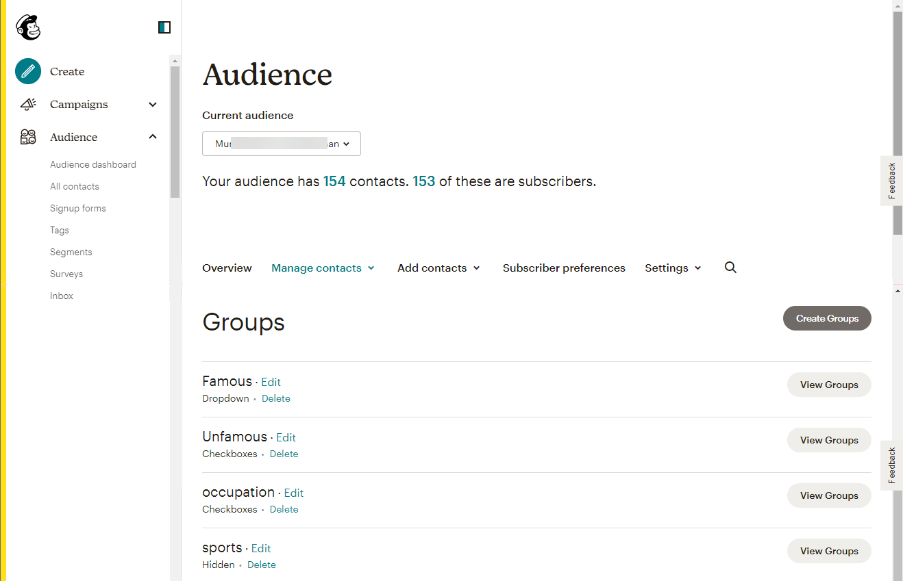

# [!DNL Mailchimp Interest Categories] 連線

[[!DNL Mailchimp]](https://mailchimp.com) 是熱門的行銷自動化平台及電子郵件行銷服務，企業可用來管理與聯絡人交談 *（客戶、客戶或其他相關人士）* 使用郵寄清單和電子郵件行銷活動。 可使用此連接器根據聯絡人的興趣和偏好將他們排序。

[!DNL Mailchimp Interest Categories] 使用 [對象](https://mailchimp.com/help/getting-started-audience/)， [群組](https://mailchimp.com/help/getting-started-with-groups/)和興趣類別 *（也稱為群組名稱或群組標題）*. 每個 [!DNL Mailchimp] 群組是興趣類別的清單。 聯絡人透過您網站上的登錄檔單訂閱一或多個興趣類別時，就會與興趣類別相關聯。 在對象中，您還可以將聯絡人組織成群組，並將其與興趣類別建立關聯，然後可以使用這些群組來建立區段。 您可以使用這些受眾將目標行銷活動電子郵件廣播給訂閱的聯絡人。

<!--
Compared to [!DNL Mailchimp Tags] which you would use for internal classification, [!DNL Mailchimp Interest Categories] is meant to manage subscriptions to topics of interest that your contacts might be interested in. *Note, Experience Platform also has a connection for [!DNL Mailchimp Tags], you can check it out on the [[!DNL Mailchimp Tags]](/help/destinations/catalog/email-marketing/mailchimp-tags.md) page.*
-->

這個 [!DNL Adobe Experience Platform] [目的地](/help/destinations/home.md) 使用 [[!DNL Mailchimp batch subscribe or unsubscribe API]](https://mailchimp.com/developer/marketing/api/lists/batch-subscribe-or-unsubscribe/) 要建立的API [興趣類別](https://mailchimp.com/developer/marketing/api/interest-categories/) 然後將每個選定Platform對象的聯絡人新增至對應的興趣類別。 您可以 **新增連絡人** 或 **更新現有專案的資訊 [!DNL Mailchimp] 連絡人**，然後 **新增或移除其想要的群組** 在現有 [!DNL Mailchimp] 在新區段中啟用對象後的對象。 [!DNL Mailchimp Interest Groups] 使用從Platform中選取的對象名稱作為中的興趣類別 [!DNL Mailchimp].

## 使用案例 {#use-cases}

為了協助您更清楚瞭解您應如何及何時使用 [!DNL Mailchimp Interest Categories] 目的地，以下是Adobe Experience Platform客戶可以使用此目的地解決的範例使用案例。

### 傳送電子郵件給行銷活動的連絡人 {#use-case-send-emails}

一家體育用品網站的銷售部門想要廣播電子郵件行銷活動，給已自我認定對足球感興趣的聯絡人清單。 聯絡人清單在從網站開發團隊收到的資料匯出中被分離為批次，因此需要被追蹤。 團隊會識別現有的 [!DNL Mailchimp] 對象並開始建立Experience Platform對象，每個清單中的聯絡人都會加入這些對象。 將這些對象傳送至後 [!DNL Mailchimp Interest Categories]，如果選取的連絡人中沒有任何連絡人 [!DNL Mailchimp] 對象會以該聯絡人所屬的對象名稱新增至群組。 如果有任何連絡人已存在於 [!DNL Mailchimp] 對象或群組，則會更新其資訊。 資料傳送至後 [!DNL Mailchimp Interest Categories]，銷售團隊可以選取行銷活動電子郵件，並傳送給中的足球興趣群組 [!DNL Mailchimp] 對象。

## 先決條件 {#prerequisites}

請參閱以下章節，以瞭解在Experience Platform中設定所需的任何先決條件，並 [!DNL Mailchimp] ，以瞭解在使用之前必須收集的資訊 [!DNL Mailchimp Interest Categories] 目的地。

### Experience Platform的必要條件 {#prerequisites-in-experience-platform}

在將資料啟用至 [!DNL Mailchimp Interest Categories] 目的地，您必須擁有 [綱要](/help/xdm/schema/composition.md)， a [資料集](https://experienceleague.adobe.com/docs/platform-learn/tutorials/data-ingestion/create-datasets-and-ingest-data.html)、和 [區段](https://experienceleague.adobe.com/docs/platform-learn/tutorials/segments/create-segments.html) 建立於 [!DNL Experience Platform].

### 的先決條件 [!DNL Mailchimp Interest Categories] 目的地 {#prerequisites-destination}

若要將資料從Platform匯出至您的 [!DNL Mailchimp] 帳戶：

#### 您必須擁有 [!DNL Mailchimp] 帳戶 {#prerequisites-account}

建立之前 [!DNL Mailchimp Interest Categories] 目的地，您必須先確定您擁有 [!DNL Mailchimp] 帳戶。 如果您還沒有這類網站，請前往 [[!DNL Mailchimp] 註冊頁面](https://login.mailchimp.com/signup/) 以註冊及建立您的帳戶。

#### 彙總 [!DNL Mailchimp] API金鑰 {#gather-credentials}

您需要您的 [!DNL Mailchimp] **API金鑰** 驗證 [!DNL Mailchimp Interest Categories] 針對您的 [!DNL Mailchimp] 帳戶。 此 **API金鑰** 用作 **密碼** 當您 [驗證目的地](#authenticate).

如果您沒有 **API金鑰**，登入您的帳戶並參閱 [[!DNL Mailchimp] 產生您的API金鑰](https://mailchimp.com/developer/marketing/guides/quick-start/#generate-your-api-key) 建立檔案。

API金鑰的範例為 `0123456789abcdef0123456789abcde-us14`.

>[!IMPORTANT]
>
>如果您產生 **API金鑰**，請寫下它，因為您無法在世代之後存取它。

#### 識別 [!DNL Mailchimp] 資料中心 {#identify-data-center}

接下來，您必須識別您的 [!DNL Mailchimp] 資料中心。 若要這麼做，請登入 [!DNL Mailchimp] 帳戶並導覽至 **API金鑰區段** ，以取得您的帳號。

值是您在瀏覽器中看到的URL的第一部分。 如果URL為 *https://`us14`.mailchimp.com/account/api/*，則資料中心為 `us14`.

也會以表單附加至您的API金鑰 *key-dc*；如果您的API金鑰為 `0123456789abcdef0123456789abcde-us14`，則資料中心為 `us14`.

寫下資料中心值 *(`us14` 在此範例中)*，您需要在下列情況下使用此值： [填寫目的地詳細資料](#destination-details).

如果您需要進一步的指引，請參閱 [[!DNL Mailchimp] 基礎檔案](https://mailchimp.com/developer/marketing/docs/fundamentals/#api-structure).

### 護欄 {#guardrails}

您的 [!DNL Mailchimp] 對象可在單一群組中或相同對象內數個群組間包含最多60個群組名稱（或興趣類別）。 請參閱 [!DNL Mailchimp] [群組](https://mailchimp.com/help/getting-started-with-groups/) 以取得任何澄清。 達到此限制時，您會收到 `400 BAD_REQUEST Cannot have more than 60 interests per list (Across all categories)` 作為錯誤回應的訊息 [!DNL Mailchimp] API。

此外，請參閱 [!DNL Mailchimp] [速率限制](https://mailchimp.com/developer/marketing/docs/fundamentals/#api-limits) 以取得關於 [!DNL Mailchimp] API。

## 支援的身分 {#supported-identities}

[!DNL Mailchimp] 支援下表所述的身分啟用。 進一步瞭解 [身分](/help/identity-service/namespaces.md).

| 目標身分 | 說明 | 考量事項 |
|---|---|---|
| 電子郵件 | 連絡人電子郵件地址 | 強制 |

{style="table-layout:auto"}

## 匯出型別和頻率 {#export-type-frequency}

請參閱下表以取得目的地匯出型別和頻率的資訊。

| 項目 | 類型 | 附註 |
---------|----------|---------|
| 匯出型別 | **[!UICONTROL 以設定檔為基礎]** | <ul><li>您正在匯出區段的所有成員，以及所需的結構欄位 *（例如：電子郵件地址、電話號碼、姓氏）*，根據您的欄位對應。</li><li> 針對Platform中每個選取的對象，對應至 [!DNL Mailchimp Interest Categories] 區段狀態會從Platform更新其對象狀態。</li></ul> |
| 匯出頻率 | **[!UICONTROL 串流]** | 串流目的地是「一律開啟」的API型連線。 當根據對象評估在Experience Platform中更新設定檔時，聯結器會將更新傳送至下游的目標平台。 深入瞭解 [串流目的地](/help/destinations/destination-types.md#streaming-destinations). |

{style="table-layout:auto"}

## 連線到目標 {#connect}

>[!IMPORTANT]
>
>若要連線到目的地，您需要 **[!UICONTROL 檢視目的地]** 和 **[!UICONTROL 管理目的地]** [存取控制許可權](/help/access-control/home.md#permissions). 閱讀 [存取控制總覽](/help/access-control/ui/overview.md) 或聯絡您的產品管理員以取得必要許可權。

若要連線至此目的地，請遵循以下說明的步驟： [目的地設定教學課程](../../ui/connect-destination.md). 在設定目標工作流程中，填寫以下兩個區段中列出的欄位。

範圍 **[!UICONTROL 目的地]** > **[!UICONTROL 目錄]**，搜尋 [!DNL Mailchimp Interest Categories]. 或者，您也可以在 **[!UICONTROL 電子郵件行銷]** 類別。

### 驗證目標 {#authenticate}

若要向目的地進行驗證，請填寫以下必填欄位並選取 **[!UICONTROL 連線到目的地]**.

| 欄位 | 說明 |
| --- | --- |
| **[!UICONTROL 使用者名稱]** | 您的 [!DNL Mailchimp Interest Categories] 使用者名稱。 |
| **[!UICONTROL 密碼]** | 您的 [!DNL Mailchimp] **API金鑰**，您已在 [彙總 [!DNL Mailchimp] 認證](#gather-credentials) 區段。  您的API金鑰採取以下形式 `{KEY}-{DC}`，其中 `{KEY}` 部分指在 [[!DNL Mailchimp] API金鑰](#gather-credentials) 區段和 `{DC}` 部分是指 [[!DNL Mailchimp] 資料中心](#identify-data-center).  您可以提供 `{KEY}` 部分或整個表單。  例如，如果您的API金鑰是  *`0123456789abcdef0123456789abcde-us14`*，  您可以提供&#x200B;*`0123456789abcdef0123456789abcde`*或&#x200B;*`0123456789abcdef0123456789abcde-us14`*做為值。 |

{style="table-layout:auto"}

如果提供的詳細資料有效，UI會顯示 **[!UICONTROL 已連線]** 帶有綠色勾號的狀態。 然後您可以繼續下一步驟。

### 填寫目標詳細資訊 {#destination-details}

若要設定目的地的詳細資訊，請填寫下方的必填和選用欄位。 UI中欄位旁的星號表示該欄位為必填欄位。

| 欄位 | 說明 |
| --- | --- |
| **[!UICONTROL 名稱]** | 您日後可辨識此目的地的名稱。 |
| **[!UICONTROL 說明]** | 可協助您日後識別此目的地的說明。 |
| **[!UICONTROL 資料中心]** | 您的 [!DNL Mailchimp] 帳戶 `data center`. 請參閱 [識別 [!DNL Mailchimp] 資料中心](#identify-data-center) 區段以取得任何指引。 |
| **[!UICONTROL 對象名稱（請先選取資料中心）]** | 在您選取 **[!UICONTROL 資料中心]**，此下拉式清單會自動填入您網站上的 [!DNL Mailchimp] 帳戶。 選取您要以Platform資料更新的對象。 |
| **[!UICONTROL 興趣類別（請先選取資料中心和對象名稱）]** | 在您選取 **[!UICONTROL 對象名稱]**，此下拉式清單會自動填入「 」中 [!DNL Mailchimp] 帳戶。 選取您要以Platform資料更新的類別名稱。 |

{style="table-layout:auto"}

>[!TIP]
>
> 如果您提供的API金鑰位於 **[!UICONTROL 密碼]** 欄位或 **[!UICONTROL 資料中心]** 值不正確，UI顯示 [!DNL Mailchimp] API錯誤回應： *`No options are available. Please verify the values selected for the following dependent fields: dataCenter`* 如下所示。 在此情況下，您無法從 **[!UICONTROL 對象名稱（請先選取資料中心）]** 欄位。 若要修正此錯誤，請提供正確的值。

### 啟用警示 {#enable-alerts}

您可以啟用警報以接收有關傳送到您目的地的資料流狀態的通知。 從清單中選取警報以訂閱接收有關資料流狀態的通知。 如需警示的詳細資訊，請參閱以下指南： [使用UI訂閱目的地警報](../../ui/alerts.md).

當您完成提供目的地連線的詳細資訊時，請選取「 」 **[!UICONTROL 下一個]**.

## 啟動此目標的對象 {#activate}

>[!IMPORTANT]
> 
>* 若要啟用資料，您需要 **[!UICONTROL 檢視目的地]**， **[!UICONTROL 啟用目的地]**， **[!UICONTROL 檢視設定檔]**、和 **[!UICONTROL 檢視區段]** [存取控制許可權](/help/access-control/home.md#permissions). 閱讀 [存取控制總覽](/help/access-control/ui/overview.md) 或聯絡您的產品管理員以取得必要許可權。
>* 要匯出 *身分*，您需要 **[!UICONTROL 檢視身分圖表]** [存取控制許可權](/help/access-control/home.md#permissions).   {width="100" zoomable="yes"}

讀取 [將設定檔和受眾啟用至串流受眾匯出目標](/help/destinations/ui/activate-segment-streaming-destinations.md) 以取得啟用此目的地對象的指示。

### 對應考量事項和範例 {#mapping-considerations-example}

若要正確將對象資料從Adobe Experience Platform傳送至 [!DNL Mailchimp Interest Categories] 目的地，您必須完成欄位對應步驟。 對應包括在Platform帳戶中的Experience Data Model (XDM)結構描述欄位與來自目標目的地的對應對應專案之間建立連結。

若要正確將XDM欄位對應至 [!DNL Mailchimp Interest Categories] 目的地欄位，請遵循下列步驟：

1. 在 **[!UICONTROL 對應]** 步驟，選取 **[!UICONTROL 新增對應]**. 您現在可以在畫面上看到新的對應列。
1. 在 **[!UICONTROL 選取來源欄位]** 視窗，選擇 **[!UICONTROL 選取屬性]** 類別並選取XDM屬性或選擇 **[!UICONTROL 選取身分名稱空間]** 並選取身分。
1. 在 **[!UICONTROL 選取目標欄位]** 視窗，選擇 **[!UICONTROL 選取身分名稱空間]** 並選取身分或選擇 **[!UICONTROL 選取屬性]** 類別並從填入的屬性清單中選取 [!DNL Mailchimp] API。 *您新增至所選專案的任何自訂屬性 [!DNL Mailchimp] 對象也可選擇為目標欄位。*

   XDM設定檔結構描述與之間可用的對應 [!DNL Mailchimp Interest Categories] 如下所示： | 來源欄位 | 目標欄位 | 附註 | | — | — | — | |`IdentityMap: Email`|`Identity: email`| 必要：是 | |`xdm: person.name.firstName`|`Attribute: FNAME`| | |`xdm: person.name.lastName`|`Attribute: LNAME`| | |`xdm: person.birthDayAndMonth`|`Attribute: BIRTHDAY`| |

   此外， `ADDRESS` 是特殊目標欄位，稱為 `merge field` 在您的 [!DNL Mailchimp] 對象。 此 [[!DNL Mailchimp] 檔案](https://mailchimp.com/developer/marketing/docs/merge-fields/) 將所需的索引鍵定義為 `addr1`， `city`， `state`、和 `zip`和選用的索引鍵 `addr2` 和 `country`. 這些欄位的值必須是字串。 如果任何 `ADDRESS` 若有欄位對應，則目的地會傳遞 `ADDRESS` 物件至 [!DNL Mailchimp] 用於更新的API。 任何 `ADDRESS` 未對應的欄位其值預設為 `NULL` 除了國家/地區預設為 `US`.

   以下專案可用的對應： `ADDRESS` 欄位如下：

   | 來源欄位 | 目標欄位 |
   | --- | --- |
   | `xdm: workAddress.street1` | `Attribute: ADDRESS.addr1` |
   | `xdm: workAddress.street2` | `Attribute: ADDRESS.addr2` |
   | `xdm: workAddress.city` | `Attribute: ADDRESS.city` |
   | `xdm: workAddress.state` | `Attribute: ADDRESS.state` |
   | `xdm: workAddress.postalCode` | `Attribute: ADDRESS.zip` |
   | `xdm: workAddress.country` | `Attribute: ADDRESS.country` |

   例如，您想要更新以下專案的值： `country` 連絡人的現有位址列位 `addr1`， `city`， `state`、和 `zip` 值 `132, My Street, Kingston`， `New York`， `New York` 和 `12401`. 若要更新 `country` 您必須傳遞包含變更的現有值 *（如果有的話）* 以及國家/地區的新值。 因此，資料集中的值應該 `132, My Street, Kingston`， `New York`， `New York`， `12401`、和 `US`. 若您只通過 `country` 並且不提供以下專案的值： `addr1`， `city`， `state`、和 `zip` 它們將被覆寫 `NULL`.

   具有已完成對應的範例如下所示：
   

當您完成提供目的地連線的對應時，請選取 **[!UICONTROL 下一個]**.

## 驗證資料匯出 {#exported-data}

若要驗證您是否已正確設定目的地，請遵循下列步驟：

* 登入您的 [[!DNL Mailchimp]](https://login.mailchimp.com/) 帳戶。 然後，導覽至 **[!DNL Audience]** 頁面。 接下來，展開 **[!DNL Manage Contacts]** 功能表並選取 **[!DNL Groups]**.

* 選取群組，並檢查選取的對象是否以來自平台的對象名稱建立為類別，且後面可能會接著自動產生的尾碼。
   * 此目的地會使用所選區段的名稱，透過以下方式建立興趣類別： [[!DNL Mailchimp] 新增興趣類別API](https://mailchimp.com/developer/marketing/api/interest-categories/add-interest-category/). 如果您建立新目的地，然後再次啟用相同的對象， [!DNL Mailchimp] 新增尾碼以區分現有區段和新區段。
* 群組中不存在其電子郵件的連絡人會新增至新建立的類別。
* 對於群組中已存在的連絡人，會更新屬性欄位資料，並將連絡人新增至新建立的類別。

## 資料使用與控管 {#data-usage-governance}

全部 [!DNL Adobe Experience Platform] 處理您的資料時，目的地符合資料使用原則。 如需如何操作的詳細資訊 [!DNL Adobe Experience Platform] 強制執行資料控管，請參閱 [資料控管概觀](/help/data-governance/home.md).

## 錯誤與疑難排解 {#errors-and-troubleshooting}

### 發生以下情況時發生錯誤： [!DNL Mailchimp] API金鑰或資料中心值不正確 {#incorrect-credentials-error}

如果您提供的API金鑰位於 **[!UICONTROL 密碼]** 欄位或 **[!UICONTROL 資料中心]** 值不正確，UI顯示 [!DNL Mailchimp] API錯誤回應： *`No options are available. Please verify the values selected for the following dependent fields: dataCenter`* 如下所示。 在此情況下，您無法從 **[!UICONTROL 對象名稱（請先選取資料中心）]** 欄位。

若要修正此錯誤並繼續進行下一個步驟，您必須提供正確的值。 請參閱 [識別 [!DNL Mailchimp] 資料中心](#identify-data-center) 和
[彙總 [!DNL Mailchimp] API金鑰](#gather-credentials) 區段（若您需要指引）。

### 發生以下情況時發生錯誤： [!DNL Mailchimp] 超過群組名稱限制 {#group-name-limits-error}

建立目的地時，您可能會收到下列錯誤訊息： *`Cannot have more than 60 interests per list (Across all categories)`* 或 *`400 BAD_REQUEST`*. 當超過單一群組或相同對象限制內數個群組的60個群組名稱（或興趣類別）時，就會發生此情況，如 [護欄](#guardrails) 區段。 若要修正此錯誤，請確定您未超過中的群組名稱限制。 [!DNL Mailchimp].

### [!DNL Mailchimp] 狀態與錯誤代碼

請參閱 [[!DNL Mailchimp] 錯誤頁面](https://mailchimp.com/developer/marketing/docs/errors/) 以取得狀態和錯誤碼的完整清單，並附上說明。

## 其他資源 {#additional-resources}

其他實用資訊來自 [!DNL Mailchimp] 檔案如下：
* [快速入門 [!DNL Mailchimp]](https://mailchimp.com/help/getting-started-with-mailchimp/)
* [開始使用對象](https://mailchimp.com/help/getting-started-audience/)
* [建立對象](https://mailchimp.com/help/create-audience/)
* [群組快速入門](https://mailchimp.com/help/getting-started-with-groups/)
* [建立新的對象群組](https://mailchimp.com/help/create-new-audience-group/)
* [興趣類別](https://mailchimp.com/developer/marketing/api/interest-categories/)
* [行銷API](https://mailchimp.com/developer/marketing/api/)
