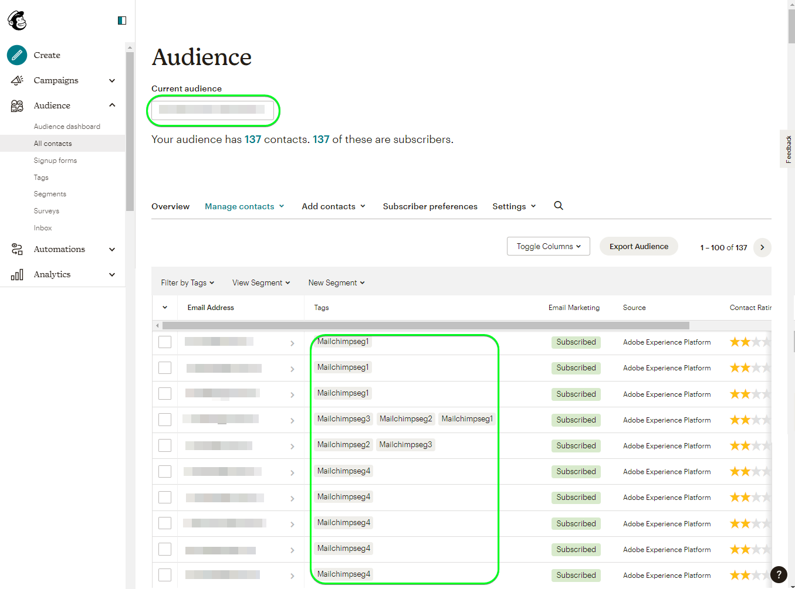

# [!DNL Mailchimp Tags] 連線

[[!DNL Mailchimp]](https://mailchimp.com) *(也稱為 [!DNL Intuit Mailchimp])* 是熱門的行銷自動化平台及電子郵件行銷服務，企業可用來管理與聯絡人交談 *（客戶、客戶或其他相關人士）* 使用郵寄清單和電子郵件行銷活動。

[!DNL Mailchimp Tags] 使用 [對象](https://mailchimp.com/help/getting-started-audience/) 和 [標籤](https://mailchimp.com/help/getting-started-tags/) 以管理您的連絡資訊。 標籤是標籤，您可以使用這些標籤來組織連絡人，並標籤它們以用於內的內部分類 [!DNL Mailchimp].

比較 [!DNL Mailchimp Interest Categories] 您可用來根據連絡人的興趣和喜好來排序連絡人， [!DNL Mailchimp Tags] 旨在管理您的聯絡人可能感興趣的主題訂閱。 *請注意，Experience Platform也有針對以下專案的連線： [!DNL Mailchimp Interest Categories]，您可在以下網址檢視： [[!DNL Mailchimp Interest Categories]](/help/destinations/catalog/email-marketing/mailchimp-interest-categories.md) 頁面。*

這個 [!DNL Adobe Experience Platform] [目的地](/help/destinations/home.md) 可運用 [[!DNL Mailchimp batch subscribe or unsubscribe API]](https://mailchimp.com/developer/marketing/api/lists/batch-subscribe-or-unsubscribe/) 端點。 您可以 **新增連絡人** 或 **更新現有標籤 [!DNL Mailchimp] 連絡人** 在現有 [!DNL Mailchimp] 在新對象中啟用它們後的對象。 [!DNL Mailchimp Tags] 使用從Platform選取的對象名稱做為 [!DNL Mailchimp].

## 使用案例 {#use-cases}

為了協助您更清楚瞭解您應如何及何時使用 [!DNL Mailchimp Tags] 目的地，以下是Adobe Experience Platform客戶可以使用此目的地解決的範例使用案例。

### 傳送電子郵件給行銷活動的連絡人 {#use-case-send-emails}

組織的銷售部門想要將電子郵件行銷活動廣播至已組織的聯絡人清單。 連絡人清單是從不同的離線來源以批次方式收到，因此需要加以追蹤。 團隊會識別現有的 [!DNL Mailchimp] 對象並開始建立Experience Platform對象，每個清單中的聯絡人都會加入這些對象。 將這些對象傳送至後 [!DNL Mailchimp Tags]，如果選取的連絡人中沒有任何連絡人 [!DNL Mailchimp] 對象，則會新增相關標籤，其中包含聯絡人所屬的對象名稱。 如果有任何連絡人已存在於 [!DNL Mailchimp] 對象已新增一個具有對象名稱的新標籤。 由於標籤可見於 [!DNL Mailchimp] 可輕鬆識別離線來源。 在資料傳送至後 [!DNL Mailchimp] 他們會將行銷活動電子郵件傳送給對象。

## 先決條件 {#prerequisites}

請參閱以下章節，以瞭解在Experience Platform中設定所需的任何先決條件，並 [!DNL Mailchimp] 以及使用之前需要收集的資訊 [!DNL Mailchimp Tags] 目的地。

### Experience Platform的必要條件 {#prerequisites-in-experience-platform}

在將資料啟用至 [!DNL Mailchimp Tags] 目的地，您必須擁有 [綱要](/help/xdm/schema/composition.md)， a [資料集](https://experienceleague.adobe.com/docs/platform-learn/tutorials/data-ingestion/create-datasets-and-ingest-data.html?lang=en)、和 [對象](https://experienceleague.adobe.com/docs/platform-learn/tutorials/audiences/create-audiences.html) 建立於 [!DNL Experience Platform].

### 的先決條件 [!DNL Mailchimp Tags] 目的地 {#prerequisites-destination}

若要將資料從Platform匯出至您的 [!DNL Mailchimp Tags] 帳戶：

#### 您需要擁有 [!DNL Mailchimp] 帳戶 {#prerequisites-account}

建立之前 [!DNL Mailchimp Tags] 目的地，您必須先確定您擁有 [!DNL Mailchimp] 帳戶。 如果您還沒有訪客，請前往 [[!DNL Mailchimp] 註冊頁面](https://login.mailchimp.com/signup/) 以註冊及建立您的帳戶。

#### 彙總 [!DNL Mailchimp] API金鑰 {#gather-credentials}

您需要您的 [!DNL Mailchimp] **API金鑰** 驗證 [!DNL Mailchimp Interest Categories] 針對您的 [!DNL Mailchimp] 帳戶。 此 **API金鑰** 用作 **密碼** 當您 [驗證目的地](#authenticate).

如果您沒有 **API金鑰**，登入您的 [!DNL Mailchimp] 帳戶並參閱 [!DNL Mailchimp] 檔案： [如何產生您的API金鑰](https://mailchimp.com/developer/marketing/guides/quick-start/#generate-your-api-key).

API金鑰的範例為 `0123456789abcdef0123456789abcde-us14`.

>[!IMPORTANT]
>
>如果您產生 **API金鑰**，請寫下它，因為您無法在世代之後存取它。

#### 識別您的 [!DNL Mailchimp] 資料中心 {#identify-data-center}

接下來，您必須識別您的 [!DNL Mailchimp] 資料中心。 若要這麼做，請登入 [!DNL Mailchimp] 帳戶並導覽至 **API金鑰區段** ，以取得您的帳號。

資料中心ID是您在瀏覽器中看到的URL的第一部分。 如果URL為 *https://`us14`.mailchimp.com/account/api/*，則資料中心為 `us14`.

資料中心ID也會以表單附加至您的API金鑰 *key-dc*；例如，若您的API金鑰為 `0123456789abcdef0123456789abcde-us14`，則資料中心為 `us14`.

寫下資料中心值 *(`us14` 在此範例中)*. 您需要此值， [填寫目的地詳細資料](#destination-details).

如果您需要進一步的指引，請參閱 [[!DNL Mailchimp] 基礎檔案](https://mailchimp.com/developer/marketing/docs/fundamentals/#api-structure).

### 護欄 {#guardrails}

請參閱 [!DNL Mailchimp] [速率限制](https://mailchimp.com/developer/marketing/docs/fundamentals/#api-limits) 以取得關於 [!DNL Mailchimp] API。

## 支援的身分 {#supported-identities}

[!DNL Mailchimp] 支援下表所述的身分啟用。 進一步瞭解 [身分](/help/identity-service/features/namespaces.md).

| 目標身分 | 說明 | 考量事項 |
|---|---|---|
| 電子郵件 | 連絡人的電子郵件地址。 | 強制 |

{style="table-layout:auto"}

## 支援的對象 {#supported-audiences}

本節說明您可以將哪些型別的對象匯出至此目的地。

| 對象來源 | 支援 | 說明 |
---------|----------|----------|
| [!DNL Segmentation Service] | ✓ (A) | 透過Experience Platform產生的對象 [分段服務](../../../segmentation/home.md). |
| 自訂上傳 | ✓ | 受眾 [已匯入](../../../segmentation/ui/overview.md#import-audience) 從CSV檔案Experience Platform為。 |

{style="table-layout:auto"}

## 匯出型別和頻率 {#export-type-frequency}

請參閱下表以取得目的地匯出型別和頻率的資訊。

| 項目 | 類型 | 附註 |
---------|----------|---------|
| 匯出型別 | **[!UICONTROL 以設定檔為基礎]** | <ul><li>您正在匯出對象的所有成員，以及所需的結構欄位 *（例如：電子郵件地址、電話號碼、姓氏）*，根據您的欄位對應。</li><li> 針對Platform中選取的每個對象，對應至 [!DNL Mailchimp Tags] 區段狀態會以Platform中的對象狀態更新。</li></ul> |
| 匯出頻率 | **[!UICONTROL 串流]** | 串流目的地是「一律開啟」的API型連線。 一旦根據對象評估在Experience Platform中更新了設定檔，聯結器就會將更新傳送至下游的目的地平台。 深入瞭解 [串流目的地](/help/destinations/destination-types.md#streaming-destinations). |

{style="table-layout:auto"}

## 連線到目標 {#connect}

>[!IMPORTANT]
>
>若要連線到目的地，您需要 **[!UICONTROL 管理目的地]** [存取控制許可權](/help/access-control/home.md#permissions). 閱讀 [存取控制總覽](/help/access-control/ui/overview.md) 或聯絡您的產品管理員以取得必要許可權。

若要連線至此目的地，請遵循以下說明的步驟： [目的地設定教學課程](../../ui/connect-destination.md). 在設定目標工作流程中，填寫以下兩個區段中列出的欄位。

範圍 **[!UICONTROL 目的地]** > **[!UICONTROL 目錄]**，搜尋 [!DNL Mailchimp Tags]. 或者，您可以在 **[!UICONTROL 電子郵件行銷]** 類別。

### 驗證目標 {#authenticate}

若要向目的地進行驗證，請填寫以下必填欄位並選取 **[!UICONTROL 連線到目的地]**.

| 欄位 | 說明 |
| --- | --- |
| **[!UICONTROL 使用者名稱]** | 您的 [!DNL Mailchimp] 使用者名稱。 |
| **[!UICONTROL 密碼]** | 您的 [!DNL Mailchimp] **API金鑰**，您已在 [彙總 [!DNL Mailchimp] 認證](#gather-credentials) 區段。  您的API金鑰採取以下形式 `{KEY}-{DC}`，其中 `{KEY}` 部分指在 [[!DNL Mailchimp] API金鑰](#gather-credentials) 區段和 `{DC}` 部分是指 [[!DNL Mailchimp] 資料中心](#identify-data-center).  您可以提供 `{KEY}` 部分或整個表單。  例如，如果您的API金鑰是  *`0123456789abcdef0123456789abcde-us14`*，  您可以提供&#x200B;*`0123456789abcdef0123456789abcde`*或&#x200B;*`0123456789abcdef0123456789abcde-us14`*做為值。 |

{style="table-layout:auto"}

如果提供的詳細資料有效，UI會顯示 **[!UICONTROL 已連線]** 帶有綠色勾號的狀態。 然後您可以繼續下一步驟。

### 填寫目標詳細資訊 {#destination-details}

若要設定目的地的詳細資訊，請填寫下方的必填和選用欄位。 UI中欄位旁的星號表示該欄位為必填欄位。

| 欄位 | 說明 |
| --- | --- |
| **[!UICONTROL 名稱]** | 您日後可辨識此目的地的名稱。 |
| **[!UICONTROL 說明]** | 可協助您日後識別此目的地的說明。 |
| **[!UICONTROL 資料中心]** | 您的 [!DNL Mailchimp] 帳戶 `data center`. 請參閱 [識別 [!DNL Mailchimp] 資料中心](#identify-data-center) 區段以取得任何指引。 |
| **[!UICONTROL 對象名稱（請先輸入資料中心）]** | 在您輸入 **[!UICONTROL 資料中心]**，此下拉式清單會自動填入您網站上的 [!DNL Mailchimp] 帳戶。 選取您要以Platform資料更新的對象。 |

{style="table-layout:auto"}

### 啟用警示 {#enable-alerts}

您可以啟用警報以接收有關傳送到您目的地的資料流狀態的通知。 從清單中選取警報以訂閱接收有關資料流狀態的通知。 如需警示的詳細資訊，請參閱以下指南： [使用UI訂閱目的地警報](../../ui/alerts.md).

當您完成提供目的地連線的詳細資訊時，請選取「 」 **[!UICONTROL 下一個]**.

## 啟動此目標的對象 {#activate}

>[!IMPORTANT]
> 
>* 若要啟用資料，您需要 **[!UICONTROL 檢視目的地]**， **[!UICONTROL 啟用目的地]**， **[!UICONTROL 檢視設定檔]**、和 **[!UICONTROL 檢視區段]** [存取控制許可權](/help/access-control/home.md#permissions). 閱讀 [存取控制總覽](/help/access-control/ui/overview.md) 或聯絡您的產品管理員以取得必要許可權。
>* 要匯出 *身分*，您需要 **[!UICONTROL 檢視身分圖表]** [存取控制許可權](/help/access-control/home.md#permissions).   {width="100" zoomable="yes"}

讀取 [啟用串流目的地的對象](/help/destinations/ui/activate-segment-streaming-destinations.md) 以取得啟用此目的地對象的指示。

### 對應考量事項和範例 {#mapping-considerations-example}

若要正確將對象資料從Adobe Experience Platform傳送至 [!DNL Mailchimp Tags] 目的地，您必須進行欄位對應步驟。 對應包括在Platform帳戶中的Experience Data Model (XDM)結構描述欄位與來自目標目的地的對應對應專案之間建立連結。

若要正確將XDM欄位對應至 [!DNL Mailchimp Tags] 目的地欄位，請遵循下列步驟：

1. 在 **[!UICONTROL 對應]** 步驟，選取 **[!UICONTROL 新增對應]**. 您會在畫面上看到新的對應列。
1. 在 **[!UICONTROL 選取來源欄位]** 視窗，選擇 **[!UICONTROL 選取身分名稱空間]** 並選取 `Email` 身分名稱空間。

   

1. 在 **[!UICONTROL 選取目標欄位]** 視窗，選擇 **[!UICONTROL 選取身分名稱空間]** 並選取 `Email` 身分名稱空間。

   

   XDM設定檔結構描述與之間的對應 [!DNL Mailchimp Tags] 將如下所示： | 來源欄位 | 目標欄位 | 強制 | | — | — | — | |`IdentityMap: Email`|`Identity: Email`| 是 |

   具有已完成對應的範例如下所示：
   

當您完成提供目的地連線的對應時，請選取 **[!UICONTROL 下一個]**.

## 驗證資料匯出 {#exported-data}

若要驗證您是否已正確設定目的地，請遵循下列步驟：

1. 登入您的 [[!DNL Mailchimp]](https://login.mailchimp.com/) 帳戶。 然後導覽至 **[!DNL Audience]** > **[!DNL All Contacts]** 頁面，並檢查是否已新增對象中的連絡人，以及對象中的連絡人是否已更新對象名稱。
   

## 資料使用與控管 {#data-usage-governance}

全部 [!DNL Adobe Experience Platform] 處理您的資料時，目的地符合資料使用原則。 如需如何操作的詳細資訊 [!DNL Adobe Experience Platform] 強制執行資料控管，請參閱 [資料控管概觀](/help/data-governance/home.md).

## 錯誤與疑難排解 {#errors-and-troubleshooting}

請參閱 [[!DNL Mailchimp] 錯誤頁面](https://mailchimp.com/developer/marketing/docs/errors/) 以取得狀態和錯誤碼的完整清單，並附上說明。

## 其他資源 {#additional-resources}

其他實用資訊來自 [!DNL Mailchimp] 檔案如下：
* [快速入門 [!DNL Mailchimp]](https://mailchimp.com/help/getting-started-with-mailchimp/)
* [開始使用對象](https://mailchimp.com/help/getting-started-audience/)
* [建立對象](https://mailchimp.com/help/create-audience/)
* [標籤快速入門](https://mailchimp.com/help/getting-started-tags/)
* [行銷API](https://mailchimp.com/developer/marketing/api/)
