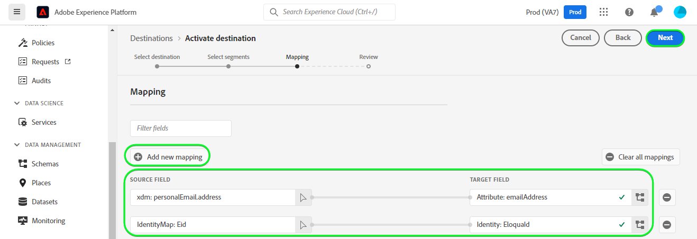

# [!DNL (API) Oracle Eloqua] 連接

[[!DNL Oracle Eloqua]](https://www.oracle.com/cx/marketing/automation/) 可讓行銷人員規劃及執行行銷活動，同時為潛在客戶提供個人化的客戶體驗。 透過整合式銷售機會管理和輕鬆的行銷活動建立，協助行銷人員在購買者歷程的適當時間與適當的對象互動，並優雅地調整規模以跨通路觸及對象，包括電子郵件、顯示搜尋、影片和行動裝置。 銷售團隊可以更快完成更多交易，透過即時分析提高行銷ROI。

此 [!DNL Adobe Experience Platform] [目的地](/help/destinations/home.md) 利用 [更新聯繫人](https://docs.oracle.com/en/cloud/saas/marketing/eloqua-rest-api/op-api-rest-1.0-data-contact-id-put.html) 操作 [!DNL Oracle Eloqua] REST API，可讓您 **更新身分** 在區段內進入 [!DNL Oracle Eloqua].

[!DNL Oracle Eloqua] uses [基本驗證](https://docs.oracle.com/en/cloud/saas/marketing/eloqua-rest-api/Authentication_Basic.html) 與 [!DNL Oracle Eloqua] REST API。 向您的 [!DNL Oracle Eloqua] 執行個體在下方， [驗證到目標](#authenticate) 區段。

## 使用案例 {#use-cases}

線上平台的行銷部門想要將電子郵件行銷活動廣播給經策劃的銷售機會對象。 該平台的行銷團隊可透過Adobe Experience Platform更新現有的銷售機會資訊、從自己的離線資料建立區段，並將這些區段傳送至 [!DNL Oracle Eloqua]，然後可用來傳送行銷活動電子郵件。

## 先決條件 {#prerequisites}

### Experience Platform必要條件 {#prerequisites-in-experience-platform}

在將資料啟用至 [!DNL Oracle Eloqua] 目的地，您必須 [綱要](/help/xdm/schema/composition.md), [資料集](https://experienceleague.adobe.com/docs/platform-learn/tutorials/data-ingestion/create-datasets-and-ingest-data.html?lang=en)，和 [區段](https://experienceleague.adobe.com/docs/platform-learn/tutorials/segments/create-segments.html?lang=en) 建立於 [!DNL Experience Platform].

請參閱Experience Platform檔案，以了解 [區段成員資格詳細資料結構欄位群組](/help/xdm/field-groups/profile/segmentation.md) 如果您需要區段狀態的指引。

### [!DNL Oracle Eloqua] 必要條件 {#prerequisites-destination}

若要將資料從Platform匯出至 [!DNL Oracle Eloqua] 帳戶 [!DNL Oracle Eloqua] 帳戶。

此外，您至少需要 *&quot;進階使用者 — 行銷權限&quot;* 為 [!DNL Oracle Eloqua] 例項。 請參閱 *&quot;安全組&quot;* 區段 [安全用戶訪問](https://docs.oracle.com/en/cloud/saas/marketing/eloqua-user/Help/SecurityOverview/SecuredUserAccess.htm) 頁面以取得指引。 目的地以程式設計方式要求存取 [決定基礎URL](https://docs.oracle.com/en/cloud/saas/marketing/eloqua-rest-api/DeterminingBaseURL.html) 叫用 [!DNL Oracle Eloqua] API。

#### 收集 [!DNL Oracle Eloqua] 憑據 {#gather-credentials}

在驗證之前，請記下下列項目 [!DNL Oracle Eloqua] 目的地：

| 憑據 | 說明 |
| --- | --- |
| `Company Name` | 與您的 [!DNL Oracle Eloqua] 帳戶。 <br>您稍後將使用 `Company Name` 和 [!DNL Oracle Eloqua] `Username` 作為串連字串以用作 **[!UICONTROL 使用者名稱]** when [驗證目的地](#authenticate). |
| `Username` | 您的 [!DNL Oracle Eloqua] 帳戶。 |
| `Password` | 您 [!DNL Oracle Eloqua] 帳戶。 |
| `Pod` | [!DNL Oracle Eloqua] 支援多個資料中心，每個資料中心都具有唯一的域名。 [!DNL Oracle Eloqua] 這些稱為&quot;pods&quot;，目前總共有7個 — p01、p02、p03、p04、p06、p07和p08。 若要取得您所在的POD，請登入 [!DNL Oracle Eloqua] 並在您成功登入後，記下瀏覽器中的URL。 例如，若您的瀏覽器URL為 `secure.p01.eloqua.com` 您的 `pod` is `p01`. 請參閱 [確定POD](https://community.oracle.com/topliners/discussion/4470225/determining-your-pod-number-for-oracle-eloqua) 頁面以取得其他指引。 |

請參閱 [登入 [!DNL Oracle Eloqua]](https://docs.oracle.com/en/cloud/saas/marketing/eloqua-user/Help/Administration/Tasks/SigningInToEloqua.htm#Signing) 以取得指引。

## 護欄 {#guardrails}

>[!NOTE]
>
>* [!DNL Oracle Eloqua] 自訂連絡欄位會使用在 **[!UICONTROL 選取區段]** 步驟。


* [!DNL Oracle Eloqua] 有250個自訂連絡欄位的上限。
* 匯出新區段之前，請確定Platform區段的數量和 [!DNL Oracle Eloqua] 請勿超過此限制。
* 如果超過此限制，您會在Experience Platform中遇到錯誤。 這是因為 [!DNL Oracle Eloqua] API無法驗證要求，並使用 — 回應 *400:驗證錯誤*  — 說明問題的錯誤訊息。
* 如果您達到上述指定的限制，則需要從目的地移除現有對應，並刪除您 [!DNL Oracle Eloqua] 帳戶才能匯出更多區段。

* 請參閱 [[!DNL Oracle Eloqua] 建立聯繫人欄位](https://docs.oracle.com/en/cloud/saas/marketing/eloqua-user/Help/ContactFields/Tasks/CreatingContactFields.htm) 頁面以取得其他限制的相關資訊。

## 支援的身分 {#supported-identities}

[!DNL Oracle Eloqua] 支援下表所述的身分識別更新。 深入了解 [身分](/help/identity-service/namespaces.md).

| Target身分 | 說明 | 必要 |
|---|---|---|
| `EloquaId` | 聯繫人的唯一標識符。 | 是 |

## 匯出類型和頻率 {#export-type-frequency}

有關目標導出類型和頻率的資訊，請參閱下表。

| 項目 | 類型 | 附註 |
---------|----------|---------|
| 匯出類型 | **[!UICONTROL 設定檔]** | <ul><li>您要匯出區段的所有成員，以及所需的結構欄位 *(例如：電子郵件地址、電話號碼、姓氏)*，根據您的欄位對應。</li><li> 對於Platform中的每個選取區段， [!DNL Oracle Eloqua] 區段狀態會從Platform更新，並顯示其區段狀態。</li></ul> |
| 匯出頻率 | **[!UICONTROL 串流]** | <ul><li>串流目的地是「一律開啟」API型連線。 一旦根據區段評估在Experience Platform中更新設定檔，連接器就會將更新傳送至下游的目的地平台。 深入了解 [串流目的地](/help/destinations/destination-types.md#streaming-destinations).</li></ul> |

{style="table-layout:auto"}

## 連接到目標 {#connect}

>[!IMPORTANT]
>
>若要連線至目的地，您需要 **[!UICONTROL 管理目的地]** [存取控制權限](/help/access-control/home.md#permissions). 閱讀 [存取控制概觀](/help/access-control/ui/overview.md) 或聯絡您的產品管理員以取得所需的權限。

若要連線至此目的地，請依照 [目的地設定教學課程](../../ui/connect-destination.md). 在設定目標工作流程中，填寫下列兩節所列的欄位。

內 **[!UICONTROL 目的地]** > **[!UICONTROL 目錄]** 搜尋 [!DNL (API) Oracle Eloqua]. 或者，您也可以在 **[!UICONTROL 電子郵件行銷]** 類別。

### 驗證到目標 {#authenticate}

>[!CONTEXTUALHELP]
>id="platform_destinations_apioracleeloqua_companyname_username"
>title="公司名稱\用戶名"
>abstract="在表單中，以您的公司名稱和OracleEloqua的使用者名稱填入此欄位 `{COMPANY_NAME}\{USERNAME}`"

填寫下方的必填欄位。 請參閱 [收集 [!DNL Oracle Eloqua] 憑據](#gather-credentials) 區段。
* **[!UICONTROL 密碼]**:您 [!DNL Oracle Eloqua] 帳戶。
* **[!UICONTROL 使用者名稱]**:由 [!DNL Oracle Eloqua] 公司名稱和 [!DNL Oracle Eloqua] 使用者名稱。<br>串連值會以 `{COMPANY_NAME}\{USERNAME}`.<br> 注意，請勿使用任何大括弧或空格，並保留 `\`. <br>例如，若您的 [!DNL Oracle Eloqua] 公司名稱為 `MyCompany` 和 [!DNL Oracle Eloqua] 用戶名為 `Username`，您將在 **[!UICONTROL 使用者名稱]** 欄位為 `MyCompany\Username`.

要驗證到目標，請選擇 **[!UICONTROL 連接到目標]**.


如果提供的詳細資料有效，UI會顯示 **[!UICONTROL 已連接]** 狀態（帶綠色複選標籤）。 接著，您可以繼續進行下一個步驟。

### 填寫目的地詳細資訊 {#destination-details}

>[!CONTEXTUALHELP]
>id="platform_destinations_apioracleeloqua_pod"
>title="Pod"
>abstract="若要尋找您的pod號碼，請登入EloquaOracle。 成功登入後，請記下瀏覽器中的URL。 "
>additional-url="https://support.oracle.com/knowledge/Oracle%20Cloud/2307176_1.html" text="Oracle知識庫 — 了解您的Pod編號"

若要設定目的地的詳細資訊，請填寫下方的必填和選填欄位。 UI中欄位旁的星號表示該欄位為必要欄位。


* **[!UICONTROL 名稱]**:日後您將透過此名稱識別此目的地。
* **[!UICONTROL 說明]**:未來可協助您識別此目的地的說明。
* **[!UICONTROL Pod]**:要獲取 `pod` 您登入，登入 [!DNL Oracle Eloqua] 並在您成功登入後，記下瀏覽器中的URL。 例如，若您的瀏覽器URL為 `secure.p01.eloqua.com` the `pod` 需要選取的值為 `p01`. 請參閱 [收集 [!DNL Oracle Eloqua] 憑據](#gather-credentials) 一節以取得其他指引。

### 啟用警報 {#enable-alerts}

您可以啟用警報，接收有關資料流到目標狀態的通知。 從清單中選擇要訂閱的警報，以接收有關資料流狀態的通知。 如需警報的詳細資訊，請參閱 [使用UI訂閱目的地警報](../../ui/alerts.md).

完成提供目標連接的詳細資訊後，請選擇 **[!UICONTROL 下一個]**.

## 啟用此目的地的區段 {#activate}

>[!IMPORTANT]
>
>若要啟用資料，您需要 **[!UICONTROL 管理目的地]**, **[!UICONTROL 啟動目的地]**, **[!UICONTROL 檢視設定檔]**，和 **[!UICONTROL 檢視區段]** [存取控制權限](/help/access-control/home.md#permissions). 閱讀 [存取控制概觀](/help/access-control/ui/overview.md) 或聯絡您的產品管理員以取得所需的權限。

閱讀 [啟動設定檔和區段至串流區段匯出目的地](/help/destinations/ui/activate-segment-streaming-destinations.md) 以取得啟用受眾區段至此目的地的指示。

### 對應考量事項和範例 {#mapping-considerations-example}

若要將您的對象資料從Adobe Experience Platform正確傳送至 [!DNL Oracle Eloqua] 目的地，您必須執行欄位對應步驟。 對應包含在您的Platform帳戶中的Experience Data Model(XDM)結構欄位與目標目的地對應的欄位之間建立連結。

將XDM欄位對應至 [!DNL Oracle Eloqua] 目標欄位，請遵循下列步驟：

1. 在 **[!UICONTROL 對應]** 步驟，選取 **[!UICONTROL 新增對應]**. 畫面上會顯示新的對應列。
1. 在 **[!UICONTROL 選擇源欄位]** 窗口，選擇 **[!UICONTROL 選擇屬性]** 類別，然後選取XDM屬性或選擇 **[!UICONTROL 選取身分命名空間]** 並選擇身份。
1. 在 **[!UICONTROL 選擇目標欄位]** 窗口，選擇 **[!UICONTROL 選取身分命名空間]** ，然後選擇 **[!UICONTROL 選取自訂屬性]** 並在 **[!UICONTROL 屬性名稱]** 欄位。 您提供的屬性名稱應符合中的現有聯絡人屬性 [!DNL Oracle Eloqua]. 請參閱 [[!DNL create a contact]](https://docs.oracle.com/en/cloud/saas/marketing/eloqua-rest-api/op-api-rest-1.0-data-contact-post.html) ，以取得您可在 [!DNL Oracle Eloqua].
   * 重複這些步驟，在XDM設定檔架構與 [!DNL Oracle Eloqua]: |源欄位 |目標欄位 |必填 | |—|—|—| |`IdentityMap: Eid`|`Identity: EloquaId`|是 | |`xdm: personalEmail.address`|`Attribute: emailAddress`|是 | |`xdm: personName.firstName`|`Attribute: firstName`| | |`xdm: personName.lastName`|`Attribute: lastName`| | |`xdm: workAddress.street1`|`Attribute: address1`| | |`xdm: workAddress.street2`|`Attribute: address2`| | |`xdm: workAddress.street3`|`Attribute: address3`| | |`xdm: workAddress.postalCode`|`Attribute: postalCode`| | |`xdm: workAddress.country`|`Attribute: country`| | |`xdm: workAddress.city`|`Attribute: city`| |

   * 以下是具有上述對應的範例：
      

>[!IMPORTANT]
>
>* 在 **[!UICONTROL 目標欄位]** 應與 [[!DNL Create a contact]](https://docs.oracle.com/en/cloud/saas/marketing/eloqua-rest-api/op-api-rest-1.0-data-contact-post.html) 因為這些屬性會形成要求內文。
>* 在 **[!UICONTROL 源欄位]** 不遵守任何此類限制。 您可以視需要對應，但如果資料格式推送至時不正確 [!DNL Oracle Eloqua] 這會導致錯誤。 例如，您可以對應 **[!UICONTROL 源欄位]** 身分命名空間 `contact key`, `ABC ID` 等。 to **[!UICONTROL 目標欄位]** : `EloquaId` 確認ID值符合所接受的格式 [!DNL Oracle Eloqua].
>* 此 `EloquaID` 必須進行對應，才能更新與身分對應的屬性。
>* 此 `emailAddress` 需要映射。 若沒有，API會擲回錯誤，如下所示：
>
>```json
>{
>     "type":"ObjectValidationError",
>     "container":{
>           "type":"ObjectKey",
>           "objectType":"Contact"
>     },
>     "property":"emailAddress",
>     "requirement":{
>           "type":"EmailAddressRequirement"
>     },
>     "value":"<null>"
>}
>```

完成為目標連接提供映射時，請選擇 **[!UICONTROL 下一個]**.

>[!NOTE]
>
>在將聯繫人欄位資訊發送到 [!DNL Oracle Eloqua]. 這可確保與區段名稱對應的聯絡人欄位名稱不會重疊。 請參閱 [驗證資料匯出](#exported-data) 部分螢幕截圖示例 [!DNL Oracle Eloqua] 「連絡人詳細資料」頁面，以及使用區段名稱建立的自訂連絡人欄位。

## 驗證資料匯出 {#exported-data}

若要驗證您是否已正確設定目的地，請遵循下列步驟：

1. 選擇 **[!UICONTROL 目的地]** > **[!UICONTROL 瀏覽]** 並導覽至目的地清單。
1. 接下來，選取目的地並切換至 **[!UICONTROL 啟動資料]** ，然後選取區段名稱。
   

1. 監控區段摘要，並確保設定檔的計數與區段內的計數相對應。
   

1. 登入 [!DNL Oracle Eloqua] 網站，然後導覽至 **[!UICONTROL 聯繫人概覽]** 頁面，檢查區段中的設定檔是否已新增。 若要查看區段狀態，請向下切入 **[!UICONTROL 聯繫人詳細資訊]** 頁面，並檢查是否已建立以所選區段名稱作為首碼的聯絡欄位。


## 資料使用與控管 {#data-usage-governance}

全部 [!DNL Adobe Experience Platform] 處理資料時，目的地符合資料使用原則。 有關如何 [!DNL Adobe Experience Platform] 強制實施資料控管，請參閱 [資料控管概觀](/help/data-governance/home.md).

## 錯誤和疑難排解 {#errors-and-troubleshooting}

建立目的地時，您可能會收到下列其中一則錯誤訊息： `400: There was a validation error` 或 `400 BAD_REQUEST`. 若超過250個自訂連絡欄位限制，就會發生此情況，如 [護欄](#guardrails) 區段。 若要修正此錯誤，請確定您未超過 [!DNL Oracle Eloqua].


請參閱 [[!DNL Oracle Eloqua] HTTP狀態代碼](https://docs.oracle.com/en/cloud/saas/marketing/eloqua-rest-api/APIRequests_HTTPStatusCodes.html) 和 [[!DNL Oracle Eloqua] 驗證錯誤](https://docs.oracle.com/en/cloud/saas/marketing/eloqua-rest-api/APIRequests_HTTPValidationErrors.html) 頁面，以取得狀態和錯誤碼的完整清單，並提供說明。

## 其他資源 {#additional-resources}

如需其他詳細資訊，請參閱 [!DNL Oracle Eloqua] 檔案：

* [OracleEloqua行銷自動化](https://docs.oracle.com/en/cloud/saas/marketing/eloqua.html)
* [REST API for EloquaOracleMarketing Cloud服務](https://docs.oracle.com/en/cloud/saas/marketing/eloqua-rest-api/rest-endpoints.html)

### 變更記錄

本節將說明此目的地連接器的功能及重要檔案更新。

+++ 查看更改日誌

| 發行月 | 更新類型 | 說明 |
|---|---|---|
| 2023 年 4 月 | 檔案更新 | <ul><li>我們已更新 [使用案例](#use-cases) 區段，提供更清楚的範例，說明客戶何時可使用此目的地獲益。</li> <li>我們已更新 [映射](#mapping-considerations-example) 區段，其中包含強制和選用對應的清楚範例。</li> <li>我們已更新 [連接到目標](#connect) 一節，說明如何為 **[!UICONTROL 使用者名稱]** 欄位使用 [!DNL Oracle Eloqua] 公司名稱和 [!DNL Oracle Eloqua] 使用者名稱。 (PLATIR-28343)</li><li>我們已更新 [收集 [!DNL Oracle Eloqua] 憑據](#gather-credentials) 和 [填寫目的地詳細資訊](#destination-details) 帶有指導的章節 [!DNL Oracle Eloqua] **[!UICONTROL Pod]** 中。 此 *&quot;Pod&quot;* 值供目的地用來建構API呼叫的基礎URL。 此 [[!DNL Oracle Eloqua] 必要條件](#prerequisites-destination) 區段也更新了指引，說明如何指派 *&quot;進階使用者 — 行銷權限&quot;* 作為必要 *&quot;安全組&quot;* 為 [!DNL Oracle Eloqua] 例項。</li></ul> |
| 2023 年 3 月 | 首次發行 | 初始目的地發行和檔案發佈。 |

{style="table-layout:auto"}

+++