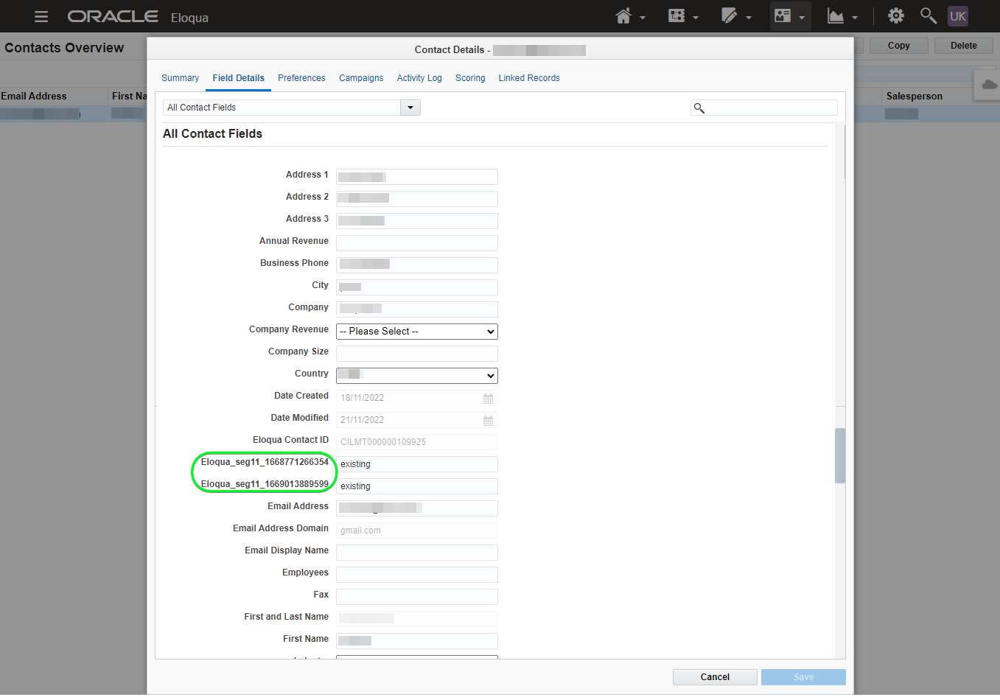

# [!DNL (API) Oracle Eloqua]個連線

[[!DNL Oracle Eloqua]](https://www.oracle.com/cx/marketing/automation/)可讓行銷人員規劃及執行行銷活動，同時為其潛在客戶提供個人化的客戶體驗。 透過整合式銷售機會管理和輕鬆建立行銷活動，可協助行銷人員在買家歷程中的適當時間，與適當的對象互動，並可優雅地擴充，以涵蓋多個管道，包括電子郵件、顯示搜尋、視訊和行動裝置。 銷售團隊可以更快完成更多交易，透過即時insight提高行銷ROI。

此[!DNL Adobe Experience Platform] [目的地](/help/destinations/home.md)利用[!DNL Oracle Eloqua] REST API中的[更新連絡人](https://docs.oracle.com/en/cloud/saas/marketing/eloqua-rest-api/op-api-rest-1.0-data-contact-id-put.html)作業，可讓您&#x200B;**將對象內的身分識別**&#x200B;更新為[!DNL Oracle Eloqua]。

[!DNL Oracle Eloqua]使用[基本驗證](https://docs.oracle.com/en/cloud/saas/marketing/eloqua-rest-api/Authentication_Basic.html)與[!DNL Oracle Eloqua] REST API通訊。 [向目的地驗證](#authenticate)區段中進一步說明如何向您的[!DNL Oracle Eloqua]執行個體進行驗證。

## 使用案例 {#use-cases}

線上平台的行銷部門想要將電子郵件行銷活動廣播給已組織的潛在客戶受眾。 平台的行銷團隊可以透過Adobe Experience Platform更新現有的潛在客戶資訊、從自己的離線資料建立對象，並將這些對象傳送至[!DNL Oracle Eloqua]，接著便可以用這些對象來傳送行銷活動電子郵件。

## 先決條件 {#prerequisites}

### Experience Platform必要條件 {#prerequisites-in-experience-platform}

在啟用資料到[!DNL Oracle Eloqua]目的地之前，您必須在[!DNL Experience Platform]中建立[結構描述](/help/xdm/schema/composition.md)、[資料集](https://experienceleague.adobe.com/docs/platform-learn/tutorials/data-ingestion/create-datasets-and-ingest-data.html)和[區段](https://experienceleague.adobe.com/docs/platform-learn/tutorials/segments/create-segments.html)。

如果您需要對象狀態的指引，請參閱[對象成員資格詳細資料結構描述欄位群組](/help/xdm/field-groups/profile/segmentation.md)的Experience Platform檔案。

### [!DNL Oracle Eloqua]必要條件 {#prerequisites-destination}

若要將資料從Experience Platform匯出至您的[!DNL Oracle Eloqua]帳戶，您需要有[!DNL Oracle Eloqua]帳戶。

此外，您至少需要[!DNL Oracle Eloqua]執行個體的&#x200B;*「進階使用者 — 行銷許可權」*。 請參閱[安全使用者存取](https://docs.oracle.com/en/cloud/saas/marketing/eloqua-user/Help/SecurityOverview/SecuredUserAccess.htm)頁面上的&#x200B;*「安全性群組」*&#x200B;區段以取得指引。 目的地需要在叫用[!DNL Oracle Eloqua] API時，以程式設計方式[決定您的基底URL](https://docs.oracle.com/en/cloud/saas/marketing/eloqua-rest-api/DeterminingBaseURL.html)的存取權。

#### 收集[!DNL Oracle Eloqua]認證 {#gather-credentials}

在驗證[!DNL Oracle Eloqua]目的地之前，請記下以下專案：

| 認證 | 說明 |
| --- | --- |
| `Company Name` | 與您的[!DNL Oracle Eloqua]帳戶相關聯的公司名稱。 <br>您稍後會使用`Company Name`與[!DNL Oracle Eloqua] `Username`作為串連字串，在[對目的地](#authenticate)進行驗證時用作&#x200B;**[!UICONTROL 使用者名稱]**。 |
| `Username` | 您[!DNL Oracle Eloqua]帳戶的使用者名稱。 |
| `Password` | 您的[!DNL Oracle Eloqua]帳戶密碼。 |
| `Pod` | [!DNL Oracle Eloqua]支援多個資料中心，每個都有唯一的網域名稱。 [!DNL Oracle Eloqua]將這些稱為「pods」，目前總共有七個 — p01、p02、p03、p04、p06、p07和p08。 若要取得您目前所在的POD，請登入[!DNL Oracle Eloqua]，並在您成功登入後記下瀏覽器的URL。 例如，如果瀏覽器URL為`secure.p01.eloqua.com`，則`pod`為`p01`。 如需其他指南，請參閱[決定您的POD](https://community.oracle.com/topliners/discussion/4470225/determining-your-pod-number-for-oracle-eloqua)頁面。 |

如需指引，請參閱[登入 [!DNL Oracle Eloqua]](https://docs.oracle.com/en/cloud/saas/marketing/eloqua-user/Help/Administration/Tasks/SigningInToEloqua.htm#Signing)。

## 護欄 {#guardrails}

>[!NOTE]
>
>* [!DNL Oracle Eloqua]自訂連絡人欄位是使用在&#x200B;**[!UICONTROL 選取區段]**&#x200B;步驟期間選取的對象名稱自動建立。

* [!DNL Oracle Eloqua]的最大限製為250個自訂連絡人欄位。
* 在匯出新對象之前，請確保[!DNL Oracle Eloqua]內的Experience Platform對象數量和現有對象數量不超過此限制。
* 如果超過此限制，您將會在Experience Platform中遇到錯誤。 這是因為[!DNL Oracle Eloqua] API無法驗證要求，並以 — *400回應：發生驗證錯誤* — 說明問題的錯誤訊息。
* 如果您已達到上述指定的限制，則必須從目的地移除現有的對應，並刪除[!DNL Oracle Eloqua]帳戶中對應的自訂聯絡人欄位，才能匯出更多區段。

* 請參閱[[!DNL Oracle Eloqua] 建立連絡人欄位](https://docs.oracle.com/en/cloud/saas/marketing/eloqua-user/Help/ContactFields/Tasks/CreatingContactFields.htm)頁面，瞭解其他限制的相關資訊。

## 支援的身分 {#supported-identities}

[!DNL Oracle Eloqua]支援下表中描述的身分更新。 深入瞭解[身分](/help/identity-service/features/namespaces.md)。

| 目標身分 | 說明 | 強制 |
|---|---|---|
| `EloquaId` | 連絡人的唯一識別碼。 | 是 |

## 匯出型別和頻率 {#export-type-frequency}

請參閱下表以取得目的地匯出型別和頻率的資訊。

| 項目 | 類型 | 附註 |
---------|----------|---------|
| 匯出類型 | **[!UICONTROL 以設定檔為基礎]** | <ul><li>您正在匯出區段的所有成員，以及所需的結構描述欄位&#x200B;*（例如：電子郵件地址、電話號碼、姓氏）* （根據您的欄位對應）。</li><li> 針對Experience Platform中每個選取的對象，相對應的[!DNL Oracle Eloqua]區段狀態會從Experience Platform更新其對象狀態。</li></ul> |
| 匯出頻率 | **[!UICONTROL 串流]** | <ul><li>串流目的地是「一律開啟」的API型連線。 根據對象評估在Experience Platform中更新設定檔後，聯結器會立即將更新傳送至下游的目標平台。 深入瞭解[串流目的地](/help/destinations/destination-types.md#streaming-destinations)。</li></ul> |

{style="table-layout:auto"}

## 連線到目標 {#connect}

>[!IMPORTANT]
>
>若要連線到目的地，您需要&#x200B;**[!UICONTROL 檢視目的地]**&#x200B;和&#x200B;**[!UICONTROL 管理目的地]** [存取控制許可權](/help/access-control/home.md#permissions)。 閱讀[存取控制總覽](/help/access-control/ui/overview.md)或連絡您的產品管理員以取得必要的許可權。

若要連線到此目的地，請依照[目的地組態教學課程](../../ui/connect-destination.md)中所述的步驟進行。 在設定目標工作流程中，填寫以下兩個區段中列出的欄位。

在&#x200B;**[!UICONTROL 目的地]** > **[!UICONTROL 目錄]**&#x200B;內，搜尋[!DNL (API) Oracle Eloqua]。 或者，您可以在&#x200B;**[!UICONTROL 電子郵件行銷]**&#x200B;類別下找到它。

### 驗證目標 {#authenticate}

>[!CONTEXTUALHELP]
>id="platform_destinations_apioracleeloqua_companyname_username"
>title="公司名稱\使用者名稱"
>abstract="在此欄位中填寫 `{COMPANY_NAME}\{USERNAME}` 表單中來自 Oracle Eloqua 的公司名稱和使用者名稱"

填寫以下必填欄位。 如需任何指引，請參閱[收集 [!DNL Oracle Eloqua] 認證](#gather-credentials)區段。
* **[!UICONTROL 密碼]**：您[!DNL Oracle Eloqua]帳戶的密碼。
* **[!UICONTROL 使用者名稱]**：由您的[!DNL Oracle Eloqua]公司名稱和[!DNL Oracle Eloqua]使用者名稱組成的串連字串。<br>串連值採用`{COMPANY_NAME}\{USERNAME}`的形式。<br>注意，請勿使用任何大括弧或空格並保留`\`。 <br>例如，若您的[!DNL Oracle Eloqua]公司名稱是`MyCompany`，[!DNL Oracle Eloqua]使用者名稱是`Username`，則您將在&#x200B;**[!UICONTROL 使用者名稱]**&#x200B;欄位中使用的串連值為`MyCompany\Username`。

若要驗證到目的地，請選取&#x200B;**[!UICONTROL 連線到目的地]**。


如果提供的詳細資料有效，UI會顯示帶有綠色勾號的&#x200B;**[!UICONTROL 已連線]**&#x200B;狀態。 然後您可以繼續下一步驟。

### 填寫目標詳細資訊 {#destination-details}

>[!CONTEXTUALHELP]
>id="platform_destinations_apioracleeloqua_pod"
>title="Pod"
>abstract="若要尋找您的 Pod 編號，請登入 Oracle Eloqua。成功登入後，記下瀏覽器中的 URL。 "

<!-- >additional-url="https://support.oracle.com/knowledge/Oracle%20Cloud/2307176_1.html" text="Oracle Knowledge base - find out your Pod number" -->

若要設定目的地的詳細資訊，請填寫下方的必填和選用欄位。 UI中欄位旁的星號表示該欄位為必填欄位。


* **[!UICONTROL 名稱]**：您日後可辨識此目的地的名稱。
* **[!UICONTROL 描述]**：可協助您日後識別此目的地的描述。
* **[!UICONTROL Pod]**：若要取得您目前所在的`pod`，請登入[!DNL Oracle Eloqua]，並在您成功登入後記下瀏覽器的URL。 例如，如果您的瀏覽器URL為`secure.p01.eloqua.com`，則需要選取的`pod`值為`p01`。 如需其他指南，請參閱[收集 [!DNL Oracle Eloqua] 認證](#gather-credentials)區段。

### 啟用警示 {#enable-alerts}

您可以啟用警報以接收有關傳送到您目的地的資料流狀態的通知。 從清單中選取警報以訂閱接收有關資料流狀態的通知。 如需警示的詳細資訊，請參閱[使用UI訂閱目的地警示](../../ui/alerts.md)的指南。

當您完成提供目的地連線的詳細資訊後，請選取&#x200B;**[!UICONTROL 下一步]**。

## 啟動此目標的對象 {#activate}

>[!IMPORTANT]
> 
>* 若要啟用資料，您需要&#x200B;**[!UICONTROL 檢視目的地]**、**[!UICONTROL 啟用目的地]**、**[!UICONTROL 檢視設定檔]**&#x200B;和&#x200B;**[!UICONTROL 檢視區段]** [存取控制許可權](/help/access-control/home.md#permissions)。 閱讀[存取控制總覽](/help/access-control/ui/overview.md)或連絡您的產品管理員以取得必要的許可權。
>* 若要匯出&#x200B;*身分*，您需要&#x200B;**[!UICONTROL 檢視身分圖表]** [存取控制許可權](/help/access-control/home.md#permissions)。<br> {width="100" zoomable="yes"}

閱讀[將設定檔和對象啟用至串流對象匯出目的地](/help/destinations/ui/activate-segment-streaming-destinations.md)，以瞭解啟用此目的地對象的指示。

### 對應考量事項和範例 {#mapping-considerations-example}

若要將對象資料從Adobe Experience Platform正確傳送至[!DNL Oracle Eloqua]目的地，您必須完成欄位對應步驟。 對應包括在Experience Platform帳戶中的Experience Data Model (XDM)結構描述欄位與來自目標目的地的對應對應專案之間建立連結。

若要將您的XDM欄位對應到[!DNL Oracle Eloqua]目的地欄位，請執行下列步驟：

1. 在&#x200B;**[!UICONTROL 對應]**&#x200B;步驟中，選取&#x200B;**[!UICONTROL 新增對應]**。 您會在畫面上看到新的對應列。
1. 在&#x200B;**[!UICONTROL 選取來源欄位]**&#x200B;視窗中，選擇&#x200B;**[!UICONTROL 選取屬性]**&#x200B;類別並選取XDM屬性，或選擇&#x200B;**[!UICONTROL 選取身分名稱空間]**&#x200B;並選取身分。
1. 在&#x200B;**[!UICONTROL 選取目標欄位]**&#x200B;視窗中，選擇&#x200B;**[!UICONTROL 選取識別名稱空間]**&#x200B;並選取識別，或選擇&#x200B;**[!UICONTROL 選取自訂屬性]**&#x200B;並在&#x200B;**[!UICONTROL 屬性名稱]**&#x200B;欄位中輸入所要的屬性名稱。 您提供的屬性名稱應符合[!DNL Oracle Eloqua]中現有的連絡人屬性。 請參閱[[!DNL create a contact]](https://docs.oracle.com/en/cloud/saas/marketing/eloqua-rest-api/op-api-rest-1.0-data-contact-post.html)以取得您可以在[!DNL Oracle Eloqua]中使用的確切屬性名稱。

   * 重複這些步驟，在您的XDM設定檔結構描述和[!DNL Oracle Eloqua]之間新增必要和任何需要的屬性對應：

     | 來源欄位 | 目標欄位 | 強制 |
     |---|---|---|
     | `IdentityMap: Eid` | `Identity: EloquaId` | 是 |
     | `xdm: personalEmail.address` | `Attribute: emailAddress` | 是 |
     | `xdm: personName.firstName` | `Attribute: firstName` | |
     | `xdm: personName.lastName` | `Attribute: lastName` | |
     | `xdm: workAddress.street1` | `Attribute: address1` | |
     | `xdm: workAddress.street2` | `Attribute: address2` | |
     | `xdm: workAddress.street3` | `Attribute: address3` | |
     | `xdm: workAddress.postalCode` | `Attribute: postalCode` | |
     | `xdm: workAddress.country` | `Attribute: country` | |
     | `xdm: workAddress.city` | `Attribute: city` | |

   * 具有上述對應的範例如下所示：

     

>[!IMPORTANT]
>
>* 在&#x200B;**[!UICONTROL 目標欄位]**&#x200B;中指定的屬性應該與[[!DNL Create a contact]](https://docs.oracle.com/en/cloud/saas/marketing/eloqua-rest-api/op-api-rest-1.0-data-contact-post.html)中指定的屬性完全相同，因為這些屬性會形成要求內文。
>* 在&#x200B;**[!UICONTROL Source欄位]**&#x200B;中指定的屬性未遵循任何此類限制。 您可以視需要加以對應，但如果資料格式在推送至[!DNL Oracle Eloqua]時不正確，則會導致錯誤。 例如，您可以對應&#x200B;**[!UICONTROL Source欄位]**&#x200B;身分名稱空間`contact key`、`ABC ID`等 至&#x200B;**[!UICONTROL 目標欄位]**：在確認ID值符合[!DNL Oracle Eloqua]接受的格式之後，`EloquaId`。
>* `EloquaID`對應是更新與識別相對應的屬性的必要專案。
>* 需要`emailAddress`對應。 若未包含API，API會擲回錯誤，如下所示：
>
>```json
>{
>     "type":"ObjectValidationError",
>     "container":{
>           "type":"ObjectKey",
>           "objectType":"Contact"
>     },
>     "property":"emailAddress",
>     "requirement":{
>           "type":"EmailAddressRequirement"
>     },
>     "value":"<null>"
>}
>```

當您完成提供目的地連線的對應時，請選取&#x200B;**[!UICONTROL 下一步]**。

>[!NOTE]
>
>傳送連絡人欄位資訊給[!DNL Oracle Eloqua]時，目的地會在每次執行時，自動將唯一的識別碼尾碼加到選取的對象名稱。 這可確保與您的對象名稱對應的聯絡人欄位名稱不會重疊。 請參考[!DNL Oracle Eloqua]連絡人詳細資料頁面的[驗證資料匯出](#exported-data)區段熒幕擷圖範例，此頁面具有使用對象名稱建立的自訂連絡人欄位。

## 驗證資料匯出 {#exported-data}

若要驗證您是否已正確設定目的地，請遵循下列步驟：

1. 選取&#x200B;**[!UICONTROL 目的地]** > **[!UICONTROL 瀏覽]**&#x200B;並導覽至目的地清單。
1. 接著，選取目的地並切換至&#x200B;**[!UICONTROL 啟用資料]**&#x200B;標籤，然後選取對象名稱。
   

1. 監控對象摘要，並確保設定檔計數與區段中的計數相對應。
   

1. 登入[!DNL Oracle Eloqua]網站，然後導覽至&#x200B;**[!UICONTROL 連絡人總覽]**&#x200B;頁面，以檢查是否已新增對象中的設定檔。 若要檢視對象狀態，請深入檢視&#x200B;**[!UICONTROL 連絡人詳細資料]**&#x200B;頁面，並檢查是否已建立以選取對象名稱作為其首碼的連絡人欄位。



## 資料使用與控管 {#data-usage-governance}

處理您的資料時，所有[!DNL Adobe Experience Platform]目的地都符合資料使用原則。 如需[!DNL Adobe Experience Platform]如何強制資料控管的詳細資訊，請參閱[資料控管概觀](/help/data-governance/home.md)。

## 錯誤與疑難排解 {#errors-and-troubleshooting}

建立目的地時，您可能會收到下列其中一個錯誤訊息： `400: There was a validation error`或`400 BAD_REQUEST`。 如[護欄](#guardrails)區段所述，當您超過250個自訂連絡人欄位限制時，就會發生這種情況。 若要修正此錯誤，請確定您在[!DNL Oracle Eloqua]中未超過自訂連絡人欄位限制。


請參閱[[!DNL Oracle Eloqua] HTTP狀態碼](https://docs.oracle.com/en/cloud/saas/marketing/eloqua-rest-api/APIRequests_HTTPStatusCodes.html)和[[!DNL Oracle Eloqua] 驗證錯誤](https://docs.oracle.com/en/cloud/saas/marketing/eloqua-rest-api/APIRequests_HTTPValidationErrors.html)頁面，以取得包含說明的狀態和錯誤碼的完整清單。

## 其他資源 {#additional-resources}

如需其他詳細資料，請參閱[!DNL Oracle Eloqua]檔案：

* [Oracle Eloqua行銷自動化](https://docs.oracle.com/en/cloud/saas/marketing/eloqua.html)
* [適用於Oracle Eloqua Marketing Cloud服務的REST API](https://docs.oracle.com/en/cloud/saas/marketing/eloqua-rest-api/rest-endpoints.html)

### Changelog

本節擷取此目的地聯結器的功能和重要檔案更新。

+++ 檢視變更記錄檔

| 發行月份 | 更新型別 | 說明 |
|---|---|---|
| 2023 年 4 月 | 文件更新 | <ul><li>我們已更新[使用案例](#use-cases)區段，針對客戶何時可受益於使用此目的地提供更清楚的範例。</li> <li>我們已更新[對應](#mapping-considerations-example)區段，其中包含強制和選用對應的明確範例。</li> <li>我們已更新[連線至目的地](#connect)區段，提供範例說明如何使用[!DNL Oracle Eloqua]公司名稱和[!DNL Oracle Eloqua]使用者名稱來建構&#x200B;**[!UICONTROL 使用者名稱]**&#x200B;欄位的串連值。 (PLATIR-28343)</li><li>我們已更新[收集 [!DNL Oracle Eloqua] 認證](#gather-credentials)及[填寫目的地詳細資料](#destination-details)區段，其中包含有關[!DNL Oracle Eloqua] **[!UICONTROL Pod]**&#x200B;選擇的指引。 目的地使用&#x200B;*&quot;Pod&quot;*&#x200B;值來建構API呼叫的基本URL。 [[!DNL Oracle Eloqua] 必要條件](#prerequisites-destination)區段也已更新，其中包含指派&#x200B;*「進階使用者 — 行銷許可權」*&#x200B;為您[!DNL Oracle Eloqua]執行個體的必要&#x200B;*「安全性群組」*&#x200B;的指引。</li></ul> |
| 2023 年 3 月 | 首次發行 | 初始目的地版本和檔案發佈。 |

{style="table-layout:auto"}

+++