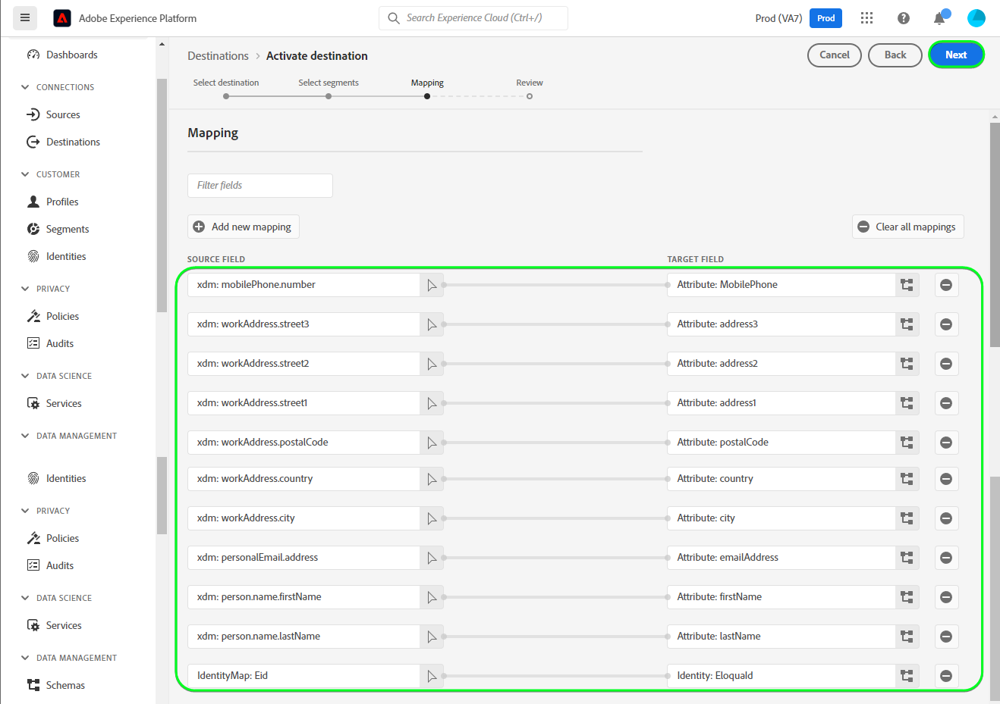

# [!DNL (API) Oracle Eloqua] 連線

[[!DNL Oracle Eloqua]](https://www.oracle.com/cx/marketing/automation/) 可讓行銷人員規劃及執行行銷活動，同時為其潛在客戶提供個人化的客戶體驗。 透過整合式銷售機會管理和輕鬆建立行銷活動，可協助行銷人員在買家歷程中的適當時間，與適當的對象互動，並可優雅地擴充，以涵蓋多個管道，包括電子郵件、顯示搜尋、視訊和行動裝置。 銷售團隊能以更快的速度完成更多交易，透過即時見解提高行銷ROI。

這個 [!DNL Adobe Experience Platform] [目的地](/help/destinations/home.md) 可運用 [更新連絡人](https://docs.oracle.com/en/cloud/saas/marketing/eloqua-rest-api/op-api-rest-1.0-data-contact-id-put.html) 作業 [!DNL Oracle Eloqua] REST API，可讓您 **更新身分** 在受眾中移至 [!DNL Oracle Eloqua].

[!DNL Oracle Eloqua] 使用 [基本驗證](https://docs.oracle.com/en/cloud/saas/marketing/eloqua-rest-api/Authentication_Basic.html) 以與 [!DNL Oracle Eloqua] REST API。 向您的驗證指示 [!DNL Oracle Eloqua] 執行個體的詳細資訊如下： [驗證到目的地](#authenticate) 區段。

## 使用案例 {#use-cases}

線上平台的行銷部門想要將電子郵件行銷活動廣播給已組織的潛在客戶受眾。 平台的行銷團隊可以透過Adobe Experience Platform更新現有的潛在客戶資訊，從自己的離線資料建立受眾，並將這些受眾傳送至 [!DNL Oracle Eloqua]，然後可用於傳送行銷活動電子郵件。

## 先決條件 {#prerequisites}

### Experience Platform必要條件 {#prerequisites-in-experience-platform}

在將資料啟用至 [!DNL Oracle Eloqua] 目的地，您必須擁有 [綱要](/help/xdm/schema/composition.md)， a [資料集](https://experienceleague.adobe.com/docs/platform-learn/tutorials/data-ingestion/create-datasets-and-ingest-data.html)、和 [區段](https://experienceleague.adobe.com/docs/platform-learn/tutorials/segments/create-segments.html) 建立於 [!DNL Experience Platform].

請參閱Experience Platform檔案以瞭解 [對象成員資格詳細資料結構欄位群組](/help/xdm/field-groups/profile/segmentation.md) 如果您需要對象狀態的指引。

### [!DNL Oracle Eloqua] 必備條件 {#prerequisites-destination}

為了將資料從Platform匯出至 [!DNL Oracle Eloqua] 您需要擁有 [!DNL Oracle Eloqua] 帳戶。

此外，您至少需要 *「進階使用者 — 行銷許可權」* 針對您的 [!DNL Oracle Eloqua] 執行個體。 請參閱 *「安全性群組」* 區段於 [安全的使用者存取](https://docs.oracle.com/en/cloud/saas/marketing/eloqua-user/Help/SecurityOverview/SecuredUserAccess.htm) 指導頁面。 目的地需要存取許可權才能以程式設計方式進行 [決定您的基底URL](https://docs.oracle.com/en/cloud/saas/marketing/eloqua-rest-api/DeterminingBaseURL.html) 叫用 [!DNL Oracle Eloqua] API。

#### 彙總 [!DNL Oracle Eloqua] 認證 {#gather-credentials}

在驗證之前，請記下以下專案 [!DNL Oracle Eloqua] 目的地：

| 認證 | 說明 |
| --- | --- |
| `Company Name` | 與您的關聯的公司名稱 [!DNL Oracle Eloqua] 帳戶。 <br>您稍後將使用 `Company Name` 和 [!DNL Oracle Eloqua] `Username` 作為串連字串，用作 **[!UICONTROL 使用者名稱]** 當 [正在向目的地進行驗證](#authenticate). |
| `Username` | 您的使用者名稱 [!DNL Oracle Eloqua] 帳戶。 |
| `Password` | 您的密碼 [!DNL Oracle Eloqua] 帳戶。 |
| `Pod` | [!DNL Oracle Eloqua] 支援多個資料中心，每個都有獨特的網域名稱。 [!DNL Oracle Eloqua] 將這些稱為「pods」，目前總共有七個 — p01、p02、p03、p04、p06、p07和p08。 若要取得您所在的POD，請登入 [!DNL Oracle Eloqua] 並記下您成功登入後瀏覽器中的URL。 例如，如果瀏覽器URL為 `secure.p01.eloqua.com` 您的 `pod` 是 `p01`. 請參閱 [決定您的POD](https://community.oracle.com/topliners/discussion/4470225/determining-your-pod-number-for-oracle-eloqua) 頁面以取得其他指引。 |

請參閱 [登入 [!DNL Oracle Eloqua]](https://docs.oracle.com/en/cloud/saas/marketing/eloqua-user/Help/Administration/Tasks/SigningInToEloqua.htm#Signing) 以取得指引。

## 護欄 {#guardrails}

>[!NOTE]
>
>* [!DNL Oracle Eloqua] 自訂聯絡人欄位會使用在期間選取的對象名稱自動建立 **[!UICONTROL 選取區段]** 步驟。

* [!DNL Oracle Eloqua] 最多只能有250個自訂聯絡人欄位。
* 在匯出新受眾之前，請先確定內的平台受眾數目以及現有受眾數目 [!DNL Oracle Eloqua] 請勿超過此限制。
* 如果超過此限制，您會在Experience Platform中遇到錯誤。 這是因為 [!DNL Oracle Eloqua] API無法驗證請求，並以 —  *400：發生驗證錯誤*  — 說明問題的錯誤訊息。
* 如果您已達到上述指定的限制，則需從目的地移除現有的對應，並刪除中對應的自訂聯絡人欄位。 [!DNL Oracle Eloqua] 帳戶，然後才能匯出更多區段。

* 請參閱 [[!DNL Oracle Eloqua] 建立連絡人欄位](https://docs.oracle.com/en/cloud/saas/marketing/eloqua-user/Help/ContactFields/Tasks/CreatingContactFields.htm) 頁面以取得其他限制的相關資訊。

## 支援的身分 {#supported-identities}

[!DNL Oracle Eloqua] 支援下表中描述的身分更新。 進一步瞭解 [身分](/help/identity-service/features/namespaces.md).

| 目標身分 | 說明 | 強制 |
|---|---|---|
| `EloquaId` | 連絡人的唯一識別碼。 | 是 |

## 匯出型別和頻率 {#export-type-frequency}

請參閱下表以取得目的地匯出型別和頻率的資訊。

| 項目 | 類型 | 附註 |
---------|----------|---------|
| 匯出類型 | **[!UICONTROL 以設定檔為基礎]** | <ul><li>您正在匯出區段的所有成員，以及所需的結構欄位 *（例如：電子郵件地址、電話號碼、姓氏）*，根據您的欄位對應。</li><li> 針對Platform中每個選取的對象，對應至 [!DNL Oracle Eloqua] 區段狀態會從Platform更新其對象狀態。</li></ul> |
| 匯出頻率 | **[!UICONTROL 串流]** | <ul><li>串流目的地是「一律開啟」的API型連線。 一旦根據對象評估在Experience Platform中更新了設定檔，聯結器就會將更新傳送至下游的目的地平台。 深入瞭解 [串流目的地](/help/destinations/destination-types.md#streaming-destinations).</li></ul> |

{style="table-layout:auto"}

## 連線到目的地 {#connect}

>[!IMPORTANT]
>
>若要連線到目的地，您需要 **[!UICONTROL 檢視目的地]** 和 **[!UICONTROL 管理目的地]** [存取控制許可權](/help/access-control/home.md#permissions). 閱讀 [存取控制總覽](/help/access-control/ui/overview.md) 或聯絡您的產品管理員以取得必要許可權。

若要連線至此目的地，請遵循以下說明的步驟： [目的地設定教學課程](../../ui/connect-destination.md). 在設定目標工作流程中，填寫以下兩個區段中列出的欄位。

範圍 **[!UICONTROL 目的地]** > **[!UICONTROL 目錄]** 搜尋 [!DNL (API) Oracle Eloqua]. 或者，您可以在 **[!UICONTROL 電子郵件行銷]** 類別。

### 驗證到目的地 {#authenticate}

>[!CONTEXTUALHELP]
>id="platform_destinations_apioracleeloqua_companyname_username"
>title="公司名稱\使用者名稱"
>abstract="在表格中填入您公司的名稱和Oracle Eloqua的使用者名稱 `{COMPANY_NAME}\{USERNAME}`"

填寫以下必填欄位。 請參閱 [彙總 [!DNL Oracle Eloqua] 認證](#gather-credentials) 區段以取得任何指引。
* **[!UICONTROL 密碼]**：您的密碼 [!DNL Oracle Eloqua] 帳戶。
* **[!UICONTROL 使用者名稱]**：串連字串，由以下專案組成： [!DNL Oracle Eloqua] 公司名稱和 [!DNL Oracle Eloqua] 使用者名稱。<br>串連值採用以下形式 `{COMPANY_NAME}\{USERNAME}`.<br> 請注意，請勿使用任何大括弧或空格，並保留 `\`. <br>例如，若您的 [!DNL Oracle Eloqua] 公司名稱為 `MyCompany` 和 [!DNL Oracle Eloqua] 使用者名稱為 `Username`，即您在中使用的串連值 **[!UICONTROL 使用者名稱]** 欄位為 `MyCompany\Username`.

若要驗證目的地，請選取 **[!UICONTROL 連線到目的地]**.


如果提供的詳細資料有效，UI會顯示 **[!UICONTROL 已連線]** 帶有綠色勾號的狀態。 然後您可以繼續下一步驟。

### 填寫目的地詳細資料 {#destination-details}

>[!CONTEXTUALHELP]
>id="platform_destinations_apioracleeloqua_pod"
>title="Pod"
>abstract="若要尋找您的Pod編號，請登入Oracle Eloqua。 請記下您成功登入後瀏覽器中的URL。 "

<!-- >additional-url="https://support.oracle.com/knowledge/Oracle%20Cloud/2307176_1.html" text="Oracle Knowledge base - find out your Pod number" -->

若要設定目的地的詳細資訊，請填寫下方的必填和選用欄位。 UI中欄位旁的星號表示該欄位為必填欄位。


* **[!UICONTROL 名稱]**：您日後可辨識此目的地的名稱。
* **[!UICONTROL 說明]**：可協助您日後識別此目的地的說明。
* **[!UICONTROL Pod]**：若要取得 `pod` 您已登入，請登入 [!DNL Oracle Eloqua] 並記下您成功登入後瀏覽器中的URL。 例如，如果瀏覽器URL為 `secure.p01.eloqua.com` 此 `pod` 您需要選取的值為 `p01`. 請參閱 [彙總 [!DNL Oracle Eloqua] 認證](#gather-credentials) 區段以取得其他指引。

### 啟用警示 {#enable-alerts}

您可以啟用警報以接收有關傳送到您目的地的資料流狀態的通知。 從清單中選取警報以訂閱接收有關資料流狀態的通知。 如需警示的詳細資訊，請參閱以下指南： [使用UI訂閱目的地警報](../../ui/alerts.md).

當您完成提供目的地連線的詳細資訊時，請選取「 」 **[!UICONTROL 下一個]**.

## 啟用此目的地的對象 {#activate}

>[!IMPORTANT]
> 
>* 若要啟用資料，您需要 **[!UICONTROL 檢視目的地]**， **[!UICONTROL 啟用目的地]**， **[!UICONTROL 檢視設定檔]**、和 **[!UICONTROL 檢視區段]** [存取控制許可權](/help/access-control/home.md#permissions). 閱讀 [存取控制總覽](/help/access-control/ui/overview.md) 或聯絡您的產品管理員以取得必要許可權。
>* 要匯出 *身分*，您需要 **[!UICONTROL 檢視身分圖表]** [存取控制許可權](/help/access-control/home.md#permissions). <br> {width="100" zoomable="yes"}

讀取 [將設定檔和受眾啟用至串流受眾匯出目標](/help/destinations/ui/activate-segment-streaming-destinations.md) 以取得啟用此目的地對象的指示。

### 對應考量事項和範例 {#mapping-considerations-example}

若要正確將對象資料從Adobe Experience Platform傳送至 [!DNL Oracle Eloqua] 目的地，您必須進行欄位對應步驟。 對應包括在Platform帳戶中的Experience Data Model (XDM)結構描述欄位與來自目標目的地的對應對應專案之間建立連結。

將您的XDM欄位對應至 [!DNL Oracle Eloqua] 目的地欄位，請遵循下列步驟：

1. 在 **[!UICONTROL 對應]** 步驟，選取 **[!UICONTROL 新增對應]**. 您會在畫面上看到新的對應列。
1. 在 **[!UICONTROL 選取來源欄位]** 視窗，選擇 **[!UICONTROL 選取屬性]** 類別並選取XDM屬性或選擇 **[!UICONTROL 選取身分名稱空間]** 並選取身分。
1. 在 **[!UICONTROL 選取目標欄位]** 視窗，選擇 **[!UICONTROL 選取身分名稱空間]** 並選取身分，或選擇 **[!UICONTROL 選取自訂屬性]** 並在中輸入所需的屬性名稱 **[!UICONTROL 屬性名稱]** 欄位。 您提供的屬性名稱應符合中現有的連絡人屬性 [!DNL Oracle Eloqua]. 另請參閱 [[!DNL create a contact]](https://docs.oracle.com/en/cloud/saas/marketing/eloqua-rest-api/op-api-rest-1.0-data-contact-post.html) 以取得您可在其中使用的確切屬性名稱 [!DNL Oracle Eloqua].
   * 重複這些步驟，在XDM設定檔結構描述和之間新增必要和任何需要的屬性對應。 [!DNL Oracle Eloqua]： | 來源欄位 | 目標欄位 | 強制 | |—|—|—| |`IdentityMap: Eid`|`Identity: EloquaId`| 是 | |`xdm: personalEmail.address`|`Attribute: emailAddress`| 是 | |`xdm: personName.firstName`|`Attribute: firstName`| | |`xdm: personName.lastName`|`Attribute: lastName`| | |`xdm: workAddress.street1`|`Attribute: address1`| | |`xdm: workAddress.street2`|`Attribute: address2`| | |`xdm: workAddress.street3`|`Attribute: address3`| | |`xdm: workAddress.postalCode`|`Attribute: postalCode`| | |`xdm: workAddress.country`|`Attribute: country`| | |`xdm: workAddress.city`|`Attribute: city`| |

   * 具有上述對應的範例如下所示：
     

>[!IMPORTANT]
>
>* 中指定的屬性 **[!UICONTROL 目標欄位]** 應完全按照 [[!DNL Create a contact]](https://docs.oracle.com/en/cloud/saas/marketing/eloqua-rest-api/op-api-rest-1.0-data-contact-post.html) 因為這些屬性會構成請求內文。
>* 中指定的屬性 **[!UICONTROL 來源欄位]** 請勿遵循任何這類限制。 您可以視需要加以對應，但如果推送至時的資料格式不正確 [!DNL Oracle Eloqua] 這會導致錯誤。 例如，您可以對應 **[!UICONTROL 來源欄位]** 身分名稱空間 `contact key`， `ABC ID` 等等。 至 **[!UICONTROL 目標欄位]** ： `EloquaId` 確認ID值符合以下格式之後： [!DNL Oracle Eloqua].
>* 此 `EloquaID` 對應是更新與身分對應之屬性的必要專案。
>* 此 `emailAddress` 需要對映。 若未包含API，API會擲回錯誤，如下所示：
>
>```json
>{
>     "type":"ObjectValidationError",
>     "container":{
>           "type":"ObjectKey",
>           "objectType":"Contact"
>     },
>     "property":"emailAddress",
>     "requirement":{
>           "type":"EmailAddressRequirement"
>     },
>     "value":"<null>"
>}
>```

完成提供目的地連線的對應後，選取 **[!UICONTROL 下一個]**.

>[!NOTE]
>
>當傳送聯絡人欄位資訊至時，目的地會在每次執行時自動為所選對象名稱加上唯一識別碼的尾碼 [!DNL Oracle Eloqua]. 這可確保與您的對象名稱對應的聯絡人欄位名稱不會重疊。 請參閱 [驗證資料匯出](#exported-data) 區段熒幕擷圖範例 [!DNL Oracle Eloqua] 「聯絡詳細資訊」頁面包含使用對象名稱建立的自訂聯絡人欄位。

## 驗證資料匯出 {#exported-data}

若要驗證您是否已正確設定目的地，請遵循下列步驟：

1. 選取 **[!UICONTROL 目的地]** > **[!UICONTROL 瀏覽]** 並導覽至目的地清單。
1. 接下來，選取目的地並切換至 **[!UICONTROL 啟用資料]** 標籤，然後選取對象名稱。
   

1. 監控對象摘要，並確保設定檔計數與區段中的計數相對應。
   

1. 登入 [!DNL Oracle Eloqua] 網站，然後導覽至 **[!UICONTROL 連絡人總覽]** 頁面以檢查是否已新增對象中的設定檔。 若要檢視對象狀態，請深入瞭解 **[!UICONTROL 連絡人詳細資料]** 頁面，並檢查聯絡人欄位是否已建立，且首碼為選取的對象名稱。


## 資料使用與控管 {#data-usage-governance}

全部 [!DNL Adobe Experience Platform] 處理您的資料時，目的地符合資料使用原則。 如需如何操作的詳細資訊 [!DNL Adobe Experience Platform] 強制執行資料控管，請參閱 [資料控管概觀](/help/data-governance/home.md).

## 錯誤與疑難排解 {#errors-and-troubleshooting}

建立目的地時，您可能會收到下列其中一個錯誤訊息： `400: There was a validation error` 或 `400 BAD_REQUEST`. 當您超過250個自訂聯絡人欄位限制時，就會發生此情況，如 [護欄](#guardrails) 區段。 若要修正此錯誤，請確定您不超過「 」中的自訂聯絡人欄位限制 [!DNL Oracle Eloqua].


請參閱 [[!DNL Oracle Eloqua] HTTP狀態碼](https://docs.oracle.com/en/cloud/saas/marketing/eloqua-rest-api/APIRequests_HTTPStatusCodes.html) 和 [[!DNL Oracle Eloqua] 驗證錯誤](https://docs.oracle.com/en/cloud/saas/marketing/eloqua-rest-api/APIRequests_HTTPValidationErrors.html) 頁面以取得狀態和錯誤碼的完整清單，並附上說明。

## 其他資源 {#additional-resources}

如需詳細資訊，請參閱 [!DNL Oracle Eloqua] 檔案：

* [oracle Eloqua行銷自動化](https://docs.oracle.com/en/cloud/saas/marketing/eloqua.html)
* [用於OracleEloquaMarketing Cloud服務的REST API](https://docs.oracle.com/en/cloud/saas/marketing/eloqua-rest-api/rest-endpoints.html)

### Changelog

本節擷取此目的地聯結器的功能和重要檔案更新。

+++ 檢視變更記錄檔

| 發行月份 | 更新型別 | 說明 |
|---|---|---|
| 2023 年 4 月 | 檔案更新 | <ul><li>我們已更新 [使用案例](#use-cases) 區段，以更清楚的範例說明客戶何時可受益於使用此目的地。</li> <li>我們已更新 [對應](#mapping-considerations-example) 區段，並提供強制和選用對應的清楚範例。</li> <li>我們已更新 [連線到目的地](#connect) 區段中有關如何建構的串連值的範例 **[!UICONTROL 使用者名稱]** 欄位使用 [!DNL Oracle Eloqua] 公司名稱和 [!DNL Oracle Eloqua] 使用者名稱。 (PLATIR-28343)</li><li>我們已更新 [彙總 [!DNL Oracle Eloqua] 認證](#gather-credentials) 和 [填寫目的地詳細資料](#destination-details) 包含相關指引的區段 [!DNL Oracle Eloqua] **[!UICONTROL Pod]** 選取。 此 *&quot;Pod&quot;* 目的地會使用值來建構API呼叫的基本URL。 此 [[!DNL Oracle Eloqua] 必備條件](#prerequisites-destination) 區段亦已更新指派指引 *「進階使用者 — 行銷許可權」* 作為必要 *「安全性群組」* 針對您的 [!DNL Oracle Eloqua] 執行個體。</li></ul> |
| 2023 年 3 月 | 首次發行 | 初始目的地版本和檔案發佈。 |

{style="table-layout:auto"}

+++