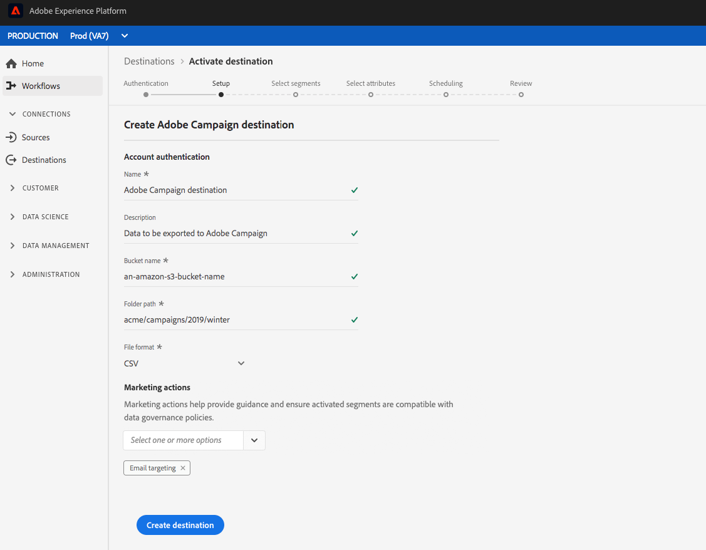

# 電子郵件行銷目標概觀{#email-marketing-destinations}

電子郵件服務供應商(ESP)可讓您管理電子郵件行銷活動，例如傳送促銷電子郵件宣傳。 Adobe Experience Platform與ESP整合，讓您啟用區段至電子郵件行銷目的地。

若要傳送區段至促銷活動的電子郵件行銷目的地，平台必須先連線至目的地。

連接到電子郵件行銷目的地是三步驟程式（[設定目標](#connect-destination)、[啟用區段](#select-segments)、[將資料從儲存位置匯入目標](#import-data-into-destination)）。 本頁將進一步說明每個步驟。

在連接目標流中（如下節所述），連接到[!DNL Amazon S3]或[!DNL SFTP]。 平台會將區段匯出為`.csv`檔案，並將它們傳送至您偏好的位置。 從[!DNL Platform]中啟用的儲存位置，排程您在電子郵件行銷平台中的資料匯入。 匯入資料的程式會因每個合作夥伴而異。 閱讀個別目標文章以取得詳細資訊。

## 配置目標{#connect-destination}

在&#x200B;**[!UICONTROL Connections]** > **[!UICONTROL Destinations]**&#x200B;中，選擇您要連接的電子郵件行銷目標，然後選擇&#x200B;**[!UICONTROL Configure]**。

在&#x200B;**[!UICONTROL Account]**&#x200B;步驟中，如果您先前已設定電子郵件行銷目的地的連線，請選取&#x200B;**[!UICONTROL Existing Account]**&#x200B;並選取您現有的連線。 或者，您可以選擇&#x200B;**[!UICONTROL 新帳戶]**&#x200B;來設定與電子郵件行銷目的地的新連線。 在&#x200B;**[!UICONTROL 連接類型]**&#x200B;選擇器中，可以在[!UICONTROL AmazonS3]、[!UICONTROL Azure Blob]、[!UICONTROL 帶密碼的SFTP或[!UICONTROL 帶SSH密鑰的SFTP]之間進行選擇。 ]根據您的連接類型填寫以下資訊，然後選擇&#x200B;**[!UICONTROL Connect]**。

- 對於&#x200B;**S3連接**，必須提供您的Amazon訪問密鑰ID和秘密訪問密鑰。
- 對於具有Password **連接的** SFTP，必須為SFTP伺服器提供域、埠、用戶名和密碼。
- 對於具有SSH密鑰&#x200B;**連接的** SFTP，必須為SFTP伺服器提供域、埠、用戶名和SSH密鑰。

或者，您可以附加RSA格式的公鑰，以便在&#x200B;**[!UICONTROL 密鑰]**&#x200B;部分下嚮導出的檔案添加加密。 您的公開金鑰必須寫入為[!DNL Base64]編碼字串。

在&#x200B;**[!UICONTROL Authentication]**&#x200B;步驟中，輸入新目標的名稱和說明，以及導出檔案的檔案格式。

如果您在上一步驟中選取AmazonS3做為儲存選項，請將儲存貯體名稱和檔案夾路徑插入雲端儲存目的地，以便傳送檔案。 對於SFTP儲存選項，插入要傳送檔案的資料夾路徑。

在此步驟中，您也可以選取任何應套用至此目的地的行銷動作。 行銷動作會指出將資料匯出至目的地的方式。 您可以從Adobe定義的行銷動作中選擇，也可以建立自己的行銷動作。 如需行銷動作的詳細資訊，請閱讀[資料使用政策概述](../../../data-governance/policies/overview.md)。

## 選擇目標導出中要包含的段成員{#select-segments}

在&#x200B;**[!UICONTROL 選擇區段]**&#x200B;頁面上，選擇要傳送至目的地的區段。 尋找以下各節中欄位的詳細資訊。

## 配置檔案名

有關區段排程和檔案名稱編輯選項的資訊，請參閱啟動目標教學課程中的「設定[」步驟。](../../ui/activate-destinations.md#configure)

## 選擇屬性——選擇在導出的檔案{#destination-attributes}中用作目標屬性的架構欄位

在此步驟中，您會選取要匯出至電子郵件行銷目的地的欄位，並標示哪些欄位為必填欄位。
有關此步驟的資訊，請參閱激活目標教程中的[選擇屬性](../../ui/activate-destinations.md#select-attributes)步驟。

## 身份 {#identity}

Adobe建議您從[union架構](../../../profile/home.md#profile-fragments-and-union-schemas)中選擇唯一標識符。 這是您的用戶身份所鎖定的欄位。 最常見的欄位是電子郵件地址，但也可以是忠誠度方案ID或電話號碼。 有關模式中最常用的唯一標識符及其XDM欄位，請參閱下表。

| 唯一識別碼 | 統一模式中的XDM欄位 |
----------------- | ---------------------------
| Email Address | `personalEmail.address` |
| 電話 | `mobilePhone.number` |
| 忠誠度方案ID | `Customer-defined XDM field` |

## 其他目標屬性

在「結構」欄位選擇器中，選擇要匯出至電子郵件目的地的其他欄位。 建議的選項包括：

| 結構 | XDM欄位 |
------ | ---------
| 「名字」 | `person.name.firstName` |
| 「姓氏」 | `person.name.lastName` |
| 電話 | `mobilePhone.number` |
| 地址城市 | `homeAddress.city` |
| 地址狀態 | `homeAddress.stateProvince` |
| 地址郵遞區號 | `homeAddress.postalCode` |
| 生日 | `person.birthDayAndMonth` |
| 區段會籍 | `segmentMembership.status` |

## 將資料從儲存位置導入目標{#import-data-into-destination}

閱讀個別電子郵件行銷目標文章，瞭解如何將資料從儲存位置匯入目標：

- [Adobe Campaign](./adobe-campaign.md#import-data-into-campaign)
- [Oracle口才](./oracle-eloqua.md#import-data-into-eloqua)
- [Oracle響應系統](./oracle-responsys.md#import-data-into-responsys)
- [SalesforceMarketing Cloud](./salesforce-marketing-cloud.md#import-data-into-salesforce)

## 啟用區段至電子郵件行銷目標

如需如何啟用區段至電子郵件行銷目的地的指示，請參閱[啟用設定檔和區段至目標](../../ui/activate-destinations.md)。

## 其他資源

- [將資料啟動至目標](../../ui/activate-destinations.md)
- [使用Flow Service API建立電子郵件行銷目標並啟用資料](../../api/email-marketing.md)
