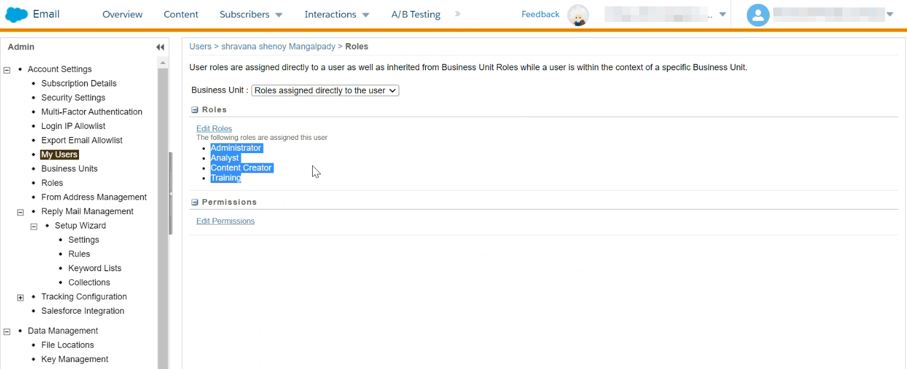
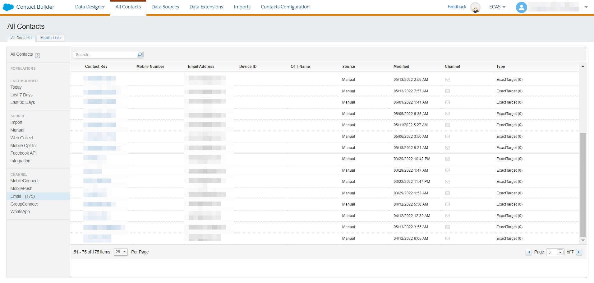

# [!DNL (API) Salesforce Marketing Cloud]個連線

## 概觀 {#overview}

[[!DNL (API) Salesforce Marketing Cloud]](https://www.salesforce.com/products/marketing-cloud/engagement/) （先前稱為[!DNL ExactTarget]）是數位行銷套件，可讓您為訪客和客戶建置和自訂歷程，以個人化其體驗。

>[!IMPORTANT]
>
> 請注意這個連線與存在於電子郵件行銷目錄區段內的其他[[!DNL Salesforce Marketing Cloud] 連線](/help/destinations/catalog/email-marketing/salesforce-marketing-cloud.md)之間的差異。 另一個SalesforceMarketing Cloud連線可讓您將檔案匯出至指定的儲存位置，而此連線是以API為基礎的串流連線。

相較於更面向&#x200B;**B2B**&#x200B;行銷的[!DNL Salesforce Marketing Cloud Account Engagement]，[!DNL (API) Salesforce Marketing Cloud]目的地是異動決策週期較短的&#x200B;**B2C**&#x200B;使用案例的理想選擇。 您可以合併代表目標對象行為的大型資料集，藉由優先順序排列及區隔連絡人（尤其是來自[!DNL Salesforce]外部的資料集），以調整及改善行銷活動。 *注意，Experience Platform也有[[!DNL Salesforce Marketing Cloud Account Engagement]](/help/destinations/catalog/email-marketing/salesforce-marketing-cloud-account-engagement.md).*&#x200B;的連線

此[!DNL Adobe Experience Platform] [目的地](/help/destinations/home.md)使用[!DNL Salesforce Marketing Cloud] [更新連絡人](https://developer.salesforce.com/docs/marketing/marketing-cloud/guide/updateContacts.html) API，可讓您在新的[!DNL Salesforce Marketing Cloud]區段中啟用連絡人後，針對您的業務需求&#x200B;**新增連絡人和更新連絡人資料**。

[!DNL Salesforce Marketing Cloud]使用具有使用者端認證的OAuth 2做為驗證機制，與[!DNL Salesforce Marketing Cloud] API通訊。 [向目的地驗證](#authenticate)區段中進一步說明如何向您的[!DNL Salesforce Marketing Cloud]執行個體進行驗證。

## 使用案例 {#use-cases}

為協助您更清楚瞭解您應如何及何時使用[!DNL (API) Salesforce Marketing Cloud]目的地，以下是Adobe Experience Platform客戶可藉由使用此目的地解決的範例使用案例。

### 傳送電子郵件給行銷活動的連絡人 {#use-case-send-emails}

家用出租平台的銷售部門想要廣播行銷電子郵件給目標客戶對象。 平台的行銷團隊可以透過Adobe Experience Platform新增連絡人/更新現有的連絡人&#x200B;*（及其電子郵件地址）*、從自己的離線資料建立對象，並將這些對象傳送至[!DNL Salesforce Marketing Cloud]，然後可以使用這些對象來傳送行銷活動電子郵件。

## 先決條件 {#prerequisites}

### Experience Platform的必要條件 {#prerequisites-in-experience-platform}

在啟用資料到[!DNL (API) Salesforce Marketing Cloud]目的地之前，您必須在[!DNL Experience Platform]中建立[結構描述](/help/xdm/schema/composition.md)、[資料集](https://experienceleague.adobe.com/docs/platform-learn/tutorials/data-ingestion/create-datasets-and-ingest-data.html)和[區段](https://experienceleague.adobe.com/docs/platform-learn/tutorials/segments/create-segments.html)。

### [!DNL (API) Salesforce Marketing Cloud]中的必要條件 {#prerequisites-destination}

若要將資料從Platform匯出至您的[!DNL Salesforce Marketing Cloud]帳戶，請注意下列必要條件：

#### 您必須擁有[!DNL Salesforce Marketing Cloud]帳戶 {#prerequisites-account}

必須有一個訂閱[[!DNL Marketing Cloud Engagement]](https://www.salesforce.com/products/marketing-cloud/engagement/)產品的[!DNL Salesforce Marketing Cloud]帳戶才能繼續。

如果您沒有[!DNL Salesforce Marketing Cloud]帳戶或帳戶缺少[!DNL Marketing Cloud Engagement]產品訂閱，請連絡[[!DNL Salesforce] 支援](https://www.salesforce.com/company/contact-us/?d=cta-glob-footer-10)。

#### 在[!DNL Salesforce Marketing Cloud]中建立屬性 {#prerequisites-attribute}

將對象啟用至[!DNL (API) Salesforce Marketing Cloud]目的地時，您必須在&#x200B;**[對象排程](#schedule-segment-export-example)**&#x200B;步驟中，為每個已啟用的對象在&#x200B;**[!UICONTROL 對應ID]**&#x200B;欄位中輸入值。

[!DNL Salesforce]需要此值才能正確讀取和解讀來自Experience Platform的對象，並在[!DNL Salesforce Marketing Cloud]內更新其對象狀態。 如果您需要對象狀態的指引，請參閱[對象成員資格詳細資料結構描述欄位群組](/help/xdm/field-groups/profile/segmentation.md)的Experience Platform檔案。

對於您從Platform啟動至[!DNL Salesforce]的每個對象，您必須在[!DNL Salesforce Marketing Cloud]內將型別`Text`的屬性連結至[!DNL Email Demographics]資料延伸模組。 使用[!DNL Salesforce Marketing Cloud] [!DNL Contact Builder]建立屬性。 如需建立屬性的相關指引，請參閱[!DNL Salesforce Marketing Cloud]檔案，以便[建立屬性](https://help.salesforce.com/s/articleView?id=mc_cab_create_an_attribute.htm&amp;type=5&amp;language=en_US)。

在&#x200B;**[!UICONTROL 對應]**&#x200B;步驟期間，[!DNL (API) Salesforce Marketing Cloud]目標欄位會使用屬性欄位名稱。 您可以根據業務需求定義最多4000個字元的欄位字元。 如需屬性型別的其他資訊，請參閱[!DNL Salesforce Marketing Cloud] [資料延伸模組資料型別](https://help.salesforce.com/s/articleView?id=sf.mc_es_data_extension_data_types.htm&amp;type=5)檔案頁面。

[!DNL Salesforce Marketing Cloud]中的資料設計工具畫面範例顯示如下，您將在其中新增屬性：

[!DNL Salesforce Marketing Cloud] [!DNL Email Data]屬性群組的檢視具有對應至[!DNL Email Demographics]資料延伸內對象狀態的屬性，如下所示：

[!DNL (API) Salesforce Marketing Cloud]目的地使用[!DNL Salesforce Marketing Cloud] [!DNL Search Attribute-Set Definitions REST] [API](https://developer.salesforce.com/docs/marketing/marketing-cloud/guide/retrieveAttributeSetDefinitions.html)來動態擷取[!DNL Salesforce Marketing Cloud]中定義的資料延伸及其連結屬性。

當您在工作流程中設定[對應](#mapping-considerations-example)以[啟用對象到目的地](#activate)時，這些會顯示在&#x200B;**[!UICONTROL 目標欄位]**&#x200B;選取視窗中。

>[!IMPORTANT]
>
> 在[!DNL Salesforce Marketing Cloud]內，您必須為每個啟用的Platform區段建立屬性，該屬性的&#x200B;**[!UICONTROL 欄位名稱]**&#x200B;必須與&#x200B;**[!UICONTROL 對應ID]**&#x200B;中指定的值完全相符。 例如，底下熒幕擷圖顯示名為`salesforce_mc_segment_1`的屬性。 啟用此目的地的對象時，請新增`salesforce_mc_segment_1`做為&#x200B;**[!UICONTROL 對應ID]**，以將對象對象從Experience Platform填入此屬性中。

在[!DNL Salesforce Marketing Cloud]中建立屬性的範例顯示如下：

>[!TIP]
>
> * 建立屬性時，請勿在欄位名稱中包含空白字元。 請改用底線`(_)`字元做為分隔符號。
> * 若要區分Platform對象所使用的屬性與[!DNL Salesforce Marketing Cloud]內的其他屬性，您可以為用於Adobe區段的屬性包含可辨識的前置詞或後置詞。 例如，使用`Adobe_test_segment`或`test_segment_Adobe`代替`test_segment`。
> * 如果您已在[!DNL Salesforce Marketing Cloud]中建立其他屬性，您可以使用與Platform區段相同的名稱，輕鬆識別[!DNL Salesforce Marketing Cloud]中的對象。

#### 在[!DNL Salesforce Marketing Cloud]中指派使用者角色和許可權 {#prerequisites-roles-permissions}

由於[!DNL Salesforce Marketing Cloud]支援自訂角色（視您的使用案例而定），因此應指派相關角色給您的使用者，以更新[!DNL Salesforce Marketing Cloud]中的屬性。 指派給使用者的角色範例如下所示：

視指派給[!DNL Salesforce Marketing Cloud]使用者的角色而定，您還需要將許可權指派給[!DNL Salesforce Marketing Cloud]資料延伸模組，其連結至您要更新的欄位。

由於此目的地需要存取`[!DNL data extension]`，因此您需要允許他們。 例如，您需要允許的`Email` [!DNL data extension]如下所示：

若要限制存取層級，您也可以使用精細的許可權覆寫個別存取權。

如需詳細指引，請參閱[[!DNL Marketing Cloud Roles]](https://help.salesforce.com/s/articleView?language=en_US&amp;id=sf.mc_overview_marketing_cloud_roles.htm&amp;type=5)及[[!DNL Marketing Cloud Roles and Permissions]](https://help.salesforce.com/s/articleView?language=en_US&amp;id=sf.mc_overview_roles.htm&amp;type=5)頁面。

#### 收集[!DNL Salesforce Marketing Cloud]認證 {#gather-credentials}

在驗證[!DNL (API) Salesforce Marketing Cloud]目的地之前，請記下以下專案。

| 認證 | 說明 | 範例 |
| --- | --- | --- |
| 子網域 | 請參閱[[!DNL Salesforce Marketing Cloud domain prefix]](https://developer.salesforce.com/docs/marketing/marketing-cloud/guide/your-subdomain-tenant-specific-endpoints.html)以瞭解如何從[!DNL Salesforce Marketing Cloud]介面取得此值。 | 如果您的[!DNL Salesforce Marketing Cloud]網域是  *`mcq4jrssqdlyc4lph19nnqgzzs84`.login.exacttarget.com*， 您必須提供`mcq4jrssqdlyc4lph19nnqgzzs84`作為值。 |
| 用戶端 ID | 請參閱[!DNL Salesforce Marketing Cloud] [檔案](https://developer.salesforce.com/docs/marketing/marketing-cloud/guide/access-token-s2s.html)以瞭解如何從[!DNL Salesforce Marketing Cloud]介面取得此值。 | r23kxxxxxxxx0z05xxxxxx |
| 使用者端密碼 | 請參閱[!DNL Salesforce Marketing Cloud] [檔案](https://developer.salesforce.com/docs/marketing/marketing-cloud/guide/access-token-s2s.html)以瞭解如何從[!DNL Salesforce Marketing Cloud]介面取得此值。 | ipxxxxxxxxxxT4xxxxxxxxxx |

{style="table-layout:auto"}

### 護欄 {#guardrails}

* Salesforce施加某些[速率限制](https://developer.salesforce.com/docs/marketing/marketing-cloud/guide/rate-limiting.html)。
   * 請參閱[!DNL Salesforce Marketing Cloud] [檔案](https://developer.salesforce.com/docs/marketing/marketing-cloud/guide/rate-limiting-errors.html)，解決您在執行期間可能遇到的任何限制，並減少錯誤。
   * 請參閱[[!DNL Salesforce Marketing Cloud] 參與訂價](https://www.salesforce.com/editions-pricing/marketing-cloud/email/)頁面以&#x200B;*以PDF格式下載完整版比較表*，其中會詳細說明您計畫所規定的限制。
   * [API總覽](https://developer.salesforce.com/docs/marketing/marketing-cloud/guide/apis-overview.html)頁面詳細說明其他限制。
   * 請參閱[這裡](https://salesforce.stackexchange.com/questions/205898/marketing-cloud-api-limits)以取得整理這些詳細資料的頁面。
* 每個物件&#x200B;*允許的*&#x200B;自訂欄位計數會依您的Salesforce版本而有所不同。
   * 如需其他指引，請參閱[!DNL Salesforce] [檔案](https://help.salesforce.com/s/articleView?id=sf.custom_field_allocations.htm&amp;type=5)。
   * 如果您已經達到[!DNL Salesforce Marketing Cloud]內每個物件&#x200B;*允許的*&#x200B;自訂欄位所定義的限制，您將需要
      * 在[!DNL Salesforce Marketing Cloud]中新增屬性之前，請先移除較舊的屬性。
      * 在[對象排程](#schedule-segment-export-example)步驟期間，更新或移除Platform目的地中使用這些較舊屬性名稱作為&#x200B;**[!UICONTROL 對應ID]**&#x200B;所提供值的任何已啟動對象。

## 支援的身分 {#supported-identities}

[!DNL (API) Salesforce Marketing Cloud]支援下表所述的身分啟用。 深入瞭解[身分](/help/identity-service/features/namespaces.md)。

| 目標身分 | 說明 | 考量事項 |
|---|---|---|
| contactKey | [!DNL Salesforce Marketing Cloud]連絡人金鑰。 如需其他指南，請參閱[!DNL Salesforce Marketing Cloud] [檔案](https://help.salesforce.com/s/articleView?id=sf.mc_cab_contact_builder_best_practices.htm&amp;type=5)。 | 強制 |

## 支援的對象 {#supported-audiences}

本節說明您可以將哪些型別的對象匯出至此目的地。

| 對象來源 | 支援 | 說明 |
|---------|----------|----------|
| [!DNL Segmentation Service] | ✓ (A) | 透過Experience Platform[細分服務](../../../segmentation/home.md)產生的對象。 |
| 自訂上傳 | X | 對象[從CSV檔案匯入](../../../segmentation/ui/audience-portal.md#import-audience)至Experience Platform。 |

{style="table-layout:auto"}

## 匯出型別和頻率 {#export-type-frequency}

請參閱下表以取得目的地匯出型別和頻率的資訊。

| 項目 | 類型 | 附註 |
---------|----------|---------|
| 匯出類型 | **[!UICONTROL 以設定檔為基礎]** | <ul><li>您正在匯出區段的所有成員，以及所需的結構描述欄位&#x200B;*（例如：電子郵件地址、電話號碼、姓氏）* （根據您的欄位對應）。</li><li> 根據[對象排程](#schedule-segment-export-example)步驟期間提供的&#x200B;**[!UICONTROL 對應ID]**&#x200B;值，[!DNL Salesforce Marketing Cloud]中的每個區段狀態都會以來自Platform的對應對象狀態更新。</li></ul> |
| 匯出頻率 | **[!UICONTROL 串流]** | 串流目的地是「一律開啟」的API型連線。 一旦根據對象評估在Experience Platform中更新了設定檔，聯結器就會將更新傳送至下游的目的地平台。 深入瞭解[串流目的地](/help/destinations/destination-types.md#streaming-destinations)。 |

{style="table-layout:auto"}

## 連線到目標 {#connect}

>[!IMPORTANT]
>
> 若要連線到目的地，您需要&#x200B;**[!UICONTROL 管理目的地]** [存取控制許可權](/help/access-control/home.md#permissions)。 閱讀[存取控制總覽](/help/access-control/ui/overview.md)或連絡您的產品管理員以取得必要的許可權。

若要連線到此目的地，請依照[目的地組態教學課程](../../ui/connect-destination.md)中所述的步驟進行。 在設定目標工作流程中，填寫以下兩個區段中列出的欄位。

在&#x200B;**[!UICONTROL 目的地]** > **[!UICONTROL 目錄]**&#x200B;內，搜尋[!DNL (API) Salesforce Marketing Cloud]。 或者，您可以在&#x200B;**[!UICONTROL 電子郵件行銷]**&#x200B;類別下找到它。

### 驗證目標 {#authenticate}

若要驗證到目的地，請填寫下列必填欄位，然後選取&#x200B;**[!UICONTROL 連線到目的地]**。 如需任何指引，請參閱[收集 [!DNL Salesforce Marketing Cloud] 認證](#gather-credentials)區段。

| [!DNL (API) Salesforce Marketing Cloud]目的地 | [!DNL Salesforce Marketing Cloud] |
| --- | --- |
| **[!UICONTROL 子網域]** | 您的[!DNL Salesforce Marketing Cloud]網域前置詞。  例如，如果您的網域是  *`mcq4jrssqdlyc4lph19nnqgzzs84`.login.exacttarget.com*， 您必須提供`mcq4jrssqdlyc4lph19nnqgzzs84`做為值。 |
| **[!UICONTROL 使用者端識別碼]** | 您的[!DNL Salesforce Marketing Cloud] `Client ID`。 |
| **[!UICONTROL 使用者端密碼]** | 您的[!DNL Salesforce Marketing Cloud] `Client Secret`。 |

如果提供的詳細資料有效，UI會以綠色勾號顯示&#x200B;**[!UICONTROL 已連線]**&#x200B;狀態，您就可以繼續進行下一個步驟。

### 填寫目標詳細資訊 {#destination-details}

若要設定目的地的詳細資訊，請填寫下方的必填和選用欄位。 UI中欄位旁的星號表示該欄位為必填欄位。

* **[!UICONTROL 名稱]**：您日後可辨識此目的地的名稱。
* **[!UICONTROL 描述]**：可協助您日後識別此目的地的描述。

### 啟用警示 {#enable-alerts}

您可以啟用警報以接收有關傳送到您目的地的資料流狀態的通知。 從清單中選取警報以訂閱接收有關資料流狀態的通知。 如需警示的詳細資訊，請參閱[使用UI訂閱目的地警示](../../ui/alerts.md)的指南。

當您完成提供目的地連線的詳細資訊後，請選取&#x200B;**[!UICONTROL 下一步]**。

## 啟動此目標的對象 {#activate}

>[!IMPORTANT]
> 
> * 若要啟用資料，您需要&#x200B;**[!UICONTROL 檢視目的地]**、**[!UICONTROL 啟用目的地]**、**[!UICONTROL 檢視設定檔]**&#x200B;和&#x200B;**[!UICONTROL 檢視區段]** [存取控制許可權](/help/access-control/home.md#permissions)。 閱讀[存取控制總覽](/help/access-control/ui/overview.md)或連絡您的產品管理員以取得必要的許可權。
> * 若要匯出&#x200B;*身分*，您需要&#x200B;**[!UICONTROL 檢視身分圖表]** [存取控制許可權](/help/access-control/home.md#permissions)。  {width="100" zoomable="yes"}

閱讀[將設定檔和對象啟用至串流對象匯出目的地](/help/destinations/ui/activate-segment-streaming-destinations.md)，以瞭解啟用此目的地對象的指示。

### 對應考量事項和範例 {#mapping-considerations-example}

若要將對象資料從Adobe Experience Platform正確傳送至[!DNL (API) Salesforce Marketing Cloud]目的地，您必須完成欄位對應步驟。 對應包括在Platform帳戶中的Experience Data Model (XDM)結構描述欄位與來自目標目的地的對應對應專案之間建立連結。

若要將您的XDM欄位正確對應到[!DNL (API) Salesforce Marketing Cloud]目的地欄位，請遵循下列步驟。

>[!IMPORTANT]
>
> * 雖然您的屬性名稱會依據您的[!DNL Salesforce Marketing Cloud]帳戶而定，但`contactKey`和`personalEmail.address`的對映是必要的。
>
> * 與[!DNL Salesforce Marketing Cloud] API的整合受Experience Platform可從Salesforce擷取的屬性數目分頁限制。 這表示在&#x200B;**[!UICONTROL 對應]**&#x200B;步驟期間，目標欄位結構描述可以從您的Salesforce帳戶顯示最多2000個屬性。

1. 在&#x200B;**[!UICONTROL 對應]**&#x200B;步驟中，選取&#x200B;**[!UICONTROL 新增對應]**。 您會在畫面上看到新的對應列。
   
1. 在&#x200B;**[!UICONTROL 選取來源欄位]**&#x200B;視窗中，選擇&#x200B;**[!UICONTROL 選取屬性]**&#x200B;類別並選取XDM屬性，或選擇&#x200B;**[!UICONTROL 選取身分名稱空間]**&#x200B;並選取身分。
1. 在&#x200B;**[!UICONTROL 選取目標欄位]**&#x200B;視窗中，選擇&#x200B;**[!UICONTROL 選取身分名稱空間]**&#x200B;並選取身分，或選擇&#x200B;**[!UICONTROL 選取屬性]**&#x200B;類別，並視需要從顯示的資料延伸中選取屬性。 [!DNL (API) Salesforce Marketing Cloud]目的地使用[!DNL Salesforce Marketing Cloud] [!DNL Search Attribute-Set Definitions REST] [API](https://developer.salesforce.com/docs/marketing/marketing-cloud/guide/retrieveAttributeSetDefinitions.html)來動態擷取[!DNL Salesforce Marketing Cloud]中定義的資料延伸及其連結屬性。 當您在[啟用對象工作流程](#activate)中設定[對應](#mapping-considerations-example)時，這些會顯示在&#x200B;**[!UICONTROL 目標欄位]**&#x200B;快顯視窗中。

   * 重複這些步驟，在您的XDM設定檔結構描述與[!DNL (API) Salesforce Marketing Cloud]之間新增下列對應：

     | 來源欄位 | 目標欄位 | 強制 |
     |---|---|---|
     | `IdentityMap: contactKey` | `Identity: salesforceContactKey` | `Mandatory` |
     | `xdm: personalEmail.address` | 來自[!DNL Salesforce Marketing Cloud] [!DNL Email Addresses]資料延伸的`Attribute: Email Address`。 | `Mandatory`，新增連絡人時。 |
     | `xdm: person.name.firstName` | 來自所需[!DNL Salesforce Marketing Cloud]資料延伸的`Attribute: First Name`。 | - |

   * 以下顯示使用這些對應的範例：
     

當您完成提供目的地連線的對應時，請選取&#x200B;**[!UICONTROL 下一步]**。

### 排程對象匯出和範例 {#schedule-segment-export-example}

執行[排程對象匯出](/help/destinations/ui/activate-segment-streaming-destinations.md#scheduling)步驟時，您必須手動將Platform對象對應到[!DNL Salesforce Marketing Cloud]中的[屬性](#prerequisites-attribute)。

若要這麼做，請選取每個區段，然後在[!DNL (API) Salesforce Marketing Cloud] **[!UICONTROL 對應ID]**&#x200B;欄位中，輸入[!DNL Salesforce Marketing Cloud]中屬性的名稱。 如需在[!DNL Salesforce Marketing Cloud]中建立屬性的相關指引和最佳實務，請參閱[在 [!DNL Salesforce Marketing Cloud]](#prerequisites-custom-field)中建立屬性。

例如，若您的[!DNL Salesforce Marketing Cloud]屬性是`salesforce_mc_segment_1`，請在[!DNL (API) Salesforce Marketing Cloud] **[!UICONTROL 對應ID]**&#x200B;中指定此值，以將對象對象從Experience Platform填入此屬性。

[!DNL Salesforce Marketing Cloud]的範例屬性顯示如下：

以下顯示指示[!DNL (API) Salesforce Marketing Cloud] **[!UICONTROL 對應ID]**位置的範例：

如圖所示，[!DNL (API) Salesforce Marketing Cloud] **[!UICONTROL 對應ID]**&#x200B;應完全符合[!DNL Salesforce Marketing Cloud] **[!UICONTROL 欄位名稱]**&#x200B;中指定的值。

對每個已啟動的Platform區段重複此章節。

以上圖影像為基礎的典型範例可能是。
| [!DNL (API) Salesforce Marketing Cloud]區段名稱 | [!DNL Salesforce Marketing Cloud] **[!UICONTROL 欄位名稱]** | [!DNL (API) Salesforce Marketing Cloud] **[!UICONTROL 對應ID]** |
| — | — | — |
| salesforce mc audience 1 | `salesforce_mc_segment_1` | `salesforce_mc_segment_1` |
| salesforce mc audience 2 | `salesforce_mc_segment_2` | `salesforce_mc_segment_2` |

## 驗證資料匯出 {#exported-data}

若要驗證您是否已正確設定目的地，請遵循下列步驟：

1. 選取&#x200B;**[!UICONTROL 目的地]** > **[!UICONTROL 瀏覽]**以瀏覽目的地清單。
   

1. 選取目的地並驗證狀態為&#x200B;**[!UICONTROL 已啟用]**。
   

1. 切換至&#x200B;**[!DNL Activation data]**標籤，然後選取對象名稱。
   

1. 監控對象摘要，並確保設定檔計數對應於在區段內建立的計數。
   

1. 登入[[!DNL Salesforce Marketing Cloud]](https://mc.exacttarget.com/)網站。 然後導覽至「**[!DNL Audience Builder]** > **[!DNL Contact Builder]** > **[!DNL All contacts]** > **[!DNL Email]**」頁面，並檢查是否已新增對象中的設定檔。
   

1. 若要檢查是否有任何設定檔已更新，請導覽至&#x200B;**[!UICONTROL 電子郵件]**&#x200B;頁面，並驗證是否已更新對象中設定檔的屬性值。 如果成功，您可以看到根據[對象排程](#schedule-segment-export-example)步驟中提供的&#x200B;**[!UICONTROL 對應ID]**&#x200B;值，[!DNL Salesforce Marketing Cloud]中的每個對象狀態已更新為來自Platform的對應對象狀態。
   

## 資料使用與控管 {#data-usage-governance}

處理您的資料時，所有[!DNL Adobe Experience Platform]目的地都符合資料使用原則。 如需[!DNL Adobe Experience Platform]如何強制資料控管的詳細資訊，請參閱[資料控管概觀](/help/data-governance/home.md)。

## 錯誤與疑難排解 {#errors-and-troubleshooting}

### 將事件推送到SalesforceMarketing Cloud時遇到未知錯誤 {#unknown-errors}

* 檢查資料流執行時，您可能會遇到下列錯誤訊息： `Unknown errors encountered while pushing events to the destination. Please contact the administrator and try again.`
  

   * 若要修正此錯誤，請確認您在啟動工作流程中提供的&#x200B;**[!UICONTROL 對應ID]**&#x200B;與[!DNL (API) Salesforce Marketing Cloud]目的地完全符合您在[!DNL Salesforce Marketing Cloud]中建立的屬性名稱。 如需相關指引，請參閱[在 [!DNL Salesforce Marketing Cloud]](#prerequisites-custom-field)內建立屬性。

* 啟用區段時，您可能會收到錯誤訊息： `The client's IP address is unauthorized for this account. Allowlist the client's IP address...`
   * 若要修正此錯誤，請連絡您的[!DNL Salesforce Marketing Cloud]帳戶管理員，將[Experience PlatformIP位址](/help/destinations/catalog/streaming/ip-address-allow-list.md)新增至您的[!DNL Salesforce Marketing Cloud]帳戶受信任的IP範圍。 如果您需要其他指引，請參閱Marketing Cloud](https://help.salesforce.com/s/articleView?id=sf.mc_es_ip_addresses_for_inclusion.htm&amp;type=5)檔案中允許清單的[!DNL Salesforce Marketing Cloud] [IP位址。

## 其他資源 {#additional-resources}

* [!DNL Salesforce Marketing Cloud] [API](https://developer.salesforce.com/docs/marketing/marketing-cloud/guide/apis-overview.html)
* [!DNL Salesforce Marketing Cloud] [檔案](https://developer.salesforce.com/docs/marketing/marketing-cloud/guide/updateContacts.html)說明如何使用指定的資訊更新連絡人。

### Changelog {#changelog}

本節擷取此目的地聯結器的功能和重要檔案更新。

+++ 檢視變更記錄檔

| 發行月份 | 更新型別 | 說明 |
|---|---|---|
| 2023 年 10 月 | 檔案更新 | <ul><li>我們已更新(API) SalesforceMarketing Cloud](#prerequisites-destination)中的[必要條件，並一般移除檔案中屬性群組的不必要參照。</li> <li>更新檔案以指出只應在[!DNL Email Demographics]資料延伸內的[!DNL Salesforce Marketing Cloud]中建立對象狀態的屬性。</li> <li>我們已更新[對應考量事項和範例](#mapping-considerations-example)區段中的對應表格，`Email Addresses`資料延伸模組中`Email Address`屬性的對應標籤為必要，標示為IMPORTANT的圖說中曾提及此要求，但表格中省略。</li></ul> |
| 2023 年 4 月 | 檔案更新 | <ul><li>我們更正了[ (API) SalesforceMarketing Cloud](#prerequisites-destination)中先決條件的陳述式及參考連結，指出[!DNL Salesforce Marketing Cloud Engagement]是使用此目的地的必要訂閱。 區段先前錯誤地指出使用者需要訂閱Marketing Cloud **帳戶**&#x200B;參與才能繼續。</li> <li>我們已在[先決條件](#prerequisites)下新增一節，以將[角色和許可權](#prerequisites-roles-permissions)指派給[!DNL Salesforce]使用者，讓此目的地正常運作。 (PLATIR-26299)</li></ul> |
| 2023 年 2 月 | 檔案更新 | 我們已更新(API) SalesforceMarketing Cloud](#prerequisites-destination)區段中的[必要條件，加入參考連結，指出[!DNL Salesforce Marketing Cloud Engagement]是使用此目的地的必要訂閱。 |
| 2023 年 2 月 | 功能更新 | 已修正目的地中不正確的設定導致將格式錯誤的JSON傳送至Salesforce的問題。 這會導致某些使用者在啟用時看到大量身分失敗。 (PLATIR-26299) |
| 2023 年 1 月 | 檔案更新 | <ul><li>我們更新了 [!DNL Salesforce]](#prerequisites-destination)中的[必要條件區段，指出必須在[!DNL Salesforce]端建立屬性。 本節現在包含如何執行此動作的詳細指示，以及命名[!DNL Salesforce]中屬性的最佳作法。 (PLATIR-25602)</li><li>我們新增了明確指示，說明如何在[對象排程](#schedule-segment-export-example)步驟中為每個已啟用的對象使用對應ID。 (PLATIR-25602)</li></ul> |
| 2022 年 10 月 | 首次發行 | 初始目的地版本和檔案發佈。 |

{style="table-layout:auto"}

+++
