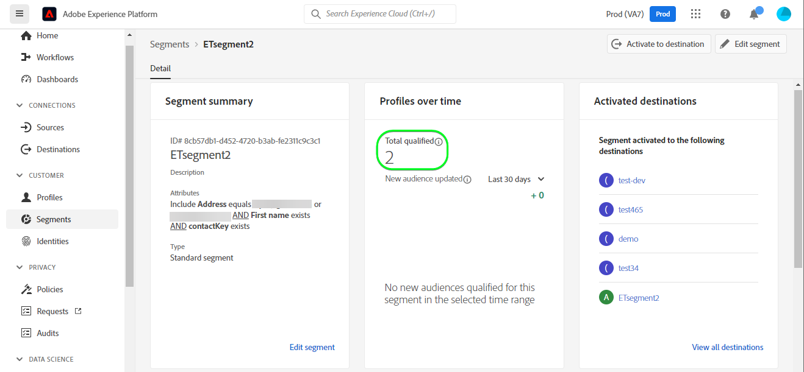

# [!DNL (API) Salesforce Marketing Cloud] 連接

## 總覽 {#overview}

[[!DNL (API) Salesforce Marketing Cloud]](https://www.salesforce.com/products/marketing-cloud/engagement/) (先前稱為 [!DNL ExactTarget])是數位行銷套裝，可讓您建置和自訂歷程，供訪客和客戶個人化其體驗。

>[!IMPORTANT]
>
>請注意此連線與其他 [[!DNL Salesforce Marketing Cloud] 連接](/help/destinations/catalog/email-marketing/salesforce-marketing-cloud.md) 存在於電子郵件行銷目錄區段中。 另一個SalesforceMarketing Cloud連線可讓您將檔案匯出至指定的儲存位置，而這是以API為基礎的串流連線。

與 [!DNL Salesforce Marketing Cloud Account Engagement] 更注重 **B2B** 行銷， [!DNL (API) Salesforce Marketing Cloud] 目的地是理想的 **B2C** 交易決策週期較短的使用案例。 您可以合併代表目標對象行為的大型資料集，透過排定聯絡人的優先順序並加以區隔，尤其是從外部資料集調整並改善行銷活動 [!DNL Salesforce]. *注意，Experience Platform也有 [[!DNL Salesforce Marketing Cloud Account Engagement]](/help/destinations/catalog/email-marketing/salesforce-marketing-cloud-account-engagement.md).*

此 [!DNL Adobe Experience Platform] [目的地](/help/destinations/home.md) 利用 [!DNL Salesforce Marketing Cloud] [更新聯繫人](https://developer.salesforce.com/docs/marketing/marketing-cloud/guide/updateContacts.html) API，可讓您 **添加聯繫人和更新聯繫人資料** 在新 [!DNL Salesforce Marketing Cloud] 區段。

[!DNL Salesforce Marketing Cloud] 使用OAuth 2搭配用戶端憑證作為驗證機制，與 [!DNL Salesforce Marketing Cloud] API。 向您的 [!DNL Salesforce Marketing Cloud] 執行個體在下方， [驗證到目標](#authenticate) 區段。

## 使用案例 {#use-cases}

以協助您更清楚了解應如何及何時使用 [!DNL (API) Salesforce Marketing Cloud] 目的地，以下是Adobe Experience Platform客戶可透過此目的地解決的範例使用案例。

### 傳送電子郵件給行銷活動的聯絡人 {#use-case-send-emails}

家庭租賃平台的銷售部門想要向目標客戶受眾廣播行銷電子郵件。 平台的行銷團隊可以新增聯絡人/更新現有的聯絡人 *（及其電子郵件地址）* 透過Adobe Experience Platform，從自己的離線資料建立區段，並將這些區段傳送至 [!DNL Salesforce Marketing Cloud]，然後可用來傳送行銷活動電子郵件。

## 先決條件 {#prerequisites}

### Experience Platform的必要條件 {#prerequisites-in-experience-platform}

在將資料啟用至 [!DNL (API) Salesforce Marketing Cloud] 目的地，您必須 [綱要](/help/xdm/schema/composition.md), [資料集](https://experienceleague.adobe.com/docs/platform-learn/tutorials/data-ingestion/create-datasets-and-ingest-data.html?lang=en)，和 [區段](https://experienceleague.adobe.com/docs/platform-learn/tutorials/segments/create-segments.html?lang=en) 建立於 [!DNL Experience Platform].

### 中的必要條件 [!DNL (API) Salesforce Marketing Cloud] {#prerequisites-destination}

若要將資料從Platform匯出至您的 [!DNL Salesforce Marketing Cloud] 帳戶：

#### 你需要 [!DNL Salesforce Marketing Cloud] 帳戶 {#prerequisites-account}

A [!DNL Salesforce Marketing Cloud] 具有訂閱的帳戶 [[!DNL Marketing Cloud Engagement]](https://www.salesforce.com/products/marketing-cloud/engagement/) 產品必須繼續。

伸手 [[!DNL Salesforce] 支援](https://www.salesforce.com/company/contact-us/?d=cta-glob-footer-10) 如果您沒有 [!DNL Salesforce Marketing Cloud] 帳戶或帳戶遺失 [!DNL Marketing Cloud Engagement] 產品訂閱。

#### 在內建立屬性 [!DNL Salesforce Marketing Cloud] {#prerequisites-attribute}

將區段啟用至 [!DNL (API) Salesforce Marketing Cloud] 目的地，您必須在 **[!UICONTROL 對應ID]** 欄位中 **[區段排程](#schedule-segment-export-example)** 步驟。

[!DNL Salesforce] 需要此值才能正確讀取和解讀來自Experience Platform的區段，以及在內更新其區段狀態 [!DNL Salesforce Marketing Cloud]. 請參閱Experience Platform檔案，以了解 [區段成員資格詳細資料結構欄位群組](/help/xdm/field-groups/profile/segmentation.md) 如果您需要區段狀態的指引。

針對您從Platform啟動至 [!DNL Salesforce Marketing Cloud]，您需要建立類型的屬性 `Text` with [!DNL Salesforce]. 使用 [!DNL Salesforce Marketing Cloud] [!DNL Contact Builder] 來建立屬性。 屬性欄位名稱用於 [!DNL (API) Salesforce Marketing Cloud] 目標欄位，應在下建立 `[!DNL Email Demographics system attribute-set]`. 您可以根據業務需求定義欄位字元，最多4000個字元。 請參閱 [!DNL Salesforce Marketing Cloud] [資料擴充功能資料類型](https://help.salesforce.com/s/articleView?id=sf.mc_es_data_extension_data_types.htm&amp;type=5) 檔案頁面，以取得屬性類型的其他資訊。

請參閱 [!DNL Salesforce Marketing Cloud] 檔案 [建立屬性](https://help.salesforce.com/s/articleView?id=mc_cab_create_an_attribute.htm&amp;type=5&amp;language=en_US) 如果您需要建立屬性的指引。

中的資料設計器畫面範例，位於 [!DNL Salesforce Marketing Cloud]，您將新增屬性的位置如下所示：

檢視 [!DNL Salesforce Marketing Cloud] [!DNL Email Demographics] 屬性集如下所示：

此 [!DNL (API) Salesforce Marketing Cloud] 目的地使用 [!DNL Salesforce Marketing Cloud] [!DNL Search Attribute-Set Definitions REST] [API](https://developer.salesforce.com/docs/marketing/marketing-cloud/guide/retrieveAttributeSetDefinitions.html) 以動態檢索在中定義的屬性及其屬性集 [!DNL Salesforce Marketing Cloud].

這些會顯示在 **[!UICONTROL 目標欄位]** 選擇窗口 [映射](#mapping-considerations-example) 在 [啟用區段至目的地](#activate). 請注意，僅對 [!DNL Salesforce Marketing Cloud] `[!DNL Email Demographics]` 支援屬性集。

>[!IMPORTANT]
>
>內 [!DNL Salesforce Marketing Cloud]，您必須使用 **[!UICONTROL 欄位名稱]** 完全符合 **[!UICONTROL 對應ID]** 針對每個已啟用的平台區段。 例如，下方的螢幕擷圖顯示一個名為 `salesforce_mc_segment_1`. 啟用區段至此目的地時，請新增 `salesforce_mc_segment_1` as **[!UICONTROL 對應ID]** 將區段對象從Experience Platform填入此屬性。

在中建立屬性的範例 [!DNL Salesforce Marketing Cloud]，如下所示：

>[!TIP]
>
>* 建立屬性時，請勿在欄位名稱中加入空格字元。 請改用底線 `(_)` 字元。
>* 區分用於Platform區段的屬性和內的其他屬性 [!DNL Salesforce Marketing Cloud]，您可以為用於Adobe區段的屬性加入可識別的首碼或尾碼。 例如，而非 `test_segment`，使用 `Adobe_test_segment` 或 `test_segment_Adobe`.
>* 如果您已在中建立其他屬性 [!DNL Salesforce Marketing Cloud]，您可以使用與Platform區段相同的名稱，輕鬆識別 [!DNL Salesforce Marketing Cloud].

#### 在中指派使用者角色和權限 [!DNL Salesforce Marketing Cloud] {#prerequisites-roles-permissions}

As [!DNL Salesforce Marketing Cloud] 根據您的使用案例支援自訂角色，您應為您的使用者指派相關角色，以更新您 [!DNL Salesforce Marketing Cloud] 屬性集。 指派給使用者的角色範例如下所示：

視您的 [!DNL Salesforce Marketing Cloud] 已指派使用者，您也需要指派權限給 [!DNL Salesforce Marketing Cloud] 屬性集，包含您要更新的欄位。

因為此目的地需要存取 `[!DNL Email Demographics system attribute-set]`，您必須允許 `Email` 如下所示：

若要限制存取層級，您也可以使用精細權限來覆寫個別存取。

請參閱 [[!DNL Marketing Cloud Roles]](https://help.salesforce.com/s/articleView?language=en_US&amp;id=sf.mc_overview_marketing_cloud_roles.htm&amp;type=5) 和 [[!DNL Marketing Cloud Roles and Permissions]](https://help.salesforce.com/s/articleView?language=en_US&amp;id=sf.mc_overview_roles.htm&amp;type=5) 頁面，以取得詳細指引。

#### 收集 [!DNL Salesforce Marketing Cloud] 憑據 {#gather-credentials}

在驗證之前，請記下下列項目 [!DNL (API) Salesforce Marketing Cloud] 目的地。

| 憑據 | 說明 | 範例 |
| --- | --- | --- |
| 子網域 | 請參閱 [[!DNL Salesforce Marketing Cloud domain prefix]](https://developer.salesforce.com/docs/marketing/marketing-cloud/guide/your-subdomain-tenant-specific-endpoints.html) 若要了解如何從 [!DNL Salesforce Marketing Cloud] 介面。 | 若您的 [!DNL Salesforce Marketing Cloud] 網域為  *`mcq4jrssqdlyc4lph19nnqgzzs84`.login.exacttarget.com*,  您需要提供 `mcq4jrssqdlyc4lph19nnqgzzs84` 作為值。 |
| 用戶端ID | 請參閱 [!DNL Salesforce Marketing Cloud] [檔案](https://developer.salesforce.com/docs/marketing/marketing-cloud/guide/access-token-s2s.html) 若要了解如何從 [!DNL Salesforce Marketing Cloud] 介面。 | r23kxxxxxxxx0z05xxxxxx |
| 用戶端密碼 | 請參閱 [!DNL Salesforce Marketing Cloud] [檔案](https://developer.salesforce.com/docs/marketing/marketing-cloud/guide/access-token-s2s.html) 若要了解如何從 [!DNL Salesforce Marketing Cloud] 介面。 | ipxxxxxxxxxxT4xxxxxxxxxx |

{style="table-layout:auto"}

### 護欄 {#guardrails}

* Salesforce強加了 [比率限制](https://developer.salesforce.com/docs/marketing/marketing-cloud/guide/rate-limiting.html).
   * 請參閱 [!DNL Salesforce Marketing Cloud] [檔案](https://developer.salesforce.com/docs/marketing/marketing-cloud/guide/rate-limiting-errors.html) 解決您可能遇到的任何可能限制，並減少執行期間的錯誤。
   * 請參閱 [[!DNL Salesforce Marketing Cloud] 參與定價](https://www.salesforce.com/editions-pricing/marketing-cloud/email/) 頁面 *下載完整版比較表* 作為pdf，詳細說明您的計畫所施加的限制。
   * 此 [API概述](https://developer.salesforce.com/docs/marketing/marketing-cloud/guide/apis-overview.html) 頁面詳細資訊其他限制。
   * 請參閱 [此處](https://salesforce.stackexchange.com/questions/205898/marketing-cloud-api-limits) ，以取得整理這些詳細資料的頁面。
* 計數 *每個對象允許的自定義欄位* 會根據您的Salesforce版本而有所不同。
   * 請參閱 [!DNL Salesforce] [檔案](https://help.salesforce.com/s/articleView?id=sf.custom_field_allocations.htm&amp;type=5) 以取得其他指導。
   * 如果已達到為定義的限制 *每個對象允許的自定義欄位* with [!DNL Salesforce Marketing Cloud] 你需要
      * 先移除舊屬性，再在中新增新屬性 [!DNL Salesforce Marketing Cloud].
      * 更新或移除Platform目的地中使用舊屬性名稱做為 **[!UICONTROL 對應ID]** 在 [區段排程](#schedule-segment-export-example) 步驟。

## 支援的身分 {#supported-identities}

[!DNL (API) Salesforce Marketing Cloud] 支援啟用下表所述的身分。 深入了解 [身分](/help/identity-service/namespaces.md).

| Target身分 | 說明 | 考量事項 |
|---|---|---|
| contactKey | [!DNL Salesforce Marketing Cloud] 聯繫密鑰。 請參閱 [!DNL Salesforce Marketing Cloud] [檔案](https://help.salesforce.com/s/articleView?id=sf.mc_cab_contact_builder_best_practices.htm&amp;type=5) 如果您需要其他指導。 | 必要 |

## 匯出類型和頻率 {#export-type-frequency}

有關目標導出類型和頻率的資訊，請參閱下表。

| 項目 | 類型 | 附註 |
---------|----------|---------|
| 匯出類型 | **[!UICONTROL 設定檔]** | <ul><li>您要匯出區段的所有成員，以及所需的結構欄位 *(例如：電子郵件地址、電話號碼、姓氏)*，根據您的欄位對應。</li><li> 中的每個區段狀態 [!DNL Salesforce Marketing Cloud] 會根據 **[!UICONTROL 對應ID]** 值 [區段排程](#schedule-segment-export-example) 步驟。</li></ul> |
| 匯出頻率 | **[!UICONTROL 串流]** | 串流目的地是「一律開啟」API型連線。 一旦根據區段評估在Experience Platform中更新設定檔，連接器就會將更新傳送至下游的目的地平台。 深入了解 [串流目的地](/help/destinations/destination-types.md#streaming-destinations). |

{style="table-layout:auto"}

## 連接到目標 {#connect}

>[!IMPORTANT]
>
>若要連線至目的地，您需要 **[!UICONTROL 管理目的地]** [存取控制權限](/help/access-control/home.md#permissions). 閱讀 [存取控制概觀](/help/access-control/ui/overview.md) 或聯絡您的產品管理員以取得所需的權限。

若要連線至此目的地，請依照 [目的地設定教學課程](../../ui/connect-destination.md). 在設定目標工作流程中，填寫下列兩節所列的欄位。

內 **[!UICONTROL 目的地]** > **[!UICONTROL 目錄]**，搜尋 [!DNL (API) Salesforce Marketing Cloud]. 或者，您也可以在 **[!UICONTROL 電子郵件行銷]** 類別。

### 驗證到目標 {#authenticate}

若要驗證目的地，請填寫下方的必填欄位並選取 **[!UICONTROL 連接到目標]**. 請參閱 [收集 [!DNL Salesforce Marketing Cloud] 憑據](#gather-credentials) 區段。

| [!DNL (API) Salesforce Marketing Cloud] 目的地 | [!DNL Salesforce Marketing Cloud] |
| --- | --- |
| **[!UICONTROL 子網域]** | 您的 [!DNL Salesforce Marketing Cloud] 網域前置詞。  例如，若您的網域為   *`mcq4jrssqdlyc4lph19nnqgzzs84`.login.exacttarget.com*,   您需要提供 `mcq4jrssqdlyc4lph19nnqgzzs84` 作為值。 |
| **[!UICONTROL 用戶端ID]** | 您的 [!DNL Salesforce Marketing Cloud] `Client ID`. |
| **[!UICONTROL 用戶端密碼]** | 您的 [!DNL Salesforce Marketing Cloud] `Client Secret`. |

如果提供的詳細資料有效，UI會顯示 **[!UICONTROL 已連接]** 狀態（加上綠色勾號），您就可以繼續進行下一個步驟。

### 填寫目的地詳細資訊 {#destination-details}

若要設定目的地的詳細資訊，請填寫下方的必填和選填欄位。 UI中欄位旁的星號表示該欄位為必要欄位。

* **[!UICONTROL 名稱]**:日後您將透過此名稱識別此目的地。
* **[!UICONTROL 說明]**:未來可協助您識別此目的地的說明。

### 啟用警報 {#enable-alerts}

您可以啟用警報，接收有關資料流到目標狀態的通知。 從清單中選擇要訂閱的警報，以接收有關資料流狀態的通知。 如需警報的詳細資訊，請參閱 [使用UI訂閱目的地警報](../../ui/alerts.md).

完成提供目標連接的詳細資訊後，請選擇 **[!UICONTROL 下一個]**.

## 啟用此目的地的區段 {#activate}

>[!IMPORTANT]
>
>若要啟用資料，您需要 **[!UICONTROL 管理目的地]**, **[!UICONTROL 啟動目的地]**, **[!UICONTROL 檢視設定檔]**，和 **[!UICONTROL 檢視區段]** [存取控制權限](/help/access-control/home.md#permissions). 閱讀 [存取控制概觀](/help/access-control/ui/overview.md) 或聯絡您的產品管理員以取得所需的權限。

閱讀 [啟動設定檔和區段至串流區段匯出目的地](/help/destinations/ui/activate-segment-streaming-destinations.md) 以取得啟用受眾區段至此目的地的指示。

### 對應考量事項和範例 {#mapping-considerations-example}

若要將您的對象資料從Adobe Experience Platform正確傳送至 [!DNL (API) Salesforce Marketing Cloud] 目的地，您必須執行欄位對應步驟。 對應包含在您的Platform帳戶中的Experience Data Model(XDM)結構欄位與目標目的地對應的欄位之間建立連結。

若要正確將XDM欄位對應至 [!DNL (API) Salesforce Marketing Cloud] 目標欄位，請遵循下列步驟。

>[!IMPORTANT]
>
>雖然屬性名稱會與 [!DNL Salesforce Marketing Cloud] 帳戶，這兩個帳戶的對應 `contactKey` 和 `personalEmail.address` 是必填的。 映射屬性時，僅從Experience Platform中的屬性 `Email Demographics` 屬性集時，應在目標欄位內使用。

1. 在 **[!UICONTROL 對應]** 步驟，選取 **[!UICONTROL 新增對應]**. 畫面上會顯示新的對應列。
   
1. 在 **[!UICONTROL 選擇源欄位]** 窗口，選擇 **[!UICONTROL 選擇屬性]** 類別，然後選取XDM屬性或選擇 **[!UICONTROL 選取身分命名空間]** 並選擇身份。
1. 在 **[!UICONTROL 選擇目標欄位]** 窗口，選擇 **[!UICONTROL 選取身分命名空間]** 並選擇身份或 **[!UICONTROL 選取自訂屬性]** 類別，並從中選取屬性 `Email Demographics` 屬性。 此 [!DNL (API) Salesforce Marketing Cloud] 目的地使用 [!DNL Salesforce Marketing Cloud] [!DNL Search Attribute-Set Definitions REST] [API](https://developer.salesforce.com/docs/marketing/marketing-cloud/guide/retrieveAttributeSetDefinitions.html) 動態擷取在中定義的屬性及其屬性集 [!DNL Salesforce Marketing Cloud]. 這些會顯示在 **[!UICONTROL 目標欄位]** 快顯視窗 [映射](#mapping-considerations-example) 在 [將區段啟用至工作流程](#activate). 注意，僅限 [!DNL Salesforce Marketing Cloud] `[!DNL Email Demographics]` 支援屬性集。

   * 重複這些步驟，新增XDM設定檔架構與 [!DNL (API) Salesforce Marketing Cloud]: |源欄位|目標欄位|必填| |—|—|—| |`IdentityMap: contactKey`|`Identity: salesforceContactKey`| `Mandatory` |\
      |`xdm: person.name.firstName`|`Attribute: Email Demographics.First Name`| - |
|`xdm: personalEmail.address`|`Attribute: Email Addresses.Email Address`| - |

   * 使用這些對應的範例如下所示：
      

完成目標連接的映射後，請選擇 **[!UICONTROL 下一個]**.

### 排程區段匯出和範例 {#schedule-segment-export-example}

執行 [排程區段匯出](/help/destinations/ui/activate-segment-streaming-destinations.md#scheduling) 步驟中，您必須手動將平台區段對應至 [屬性](#prerequisites-attribute) in [!DNL Salesforce Marketing Cloud].

若要這麼做，請選取每個區段，然後輸入屬性的名稱 [!DNL Salesforce Marketing Cloud] 在 [!DNL (API) Salesforce Marketing Cloud] **[!UICONTROL 對應ID]** 欄位。 請參閱 [在內建立屬性 [!DNL Salesforce Marketing Cloud]](#prerequisites-custom-field) 中建立屬性的指引和最佳實務 [!DNL Salesforce Marketing Cloud].

例如，若您的 [!DNL Salesforce Marketing Cloud] 屬性為 `salesforce_mc_segment_1`，請在 [!DNL (API) Salesforce Marketing Cloud] **[!UICONTROL 對應ID]** 將區段對象從Experience Platform填入此屬性。

範例屬性來自 [!DNL Salesforce Marketing Cloud] 如下所示：

表示 [!DNL (API) Salesforce Marketing Cloud] **[!UICONTROL 對應ID]** 如下所示：

如所示 [!DNL (API) Salesforce Marketing Cloud] **[!UICONTROL 對應ID]** 應完全符合中指定的值 [!DNL Salesforce Marketing Cloud] **[!UICONTROL 欄位名稱]**.

對每個已啟動的Platform區段重複此區段。

根據您的使用案例，所有啟用的區段都可對應至相同的 [!DNL Salesforce Marketing Cloud] **[!UICONTROL 欄位名稱]** 或 **[!UICONTROL 欄位名稱]** in [!DNL (API) Salesforce Marketing Cloud]. 以上所示影像為基礎的典型範例可能是。
| [!DNL (API) Salesforce Marketing Cloud] 區段名稱 | [!DNL Salesforce Marketing Cloud] **[!UICONTROL 欄位名稱]** | [!DNL (API) Salesforce Marketing Cloud] **[!UICONTROL 對應ID]** | | — | — | — | | salesforce mc區段1 | `salesforce_mc_segment_1` | `salesforce_mc_segment_1` | |銷售人員mc區段2 | `salesforce_mc_segment_2` | `salesforce_mc_segment_2` |

## 驗證資料匯出 {#exported-data}

若要驗證您是否已正確設定目的地，請遵循下列步驟：

1. 選擇 **[!UICONTROL 目的地]** > **[!UICONTROL 瀏覽]** 導覽至目的地清單。
   

1. 選取目標並驗證狀態為 **[!UICONTROL 已啟用]**.
   

1. 切換至 **[!DNL Activation data]** ，然後選取區段名稱。
   

1. 監控區段摘要，並確保設定檔計數與區段內建立的計數相對應。
   

1. 登入 [[!DNL Salesforce Marketing Cloud]](https://mc.exacttarget.com/) 網站。 然後導覽至 **[!DNL Audience Builder]** > **[!DNL Contact Builder]** > **[!DNL All contacts]** > **[!DNL Email]** 頁面，並檢查區段中的設定檔是否已新增。
   

1. 若要檢查是否已更新任何設定檔，請導覽至 **[!UICONTROL 電子郵件]** 頁面，並確認區段的設定檔屬性值是否已更新。 如果成功，您可以在 [!DNL Salesforce Marketing Cloud] 已根據 **[!UICONTROL 對應ID]** 值 [區段排程](#schedule-segment-export-example) 步驟。
   

## 資料使用與控管 {#data-usage-governance}

全部 [!DNL Adobe Experience Platform] 處理資料時，目的地符合資料使用原則。 有關如何 [!DNL Adobe Experience Platform] 強制實施資料控管，請參閱 [資料控管概觀](/help/data-governance/home.md).

## 錯誤和疑難排解 {#errors-and-troubleshooting}

### 將事件推送至SalesforceMarketing Cloud時遇到未知錯誤 {#unknown-errors}

* 檢查資料流運行時，您可能會遇到以下錯誤消息： `Unknown errors encountered while pushing events to the destination. Please contact the administrator and try again.`

   

   * 若要修正此錯誤，請確認 **[!UICONTROL 對應ID]** 在啟動工作流程中提供給 [!DNL (API) Salesforce Marketing Cloud] 目的地完全符合您在 [!DNL Salesforce Marketing Cloud]. 請參閱 [在內建立屬性 [!DNL Salesforce Marketing Cloud]](#prerequisites-custom-field) 一節以取得指引。

* 啟用區段時，您可能會收到錯誤訊息： `The client's IP address is unauthorized for this account. Allowlist the client's IP address...`
   * 若要修正此錯誤，請連絡您的 [!DNL Salesforce Marketing Cloud] 帳戶管理員 [Experience PlatformIP位址](/help/destinations/catalog/streaming/ip-address-allow-list.md) 至 [!DNL Salesforce Marketing Cloud] 帳戶信任的IP範圍。 請參閱 [!DNL Salesforce Marketing Cloud] [要納入Marketing Cloud允許清單的IP位址](https://help.salesforce.com/s/articleView?id=sf.mc_es_ip_addresses_for_inclusion.htm&amp;type=5) 說明檔案。

## 其他資源 {#additional-resources}

* [!DNL Salesforce Marketing Cloud] [API](https://developer.salesforce.com/docs/marketing/marketing-cloud/guide/apis-overview.html)
* [!DNL Salesforce Marketing Cloud] [檔案](https://developer.salesforce.com/docs/marketing/marketing-cloud/guide/updateContacts.html) 說明如何使用指定屬性組中的指定資訊更新聯繫人。

### 變更記錄 {#changelog}

本節將說明此目的地連接器的功能及重要檔案更新。

+++ 查看更改日誌

| 發行月 | 更新類型 | 說明 |
|---|---|---|
| 2023 年 4 月 | 檔案更新 | <ul><li>我們已更正 [(API)SalesforceMarketing Cloud中的必要條件](#prerequisites-destination) 區段 [!DNL Salesforce Marketing Cloud Engagement] 是使用此目的地的強制訂閱。 先前呼叫的區段錯誤地指出使用者需要訂閱Marketing Cloud **帳戶** 參與以繼續。</li> <li>我們在 [必要條件](#prerequisites) for [角色和權限](#prerequisites-roles-permissions) 要分配給 [!DNL Salesforce] 使用者。 (PLATIR-26299)</li></ul> |
| 2023 年 2 月 | 檔案更新 | 我們已更新 [(API)SalesforceMarketing Cloud中的必要條件](#prerequisites-destination) 區段來包含引用連結呼叫， [!DNL Salesforce Marketing Cloud Engagement] 是使用此目的地的強制訂閱。 |
| 2023 年 2 月 | 功能更新 | 我們修正了目標中的錯誤設定導致格式錯誤的JSON傳送至Salesforce的問題。 這導致某些使用者在啟動時發現大量身分識別失敗。 (PLATIR-26299) |
| 2023 年 1 月 | 檔案更新 | <ul><li>我們已更新 [中的必要條件 [!DNL Salesforce]](#prerequisites-destination) 區段來呼叫需要在 [!DNL Salesforce] 側。 本節現在包含如何執行此動作的詳細指示，以及中關於命名屬性的最佳實務 [!DNL Salesforce]. (PLATIR-25602)</li><li>我們已新增清楚指示，說明如何在 [區段排程](#schedule-segment-export-example) 步驟。 (PLATIR-25602)</li></ul> |
| 2022 年 10 月 | 首次發行 | 初始目的地發行和檔案發佈。 |

{style="table-layout:auto"}

+++
