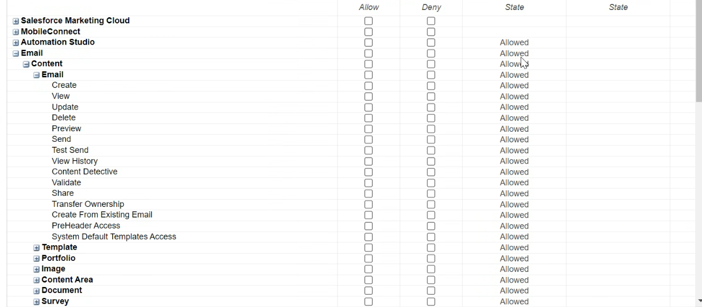

# [!DNL (API) Salesforce Marketing Cloud] 連線

## 概觀 {#overview}

[[!DNL (API) Salesforce Marketing Cloud]](https://www.salesforce.com/products/marketing-cloud/engagement/) (先前稱為 [!DNL ExactTarget])是數位行銷套件，可讓您建置和自訂訪客和客戶的歷程，以個人化其體驗。

>[!IMPORTANT]
>
>請注意此連線與其他連線之間的差異 [[!DNL Salesforce Marketing Cloud] 連線](/help/destinations/catalog/email-marketing/salesforce-marketing-cloud.md) 存在於電子郵件行銷目錄區段中的屬性。 另一個SalesforceMarketing Cloud連線可讓您將檔案匯出至指定的儲存位置，而此連線是以API為基礎的串流連線。

比較 [!DNL Salesforce Marketing Cloud Account Engagement] 更傾向於 **B2B** 行銷， [!DNL (API) Salesforce Marketing Cloud] 目的地適合 **B2C** 具有較短異動決策週期的使用案例。 您可以合併代表目標受眾行為的較大資料集，以調整及改善行銷活動，方法是優先順序並劃分聯絡人（尤其是來自外部資料集的聯絡人） [!DNL Salesforce]. *請注意，Experience Platform也有 [[!DNL Salesforce Marketing Cloud Account Engagement]](/help/destinations/catalog/email-marketing/salesforce-marketing-cloud-account-engagement.md).*

這個 [!DNL Adobe Experience Platform] [目的地](/help/destinations/home.md) 可運用 [!DNL Salesforce Marketing Cloud] [更新連絡人](https://developer.salesforce.com/docs/marketing/marketing-cloud/guide/updateContacts.html) API，可讓您 **新增聯絡人並更新聯絡人資料** 在新的網站中啟用後，即可滿足您的業務需求 [!DNL Salesforce Marketing Cloud] 區段。

[!DNL Salesforce Marketing Cloud] 使用具有使用者端憑證的OAuth 2作為驗證機制，與 [!DNL Salesforce Marketing Cloud] API。 向您的驗證指示 [!DNL Salesforce Marketing Cloud] 執行個體的詳細資訊如下： [驗證到目的地](#authenticate) 區段。

## 使用案例 {#use-cases}

為了協助您更清楚瞭解您應如何及何時使用 [!DNL (API) Salesforce Marketing Cloud] 目的地，以下是Adobe Experience Platform客戶可以使用此目的地解決的範例使用案例。

### 傳送電子郵件給行銷活動的連絡人 {#use-case-send-emails}

家用出租平台的銷售部門想要廣播行銷電子郵件給目標客戶對象。 平台的行銷團隊可以新增聯絡人/更新現有的聯絡人 *（及其電子郵件地址）* 透過Adobe Experience Platform，從對象的離線資料建立對象，並將這些對象傳送至 [!DNL Salesforce Marketing Cloud]，然後可用於傳送行銷活動電子郵件。

## 先決條件 {#prerequisites}

### Experience Platform的必要條件 {#prerequisites-in-experience-platform}

在將資料啟用至 [!DNL (API) Salesforce Marketing Cloud] 目的地，您必須擁有 [綱要](/help/xdm/schema/composition.md)， a [資料集](https://experienceleague.adobe.com/docs/platform-learn/tutorials/data-ingestion/create-datasets-and-ingest-data.html?lang=en)、和 [區段](https://experienceleague.adobe.com/docs/platform-learn/tutorials/segments/create-segments.html?lang=en) 建立於 [!DNL Experience Platform].

### 中的必要條件 [!DNL (API) Salesforce Marketing Cloud] {#prerequisites-destination}

若要將資料從Platform匯出至您的 [!DNL Salesforce Marketing Cloud] 帳戶：

#### 您需要擁有 [!DNL Salesforce Marketing Cloud] 帳戶 {#prerequisites-account}

A [!DNL Salesforce Marketing Cloud] 訂閱的帳戶 [[!DNL Marketing Cloud Engagement]](https://www.salesforce.com/products/marketing-cloud/engagement/) 產品必須執行才能繼續。

請聯絡 [[!DNL Salesforce] 支援](https://www.salesforce.com/company/contact-us/?d=cta-glob-footer-10) 如果您沒有 [!DNL Salesforce Marketing Cloud] 帳戶或您的帳戶缺少 [!DNL Marketing Cloud Engagement] 產品訂閱。

#### 在中建立屬性 [!DNL Salesforce Marketing Cloud] {#prerequisites-attribute}

將對象啟用至 [!DNL (API) Salesforce Marketing Cloud] 目的地，您必須在 **[!UICONTROL 對應ID]** 欄位中針對每個已啟用的對象， **[對象排程](#schedule-segment-export-example)** 步驟。

[!DNL Salesforce] 需要此值才能正確讀取和解讀來自Experience Platform的受眾，並在中更新其受眾狀態 [!DNL Salesforce Marketing Cloud]. 請參閱Experience Platform檔案以瞭解 [對象成員資格詳細資料結構欄位群組](/help/xdm/field-groups/profile/segmentation.md) 如果您需要對象狀態的指引。

針對您從Platform啟用的每個對象，設定為 [!DNL Salesforce Marketing Cloud]，您需要建立型別的屬性 `Text` 範圍 [!DNL Salesforce]. 使用 [!DNL Salesforce Marketing Cloud] [!DNL Contact Builder] 以建立屬性。 屬性欄位名稱用於 [!DNL (API) Salesforce Marketing Cloud] 期間的目標欄位 **[!UICONTROL 對應]** 步驟。 您可以根據業務需求定義最多4000個字元的欄位字元。 請參閱 [!DNL Salesforce Marketing Cloud] [資料擴充功能資料型別](https://help.salesforce.com/s/articleView?id=sf.mc_es_data_extension_data_types.htm&amp;type=5) 檔案頁面，以取得屬性型別的詳細資訊。

請參閱 [!DNL Salesforce Marketing Cloud] 檔案至 [建立屬性](https://help.salesforce.com/s/articleView?id=mc_cab_create_an_attribute.htm&amp;type=5&amp;language=en_US) 如果您需要有關建立屬性的指引。

中的資料設計工具畫面範例 [!DNL Salesforce Marketing Cloud]，您會將屬性新增至其中，如下所示：

檢視 [!DNL Salesforce Marketing Cloud] [!DNL Email Demographics] attribute-set如下所示：

此 [!DNL (API) Salesforce Marketing Cloud] 目的地使用 [!DNL Salesforce Marketing Cloud] [!DNL Search Attribute-Set Definitions REST] [API](https://developer.salesforce.com/docs/marketing/marketing-cloud/guide/retrieveAttributeSetDefinitions.html) 以動態擷取在中定義的屬性及其屬性集 [!DNL Salesforce Marketing Cloud].

這些標籤會顯示在 **[!UICONTROL 目標欄位]** 選取視窗 [對應](#mapping-considerations-example) 在工作流程中至 [對目的地啟用對象](#activate).

>[!IMPORTANT]
>
>範圍 [!DNL Salesforce Marketing Cloud]，您必須使用建立屬性 **[!UICONTROL 欄位名稱]** 完全符合中指定的值 **[!UICONTROL 對應ID]** 適用於每個已啟動的Platform區段。 例如，底下熒幕擷圖顯示名為的屬性 `salesforce_mc_segment_1`. 將對象啟用至此目的地時，新增 `salesforce_mc_segment_1` 作為 **[!UICONTROL 對應ID]** 將對象從Experience Platform填入此屬性中。

在中建立屬性的範例 [!DNL Salesforce Marketing Cloud]，如下所示：

>[!TIP]
>
>* 建立屬性時，請勿在欄位名稱中包含空白字元。 請改用底線 `(_)` 分隔符號的字元。
>* 若要區分用於Platform對象的屬性以及內的其他屬性 [!DNL Salesforce Marketing Cloud]，您可以為用於Adobe區段的屬性包含可辨識的前置詞或後置詞。 例如，不使用 `test_segment`，使用 `Adobe_test_segment` 或 `test_segment_Adobe`.
>* 如果您已在中建立其他屬性 [!DNL Salesforce Marketing Cloud]，您可以使用與平台區段相同的名稱，輕鬆識別中的對象 [!DNL Salesforce Marketing Cloud].

#### 在中指派使用者角色和許可權 [!DNL Salesforce Marketing Cloud] {#prerequisites-roles-permissions}

作為 [!DNL Salesforce Marketing Cloud] 支援自訂角色根據您的使用案例，應指派相關角色給您的使用者，以更新您內的屬性。 [!DNL Salesforce Marketing Cloud] 屬性集。 指派給使用者的角色範例如下所示：

視您的角色而定 [!DNL Salesforce Marketing Cloud] 使用者已指派，您也需要指派許可權給 [!DNL Salesforce Marketing Cloud] 屬性集，其中包含您要更新的欄位。

由於此目的地需要存取 `[!DNL attribute-set]`，您必須允許這些事件。 例如， `Email` [!DNL attribute-set] 您需要允許，如下所示：

若要限制存取層級，您也可以使用精細的許可權覆寫個別存取。

請參閱 [[!DNL Marketing Cloud Roles]](https://help.salesforce.com/s/articleView?language=en_US&amp;id=sf.mc_overview_marketing_cloud_roles.htm&amp;type=5) 和 [[!DNL Marketing Cloud Roles and Permissions]](https://help.salesforce.com/s/articleView?language=en_US&amp;id=sf.mc_overview_roles.htm&amp;type=5) 詳細指引頁面。

#### 彙總 [!DNL Salesforce Marketing Cloud] 認證 {#gather-credentials}

在驗證之前，請記下以下專案 [!DNL (API) Salesforce Marketing Cloud] 目的地。

| 認證 | 說明 | 範例 |
| --- | --- | --- |
| 子網域 | 另請參閱 [[!DNL Salesforce Marketing Cloud domain prefix]](https://developer.salesforce.com/docs/marketing/marketing-cloud/guide/your-subdomain-tenant-specific-endpoints.html) 以瞭解如何從取得此值 [!DNL Salesforce Marketing Cloud] 介面。 | 若您的 [!DNL Salesforce Marketing Cloud] 網域為  *`mcq4jrssqdlyc4lph19nnqgzzs84`.login.exacttarget.com*，  您需要提供 `mcq4jrssqdlyc4lph19nnqgzzs84` 做為值。 |
| 使用者端ID | 請參閱 [!DNL Salesforce Marketing Cloud] [檔案](https://developer.salesforce.com/docs/marketing/marketing-cloud/guide/access-token-s2s.html) 以瞭解如何從取得此值 [!DNL Salesforce Marketing Cloud] 介面。 | r23kxxxxxxxx0z05xxxxxx |
| 使用者端密碼 | 請參閱 [!DNL Salesforce Marketing Cloud] [檔案](https://developer.salesforce.com/docs/marketing/marketing-cloud/guide/access-token-s2s.html) 以瞭解如何從取得此值 [!DNL Salesforce Marketing Cloud] 介面。 | ipxxxxxxxxxxT4xxxxxxxxxx |

{style="table-layout:auto"}

### 護欄 {#guardrails}

* Salesforce強制特定 [速率限制](https://developer.salesforce.com/docs/marketing/marketing-cloud/guide/rate-limiting.html).
   * 請參閱 [!DNL Salesforce Marketing Cloud] [檔案](https://developer.salesforce.com/docs/marketing/marketing-cloud/guide/rate-limiting-errors.html) 以解決您可能會遇到的任何限制，並減少執行期間的錯誤。
   * 請參閱 [[!DNL Salesforce Marketing Cloud] 參與定價](https://www.salesforce.com/editions-pricing/marketing-cloud/email/) 頁面至 *下載完整版比較表* 以pdf格式顯示，詳細說明計畫所強加的限制。
   * 此 [API總覽](https://developer.salesforce.com/docs/marketing/marketing-cloud/guide/apis-overview.html) 頁面詳細說明其他限制。
   * 參考 [此處](https://salesforce.stackexchange.com/questions/205898/marketing-cloud-api-limits) 用於整理這些詳細資料的頁面。
* 計數 *每個物件允許的自訂欄位* 視您的Salesforce版本而定。
   * 請參閱 [!DNL Salesforce] [檔案](https://help.salesforce.com/s/articleView?id=sf.custom_field_allocations.htm&amp;type=5) 以取得其他指引。
   * 如果您已達到為定義的限制 *每個物件允許的自訂欄位* 範圍 [!DNL Salesforce Marketing Cloud] 您將需要
      * 在新增屬性之前移除較舊的屬性 [!DNL Salesforce Marketing Cloud].
      * 在Platform目的地更新或移除任何啟用對象，這些對象會使用這些較舊的屬性名稱作為所提供的值 **[!UICONTROL 對應ID]** 期間為 [對象排程](#schedule-segment-export-example) 步驟。

## 支援的身分 {#supported-identities}

[!DNL (API) Salesforce Marketing Cloud] 支援下表所述的身分啟用。 進一步瞭解 [身分](/help/identity-service/namespaces.md).

| 目標身分 | 說明 | 考量事項 |
|---|---|---|
| contactKey | [!DNL Salesforce Marketing Cloud] 連絡人金鑰。 請參閱 [!DNL Salesforce Marketing Cloud] [檔案](https://help.salesforce.com/s/articleView?id=sf.mc_cab_contact_builder_best_practices.htm&amp;type=5) 如果您需要其他指引。 | 必要 |

## 匯出型別和頻率 {#export-type-frequency}

請參閱下表以取得目的地匯出型別和頻率的資訊。

| 項目 | 類型 | 附註 |
---------|----------|---------|
| 匯出型別 | **[!UICONTROL 以設定檔為基礎]** | <ul><li>您正在匯出區段的所有成員，以及所需的結構欄位 *（例如：電子郵件地址、電話號碼、姓氏）*，根據您的欄位對應。</li><li> 中的每個區段狀態 [!DNL Salesforce Marketing Cloud] 會根據 **[!UICONTROL 對應ID]** 值期間提供 [對象排程](#schedule-segment-export-example) 步驟。</li></ul> |
| 匯出頻率 | **[!UICONTROL 串流]** | 串流目的地是「一律開啟」的API型連線。 一旦根據對象評估在Experience Platform中更新了設定檔，聯結器就會將更新傳送至下游的目的地平台。 深入瞭解 [串流目的地](/help/destinations/destination-types.md#streaming-destinations). |

{style="table-layout:auto"}

## 連線到目的地 {#connect}

>[!IMPORTANT]
>
>若要連線到目的地，您需要 **[!UICONTROL 管理目的地]** [存取控制許可權](/help/access-control/home.md#permissions). 閱讀 [存取控制總覽](/help/access-control/ui/overview.md) 或聯絡您的產品管理員以取得必要許可權。

若要連線至此目的地，請遵循以下說明的步驟： [目的地設定教學課程](../../ui/connect-destination.md). 在設定目標工作流程中，填寫以下兩個區段中列出的欄位。

範圍 **[!UICONTROL 目的地]** > **[!UICONTROL 目錄]**，搜尋 [!DNL (API) Salesforce Marketing Cloud]. 或者，您可以在 **[!UICONTROL 電子郵件行銷]** 類別。

### 驗證到目的地 {#authenticate}

若要向目的地進行驗證，請填寫以下必填欄位並選取 **[!UICONTROL 連線到目的地]**. 請參閱 [彙總 [!DNL Salesforce Marketing Cloud] 認證](#gather-credentials) 區段以取得任何指引。

| [!DNL (API) Salesforce Marketing Cloud] 目的地 | [!DNL Salesforce Marketing Cloud] |
| --- | --- |
| **[!UICONTROL 子網域]** | 您的 [!DNL Salesforce Marketing Cloud] 網域前置詞。  例如，如果您的網域為   *`mcq4jrssqdlyc4lph19nnqgzzs84`.login.exacttarget.com*，   您需要提供 `mcq4jrssqdlyc4lph19nnqgzzs84` 做為值。 |
| **[!UICONTROL 使用者端ID]** | 您的 [!DNL Salesforce Marketing Cloud] `Client ID`. |
| **[!UICONTROL 使用者端密碼]** | 您的 [!DNL Salesforce Marketing Cloud] `Client Secret`. |

如果提供的詳細資料有效，UI會顯示 **[!UICONTROL 已連線]** 狀態，並顯示綠色核取記號，您就可以繼續進行下一個步驟。

### 填寫目的地詳細資料 {#destination-details}

若要設定目的地的詳細資訊，請填寫下方的必填和選用欄位。 UI中欄位旁的星號表示該欄位為必填欄位。

* **[!UICONTROL 名稱]**：您日後可辨識此目的地的名稱。
* **[!UICONTROL 說明]**：可協助您日後識別此目的地的說明。

### 啟用警示 {#enable-alerts}

您可以啟用警報以接收有關傳送到您目的地的資料流狀態的通知。 從清單中選取警報以訂閱接收有關資料流狀態的通知。 如需警示的詳細資訊，請參閱以下指南： [使用UI訂閱目的地警報](../../ui/alerts.md).

當您完成提供目的地連線的詳細資訊時，請選取「 」 **[!UICONTROL 下一個]**.

## 啟用此目的地的對象 {#activate}

>[!IMPORTANT]
> 
>* 若要啟用資料，您需要 **[!UICONTROL 管理目的地]**， **[!UICONTROL 啟用目的地]**， **[!UICONTROL 檢視設定檔]**、和 **[!UICONTROL 檢視區段]** [存取控制許可權](/help/access-control/home.md#permissions). 閱讀 [存取控制總覽](/help/access-control/ui/overview.md) 或聯絡您的產品管理員以取得必要許可權。
>* 要匯出 *身分*，您需要 **[!UICONTROL 檢視身分圖表]** [存取控制許可權](/help/access-control/home.md#permissions).   {width="100" zoomable="yes"}

讀取 [將設定檔和受眾啟用至串流受眾匯出目標](/help/destinations/ui/activate-segment-streaming-destinations.md) 以取得啟用此目的地對象的指示。

### 對應考量事項和範例 {#mapping-considerations-example}

若要正確將對象資料從Adobe Experience Platform傳送至 [!DNL (API) Salesforce Marketing Cloud] 目的地，您必須進行欄位對應步驟。 對應包括在Platform帳戶中的Experience Data Model (XDM)結構描述欄位與來自目標目的地的對應對應專案之間建立連結。

若要正確將XDM欄位對應至 [!DNL (API) Salesforce Marketing Cloud] 目的地欄位，請遵循下列步驟。

>[!IMPORTANT]
>
>* 雖然您的屬性名稱將根據 [!DNL Salesforce Marketing Cloud] 帳戶，兩者的對應 `contactKey` 和 `personalEmail.address` 為必填欄位。
>
>* 與整合 [!DNL Salesforce Marketing Cloud] API受Experience Platform可從Salesforce擷取之屬性的分頁數限制。 這表示在 **[!UICONTROL 對應]** 步驟，目標欄位結構描述可以從您的Salesforce帳戶顯示最多2000個屬性。

1. 在 **[!UICONTROL 對應]** 步驟，選取 **[!UICONTROL 新增對應]**. 您會在畫面上看到新的對應列。
   
1. 在 **[!UICONTROL 選取來源欄位]** 視窗，選擇 **[!UICONTROL 選取屬性]** 類別並選取XDM屬性或選擇 **[!UICONTROL 選取身分名稱空間]** 並選取身分。
1. 在 **[!UICONTROL 選取目標欄位]** 視窗，選擇 **[!UICONTROL 選取身分名稱空間]** 並選取身分或選擇 **[!UICONTROL 選取屬性]** 分類，並視需要從顯示的屬性集中選取屬性。 此 [!DNL (API) Salesforce Marketing Cloud] 目的地使用 [!DNL Salesforce Marketing Cloud] [!DNL Search Attribute-Set Definitions REST] [API](https://developer.salesforce.com/docs/marketing/marketing-cloud/guide/retrieveAttributeSetDefinitions.html) 以動態擷取在中定義的屬性及其屬性集 [!DNL Salesforce Marketing Cloud]. 這些標籤會顯示在 **[!UICONTROL 目標欄位]** 當您設定 [對應](#mapping-considerations-example) 在 [啟用受眾工作流程](#activate).

   * 重複這些步驟，在您的XDM設定檔結構描述之間新增下列對應，並 [!DNL (API) Salesforce Marketing Cloud]：

     | 來源欄位 | 目標欄位 | 必要 |
     |---|---|---|
     | `IdentityMap: contactKey` | `Identity: salesforceContactKey` | `Mandatory` |
     | `xdm: person.name.firstName` | `Attribute: First Name` 從您想要的屬性集。 | - |
     | `xdm: personalEmail.address` | `Attribute: Email Address` 從您想要的屬性集。 | - |

   * 以下顯示使用這些對應的範例：
     

當您完成提供目的地連線的對應時，請選取 **[!UICONTROL 下一個]**.

### 排程對象匯出和範例 {#schedule-segment-export-example}

執行 [排程對象匯出](/help/destinations/ui/activate-segment-streaming-destinations.md#scheduling) 步驟，您必須手動將平台對象對應至 [屬性](#prerequisites-attribute) 在 [!DNL Salesforce Marketing Cloud].

若要這麼做，請選取每個區段，然後輸入屬性名稱，從 [!DNL Salesforce Marketing Cloud] 在 [!DNL (API) Salesforce Marketing Cloud] **[!UICONTROL 對應ID]** 欄位。 請參閱 [在中建立屬性 [!DNL Salesforce Marketing Cloud]](#prerequisites-custom-field) 區段，瞭解在中建立屬性的相關指引和最佳作法 [!DNL Salesforce Marketing Cloud].

例如，如果您的 [!DNL Salesforce Marketing Cloud] 屬性為 `salesforce_mc_segment_1`，請在 [!DNL (API) Salesforce Marketing Cloud] **[!UICONTROL 對應ID]** 將對象從Experience Platform填入此屬性中。

範例屬性來自 [!DNL Salesforce Marketing Cloud] 如下所示：

指示位置的 [!DNL (API) Salesforce Marketing Cloud] **[!UICONTROL 對應ID]** 如下所示：

如所示 [!DNL (API) Salesforce Marketing Cloud] **[!UICONTROL 對應ID]** 應該完全符合中指定的值 [!DNL Salesforce Marketing Cloud] **[!UICONTROL 欄位名稱]**.

對每個已啟動的Platform區段重複此章節。

根據您的使用案例，所有已啟用的對象皆可對映至相同對象 [!DNL Salesforce Marketing Cloud] **[!UICONTROL 欄位名稱]** 或變更為其他 **[!UICONTROL 欄位名稱]** 在 [!DNL (API) Salesforce Marketing Cloud]. 以上圖影像為基礎的典型範例可能是。
| [!DNL (API) Salesforce Marketing Cloud] 區段名稱 | [!DNL Salesforce Marketing Cloud] **[!UICONTROL 欄位名稱]** | [!DNL (API) Salesforce Marketing Cloud] **[!UICONTROL 對應ID]** | | — | — | — | | salesforce mc audience 1 | `salesforce_mc_segment_1` | `salesforce_mc_segment_1` | | salesforce mc audience 2 | `salesforce_mc_segment_2` | `salesforce_mc_segment_2` |

## 驗證資料匯出 {#exported-data}

若要驗證您是否已正確設定目的地，請遵循下列步驟：

1. 選取 **[!UICONTROL 目的地]** > **[!UICONTROL 瀏覽]** 以導覽至目的地清單。
   

1. 選取目的地並驗證狀態是否為 **[!UICONTROL 已啟用]**.
   

1. 切換至 **[!DNL Activation data]** 標籤，然後選取對象名稱。
   

1. 監控對象摘要，並確保設定檔計數對應於在區段內建立的計數。
   

1. 登入 [[!DNL Salesforce Marketing Cloud]](https://mc.exacttarget.com/) 網站。 然後導覽至 **[!DNL Audience Builder]** > **[!DNL Contact Builder]** > **[!DNL All contacts]** > **[!DNL Email]** 頁面，並檢查是否已新增對象中的設定檔。
   

1. 若要檢查是否有任何設定檔已更新，請導覽至 **[!UICONTROL 電子郵件]** 頁面，並驗證對象的設定檔屬性值是否已更新。 如果成功，您可以在中看到每個受眾狀態 [!DNL Salesforce Marketing Cloud] 已根據「 」更新Platform中的對應對象狀態 **[!UICONTROL 對應ID]** 提供的值 [對象排程](#schedule-segment-export-example) 步驟。
   

## 資料使用與控管 {#data-usage-governance}

全部 [!DNL Adobe Experience Platform] 處理您的資料時，目的地符合資料使用原則。 如需如何操作的詳細資訊 [!DNL Adobe Experience Platform] 強制執行資料控管，請參閱 [資料控管概觀](/help/data-governance/home.md).

## 錯誤與疑難排解 {#errors-and-troubleshooting}

### 將事件推送到SalesforceMarketing Cloud時遇到未知錯誤 {#unknown-errors}

* 檢查資料流執行時，您可能會遇到下列錯誤訊息： `Unknown errors encountered while pushing events to the destination. Please contact the administrator and try again.`
  

   * 若要修正此錯誤，請確認 **[!UICONTROL 對應ID]** 您在啟動工作流程中提供的資料給 [!DNL (API) Salesforce Marketing Cloud] 目的地與您在中建立的屬性名稱完全相符 [!DNL Salesforce Marketing Cloud]. 請參閱 [在中建立屬性 [!DNL Salesforce Marketing Cloud]](#prerequisites-custom-field) 區段以取得指引。

* 啟用區段時，您可能會收到錯誤訊息： `The client's IP address is unauthorized for this account. Allowlist the client's IP address...`
   * 若要修正此錯誤，請連絡您的 [!DNL Salesforce Marketing Cloud] 要新增的帳戶管理員 [Experience PlatformIP位址](/help/destinations/catalog/streaming/ip-address-allow-list.md) 至您的 [!DNL Salesforce Marketing Cloud] 帳戶的受信任IP範圍。 請參閱 [!DNL Salesforce Marketing Cloud] [要包含在Marketing Cloud允許清單中的IP位址](https://help.salesforce.com/s/articleView?id=sf.mc_es_ip_addresses_for_inclusion.htm&amp;type=5) 說明檔案（若您需要其他指引）。

## 其他資源 {#additional-resources}

* [!DNL Salesforce Marketing Cloud] [API](https://developer.salesforce.com/docs/marketing/marketing-cloud/guide/apis-overview.html)
* [!DNL Salesforce Marketing Cloud] [檔案](https://developer.salesforce.com/docs/marketing/marketing-cloud/guide/updateContacts.html) 說明如何使用指定屬性群組中的指定資訊來更新連絡人。

### Changelog {#changelog}

本節擷取此目的地聯結器的功能和重要檔案更新。

+++ 檢視變更記錄檔

| 發行月份 | 更新型別 | 說明 |
|---|---|---|
| 2023 年 4 月 | 檔案更新 | <ul><li>我們已更正 [(API) SalesforceMarketing Cloud的必要條件](#prerequisites-destination) 區段以標示 [!DNL Salesforce Marketing Cloud Engagement] 是使用此目的地的必要訂閱。 區段先前錯誤地指出使用者需要訂閱Marketing Cloud **帳戶** 參與以繼續。</li> <li>我們在「 」下新增了區段 [必備條件](#prerequisites) 的 [角色與許可權](#prerequisites-roles-permissions) 將指派給 [!DNL Salesforce] 讓此目的地正常運作的使用者。 (PLATIR-26299)</li></ul> |
| 2023 年 2 月 | 檔案更新 | 我們已更新 [(API) SalesforceMarketing Cloud的必要條件](#prerequisites-destination) 區段，加入向外呼叫的參考連結 [!DNL Salesforce Marketing Cloud Engagement] 是使用此目的地的必要訂閱。 |
| 2023 年 2 月 | 功能更新 | 已修正目的地中不正確的設定導致將格式錯誤的JSON傳送至Salesforce的問題。 這會導致某些使用者在啟用時看到大量身分失敗。 (PLATIR-26299) |
| 2023 年 1 月 | 檔案更新 | <ul><li>我們已更新 [中的必要條件 [!DNL Salesforce]](#prerequisites-destination) 區段來標註需要在上建立屬性 [!DNL Salesforce] 側。 本節現在包含如何執行此動作的詳細指示，以及命名中屬性的最佳作法 [!DNL Salesforce]. (PLATIR-25602)</li><li>我們新增了明確指示，說明如何在中為每個已啟用的對象使用對應ID [對象排程](#schedule-segment-export-example) 步驟。 (PLATIR-25602)</li></ul> |
| 2022 年 10 月 | 首次發行 | 初始目的地版本和檔案發佈。 |

{style="table-layout:auto"}

+++
