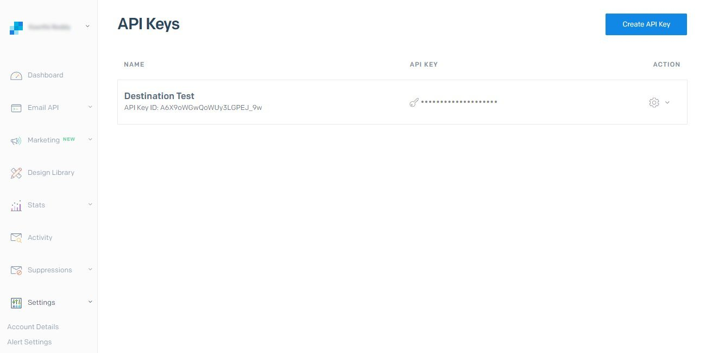

# [!DNL SendGrid]個連線

## 概觀 {#overview}

[SendGrid](https://www.sendgrid.com)是交易和行銷電子郵件的熱門客戶通訊平台。

此[!DNL Adobe Experience Platform] [目的地](/help/destinations/home.md)利用[[!DNL SendGrid Marketing Contacts API]](https://api.sendgrid.com/v3/marketing/contacts)，可讓您匯出第一方電子郵件設定檔，並在新的SendGrid對象中啟用這些設定檔，以滿足您的業務需求。

SendGrid使用API持有人權杖作為驗證機制，與SendGrid API通訊。

## 先決條件 {#prerequisites}

開始設定目的地之前，需要下列專案。

1. 您必須有SendGrid帳戶。
   * 移至SendGrid [註冊](https://signup.sendgrid.com/)頁面，註冊並建立SendGrid帳戶（如果尚未建立）。
1. 登入SendGrid入口網站後，您還需要產生API權杖。
1. 導覽至SendGrid網站並存取&#x200B;**[!DNL Settings]** > **[!DNL API Keys]**&#x200B;頁面。 或者，請參閱[SendGrid檔案](https://app.sendgrid.com/settings/api_keys)以存取SendGrid應用程式中的適當區段。
1. 最後，選取&#x200B;**[!DNL Create API Key]**&#x200B;按鈕。
   * 如需執行哪些動作的指引，請參閱[SendGrid檔案](https://docs.sendgrid.com/ui/account-and-settings/api-keys#creating-an-api-key)。
   * 如果您想要以程式設計方式產生API金鑰，請參閱[SendGrid檔案](https://docs.sendgrid.com/api-reference/api-keys/create-api-keys)。

在啟用資料到SendGrid目的地之前，您必須在[!DNL Experience Platform]中建立[結構描述](https://experienceleague.adobe.com/docs/experience-platform/xdm/schema/composition.html?lang=zh-Hant)、[資料集](https://experienceleague.adobe.com/docs/platform-learn/tutorials/data-ingestion/create-datasets-and-ingest-data.html?lang=zh-Hant)和[區段](https://experienceleague.adobe.com/docs/platform-learn/tutorials/segments/create-segments.html?lang=zh-Hant)。 另請參閱此頁面下方的[限制](#limits)區段。

>[!IMPORTANT]
>
>* 用於從電子郵件設定檔建立郵寄清單的SendGrid API要求在每個設定檔中提供唯一的電子郵件地址。 無論其用作&#x200B;*電子郵件*&#x200B;或&#x200B;*備用電子郵件*&#x200B;的值，皆不適用。 由於SendGrid連線支援電子郵件和備用電子郵件值的對應，請確定在&#x200B;*資料集*&#x200B;的每個設定檔中，使用的所有電子郵件地址都應該是唯一的。 否則，將電子郵件設定檔傳送至SendGrid時，將會導致錯誤，且該電子郵件設定檔將不會出現在資料匯出中。
>
>* 目前，從Experience Platform的對象中移除設定檔時，無法從SendGrid移除設定檔。

## 支援的身分 {#supported-identities}

SendGrid支援如下表所述的身分啟用。 深入瞭解[身分](/help/identity-service/features/namespaces.md)。

| 目標身分 | 說明 | 考量事項 |
|---|---|---|
| 電子郵件 | 電子郵件地址 | 請注意，[!DNL Adobe Experience Platform]同時支援純文字和SHA256雜湊電子郵件地址。 如果Experience Platform來源欄位包含未雜湊的屬性，請核取&#x200B;**[!UICONTROL 套用轉換]**&#x200B;選項，讓[!DNL Experience Platform]在啟用時自動雜湊資料。  請注意，**SendGrid**&#x200B;不支援雜湊電子郵件地址，所以只會將純文字資料傳送至目的地，而不進行轉換。 |

{style="table-layout:auto"}

## 匯出型別和頻率 {#export-type-frequency}

請參閱下表以取得目的地匯出型別和頻率的資訊。

| 項目 | 類型 | 附註 |
---------|----------|---------|
| 匯出類型 | **[!UICONTROL 以設定檔為基礎]** | 您正在匯出區段的所有成員，以及所需的結構描述欄位（例如：電子郵件地址、電話號碼、姓氏），如[目的地啟用工作流程](/help/destinations/ui/activate-batch-profile-destinations.md#select-attributes)的選取設定檔屬性畫面中所選。 |
| 匯出頻率 | **[!UICONTROL 串流]** | 串流目的地是「一律開啟」的API型連線。 根據對象評估在Experience Platform中更新設定檔後，聯結器會立即將更新傳送至下游的目標平台。 深入瞭解[串流目的地](/help/destinations/destination-types.md#streaming-destinations)。 |

{style="table-layout:auto"}

## 使用案例 {#use-cases}

為了協助您更清楚瞭解您應如何及何時使用SendGrid目的地，以下是[!DNL Experience Platform]客戶可以使用此目的地解決的範例使用案例。

### 為多個行銷活動建立行銷清單

使用SendGrid的行銷團隊可以在SendGrid內建立郵寄清單，並填入電子郵件地址。 現在於SendGrid內建立的郵寄清單可隨後用於多個行銷活動。

## 連線到目的地 {#connect}

>[!IMPORTANT]
> 
>若要連線到目的地，您需要&#x200B;**[!UICONTROL 檢視目的地]**&#x200B;和&#x200B;**[!UICONTROL 管理目的地]** [存取控制許可權](/help/access-control/home.md#permissions)。 閱讀[存取控制總覽](/help/access-control/ui/overview.md)或連絡您的產品管理員以取得必要的許可權。

若要連線到此目的地，請依照[目的地組態教學課程](../../ui/connect-destination.md)中所述的步驟進行。 在設定目標工作流程中，填寫以下兩個區段中列出的欄位。

### 驗證目標 {#authenticate}

1. 在[!DNL Adobe Experience Platform]主控台中，導覽至&#x200B;**目的地**。

1. 選取&#x200B;**目錄**&#x200B;索引標籤並搜尋&#x200B;*SendGrid*。 然後選取&#x200B;**設定**。 在您建立與目的地的連線後，UI標籤會變更為&#x200B;**啟用區段**。
   

1. 系統會顯示精靈，協助您設定SendGrid目的地。 選取&#x200B;**設定新的目的地**，以建立新的目的地。
   

1. 選取&#x200B;**新帳戶**&#x200B;選項並填入&#x200B;**持有人權杖**&#x200B;值。 此值是先前在[必要條件區段](#prerequisites)中提及的SendGrid *API金鑰*。
   

1. 選取&#x200B;**連線到目的地**。 如果您提供的SendGrid *API金鑰*&#x200B;有效，UI會以綠色勾號顯示&#x200B;**已連線**&#x200B;狀態，然後您可以繼續下一個步驟以填寫其他資訊欄位。

### 填寫目標詳細資訊 {#destination-details}

在[設定](https://experienceleague.adobe.com/docs/experience-platform/destinations/ui/connect-destination.html?lang=zh-Hant)此目的地時，您必須提供下列資訊：

* **[!UICONTROL 名稱]**：您日後識別此目的地所使用的名稱。
* **[!UICONTROL 描述]**：可協助您日後識別此目的地的可選描述。

### 啟用警示 {#enable-alerts}

您可以啟用警報以接收有關傳送到您目的地的資料流狀態的通知。 從清單中選取警報以訂閱接收有關資料流狀態的通知。 如需警示的詳細資訊，請參閱[使用UI訂閱目的地警示](../../ui/alerts.md)的指南。

當您完成提供目的地連線的詳細資訊後，請選取&#x200B;**[!UICONTROL 下一步]**。

## 啟動此目標的對象 {#activate}

>[!IMPORTANT]
> 
>* 若要啟用資料，您需要&#x200B;**[!UICONTROL 檢視目的地]**、**[!UICONTROL 啟用目的地]**、**[!UICONTROL 檢視設定檔]**&#x200B;和&#x200B;**[!UICONTROL 檢視區段]** [存取控制許可權](/help/access-control/home.md#permissions)。 閱讀[存取控制總覽](/help/access-control/ui/overview.md)或連絡您的產品管理員以取得必要的許可權。
>* 若要匯出&#x200B;*身分*，您需要&#x200B;**[!UICONTROL 檢視身分圖表]** [存取控制許可權](/help/access-control/home.md#permissions)。  {width="100" zoomable="yes"}

閱讀[將設定檔和對象啟用至串流對象匯出目的地](/help/destinations/ui/activate-segment-streaming-destinations.md)，以瞭解啟用此目的地對象的指示。

如需此目的地的特定詳細資訊，請參閱下列影像。

1. 選取一或多個要匯出至SendGrid的對象。
   

1. 在&#x200B;**[!UICONTROL 對應]**&#x200B;步驟中，選取&#x200B;**[!UICONTROL 新增對應]**&#x200B;後，您會看到對應頁面，以將來源XDM欄位對應到SendGrid API目標欄位。 下圖示範如何在Experience Platform和SendGrid之間對應身分識別名稱空間。 請確定&#x200B;**[!UICONTROL Source欄位]** *電子郵件*&#x200B;應該對應至&#x200B;**[!UICONTROL 目標欄位]** *external_id*，如下所示。
   
   
   
   

1. 同樣地，對應您要匯出至SendGrid目的地的所需[!DNL Adobe Experience Platform]屬性。
   
   

1. 完成對應後，選取&#x200B;**[!UICONTROL 下一步]**&#x200B;以進入檢閱畫面。
   

1. 選取&#x200B;**[!UICONTROL 完成]**&#x200B;以完成設定。
   

可為[SendGrid行銷連絡人>新增或更新連絡人API](https://docs.sendgrid.com/api-reference/contacts/add-or-update-a-contact)設定的支援屬性對應完整清單如下。

| 來源欄位 | 目標欄位 | 類型 | 說明 | 限制 |
|---|---|---|---|---|
| xdm：  homeAddress.street1 | xdm：  address_line_1 | 字串 | 地址的第一行。 | 最大長度：  100個字元 |
| xdm：  homeAddress.street2 | xdm：  address_line_2 | 字串 | 位址的選擇性第二行。 | 最大長度：  100個字元 |
| xdm：  _extconndev.alternate_emails | xdm： 封備用電子郵件 | 字串陣列 | 和聯絡人相關聯的其他電子郵件。 | <ul><li>最多5個專案</li><li>最小值：0個專案</li></ul> |
| xdm：  homeAddress.city | xdm： 城市 | 字串 | 連絡人的城市。 | 最大長度：  60個字元 |
| xdm：  homeAddress.country | xdm： 國家/地區 | 字串 | 連絡人的國家/地區。 可以是全名或縮寫。 | 最大長度：  50個字元 |
| identityMap： 電子郵件 | 身分：  external_id | 字串 | 連絡人的主要電子郵件。 這必須是有效的電子郵件。 | 最大長度：  254個字元 |
| xdm： 人員。名稱。名字 | xdm：  first_name | 字串 | 連絡人姓名 | 最大長度：  50個字元 |
| xdm：  person.name.lastName | xdm：  last_name | 字串 | 連絡人的姓氏 | 最大長度：  50個字元 |
| xdm：  homeAddress.postalCode | xdm：  postal_code | 字串 | 連絡人的郵遞區號或其他郵遞區號。 | |
| xdm：  homeAddress.stateProvince | xdm：  state_providle_region | 字串 | 連絡人的州、省或地區。 | 最大長度：  50個字元 |

## 驗證SendGrid中的資料匯出 {#validate}

若要驗證您是否已正確設定目的地，請遵循下列步驟：

1. 選取&#x200B;**[!UICONTROL 目的地]** > **[!UICONTROL 瀏覽]**&#x200B;以瀏覽目的地清單。
   

1. 選取目的地並驗證狀態為&#x200B;**[!UICONTROL 已啟用]**。
   

1. 切換至&#x200B;**[!DNL Activation data]**&#x200B;標籤，然後選取對象名稱。
   

1. 監視對象摘要，並檢查與資料集中建立的計數對應的設定檔計數。
   

1. [SendGrid行銷清單>建立清單API](https://docs.sendgrid.com/api-reference/lists/create-list)是用來在SendGrid中建立唯一的連絡人清單，方法是加入&#x200B;*list_name*屬性的值和資料匯出的時間戳記。 導覽至SendGrid網站，並檢查是否建立了符合名稱模式的新連絡人清單。
   
   

1. 選取新建立的連絡人清單，並檢查您是否將來自您建立之資料集的新電子郵件記錄填入新連絡人清單中。

1. 此外，也檢查一些電子郵件以驗證欄位對應是否正確。
   
   

## 資料使用與控管 {#data-usage-governance}

處理您的資料時，所有[!DNL Adobe Experience Platform]目的地都符合資料使用原則。 如需[!DNL Adobe Experience Platform]如何強制資料控管的詳細資訊，請參閱[資料控管概觀](/help/data-governance/home.md)。

## 其他資源 {#additional-resources}

此SendGrid目的地會利用以下API：
* [SendGrid行銷清單>建立清單API](https://docs.sendgrid.com/api-reference/lists/create-list)
* [SendGrid行銷連絡人>新增或更新連絡人API](https://docs.sendgrid.com/api-reference/contacts/add-or-update-a-contact)

### 限制 {#limits}

* [SendGrid行銷連絡人>新增或更新連絡人API](https://api.sendgrid.com/v3/marketing/contacts)可以接受30,000個連絡人，或6MB的資料（以較低者為準）。
