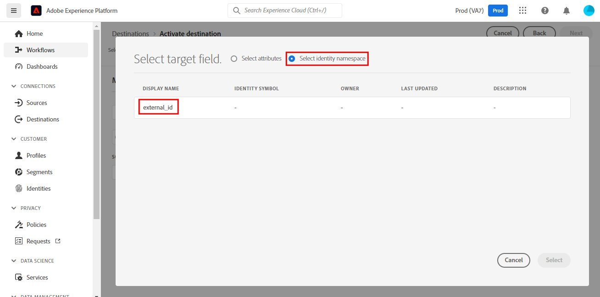

# [!DNL SendGrid] 連接

## 總覽 {#overview}

[SendGrid](https://www.sendgrid.com) 是交易和行銷電子郵件的熱門客戶通訊平台。

此 [!DNL Adobe Experience Platform] [目的地](/help/destinations/home.md) 利用 [[!DNL SendGrid Marketing Contacts API]](https://api.sendgrid.com/v3/marketing/contacts)，可讓您匯出第一方電子郵件設定檔，並在新的SendGrid區段中根據您的業務需求啟用這些設定檔。

SendGrid使用API承載權杖作為驗證機制，與SendGrid API通訊。

## 先決條件 {#prerequisites}

開始設定目的地前，需要下列項目。

1. 您需要有SendGrid帳戶。
   * 前往SendGrid [註冊](https://signup.sendgrid.com/) 頁，註冊並建立SendGrid帳戶（如果尚未建立）。
1. 登入SendGrid入口網站後，您也需要產生API代號。
1. 導覽至SendGrid網站並存取 **[!DNL Settings]** > **[!DNL API Keys]** 頁面。 或者，請參閱 [SendGrid文檔](https://app.sendgrid.com/settings/api_keys) 來存取SendGrid應用程式中的適當區段。
1. 最後，選取 **[!DNL Create API Key]** 按鈕。
   * 請參閱 [SendGrid文檔](https://docs.sendgrid.com/ui/account-and-settings/api-keys#creating-an-api-key)，若您需要要執行的動作相關指引。
   * 若要以程式設計方式產生API金鑰，請參閱 [SendGrid文檔](https://docs.sendgrid.com/api-reference/api-keys/create-api-keys).

在將資料激活到SendGrid目標之前，您必須具有 [綱要](https://experienceleague.adobe.com/docs/experience-platform/xdm/schema/composition.html?lang=zh-Hant), [資料集](https://experienceleague.adobe.com/docs/platform-learn/tutorials/data-ingestion/create-datasets-and-ingest-data.html?lang=en)，和 [區段](https://experienceleague.adobe.com/docs/platform-learn/tutorials/segments/create-segments.html?lang=en) 建立於 [!DNL Experience Platform]. 另請參閱 [限制](#limits) 下一節。

>[!IMPORTANT]
>
>* 用於從電子郵件設定檔建立郵件清單的SendGrid API要求在每個設定檔中提供唯一的電子郵件地址。 這無論其是否用作 *電子郵件* 或 *替代電子郵件*. 由於SendGrid連接支援電子郵件值和替代電子郵件值的映射，因此請確保所使用的所有電子郵件地址在的每個配置檔案中應是唯一的 *資料集*. 否則，當電子郵件設定檔傳送至SendGrid時，將會導致錯誤，且該電子郵件設定檔將不會存在於資料匯出中。
>
>* 目前，從Experience Platform的區段移除設定檔時，無法從SendGrid中移除設定檔。

## 支援的身分 {#supported-identities}

SendGrid支援激活下表中所述的身份。 深入了解 [身分](/help/identity-service/namespaces.md).

| Target身分 | 說明 | 考量事項 |
|---|---|---|
| 電子郵件 | 電子郵件地址 | 請注意，支援純文字和SHA256雜湊電子郵件地址， [!DNL Adobe Experience Platform]. 如果Experience Platform來源欄位包含未雜湊的屬性，請核取 **[!UICONTROL 套用轉換]** 選項，必須 [!DNL Platform] 啟動時自動雜湊資料。   請注意 **SendGrid** 不支援雜湊電子郵件地址，因此只有不含轉換的純文字資料會傳送至目的地。 |

{style="table-layout:auto"}

## 匯出類型和頻率 {#export-type-frequency}

有關目標導出類型和頻率的資訊，請參閱下表。

| 項目 | 類型 | 附註 |
---------|----------|---------|
| 匯出類型 | **[!UICONTROL 設定檔]** | 您要匯出區段的所有成員，以及所需的結構欄位(例如：電子郵件地址、電話號碼、姓氏)，如「選取設定檔屬性」畫面中所選 [目的地啟動工作流程](/help/destinations/ui/activate-batch-profile-destinations.md#select-attributes). |
| 匯出頻率 | **[!UICONTROL 串流]** | 串流目的地是「一律開啟」API型連線。 一旦根據區段評估在Experience Platform中更新設定檔，連接器就會將更新傳送至下游的目的地平台。 深入了解 [串流目的地](/help/destinations/destination-types.md#streaming-destinations). |

{style="table-layout:auto"}

## 使用案例 {#use-cases}

為協助您更清楚了解應如何及何時使用SendGrid目的地，以下是範例使用案例 [!DNL Experience Platform] 客戶可透過此目的地來解析。

### 為多個行銷活動建立行銷清單

使用SendGrid的行銷團隊可在SendGrid中建立郵件清單，並填入電子郵件地址。 現在於SendGrid中建立的郵件清單隨後可用於多個行銷活動。

## 連接到目標 {#connect}

>[!IMPORTANT]
> 
>若要連線至目的地，您需要 **[!UICONTROL 管理目的地]** [存取控制權限](/help/access-control/home.md#permissions). 閱讀 [存取控制概觀](/help/access-control/ui/overview.md) 或聯絡您的產品管理員以取得所需的權限。

若要連線至此目的地，請依照 [目的地設定教學課程](../../ui/connect-destination.md). 在設定目標工作流程中，填寫下列兩節所列的欄位。

### 驗證到目標 {#authenticate}

1. 在 [!DNL Adobe Experience Platform] 主控台，導覽至 **目的地**.

1. 選取 **目錄** 標籤和搜尋 *SendGrid*. 然後選取 **設定**. 建立與目的地的連線後，UI標籤會變更為 **啟用區段**.
   

1. 系統會向您顯示精靈，協助您設定SendGrid目的地。 透過選取 **配置新目標**.
   

1. 選取 **新帳戶** 選項並填入 **承載令牌** 值。 此值是SendGrid *API金鑰* 先前在 [必要條件一節](#prerequisites).
   

1. 選擇 **連接到目標**. 如果SendGrid *API金鑰* 您提供的有效，則UI會顯示 **已連接** 狀態（加上綠色核取記號），您就可以繼續進行下一個步驟，以填入其他資訊欄位。

### 填寫目的地詳細資訊 {#destination-details}

同時 [設定](https://experienceleague.adobe.com/docs/experience-platform/destinations/ui/connect-destination.html?lang=en) 此目的地時，您必須提供下列資訊：

* **[!UICONTROL 名稱]**:日後您將據以識別此目的地的名稱。
* **[!UICONTROL 說明]**:此選用說明可協助您日後識別此目的地。

### 啟用警報 {#enable-alerts}

您可以啟用警報，接收有關資料流到目標狀態的通知。 從清單中選擇要訂閱的警報，以接收有關資料流狀態的通知。 如需警報的詳細資訊，請參閱 [使用UI訂閱目的地警報](../../ui/alerts.md).

完成提供目標連接的詳細資訊後，請選擇 **[!UICONTROL 下一個]**.

## 啟用此目的地的區段 {#activate}

>[!IMPORTANT]
> 
>若要啟用資料，您需要 **[!UICONTROL 管理目的地]**, **[!UICONTROL 啟動目的地]**, **[!UICONTROL 檢視設定檔]**，和 **[!UICONTROL 檢視區段]** [存取控制權限](/help/access-control/home.md#permissions). 閱讀 [存取控制概觀](/help/access-control/ui/overview.md) 或聯絡您的產品管理員以取得所需的權限。

閱讀 [啟動設定檔和區段至串流區段匯出目的地](/help/destinations/ui/activate-segment-streaming-destinations.md) 以取得啟用受眾區段至此目的地的指示。

如需此目的地的特定詳細資訊，請參閱下列影像。

1. 選取一或多個要匯出至SendGrid的區段。
   

1. 在 **[!UICONTROL 對應]** 步驟，在選取 **[!UICONTROL 新增對應]**，會顯示「對應」頁面，將來源XDM欄位對應至SendGrid API目標欄位。 下圖示範如何在Experience Platform和SendGrid之間對應身分識別命名空間。 請確保 **[!UICONTROL 源欄位]** *電子郵件* 應對應至 **[!UICONTROL 目標欄位]** *external_id* 如下所示。
   

   
   
   

1. 同樣地，對應所需 [!DNL Adobe Experience Platform] 要導出到SendGrid目標的屬性。
   

   

1. 完成對應後，請選取 **[!UICONTROL 下一個]** 前進至審核螢幕。
   

1. 選擇 **[!UICONTROL 完成]** 以完成設定。
   

可為 [SendGrid行銷連絡人>新增或更新連絡人API](https://docs.sendgrid.com/api-reference/contacts/add-or-update-a-contact) 在下方。

| 源欄位 | 目標欄位 | 類型 | 說明 | 限制 |
|---|---|---|---|---|
| xdm:  homeAddress.street1 | xdm:  address_line_1 | 字串 | 地址的第一行。 | 最大長度：  100個字元 |
| xdm:  homeAddress.street2 | xdm:  address_line_2 | 字串 | 地址的可選第二行。 | 最大長度：  100個字元 |
| xdm:  _extcondev.alternate_emails | xdm:  alternate_emails | 字串陣列 | 與該聯繫人相關聯的其他電子郵件。 | <ul><li>最大：5件</li><li>最小值：0件</li></ul> |
| xdm:  homeAddress.city | xdm:  city | 字串 | 聯繫人的城市。 | 最大長度：  60個字元 |
| xdm:  homeAddress.country | xdm:  國家 | 字串 | 聯繫人的國家。 可以是全名或縮寫。 | 最大長度：  50個字元 |
| identityMap:  電子郵件 | 身份：  external_id | 字串 | 連絡人的主要電子郵件。 這必須是有效的電子郵件。 | 最大長度：  254個字元 |
| xdm:  person.name.firstName | xdm:  first_name | 字串 | 聯繫人的姓名 | 最大長度：  50個字元 |
| xdm:  person.name.lastName | xdm:  last_name | 字串 | 聯繫人的姓 | 最大長度：  50個字元 |
| xdm:  homeAddress.postalCode | xdm:  postal_code | 字串 | 聯絡人的郵遞區號或其他郵遞區號。 |  |
| xdm:  homeAddress.stateProvice | xdm:  state_province_region | 字串 | 聯繫人的州、省或地區。 | 最大長度：  50個字元 |

## 驗證SendGrid中的資料導出 {#validate}

若要驗證您是否已正確設定目的地，請遵循下列步驟：

1. 選擇 **[!UICONTROL 目的地]** > **[!UICONTROL 瀏覽]** 導覽至目的地清單。
   

1. 選取目標並驗證狀態為 **[!UICONTROL 已啟用]**.
   

1. 切換至 **[!DNL Activation data]** ，然後選取區段名稱。
   

1. 監控區段摘要，並檢查設定檔計數與資料集內建立的計數相對應。
   

1. 此 [SendGrid行銷清單>建立清單API](https://docs.sendgrid.com/api-reference/lists/create-list) 用於通過聯接的 *list_name* 屬性和資料匯出的時間戳記。 導航到SendGrid站點，檢查是否建立了符合名稱模式的新聯繫人清單。
   

   

1. 選擇新建立的聯繫人清單，並檢查新聯繫人清單中是否填充了您建立的資料集中的新電子郵件記錄。

1. 此外，也請檢查幾封電子郵件，以驗證欄位對應是否正確。
   

   

## 資料使用與控管 {#data-usage-governance}

全部 [!DNL Adobe Experience Platform] 處理資料時，目的地符合資料使用原則。 有關如何 [!DNL Adobe Experience Platform] 強制實施資料控管，請參閱 [資料控管概觀](/help/data-governance/home.md).

## 其他資源 {#additional-resources}

此SendGrid目標利用以下API:
* [SendGrid行銷清單>建立清單API](https://docs.sendgrid.com/api-reference/lists/create-list)
* [SendGrid行銷連絡人>新增或更新連絡人API](https://docs.sendgrid.com/api-reference/contacts/add-or-update-a-contact)

### 限制 {#limits}

* 此 [SendGrid行銷連絡人>新增或更新連絡人API](https://api.sendgrid.com/v3/marketing/contacts) 可以接受30,000個聯繫人，或6MB資料（以較低者為準）。
