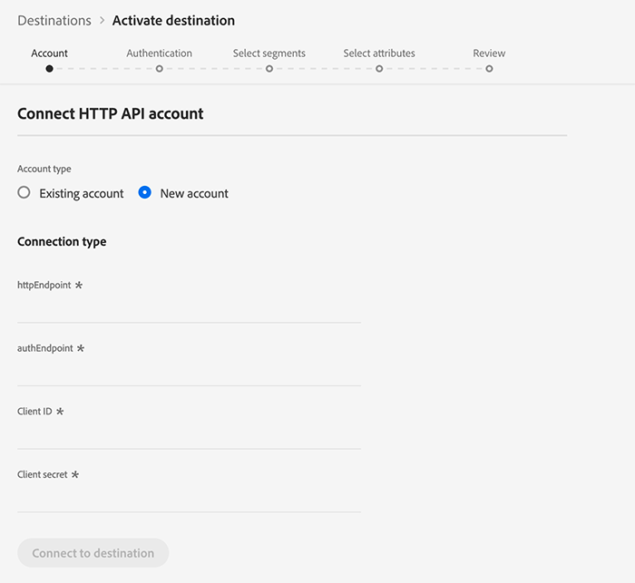

# (Alpha)[!DNL HTTP]連接

>[!IMPORTANT]
>
>平台中的[!DNL HTTP]目標當前位於alpha。 文件和功能可能會有所變更。

## 概述 {#overview}

[!DNL HTTP]目的地是[!DNL Adobe Experience Platform]串流目的地，可協助您將描述檔資料傳送至第三方[!DNL HTTP]端點。

要向[!DNL HTTP]端點發送配置檔案資料，必須首先連接到[[!DNL Adobe Experience Platform]](#connect-destination)中的目標。

## 使用案例 {#use-cases}

[!DNL HTTP]目標針對需要將XDM描述檔資料和對象區段匯出至一般[!DNL HTTP]端點的客戶。

[!DNL HTTP] 端點可以是客戶自己的系統或第三方解決方案。

## 連接到目標{#connect-destination}

在&#x200B;**[!UICONTROL Connections]** > **[!UICONTROL Destinations]**&#x200B;中，選擇[!DNL HTTP API] ，然後選擇&#x200B;**[!UICONTROL Configure]**。


如果已存在與此目標的連接，則可以在目標卡上看到&#x200B;**[!UICONTROL Activate]**&#x200B;按鈕。 有關&#x200B;**[!UICONTROL Activate]**&#x200B;和&#x200B;**[!UICONTROL Configure]**&#x200B;之間差異的詳細資訊，請參閱目標工作區文檔的[目錄](../ui/destinations-workspace.md#catalog)部分。



在[!UICONTROL Account]步驟中，您需要定義HTTP端點連接詳細資訊。 選擇&#x200B;**[!UICONTROL New account]**&#x200B;並輸入要連接的HTTP端點的連接詳細資訊。
- **[!UICONTROL httpEndpoint]**:您要 [!DNL URL] 將描述檔資料傳送至的HTTP端點的完整。
   - 或者，您可以將查詢參數添加到[!UICONTROL httpEndpoint] [!DNL URL]。
- **[!UICONTROL authEndpoint]**:用於 [!DNL URL] 驗證的HTTP端點的完 [!DNL OAuth2] 整。
- **[!UICONTROL Client ID]**:用戶 [!DNL clientID] 端認證中使 [!DNL OAuth2] 用的參數。
- **[!UICONTROL Client Secret]**:用戶 [!DNL clientSecret] 端認證中使 [!DNL OAuth2] 用的參數。

>[!NOTE]
>
>目前僅支援[!DNL OAuth2]用戶端認證。


按一下「**[!UICONTROL Connect to destination]**」。連接成功後，按一下&#x200B;**[!UICONTROL Next]**。

在[!UICONTROL Authentication]步驟中，輸入帳戶驗證憑據：
- **[!UICONTROL Name]**:輸入您將來識別此目的地的名稱。
- **[!UICONTROL Description]**:輸入說明，以幫助您識別未來的目標。
- **[!UICONTROL Custom Headers]**:輸入您想要納入目標呼叫的任何自訂標題，請遵循下列格式： `header1:value1,header2:value2,...headerN:valueN`.
- **[!UICONTROL Marketing actions]**:行銷動作會指出將資料匯出至目的地的方式。您可以從Adobe定義的行銷動作中選擇，也可以建立自己的行銷動作。 如需行銷動作的詳細資訊，請參閱「Adobe Experience Platform的資料治理」頁面。 [](/help/data-governance/policies/overview.md)如需個別Adobe定義之行銷動作的詳細資訊，請參閱[資料使用政策概述](/help/data-governance/policies/overview.md)。

>[!IMPORTANT]
>
>目前的實作至少需要一個自訂標題。 此限制將在日後的更新中解決。


**[!UICONTROL Marketing action]**:行銷動作會指出將資料匯出至目的地的方式。您可以從Adobe定義的行銷動作中選擇，也可以建立自己的行銷動作。 如需行銷動作的詳細資訊，請參閱[資料使用政策概述](../../data-governance/policies/overview.md)。

按一下「**[!UICONTROL Create destination]**」。

## 啟用區段

如需區段啟動工作流程的相關資訊，請參閱[啟用設定檔和區段至目標](../ui/activate-destinations.md#select-attributes)。

## 目標屬性

在[[!UICONTROL Select attributes]](../ui/activate-destinations.md#select-attributes)步驟中，當[啟用區段](../ui/activate-destinations.md)至[!DNL HTTP]目的地時，我們建議您從[union架構](../../profile/home.md#profile-fragments-and-union-schemas)中選取唯一識別碼。 選擇要導出到目標的唯一標識符和任何其他XDM欄位。

## 導出資料{#exported-data}

您匯出的[!DNL Experience Platform]資料會以JSON格式著陸至您的[!DNL HTTP]目的地。 例如，以下事件包含符合特定區段資格並退出其他區段之對象的電子郵件地址設定檔屬性。 此潛在客戶的身份是[!DNL ECID]和電子郵件。

```json
{
  "person": {
    "email": "yourstruly@adobe.con"
  },
  "segmentMembership": {
    "ups": {
      "7841ba61-23c1-4bb3-a495-00d3g5fe1e93": {
        "lastQualificationTime": "2020-05-25T21:24:39Z",
        "status": "exited"
      },
      "59bd2fkd-3c48-4b18-bf56-4f5c5e6967ae": {
        "lastQualificationTime": "2020-05-25T23:37:33Z",
        "status": "existing"
      }
    }
  },
  "identityMap": {
    "ecid": [
      {
        "id": "14575006536349286404619648085736425115"
      },
      {
        "id": "66478888669296734530114754794777368480"
      }
    ],
    "email_lc_sha256": [
      {
        "id": "655332b5fa2aea4498bf7a290cff017cb4"
      },
      {
        "id": "66baf76ef9de8b42df8903f00e0e3dc0b7"
      }
    ]
  }
}
```
