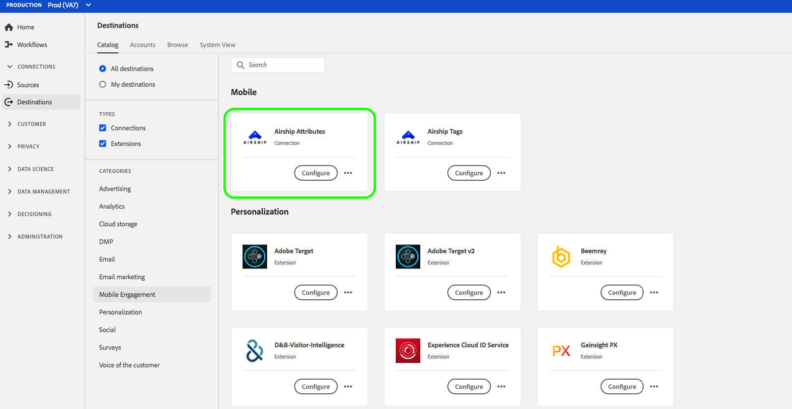

# （測試版）[!DNL Airship Attributes]連接{#airship-attributes-destination}

>[!IMPORTANT]
>
>Adobe Experience Platform中的[!DNL Airship Attributes]目標目前正在測試中。 文件和功能可能會有所變更。

[!DNL Airship] 是領先的客戶互動平台，可協助您在客戶生命週期的每個階段，為您的使用者提供有意義的個人化全通道訊息。

此整合會將Adobe描述檔資料以[屬性](https://docs.airship.com/guides/audience/attributes/)的形式傳入[!DNL Airship]中，以進行定位或觸發。

若要進一步瞭解[!DNL Airship]，請參閱[飛艇檔案](https://docs.airship.com)。

>[!TIP]
>
>此文檔頁面由[!DNL Airship]團隊建立。 如需任何查詢或更新要求，請直接與[support.airship.com](https://support.airship.com/)聯絡。

## 先決條件 {#prerequisites}

您必須先執行下列動作，才能將對象區段傳送至[!DNL Airship]:

* 在[!DNL Airship]專案中啟用屬性。
* 產生用於驗證的承載Token。

>[!TIP]
>
>如果您尚未透過[此註冊連結](https://go.airship.eu/accounts/register/plan/starter/)建立[!DNL Airship]帳戶。

### 啟用屬性{#enable-attributes}

Adobe Experience Platform描述檔屬性類似於[!DNL Airship]屬性，使用本頁下面進一步說明的對應工具，在平台中可輕鬆地彼此對應。

[!DNL Airship] 專案有數個預先定義和預設屬性。如果您有自訂屬性，則必須先在[!DNL Airship]中定義。 如需詳細資訊，請參閱[設定和管理屬性](https://docs.airship.com/tutorials/audience/attributes/)。

### 載體Token {#bearer-token}

前往[Airship儀表板](https://go.airship.com)中的&#x200B;**[!UICONTROL Settings]**&quot; **[!UICONTROL &quot; APIs &amp; Integrations]**，然後在左側功能表中選擇&#x200B;**[!UICONTROL Token]**。

按一下「建立Token **[!UICONTROL 」。]**

為您的Token提供好記的名稱，例如「Adobe屬性目的地」，並選取「完整存取權」做為角色。

按一下「建立Token ]**」，並將詳細資訊儲存為機密。**[!UICONTROL 

## 使用案例 {#use-cases}

為協助您進一步瞭解應如何及何時使用[!DNL Airship Attributes]目標，以下是Adobe Experience Platform客戶可使用此目標解決的範例使用案例。

### 使用案例#1

運用在Adobe Experience Platform中收集的個人檔案資料，在[!DNL Airship]的任何通道中將訊息和豐富內容個人化。 例如，利用[!DNL Experience Platform]描述檔資料來設定[!DNL Airship]中的位置屬性。 這可讓酒店品牌針對每位使用者顯示最近的酒店位置影像。

### 使用案例#2

運用Adobe Experience Platform的屬性進一步豐富[!DNL Airship]個人檔案，並將其與SDK或[!DNL Airship]預測性資料結合。 例如，零售商可以建立包含忠誠度狀態和位置資料（來自平台的屬性）和[!DNL Airship]預測會流失資料的區段，以傳送高針對性訊息給居住在內華達州拉斯維加斯的黃金忠誠度狀態使用者，而且攪動的可能性很高。

## 連接到[!DNL Airship Attributes] {#connect-airship-attributes}

在&#x200B;**[!UICONTROL 目標]** > **[!UICONTROL 目錄]**&#x200B;中，滾動到&#x200B;**[!UICONTROL 移動參與]**&#x200B;類別。 選擇&#x200B;**[!DNL Airship Attributes]**，然後選擇&#x200B;**[!UICONTROL 配置]**。

>[!NOTE]
>
>如果已存在與此目標的連接，您可以在目標卡上看到&#x200B;**[!UICONTROL 激活]**&#x200B;按鈕。 有關&#x200B;**[!UICONTROL Activate]**&#x200B;和&#x200B;**[!UICONTROL Configure]**&#x200B;之間差異的詳細資訊，請參閱目標工作區文檔的[Catalog](../../ui/destinations-workspace.md#catalog)部分。

在&#x200B;**Account**&#x200B;步驟中，如果您先前已設定到[!DNL Airship Attributes]目標的連接，請選擇&#x200B;**[!UICONTROL Existing Account]**&#x200B;並選擇您的現有連接。 或者，您可以選擇&#x200B;**[!UICONTROL 新帳戶]**&#x200B;來設定到[!DNL Airship Attributes]的新連接。 選擇&#x200B;**[!UICONTROL 連線至目的地]**，以使用您從[!DNL Airship]控制面板產生的承載Token，將Adobe Experience Platform連線至您的[!DNL Airship]專案。

>[!NOTE]
>
>Adobe Experience Platform支援驗證程式中的認證驗證，如果您為[!DNL Airship]帳戶輸入錯誤的認證，則會顯示錯誤訊息。 這可確保您不會以不正確的憑證完成工作流程。

在確認您的認證並將Adobe Experience Platform連線至您的[!DNL Airship]專案後，您可以選取&#x200B;**[!UICONTROL Next]**&#x200B;以繼續&#x200B;**[!UICONTROL Setup]**&#x200B;步驟。

在&#x200B;**[!UICONTROL 驗證]**&#x200B;步驟中，輸入激活流程的&#x200B;**[!UICONTROL 名稱]**&#x200B;和&#x200B;**[!UICONTROL 說明]**。

此外，在此步驟中，您可以選擇美國或歐盟的資料中心，具體取決於哪個[!DNL Airship]資料中心適用於此目標。 最後，選取一或多個將資料匯出至目的地的行銷使用案例。 您可以從Adobe定義的行銷使用案例中選擇，也可以自行建立。 如需行銷使用案例的詳細資訊，請參閱[資料使用政策概述](../../../data-governance/policies/overview.md)。

在填寫上述欄位後，選擇「建立目標」。****

您的目標現在已建立。 如果您想稍後啟動區段，可以選取&#x200B;**[!UICONTROL 儲存並退出]**，或選取&#x200B;**[!UICONTROL Next]**&#x200B;以繼續工作流程並選取要啟動的區段。 在這兩種情況下，請參閱工作流程的下一節[啟動區段](#activate-segments)。

## 啟用區段{#activate-segments}

若要將區段啟用至[!DNL Airship Attributes]，請遵循下列步驟：

在&#x200B;**[!UICONTROL 目標>瀏覽]**&#x200B;中，選取您要啟用區段的[!DNL Airship Attributes]目標。

按一下目標的名稱。 這會帶您進入「啟動」流程。

請注意，如果目的地已有啟動流程，您可以看到目前傳送至目的地的區段。 選擇右側導軌中的&#x200B;**[!UICONTROL 編輯激活]** ，然後按照以下步驟修改激活詳細資訊。

選擇&#x200B;**[!UICONTROL 激活]**。 在&#x200B;**[!UICONTROL 啟動目標]**&#x200B;工作流程的&#x200B;**[!UICONTROL 選擇區段]**&#x200B;頁面上，選取要傳送至[!DNL Airship Attributes]的區段。

在&#x200B;**[!UICONTROL 映射]**&#x200B;步驟中，從[XDM](../../../xdm/home.md)模式中選擇要映射到目標模式的屬性和標識。 選擇&#x200B;**[!UICONTROL 添加新映射]**&#x200B;以瀏覽方案並將其映射到相應的目標標識。

[!DNL Airship] 屬性可以在代表裝置例項（例如iPhone）的頻道上設定，或指名用戶（其將使用者的所有裝置對應至通用識別碼，例如客戶ID）上。如果您的架構中具有純文字檔案（未散列）電子郵件地址作為主要標識，請在&#x200B;**[!UICONTROL 源屬性]**&#x200B;中選擇電子郵件欄位，並映射到&#x200B;**[!UICONTROL 目標標識]**&#x200B;下右列中的[!DNL Airship]指名用戶，如下所示。

對於應映射到頻道（即設備）的標識符，請根據源映射到相應的頻道。 下圖顯示如何建立兩個映射：

* IDFA iOS廣告ID至[!DNL Airship] iOS頻道
* Adobe `fullName`屬性至[!DNL Airship] &quot;Full Name&quot;屬性

>[!NOTE]
>
>在為屬性映射選擇目標欄位時，使用[!DNL Airship]儀表板中顯示的用戶友好名稱。

**地圖識別**

選擇源欄位：

選擇目標欄位：

**地圖屬性**

選擇源屬性：

選擇目標屬性：

驗證映射：

在&#x200B;**[!UICONTROL 區段排程]**&#x200B;頁面上，排程目前停用。 按一下&#x200B;**[!UICONTROL Next]**&#x200B;繼續查看步驟。

在&#x200B;**[!UICONTROL Review]**&#x200B;頁面上，您可以看到您所選內容的摘要。 選擇&#x200B;**[!UICONTROL 取消]**&#x200B;以劃分流程，選擇&#x200B;**[!UICONTROL 返回]**&#x200B;以修改設定，或選擇&#x200B;**[!UICONTROL 完成]**&#x200B;以確認選擇並開始向目標發送資料。

>[!IMPORTANT]
>
>在此步驟中，Adobe Experience Platform會檢查資料使用政策違規。 以下是違反原則的範例。 除非您解決違規問題，否則無法完成區段啟動工作流程。 有關如何解決策略違規的資訊，請參見資料治理文檔部分中的[策略實施](../../../data-governance/enforcement/auto-enforcement.md)。

如果未檢測到任何違反策略的情況，請選擇&#x200B;**[!UICONTROL 完成]**&#x200B;以確認選擇並開始向目標發送資料。

## 資料使用與治理{#data-usage-governance}

所有[!DNL Adobe Experience Platform]目標在處理資料時都符合資料使用原則。 有關[!DNL Adobe Experience Platform]如何實施資料治理的詳細資訊，請參閱[資料治理概述](../../../data-governance/home.md)。
