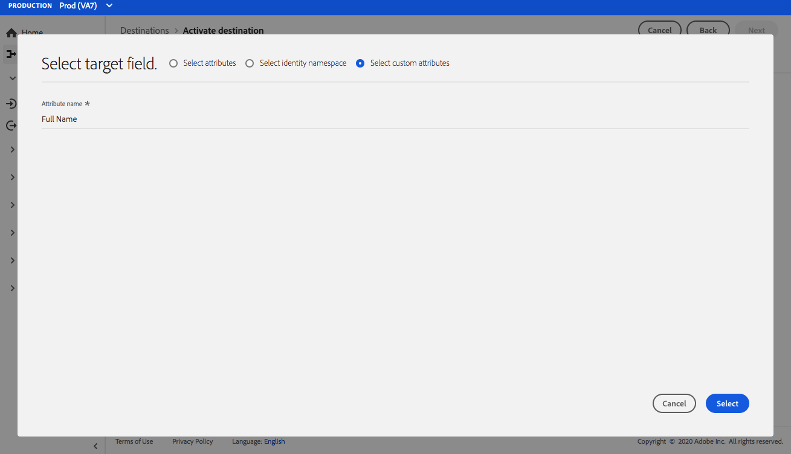

# [!DNL Airship Attributes]個連線 {#airship-attributes-destination}

## 概觀 {#overview}

[!DNL Airship]是領先的客戶參與平台，可在客戶生命週期的每個階段協助您為使用者提供有意義、個人化的全通路訊息。

此整合會將Adobe設定檔資料作為[屬性](https://docs.airship.com/guides/audience/attributes/)傳遞至[!DNL Airship]，以用於鎖定或觸發。

若要深入瞭解[!DNL Airship]，請參閱[飛艇檔案](https://docs.airship.com)。

>[!TIP]
>
>此目的地聯結器和檔案頁面是由[!DNL Airship]團隊建立和維護。 若有任何查詢或更新要求，請直接透過[support.airship.com](https://support.airship.com/)連絡他們。

## 先決條件 {#prerequisites}

在將您的對象傳送至[!DNL Airship]之前，您必須：

* 啟用您[!DNL Airship]專案中的屬性。
* 產生持有人權杖以進行驗證。

>[!TIP]
>
>如果您尚未透過[此註冊連結](https://go.airship.eu/accounts/register/plan/starter/)建立[!DNL Airship]帳戶。

## 支援的對象 {#supported-audiences}

本節說明您可以將哪些型別的對象匯出至此目的地。

| 對象來源 | 支援 | 說明 |
|---------|----------|----------|
| [!DNL Segmentation Service] | ✓ (A) | 透過Experience Platform[細分服務](../../../segmentation/home.md)產生的對象。 |
| 自訂上傳 | ✓ (A) | 對象[從CSV檔案匯入](../../../segmentation/ui/audience-portal.md#import-audience)至Experience Platform。 |

{style="table-layout:auto"}

## 匯出型別和頻率 {#export-type-frequency}

請參閱下表以取得目的地匯出型別和頻率的資訊。

| 項目 | 類型 | 附註 |
---------|----------|---------|
| 匯出類型 | **[!UICONTROL 以設定檔為基礎]** | 您正在匯出區段的所有成員，以及所需的結構欄位（例如：電子郵件地址、電話號碼、姓氏）和/或身分，視您的欄位對應而定。 |
| 匯出頻率 | **[!UICONTROL 串流]** | 串流目的地是「一律開啟」的API型連線。 一旦根據對象評估在Experience Platform中更新了設定檔，聯結器就會將更新傳送至下游的目的地平台。 深入瞭解[串流目的地](/help/destinations/destination-types.md#streaming-destinations)。 |

{style="table-layout:auto"}

## 啟用屬性 {#enable-attributes}

Adobe Experience Platform設定檔屬性與[!DNL Airship]屬性類似，而且可以透過本頁面下方進一步示範的對映工具，在Platform中輕鬆相互對應。

[!DNL Airship]個專案具有數個預先定義的和預設屬性。 如果您有自訂屬性，必須先在[!DNL Airship]中定義它。 如需詳細資訊，請參閱[設定和管理屬性](https://docs.airship.com/tutorials/audience/attributes/)。

## 產生持有人權杖 {#bearer-token}

移至[飛艇儀表板](https://go.airship.com)中的&#x200B;**[!UICONTROL 設定]** &quot; **[!UICONTROL API和整合]**，然後在左側功能表中選取&#x200B;**[!UICONTROL 代號]**。

按一下&#x200B;**[!UICONTROL 建立Token]**。

為您的Token提供好記的名稱，例如「Adobe屬性目的地」，然後為角色選取「完全存取」。

按一下&#x200B;**[!UICONTROL 建立Token]**，並將詳細資料儲存為機密檔案。

## 使用案例 {#use-cases}

為協助您更清楚瞭解您應如何及何時使用[!DNL Airship Attributes]目的地，以下是Adobe Experience Platform客戶可藉由使用此目的地解決的範例使用案例。

### 使用案例#1

運用Adobe Experience Platform中收集的設定檔資料，在[!DNL Airship]的任何管道中個人化訊息和豐富的內容。 例如，運用[!DNL Experience Platform]設定檔資料來設定[!DNL Airship]內的位置屬性。 這可讓飯店品牌為每位使用者顯示最近的飯店位置影像。

### 使用案例#2

運用Adobe Experience Platform的屬性進一步擴充[!DNL Airship]設定檔，並將其與SDK或[!DNL Airship]預測性資料結合。 例如，零售商可建立具有忠誠度狀態和位置資料（來自Platform的屬性）以及[!DNL Airship]預測會流失資料的對象，以傳送高針對性訊息給住在內華達州拉斯維加斯且具有高流失率的金級忠誠度狀態使用者。

## 連線到目標 {#connect}

>[!IMPORTANT]
> 
>若要連線到目的地，您需要&#x200B;**[!UICONTROL 檢視目的地]**&#x200B;和&#x200B;**[!UICONTROL 管理目的地]** [存取控制許可權](/help/access-control/home.md#permissions)。 閱讀[存取控制總覽](/help/access-control/ui/overview.md)或連絡您的產品管理員以取得必要的許可權。

若要連線到此目的地，請依照[目的地組態教學課程](../../ui/connect-destination.md)中所述的步驟進行。 在設定目標工作流程中，填寫以下兩個區段中列出的欄位。

### 驗證目標 {#authenticate}

若要驗證到目的地，請填入必填欄位，然後選取&#x200B;**[!UICONTROL 連線到目的地]**。

* **[!UICONTROL 持有人權杖]**：您從[!DNL Airship]儀表板產生的持有人權杖。

### 填寫目標詳細資訊 {#destination-details}

若要設定目的地的詳細資訊，請填寫下方的必填和選用欄位。 UI中欄位旁的星號表示該欄位為必填欄位。

* **[!UICONTROL 名稱]**：輸入可協助您識別此目的地的名稱。
* **[!UICONTROL 描述]**：輸入此目的地的描述。
* **[!UICONTROL 網域]**：選取美國或歐盟資料中心，視哪個[!DNL Airship]資料中心套用至此目的地而定。

### 啟用警示 {#enable-alerts}

您可以啟用警報以接收有關傳送到您目的地的資料流狀態的通知。 從清單中選取警報以訂閱接收有關資料流狀態的通知。 如需警示的詳細資訊，請參閱[使用UI訂閱目的地警示](../../ui/alerts.md)的指南。

當您完成提供目的地連線的詳細資訊後，請選取&#x200B;**[!UICONTROL 下一步]**。

## 啟動此目標的對象 {#activate}

>[!IMPORTANT]
> 
>* 若要啟用資料，您需要&#x200B;**[!UICONTROL 檢視目的地]**、**[!UICONTROL 啟用目的地]**、**[!UICONTROL 檢視設定檔]**&#x200B;和&#x200B;**[!UICONTROL 檢視區段]** [存取控制許可權](/help/access-control/home.md#permissions)。 閱讀[存取控制總覽](/help/access-control/ui/overview.md)或連絡您的產品管理員以取得必要的許可權。
>* 若要匯出&#x200B;*身分*，您需要&#x200B;**[!UICONTROL 檢視身分圖表]** [存取控制許可權](/help/access-control/home.md#permissions)。  {width="100" zoomable="yes"}

如需啟用此目的地的對象的指示，請參閱[啟用串流對象匯出目的地的對象資料](../../ui/activate-segment-streaming-destinations.md)。

## 對應考量事項 {#mapping-considerations}

[!DNL Airship]屬性可以在代表裝置執行個體(例如iPhone)的頻道上設定，或是可將使用者的所有裝置對應到共同識別碼（例如客戶ID）的具名使用者上設定。 如果您的結構描述中有純文字（未雜湊）電子郵件地址作為主要身分，請在&#x200B;**[!UICONTROL Source屬性]**&#x200B;中選取電子郵件欄位，並對應至&#x200B;**[!UICONTROL 目標身分]**&#x200B;下右側欄中的[!DNL Airship]具名使用者，如下所示。

對於應對應至管道（即裝置）的識別碼，請根據來源對應至適當的管道。 下列影像顯示如何建立兩個對應：

* 將IDFA iOS Advertising ID新增至[!DNL Airship] iOS頻道
* 將`fullName`屬性Adobe至[!DNL Airship]「全名」屬性

>[!NOTE]
>
>選擇屬性對應的目標欄位時，請使用顯示在[!DNL Airship]儀表板中的使用者易記名稱。

**對應身分**

選取來源欄位：

選取目標欄位：

**對應屬性**

選取來源屬性：

選取目標屬性：

驗證對應：

## 資料使用與控管 {#data-usage-governance}

處理您的資料時，所有[!DNL Adobe Experience Platform]目的地都符合資料使用原則。 如需[!DNL Adobe Experience Platform]如何強制資料控管的詳細資訊，請參閱[資料控管概觀](../../../data-governance/home.md)。
