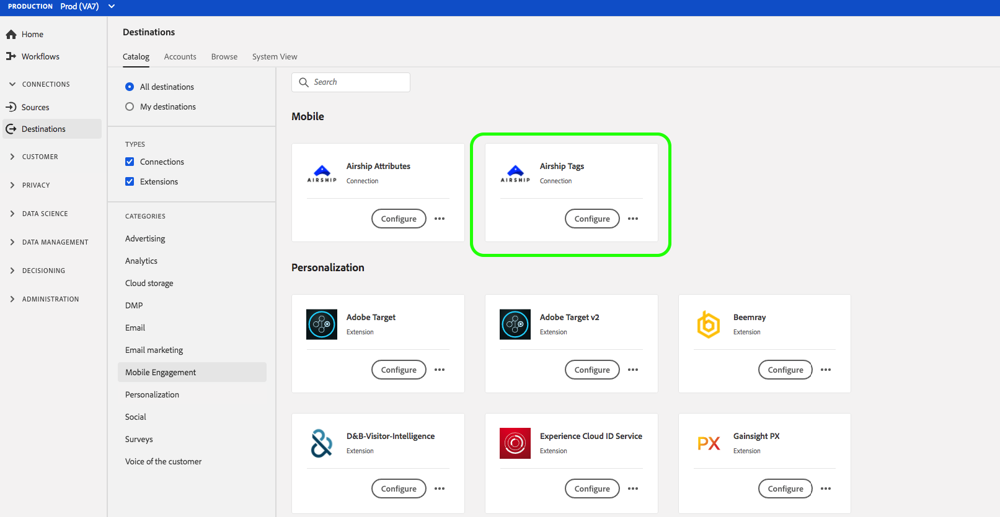

# （測試版）[!DNL Airship Tags]連接{#airship-tags-destination}

>[!IMPORTANT]
>
>Adobe Experience Platform的[!DNL Airship Tags]目的地目前為beta。 文件和功能可能會有所變更。

## 概述

[!DNL Airship] 是領先的客戶互動平台，可協助您在客戶生命週期的每個階段，為您的使用者提供有意義的個人化全通道訊息。

此整合會將Adobe Experience Platform區段資料以[Tags](https://docs.airship.com/guides/audience/tags/)的形式傳入[!DNL Airship]中，以進行定位或觸發。

若要進一步瞭解[!DNL Airship]，請參閱[飛艇檔案](https://docs.airship.com)。

>[!TIP]
>
>此文檔頁面由[!DNL Airship]團隊建立。 如需任何查詢或更新要求，請直接與[support.airship.com](https://support.airship.com/)聯絡。

## 先決條件

在將Adobe Experience Platform區段傳送至[!DNL Airship]之前，您必須：

* 在[!DNL Airship]專案中建立標籤群組。
* 產生用於驗證的承載Token。

>[!TIP]
> 
>如果您尚未透過[此註冊連結](https://go.airship.eu/accounts/register/plan/starter/)建立[!DNL Airship]帳戶。

## 標籤群組

Adobe Experience Platform中區段的概念與Airship中的[Tags](https://docs.airship.com/guides/audience/tags/)類似，在實作上略有不同。 此整合會將Experience Platform區段](https://experienceleague.adobe.com/docs/experience-platform/xdm/mixins/profile/segmentation.html?lang=en#mixins)中使用者的[會籍狀態對應至[!DNL Airship]標籤的存在與否。 例如，在`xdm:status`變更為`realized`的「平台」區段中，標籤會新增至[!DNL Airship]頻道或此描述檔已映射至的指名用戶。 如果`xdm:status`變更為`exited`，則會移除標籤。

若要啟用此整合，請在[!DNL Airship]中建立名為`adobe-segments`的&#x200B;*標籤群組*。

>[!IMPORTANT]
>
>建立新標籤群組&#x200B;**請勿勾選**&#x200B;顯示&quot;[!DNL Allow these tags to be set only from your server]&quot;的選項按鈕。 這麼做會導致Adobe標籤整合失敗。

如需建立標籤群組的指示，請參閱[管理標籤群組](https://docs.airship.com/tutorials/manage-project/messaging/tag-groups)。

## 產生記載性Token

前往[飛艇儀表板](https://go.airship.com)中的&#x200B;**[!UICONTROL Settings]**&quot; **[!UICONTROL APIs & Integrations]**，然後在左側菜單中選擇&#x200B;**[!UICONTROL Tokens]**。

按一下「**[!UICONTROL Create Token]**」。

為您的Token提供好記的名稱，例如「Adobe標籤目標」，並選取角色的「完整存取權」。

按一下&#x200B;**[!UICONTROL Create Token]**&#x200B;並將詳細資訊儲存為機密。

## 使用個案

為協助您進一步瞭解應如何及何時使用[!DNL Airship Tags]目標，以下是Adobe Experience Platform客戶可使用此目標解決的範例使用案例。

### 使用案例#1

零售商或娛樂平台可以建立忠誠客戶的使用者個人檔案，並將這些細分傳入[!DNL Airship]，以便在行動宣傳上鎖定訊息。

### 使用案例#2

當使用者進入或離開Adobe Experience Platform的特定區段時，即時觸發一對一訊息。

例如，零售商在Platform中設定牛仔品牌專屬區隔。 當某人將牛仔褲偏好設定設為特定品牌時，該零售商現在可以觸發行動訊息。

## 連接到[!DNL Airship Tags] {#connect-airship-tags}

在&#x200B;**[!UICONTROL Destinations]** > **[!UICONTROL Catalog]**&#x200B;中，滾動到&#x200B;**[!UICONTROL Mobile Engagement]**&#x200B;類別。 選擇&#x200B;**[!DNL Airship Tags]**，然後選擇&#x200B;**[!UICONTROL Configure]**。

>[!NOTE]
>
>如果已存在與此目標的連接，則可以在目標卡上看到&#x200B;**[!UICONTROL Activate]**&#x200B;按鈕。 有關&#x200B;**[!UICONTROL Activate]**&#x200B;和&#x200B;**[!UICONTROL Configure]**&#x200B;之間差異的詳細資訊，請參閱目標工作區文檔的[目錄](../../ui/destinations-workspace.md#catalog)部分。

在&#x200B;**Account**&#x200B;步驟中，如果您先前已設定到[!DNL Airship Tags]目標的連接，請選擇&#x200B;**[!UICONTROL Existing Account]**&#x200B;並選擇現有連接。 或者，您可以選擇&#x200B;**[!UICONTROL New Account]**&#x200B;來設定到[!DNL Airship Tags]的新連接。 選擇&#x200B;**[!UICONTROL Connect to destination]**&#x200B;以使用您從[!DNL Airship]儀表板生成的承載令牌將Adobe Experience Platform連接到您的[!DNL Airship]項目。

>[!NOTE]
>
>Adobe Experience Platform支援驗證程式中的認證驗證，如果您在[!DNL Airship]帳戶中輸入錯誤的認證，則會顯示錯誤訊息。 這可確保您不會以不正確的憑證完成工作流程。

在確認您的憑據並將Adobe Experience Platform連接到[!DNL Airship]項目後，您可以選擇&#x200B;**[!UICONTROL Next]**&#x200B;繼續&#x200B;**[!UICONTROL Setup]**&#x200B;步驟。

在&#x200B;**[!UICONTROL Authentication]**&#x200B;步驟中，輸入&#x200B;**[!UICONTROL Name]**&#x200B;和&#x200B;**[!UICONTROL Description]**&#x200B;作為啟動流程。

此外，在此步驟中，您可以選擇美國或歐盟的資料中心，具體取決於哪個[!DNL Airship]資料中心適用於此目標。 最後，選擇要將資料導出到目標的一個或多個&#x200B;**[!UICONTROL Marketing Actions]**。 您可以從Adobe定義的行銷動作中選擇，也可以自行建立。 如需行銷動作的詳細資訊，請參閱[資料使用政策概述](../../../data-governance/policies/overview.md)。

在填寫上述欄位後，請選取&#x200B;**[!UICONTROL Create Destination]**。

您的目標現在已建立。 如果您想稍後啟動區段，可以選取&#x200B;**[!UICONTROL Save & Exit]**，或選取&#x200B;**[!UICONTROL Next]**&#x200B;以繼續工作流程，並選取要啟動的區段。 在這兩種情況下，請參閱工作流程的下一節[啟動區段](#activate-segments)。

## 啟用區段{#activate-segments}

若要將區段啟用至[!DNL Airship Tags]，請遵循下列步驟：

在&#x200B;**[!UICONTROL Destinations > Browse]**&#x200B;中，選取您要啟用區段的[!DNL Airship Tags]目標。

按一下目標的名稱。 這會帶您進入「啟動」流程。

請注意，如果目的地已有啟動流程，您可以看到目前傳送至目的地的區段。 在右側導軌中選擇&#x200B;**[!UICONTROL Edit activation]**，然後依照下列步驟修改啟動詳細資訊。

選擇「**[!UICONTROL Activate]**」。在&#x200B;**[!UICONTROL Activate destination]**&#x200B;工作流程的&#x200B;**[!UICONTROL Select Segments]**&#x200B;頁面上，選取要傳送至[!DNL Airship Tags]的區段。

在&#x200B;**[!UICONTROL Mapping]**&#x200B;步驟中，從[XDM](../../../xdm/home.md)架構中選擇要映射到目標架構的屬性和標識。 選擇&#x200B;**[!UICONTROL Add new mapping]**&#x200B;以瀏覽您的架構並將它們映射到相應的目標標識。

[!DNL Airship] 可以在代表裝置例項（例如iPhone）的頻道上設定標籤，或指名用戶，其將使用者的所有裝置對應至通用識別碼（例如客戶ID）。如果您的架構中有純文字檔案（未散列）電子郵件地址作為主要標識，請在&#x200B;**[!UICONTROL Source Attributes]**&#x200B;中選擇電子郵件欄位，並映射到&#x200B;**[!UICONTROL Target Identities]**&#x200B;右列中[!DNL Airship]的指名用戶，如下所示。

對於應映射到頻道（即設備）的標識符，請根據源映射到相應的頻道。 下列影像顯示如何將Google廣告ID對應至[!DNL Airship] Android頻道。

在&#x200B;**[!UICONTROL Segment schedule]**&#x200B;頁面上，計畫目前停用。 按一下&#x200B;**[!UICONTROL Next]**&#x200B;繼續查看步驟。

在&#x200B;**[!UICONTROL Review]**&#x200B;頁面上，您可以看到您所選內容的摘要。 選擇&#x200B;**[!UICONTROL Cancel]**&#x200B;以劃分流程，選擇&#x200B;**[!UICONTROL Back]**&#x200B;以修改設定，或選擇&#x200B;**[!UICONTROL Finish]**&#x200B;以確認選擇並開始向目標發送資料。

>[!IMPORTANT]
>
>在此步驟中，Adobe Experience Platform會檢查資料使用政策違規。 以下是違反原則的範例。 除非您解決違規問題，否則無法完成區段啟動工作流程。 有關如何解決策略違規的資訊，請參見資料治理文檔部分中的[策略實施](../../../data-governance/enforcement/auto-enforcement.md)。

如果未檢測到任何違反策略的情況，請選擇&#x200B;**[!UICONTROL Finish]**&#x200B;以確認選擇並開始向目標發送資料。

## 資料使用與治理{#data-usage-governance}

所有[!DNL Adobe Experience Platform]目標在處理資料時都符合資料使用原則。 有關[!DNL Adobe Experience Platform]如何實施資料治理的詳細資訊，請參閱[資料治理概述](../../../data-governance/home.md)。

