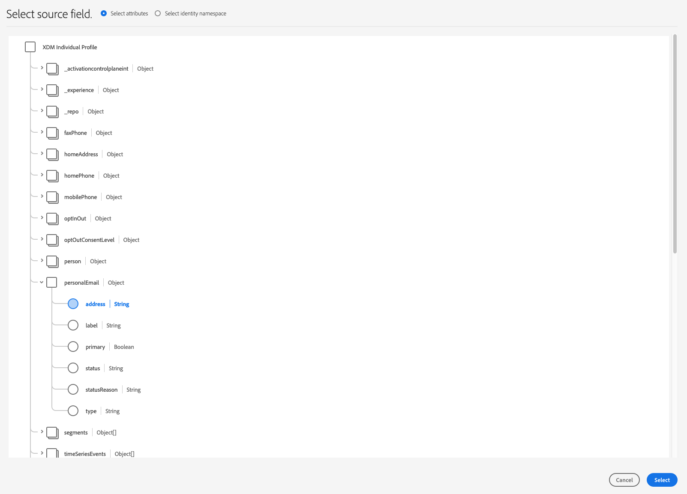

# [!DNL Braze] 連線

## 概觀 {#overview}

此 [!DNL Braze] 目的地可幫助您傳送設定檔資料至 [!DNL Braze].

[!DNL Braze] 是全方位的客戶參與平台，可在客戶與所喜愛品牌之間提供相關且難忘的體驗。

若要傳送設定檔資料至 [!DNL Braze]，您必須先連線至目的地。

## 目的地詳情 {#specifics}

請注意以下專屬於 [!DNL Braze] 目的地：

* [!DNL Adobe Experience Platform] 對象已匯出至 [!DNL Braze] 在 `AdobeExperiencePlatformSegments` 屬性。

>[!NOTE]
>
>請記住，傳送其他自訂屬性至 [!DNL Braze] 可能會導致 [!DNL Braze] 資料點使用量。 請諮詢您的 [!DNL Braze] 帳戶管理員，然後再傳送其他自訂屬性。

## 使用案例 {#use-cases}

身為行銷人員，我想要在行動參與目的地中鎖定使用者，並內建受眾 [!DNL Adobe Experience Platform]. 此外，我想要根據使用者的屬性，為他們提供個人化體驗 [!DNL Adobe Experience Platform] 設定檔，當對象和設定檔在中更新時 [!DNL Adobe Experience Platform].

## 支援的身分 {#supported-identities}

[!DNL Braze] 支援下表所述的身分啟用。

| 目標身分 | 說明 | 考量事項 |
|---|---|---|
| external_id | 自訂 [!DNL Braze] 支援對應任何身分的識別碼。 | 您可以傳送任何 [身分](../../../identity-service/namespaces.md) 至 [!DNL Braze] 目的地，只要您將它對應到 [!DNL Braze] [`external_id`](https://www.braze.com/docs/api/basics/#external-user-id-explanation). |

{style="table-layout:auto"}

## 支援的對象 {#supported-audiences}

本節說明您可以將哪些型別的對象匯出至此目的地。

| 對象來源 | 支援 | 說明 |
---------|----------|----------|
| [!DNL Segmentation Service] | ✓ (A) | 透過Experience Platform產生的對象 [分段服務](../../../segmentation/home.md). |
| 自訂上傳 | ✓ | 受眾 [已匯入](../../../segmentation/ui/overview.md#import-audience) 從CSV檔案Experience Platform為。 |

{style="table-layout:auto"}

## 匯出型別和頻率 {#export-type-frequency}

請參閱下表以取得目的地匯出型別和頻率的資訊。

| 項目 | 類型 | 附註 |
---------|----------|---------|
| 匯出型別 | **[!UICONTROL 以設定檔為基礎]** | 您正在匯出區段的所有成員，以及所需的結構欄位（例如：電子郵件地址、電話號碼、姓氏）和/或身分，視您的欄位對應而定。[!DNL Adobe Experience Platform] 對象已匯出至 [!DNL Braze] 在 `AdobeExperiencePlatformSegments` 屬性。 |
| 匯出頻率 | **[!UICONTROL 串流]** | 串流目的地是「一律開啟」的API型連線。 一旦根據對象評估在Experience Platform中更新了設定檔，聯結器就會將更新傳送至下游的目的地平台。 深入瞭解 [串流目的地](/help/destinations/destination-types.md#streaming-destinations). |

{style="table-layout:auto"}

## 連線到目標 {#connect}

>[!IMPORTANT]
> 
>若要連線到目的地，您需要 **[!UICONTROL 檢視目的地]** 和 **[!UICONTROL 管理目的地]** [存取控制許可權](/help/access-control/home.md#permissions). 閱讀 [存取控制總覽](/help/access-control/ui/overview.md) 或聯絡您的產品管理員以取得必要許可權。

若要連線至此目的地，請遵循以下說明的步驟： [目的地設定教學課程](../../ui/connect-destination.md). 在設定目標工作流程中，填寫以下兩個區段中列出的欄位。

### 驗證目標 {#authenticate}

若要向目的地進行驗證，請填寫必填欄位並選取 **[!UICONTROL 連線到目的地]**.

* **[!UICONTROL 硬碟帳戶權杖]**：這是您的 [!DNL Braze] [!DNL API] 機碼。 您可以找到有關如何取得 [!DNL API] 在此輸入： [REST API金鑰總覽](https://www.braze.com/docs/api/api_key/).

### 填寫目標詳細資訊 {#destination-details}

若要設定目的地的詳細資訊，請填寫下方的必填和選用欄位。 UI中欄位旁的星號表示該欄位為必填欄位。

* **[!UICONTROL 名稱]**：輸入您日後用來辨識此目的地的名稱。
* **[!UICONTROL 說明]**：輸入說明，協助您日後識別此目的地。
* **[!UICONTROL 端點例項]**：詢問您的 [!DNL Braze] 代表您應該使用哪個端點例項。

### 啟用警示 {#enable-alerts}

您可以啟用警報以接收有關傳送到您目的地的資料流狀態的通知。 從清單中選取警報以訂閱接收有關資料流狀態的通知。 如需警示的詳細資訊，請參閱以下指南： [使用UI訂閱目的地警報](../../ui/alerts.md).

當您完成提供目的地連線的詳細資訊時，請選取「 」 **[!UICONTROL 下一個]**.

## 啟動此目標的對象 {#activate}

>[!IMPORTANT]
> 
>* 若要啟用資料，您需要 **[!UICONTROL 檢視目的地]**， **[!UICONTROL 啟用目的地]**， **[!UICONTROL 檢視設定檔]**、和 **[!UICONTROL 檢視區段]** [存取控制許可權](/help/access-control/home.md#permissions). 閱讀 [存取控制總覽](/help/access-control/ui/overview.md) 或聯絡您的產品管理員以取得必要許可權。
>* 要匯出 *身分*，您需要 **[!UICONTROL 檢視身分圖表]** [存取控制許可權](/help/access-control/home.md#permissions).   {width="100" zoomable="yes"}

另請參閱 [啟用受眾資料至串流受眾匯出目的地](../../ui/activate-segment-streaming-destinations.md) 以取得啟用此目的地對象的指示。

## 對應考量事項 {#mapping-considerations}

若要正確傳送您的對象資料，請從 [!DNL Adobe Experience Platform] 至 [!DNL Braze] 目的地，您必須進行欄位對應步驟。

對應包括在 [!DNL Experience Data Model] (XDM)結構描述欄位 [!DNL Platform] 帳戶，以及目標目的地中對應的對等帳戶。

若要正確將XDM欄位對應至 [!DNL Braze] 目的地欄位，請遵循下列步驟：

在 [!UICONTROL 對應] 步驟，按一下 **[!UICONTROL 新增對應]**.

在 [!UICONTROL 來源欄位] 區段，按一下空白欄位旁的箭頭按鈕。

在 [!UICONTROL 選取來源欄位] 視窗，您可以選擇以下兩種XDM欄位類別：
* [!UICONTROL 選取屬性]：使用此選項將XDM結構描述中的特定欄位對應至 [!DNL Braze] 屬性。

* [!UICONTROL 選取身分名稱空間]：使用此選項來對應 [!DNL Platform] 將身分名稱空間設為 [!DNL Braze] 名稱空間。

選擇您的來源欄位，然後按一下 **[!UICONTROL 選取]**.

在 [!UICONTROL 目標欄位] 區段，按一下欄位右側的對應圖示。

在 [!UICONTROL 選取目標欄位] 視窗中，您可以選擇以下兩種目標欄位類別：
* [!UICONTROL 選取身分名稱空間]：使用此選項來對應 [!DNL Platform] 身分名稱空間至 [!DNL Braze] 身分名稱空間。
* [!UICONTROL 選取自訂屬性]：使用此選項將XDM屬性對應至自訂 [!DNL Braze] 您在中定義的屬性 [!DNL Braze] 帳戶。   您也可以使用此選項將現有XDM屬性重新命名為 [!DNL Braze]. 例如，對應 `lastName` XDM屬性至自訂 `Last_Name` 中的屬性 [!DNL Braze]，將會建立 `Last_Name` 中的屬性 [!DNL Braze]，如果尚未存在，則對應 `lastName` XDM屬性。

選擇您的目標欄位，然後按一下 **[!UICONTROL 選取]**.

您現在應該會在清單中看到您的欄位對應。

若要新增更多對應，請重複上述步驟。

## 對應範例 {#mapping-example}

比如您的XDM設定檔結構描述和 [!DNL Braze] 執行個體包含以下屬性和身分：

|  | XDM設定檔結構描述 | [!DNL Braze] 例項 |
|---|---|---|
| 屬性 | <ul><li><code>person.name.firstName</code></li><li><code>person.name.lastName</code></li><li><code>mobilePhone.number</code></li></ul> | <ul><li><code>名字</code></li><li><code>姓氏</code></li><li><code>電話號碼</code></li></ul> |
| 身分 | <ul><li><code>電子郵件</code></li><li><code>Google廣告ID (GAID)</code></li><li><code>廣告商適用的Apple ID (IDFA)</code></li></ul> | <ul><li><code>external_id</code></li></ul> |

正確的對應如下所示：

## 匯出的資料 {#exported-data}

驗證資料是否已成功匯出至 [!DNL Braze] 目的地，請檢視您的 [!DNL Braze] 帳戶。 [!DNL Adobe Experience Platform] 對象已匯出至 [!DNL Braze] 在 `AdobeExperiencePlatformSegments` 屬性。

## 疑難排解 {#troubleshooting}

**將我的對象啟用至此目的地時，我收到逾時錯誤。 我應該怎麼做？**

有時，此目的地的對象啟用可能會導致逾時錯誤。 此錯誤並不表示有啟用問題。

如果您收到逾時錯誤，請檢查目的地平台中的對象人數。 如果對象人數正確，則整合可如預期運作。

## 資料使用與控管 {#data-usage-governance}

全部 [!DNL Adobe Experience Platform] 處理您的資料時，目的地符合資料使用原則。 如需如何操作的詳細資訊 [!DNL Adobe Experience Platform] 強制資料控管，請參閱 [資料控管概觀](../../../data-governance/home.md).
