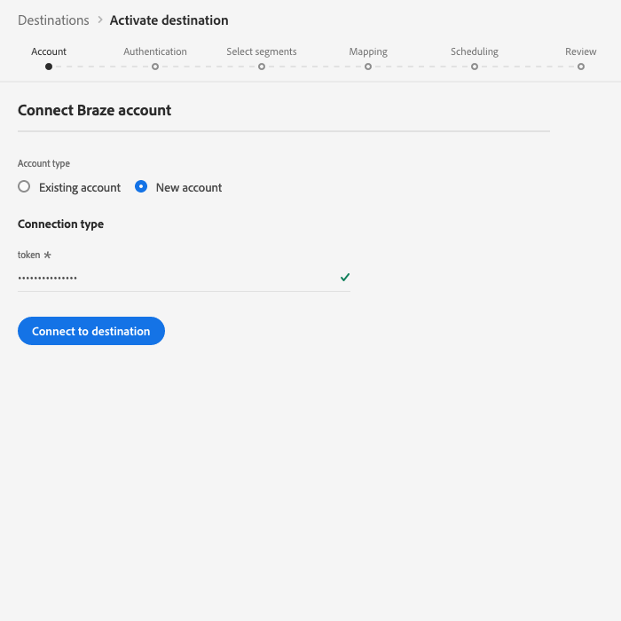

# （測試版）[!DNL Braze]連線

>[!IMPORTANT]
>
>Adobe Experience Platform中的Braze目標目前正在測試中。 文件和功能可能會有所變更。

[!DNL Braze]目的地可協助您將描述檔資料傳送至[!DNL Braze]。

[!DNL Braze] 是全方位的客戶互動平台，可為客戶與他們喜愛的品牌提供相關且值得回味的體驗。

要向[!DNL Braze]發送配置檔案資料，必須首先連接到目標。

## 目標規格{#destination-specs}

請注意以下特定於[!DNL Braze]目標的詳細資訊：

* 只要您將任何[identity](../../../identity-service/namespaces.md)傳送至[!DNL Braze]目的地，即可將它對應至[!DNL Braze] [`external_id`](https://www.braze.com/docs/api/basics/#external-user-id-explanation)。
* [!DNL Adobe Experience Platform] 區段會匯出至 [!DNL Braze] 屬性下 `AdobeExperiencePlatformSegments` 方。

>[!NOTE]
>
>請記住，將其他自訂屬性傳送至[!DNL Braze]可能會增加您的[!DNL Braze]資料點使用量。 傳送其他自訂屬性前，請洽詢您的[!DNL Braze]客戶經理。

## 使用案例 {#use-cases}

身為行銷人員，我想鎖定行動參與目的地的使用者，並內建[!DNL Adobe Experience Platform]區段。 此外，我想根據[!DNL Adobe Experience Platform]個人檔案的屬性，在[!DNL Adobe Experience Platform]中更新區段和個人檔案後，立即為他們提供個人化體驗。

## 導出類型{#export-type}

**[!DNL Profile-based]** -您要匯出區段的所有成員，以及所需的架構欄位(例如：電子郵件地址、電話號碼、姓氏)和／或身分，視您的欄位對應而定。[!DNL Adobe Experience Platform] 區段會匯出至 [!DNL Braze] 屬性下 `AdobeExperiencePlatformSegments` 方。

## 連接到目標{#connect-destination}

在&#x200B;**[!UICONTROL 連接]** > **[!UICONTROL 目標]**&#x200B;中，選擇[!DNL Braze] ，然後選擇&#x200B;**[!UICONTROL 配置]**。

>[!NOTE]
>
>如果已存在與此目標的連接，您可以在目標卡上看到&#x200B;**[!UICONTROL 激活]**&#x200B;按鈕。 有關&#x200B;**[!UICONTROL Activate]**&#x200B;和&#x200B;**[!UICONTROL Configure]**&#x200B;之間差異的詳細資訊，請參閱目標工作區文檔的[Catalog](../../ui/destinations-workspace.md#catalog)部分。
>
>

在[!UICONTROL Account]步驟中，您需要提供[!DNL Braze]帳戶Token。 這是您的[!DNL Braze] [!DNL API]鍵。 您可以在以下網址找到有關如何獲得[!DNL API]鍵的詳細說明：[REST API金鑰概觀](https://www.braze.com/docs/api/api_key/)。 輸入標籤並按一下&#x200B;**[!UICONTROL 連接到目標]**。

按&#x200B;**[!UICONTROL 「下一步」]**。在[!UICONTROL Authentication]步驟中，您需要輸入[!DNL Braze]連接詳細資訊：
* **[!UICONTROL 名稱]**:輸入您將來識別此目的地的名稱。
* **[!UICONTROL 說明]**:輸入說明，以幫助您識別未來的目標。
* **[!UICONTROL 端點實例]**:詢問您的 [!DNL Braze] 代表您應使用哪個端點實例。
* **[!UICONTROL 行銷使用案例]**:行銷使用案例會指出資料將匯出至目的地的方式。您可以從Adobe定義的行銷使用案例中選擇，也可以建立自己的行銷使用案例。 如需行銷使用案例的詳細資訊，請參閱「Adobe Experience Platform中的[資料治理」頁面。 ](../../../data-governance/policies/overview.md)如需個別Adobe定義之行銷使用案例的詳細資訊，請參閱[資料使用政策概觀](../../../data-governance/policies/overview.md)。

按一下&#x200B;**[!UICONTROL 建立目標]**。 您的目標現在已建立。 如果您想稍後啟動區段，可以按一下「儲存並退出」，或選擇「下一步」以繼續工作流程並選取要啟動的區段。 ********&#x200B;在這兩種情況下，請參閱工作流程的下一節[啟動區段](#activate-segments)。

## 啟用區段{#activate-segments}

如需區段啟動工作流程的相關資訊，請參閱[啟用設定檔和區段至目標](../../ui/activate-destinations.md#select-attributes)。

## 欄位映射{#field-mapping}

若要將您的觀眾資料從[!DNL Adobe Experience Platform]正確傳送至[!DNL Braze]目的地，您必須執行欄位對應步驟。

映射包括在[!DNL Platform]帳戶的[!DNL Experience Data Model](XDM)架構欄位與目標目標目標中相應的欄位之間建立連結。

要正確將XDM欄位映射到[!DNL Braze]目標欄位，請執行以下步驟：

在[!UICONTROL 映射]步驟中，按一下&#x200B;**[!UICONTROL 添加新映射]**。

在[!UICONTROL 來源欄位]區段中，按一下空欄位旁的箭頭按鈕。

在[!UICONTROL 選擇源欄位]窗口中，可以選擇兩個XDM欄位類別：
* [!UICONTROL 選擇屬性]:使用此選項可將XDM架構中的特定欄位映射到 [!DNL Braze] 屬性。

* [!UICONTROL 選擇身份名稱空間]:使用此選項可將身分命名 [!DNL Platform] 空間對應至命名 [!DNL Braze] 空間。

選擇源欄位，然後按一下&#x200B;**[!UICONTROL 選擇]**。

在[!UICONTROL 目標欄位]部分，按一下欄位右側的映射表徵圖。

在[!UICONTROL 選擇目標欄位]窗口中，您可以在三個目標欄位類別中進行選擇：
* [!UICONTROL 選擇屬性]:使用此選項可將XDM屬性映射至標準 [!DNL Braze] 屬性。
* [!UICONTROL 選擇身份名稱空間]:使用此選項可將身分名稱 [!DNL Platform] 空間映射至身 [!DNL Braze] 分名稱空間。
* [!UICONTROL 選擇自訂屬性]:使用此選項可將XDM屬性映射至您在帳 [!DNL Braze] 戶中定義的自訂 [!DNL Braze] 屬性。
* 您也可以使用此選項將現有的XDM屬性更名為[!DNL Braze]。 例如，將`lastName` XDM屬性映射到[!DNL Braze]中的自定義`Last_Name`屬性時，如果[!DNL Braze]中不存在`Last_Name`屬性，則將`lastName` XDM屬性映射到該屬性。

選擇目標欄位，然後按一下&#x200B;**[!UICONTROL 選擇]**。

您現在應該會在清單中看到欄位對應。

要添加更多映射，請重複上述步驟。

### 範例 {#mapping-example}

假設您的XDM配置檔案模式和[!DNL Braze]實例包含以下屬性和身份：

|  | XDM配置檔案模式 | [!DNL Braze] 例項 |
|---|---|---|
| 屬性 | <ul><li>person.name.firstName</code></li><li>person.name.lastName</code></li><li>mobilePhone.number</code></li></ul> | <ul><li>FirstName</code></li><li>LastName</code></li><li>電話號碼</code></li></ul> |
| 身份 | <ul><li>電子郵件</code></li><li>Google廣告ID(GAID)</code></li><li>廣告商的Apple ID(IDFA)</code></li></ul> | <ul><li>external_id</code></li></ul> |

正確的對應如下所示：

## 導出資料{#exported-data}

要驗證資料是否已成功導出到[!DNL Braze]目標，請檢查[!DNL Braze]帳戶。 [!DNL Adobe Experience Platform] 區段會匯出至 [!DNL Braze] 屬性下 `AdobeExperiencePlatformSegments` 方。

## 資料使用與治理{#data-usage-governance}

所有[!DNL Adobe Experience Platform]目標在處理資料時都符合資料使用原則。 有關[!DNL Adobe Experience Platform]如何實施資料治理的詳細資訊，請參閱[資料治理概述](../../../data-governance/home.md)。

