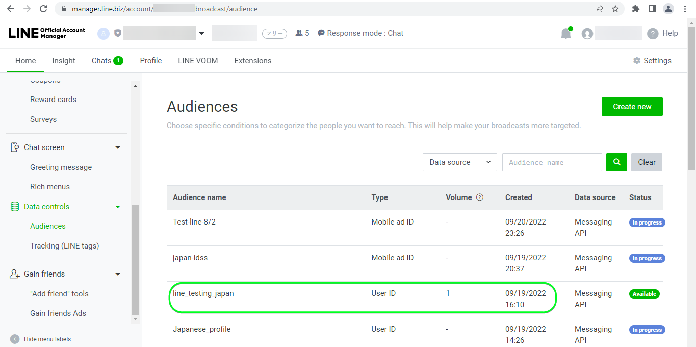

# [!DNL LINE]個連線

## 概觀 {#overview}

[[!DNL LINE]](https://line.me/en/)是連線人員、服務和資訊的常用通訊平台，已從聊天應用程式成長為娛樂、社交和日常活動的中心。

此[!DNL Adobe Experience Platform] [目的地](/help/destinations/home.md)利用[[!DNL LINE] 傳訊API](https://developers.line.biz/en/reference/messaging-api/)。 您可以從Experience Platform對象啟用設定檔，作為[!DNL LINE]內的連線，以滿足您的業務需求。

[!DNL LINE]使用持有人權杖作為驗證機制，以與[!DNL LINE]傳訊API通訊。 在[向目的地驗證](#authenticate)區段中，進一步說明如何向您的[!DNL LINE]執行個體進行驗證。

## 使用案例 {#use-cases}

作為行銷人員，您可以在行動參與目的地中鎖定使用者，並在[!DNL Adobe Experience Platform]中建立對象。 此外，只要在[!DNL Adobe Experience Platform]中更新對象和設定檔，您就可以根據其[!DNL Adobe Experience Platform]設定檔中的屬性，向他們提供個人化體驗。

## 先決條件 {#prerequisites}

### [!DNL LINE]必要條件 {#prerequisites-destination}

請注意[!DNL LINE]中的下列必要條件，以便從Experience Platform將資料匯出至您的[!DNL LINE]帳戶：

#### 您必須擁有[!DNL LINE]帳戶 {#prerequisites-account}

如果您還沒有帳戶，則需要註冊並建立[!DNL LINE]帳戶。 若要建立帳戶：

1. 瀏覽至[!DNL LINE] [帳戶登入](https://account.line.biz/login?redirectUri=https%3A%2F%2Fmanager.line.biz%2F)頁面
2. 選取&#x200B;**[!UICONTROL 建立帳戶]**。

#### 從[!DNL LINE]開發人員主控台收集[!DNL LINE channel access token (long-lived)] {#gather-credentials}

若要允許Experience Platform存取[!DNL LINE]資源，您將需要所需[!DNL LINE] *傳訊API*&#x200B;通道的&#x200B;*[!DNL Channel access token (long-lived)]*。

1. 使用您的[!DNL LINE]帳戶登入[[!DNL LINE] 開發人員主控台](https://developers.line.biz/console)。
1. 接著，存取&#x200B;*[!DNL Providers]*&#x200B;清單，然後選取感興趣的&#x200B;*[!DNL Provider]*，最後選取&#x200B;*傳訊API*&#x200B;通道以存取其設定。 如果您是第一次存取開發人員主控台，請依照[[!DNL LINE] 檔案](https://developers.line.biz/en/docs/messaging-api/getting-started/)完成建立提供者所需的步驟。
1. 最後，導覽至&#x200B;***[!DNL Channel access token]***&#x200B;區段，並複製[向目的地驗證](#authenticate)步驟中所需的&#x200B;***[!DNL Channel access token (long-lived)]***&#x200B;值。

| 認證 | 說明 | 範例 |
| --- | --- | --- |
| `[!DNL Channel access token (long-lived)]` | 您的[!DNL LINE Channel access token (long-lived)]。 | `aaa2112XSMWqLXR7..........nyilFU=` |

請參閱[[!DNL LINE] 檔案](https://developers.line.biz/en/docs/messaging-api/getting-started/)，以取得關於透過[!DNL LINE]開發人員控制檯建立管道或新增管道至您現有[!DNL LINE]帳戶的指引。

## 支援的身分 {#supported-identities}

[!DNL LINE]支援下表中描述的身分更新和匯出。 深入瞭解[身分](/help/identity-service/features/namespaces.md)。

| 目標身分 | 說明 |
|---|---|
| 廣告商ID (IFA) | 當來源身分識別是IFA *(廣告商的Apple ID)*&#x200B;或GAID * (Google Advertising ID)名稱空間時，選取廣告商(IFA)目標身分識別的ID。 |
| LINE使用者ID | 當來源身分識別為LINE使用者ID時，選取UserID目標身分。 |

## 匯出型別和頻率 {#export-type-frequency}

請參閱下表以取得目的地匯出型別和頻率的資訊。

| 項目 | 類型 | 附註 |
---------|----------|---------|
| 匯出類型 | **[!UICONTROL 以設定檔為基礎]** | 您正在匯出具有[!DNL LINE]目的地中所使用識別碼（名稱、電話號碼或其他）的對象的所有成員。 |
| 匯出頻率 | **[!UICONTROL 串流]** | 串流目的地是「一律開啟」的API型連線。 根據對象評估在Experience Platform中更新設定檔後，聯結器會立即將更新傳送至下游的目標平台。 深入瞭解[串流目的地](/help/destinations/destination-types.md#streaming-destinations)。 |

{style="table-layout:auto"}

## 連線到目標 {#connect}

>[!IMPORTANT]
>
>若要連線到目的地，您需要&#x200B;**[!UICONTROL 檢視目的地]**&#x200B;和&#x200B;**[!UICONTROL 管理目的地]** [存取控制許可權](/help/access-control/home.md#permissions)。 閱讀[存取控制總覽](/help/access-control/ui/overview.md)或連絡您的產品管理員以取得必要的許可權。

若要連線到此目的地，請依照[目的地組態教學課程](../../ui/connect-destination.md)中所述的步驟進行。 在設定目標工作流程中，填寫以下兩個區段中列出的欄位。

在&#x200B;**[!UICONTROL 目的地]** > **[!UICONTROL 目錄]**&#x200B;內，搜尋[!DNL LINE]。 或者，您可以在&#x200B;**[!UICONTROL 行動參與]**&#x200B;類別下找到它。

### 驗證目標 {#authenticate}

若要驗證到目的地，請選取&#x200B;**[!UICONTROL 連線到目的地]**。

填寫以下必填欄位。
* **[!UICONTROL 持有人權杖]**：您從[!DNL LINE]開發人員主控台的[!DNL LINE Channel access token (long-lived)]。 請參閱[收集認證](#gather-credentials)區段。

如果提供的詳細資料有效，UI會顯示帶有綠色勾號的&#x200B;**[!UICONTROL 已連線]**&#x200B;狀態。 然後您可以繼續下一步驟。

### 填寫目標詳細資訊 {#destination-details}

若要設定目的地的詳細資訊，請填寫下方的必填和選用欄位。 UI中欄位旁的星號表示該欄位為必填欄位。

* **[!UICONTROL 名稱]**：您日後可辨識此目的地的名稱。
* **[!UICONTROL 描述]**：可協助您日後識別此目的地的描述。
* **[!UICONTROL 對象型別]**：如果您要匯出的身分屬於廣告商(IFA)*的型別* ID，請選取&#x200B;**[!UICONTROL 廣告商(IFA)]**。 如果您要匯出的身分是型別&#x200B;*LINE使用者ID*，請選取&#x200B;**[!UICONTROL LINE使用者ID]**。 如需身分型別的詳細資訊，請參閱[支援的身分](#supported-identities)區段。

### 啟用警示 {#enable-alerts}

您可以啟用警報以接收有關傳送到您目的地的資料流狀態的通知。 從清單中選取警報以訂閱接收有關資料流狀態的通知。 如需警示的詳細資訊，請參閱[使用UI訂閱目的地警示](../../ui/alerts.md)的指南。

當您完成提供目的地連線的詳細資訊後，請選取&#x200B;**[!UICONTROL 下一步]**。

## 啟動此目標的對象 {#activate}

>[!IMPORTANT]
> 
>* 若要啟用資料，您需要&#x200B;**[!UICONTROL 檢視目的地]**、**[!UICONTROL 啟用目的地]**、**[!UICONTROL 檢視設定檔]**&#x200B;和&#x200B;**[!UICONTROL 檢視區段]** [存取控制許可權](/help/access-control/home.md#permissions)。 閱讀[存取控制總覽](/help/access-control/ui/overview.md)或連絡您的產品管理員以取得必要的許可權。
>* 若要匯出&#x200B;*身分*，您需要&#x200B;**[!UICONTROL 檢視身分圖表]** [存取控制許可權](/help/access-control/home.md#permissions)。  {width="100" zoomable="yes"}

閱讀[將設定檔和對象啟用至串流對象匯出目的地](/help/destinations/ui/activate-segment-streaming-destinations.md)，以瞭解啟用此目的地對象的指示。

### 對應屬性和身分 {#map}

若要將對象資料從Adobe Experience Platform正確傳送至[!DNL LINE]目的地，您必須完成欄位對應步驟。 對應包括在Experience Platform帳戶中的Experience Data Model (XDM)結構描述欄位與來自目標目的地的對應對應專案之間建立連結。 若要將您的XDM欄位正確對應到[!DNL LINE]目的地欄位，請遵循下列步驟：

根據您的來源身分，必須對應以下目標身分名稱空間：

| 目標身分 | 來源欄位 | 目標欄位 |
| --- | --- | --- |
| 廣告商ID (IFA) | `IDFA`或`GAID` | `LineId` |
| LINE使用者ID | `UserID` | `LineId` |

如果您的目標身分識別是&#x200B;*LINE使用者ID的*，您將需要下列專案：

如果您的目標識別碼是廣告商(IFA)*的*ID，您將需要下列專案：

## 驗證資料匯出 {#exported-data}

成功從Experience Platform匯出資料後，[!DNL LINE]目的地會使用選取的對象名稱，在[!DNL LINE]內建立新的對象。

若要驗證您是否已正確設定目的地，請遵循下列步驟：

1. 在[!DNL LINE]中，登入[管理員主控台](https://manager.line.biz/)。

1. 接著，導覽至&#x200B;**[!UICONTROL 資料控制項]** > **[!UICONTROL 對象]**，並檢查&#x200B;**[!UICONTROL 對象名稱]**&#x200B;欄中符合所選對象的名稱。

1. 更新的磁碟區會符合區段內的計數。

1. 如果您匯出的身分屬於&#x200B;*UserID*&#x200B;型別，*Type*&#x200B;資料行將會提及&#x200B;**[!UICONTROL UserID]**。 同樣地，如果您匯出的身分屬於&#x200B;*IDFA*&#x200B;型別，則&#x200B;*Type*&#x200B;欄將提及&#x200B;**[!UICONTROL 行動廣告ID]**。

以下顯示[!DNL LINE]中的設定範例：

## 資料使用與控管 {#data-usage-governance}

處理您的資料時，所有[!DNL Adobe Experience Platform]目的地都符合資料使用原則。 如需[!DNL Adobe Experience Platform]如何強制資料控管的詳細資訊，請參閱[資料控管概觀](/help/data-governance/home.md)。
