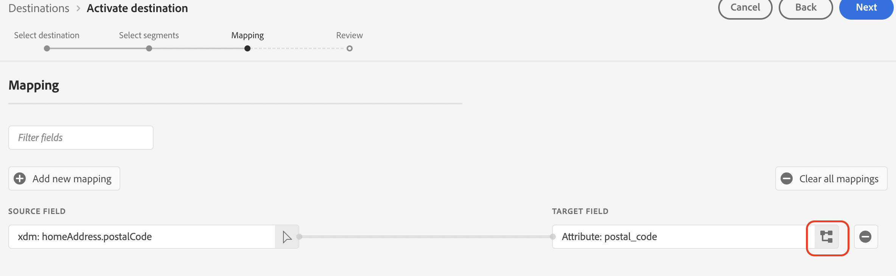
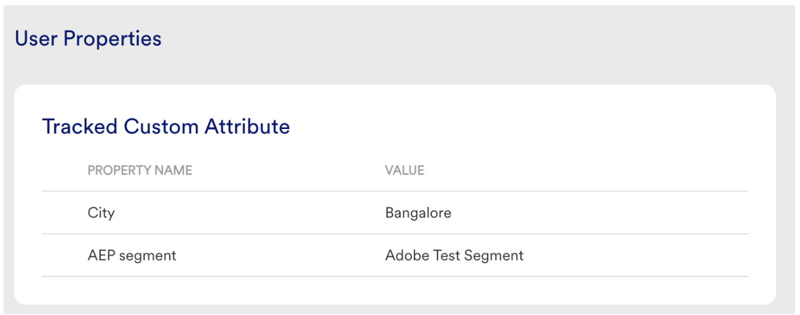

# [!DNL Moengage]個連線

## 概觀 {#overview}

使用[!DNL Moengage]目的地來連線您的Adobe資料（使用者屬性、區段和事件），並即時對應至MoEngage。 然後，客戶可以對這些資料採取行動，提供個人化、鎖定目標的體驗。

透過Adobe，整合非常簡單且直覺。 只需取用任何Adobe使用者設定檔，並將其對應至MoEngage使用者屬性即可。

>[!IMPORTANT]
>
>此目的地聯結器和檔案頁面是由&#x200B;*Moengage*&#x200B;團隊建立和維護。 若有任何查詢或更新要求，請直接在&#x200B;*`https://help.moengage.com/hc/en-us`.*&#x200B;聯絡他們

## 使用案例 {#use-cases}

行銷人員想要透過[!DNL Moengage]行銷活動鎖定使用者區段(內建於Adobe Experience Platform)。 此外，他們還想根據Adobe Experience Platform設定檔中的屬性來個人化促銷活動內容。 透過這項整合，只要在Adobe Experience Platform中更新區段和設定檔，使用者和屬性就會在MoEngage中更新。

## 先決條件 {#prerequisites}

在將Adobe Experience Platform資料傳送至[!DNL Moengage]之前，請注意下列必要條件：

* 若要搭配Adobe Experience Platform使用MoEngage目的地，使用者必須先擁有其[!DNL Moengage]帳戶的存取權。 請造訪以下頁面以註冊或登入您的MoEngage帳戶： https://app.moengage.com

## 支援的身分 {#supported-identities}

[!DNL Moengage]支援下表所述的身分啟用。

| 目標身分 | 說明 | 考量事項 |
|---|------------------------------------------------------------------------------------------|----------------------------------------------------------------------------------------|
| user_id | 在[!DNL Moengage]系統中唯一識別使用者設定檔的唯一識別碼。 | 此識別碼支援字串型別。 需要user_id或anonymous_id其中之一 |
| anonymous_id | 未知使用者設定檔的另一個識別碼，表示系統中不存在的設定檔。 | 此識別碼支援字串型別。 需要user_id或anonymous_id其中之一 |

{style="table-layout:auto"}

## 匯出型別和頻率 {#export-type-frequency}

請參閱下表以取得目的地匯出型別和頻率的資訊。

| 項目 | 類型 | 附註 |
---------|----------|------------------------------------------------------------------------------------------------------------------------------------------------------------------------------------------------------------------------------------------------------------------------------------------------------------------------------------|
| 匯出類型 | **[!UICONTROL 以設定檔為基礎]** | 您正在匯出區段（受眾）的所有成員，其中包含識別碼(user_id、anonymous_id)以及您匯出至[!DNL Moengage]所定義的自訂屬性。 |
| 匯出頻率 | **[!UICONTROL 串流]** | 串流目的地是「一律開啟」的API型連線。 一旦根據區段評估在Experience Platform中更新了設定檔，聯結器就會將更新傳送至下游的目標平台。 深入瞭解[串流目的地](/help/destinations/destination-types.md#streaming-destinations)。 |

{style="table-layout:auto"}

## 連線到目標 {#connect}

>[!IMPORTANT]
> 
>若要連線到目的地，您需要&#x200B;**[!UICONTROL 檢視目的地]**&#x200B;和&#x200B;**[!UICONTROL 管理目的地]** [存取控制許可權](/help/access-control/home.md#permissions)。 閱讀[存取控制總覽](/help/access-control/ui/overview.md)或連絡您的產品管理員以取得必要的許可權。

若要連線到此目的地，請依照[目的地組態教學課程](../../ui/connect-destination.md)中所述的步驟進行。 在設定目標工作流程中，填寫以下兩個區段中列出的欄位。

### 驗證目標 {#authenticate}

若要驗證到目的地，請填入必填欄位，然後選取&#x200B;**[!UICONTROL 連線到目的地]**。

### 填寫目標詳細資訊 {#destination-details}

若要設定目的地的詳細資訊，請填寫下方的必填和選用欄位。 UI中欄位旁的星號表示該欄位為必填欄位。

* **[!UICONTROL 使用者名稱]**： [!DNL Moengage]儀表板的設定頁面資料應用程式識別碼。
* **[!UICONTROL 密碼]**：來自[!DNL Moengage]儀表板的設定頁面的資料應用程式金鑰。

* **[!UICONTROL 名稱]**：您日後可辨識此目的地的名稱。
* **[!UICONTROL 描述]**：可協助您日後識別此目的地的描述。
* **[!UICONTROL 地區]**：您的應用程式&#x200B;*資料中心*。

### 啟用警示 {#enable-alerts}

您可以啟用警報以接收有關傳送到您目的地的資料流狀態的通知。 從清單中選取警報以訂閱接收有關資料流狀態的通知。 如需警示的詳細資訊，請參閱[使用UI訂閱目的地警示](../../ui/alerts.md)的指南。

當您完成提供目的地連線的詳細資訊後，請選取&#x200B;**[!UICONTROL 下一步]**。

## 啟用此目的地的區段 {#activate}

>[!IMPORTANT]
> 
>若要啟用資料，您需要&#x200B;**[!UICONTROL 檢視目的地]**、**[!UICONTROL 啟用目的地]**、**[!UICONTROL 檢視設定檔]**&#x200B;和&#x200B;**[!UICONTROL 檢視區段]** [存取控制許可權](/help/access-control/home.md#permissions)。 閱讀[存取控制總覽](/help/access-control/ui/overview.md)或連絡您的產品管理員以取得必要的許可權。

如需啟用此目的地的對象區段的指示，請參閱[啟用串流區段匯出目的地的對象資料](../../ui/activate-segment-streaming-destinations.md)。

### 對應屬性和身分 {#map}

若要將對象資料從[!DNL Adobe Experience Platform]正確傳送至[!DNL Moengage]目的地，您必須完成欄位對應步驟。

對應包括在[!DNL Platform]帳戶中的[!DNL Experience Data Model] (XDM)結構描述欄位之間建立連結，以及從目標目的地建立對應對應專案。

若要將您的XDM欄位正確對應到[!DNL Moengage]目的地欄位，請遵循下列步驟：

在[!UICONTROL 對應]步驟中，選取&#x200B;**[!UICONTROL 核取方塊]**。

在[!UICONTROL 對應]步驟中，選取&#x200B;**[!UICONTROL 新增對應]**。

在[!UICONTROL Source欄位]區段中，選取空白欄位旁的箭頭按鈕。

在[!UICONTROL 選取來源欄位]視窗中，您可以在兩種類別的XDM欄位之間進行選擇：
* [!UICONTROL 選取屬性]：使用此選項將您XDM結構描述中的特定欄位對應到[!DNL Moengage]屬性。

選擇您的來源欄位，然後選取&#x200B;**[!UICONTROL 選取]**。

在[!UICONTROL 目標欄位]區段中，選取欄位右側的對應圖示。

在[!UICONTROL 選取目標欄位]視窗中，您可以選擇兩種目標欄位類別：
* [!UICONTROL 選取身分名稱空間]：使用此選項將[!DNL Platform]身分名稱空間對應到[!DNL Moengage]身分名稱空間。
* [!UICONTROL 選取自訂屬性]：使用此選項將XDM屬性對應到您在[!DNL Moengage]帳戶中定義的自訂[!DNL Moengage]屬性。  您也可以使用此選項將現有的XDM屬性重新命名為[!DNL Moengage]。 例如，將`lastName` XDM屬性對應至[!DNL Moengage]中的自訂`Last_Name`屬性，將在[!DNL Moengage]中建立`Last_Name`屬性（如果尚未存在），並將`lastName` XDM屬性對應至該屬性。

選擇您的目標欄位，然後選取&#x200B;**[!UICONTROL 選取]**。

您現在應該會在清單中看到您的欄位對應。

若要新增更多對應，請重複上述步驟。

## 匯出的資料/驗證資料匯出 {#exported-data}

若要確認資料是否已成功匯出至[!DNL Moengage]目的地，請移至您[!DNL Moengage]帳戶的使用者設定檔。 您會看到名為「AEP區段」的使用者屬性。

## 資料使用與控管 {#data-usage-governance}

處理您的資料時，所有[!DNL Adobe Experience Platform]目的地都符合資料使用原則。 如需[!DNL Adobe Experience Platform]如何強制資料控管的詳細資訊，請閱讀[資料控管概觀](/help/data-governance/home.md)。
