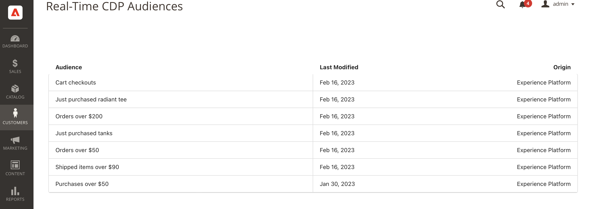

# Adobe Commerce連線 {#adobe-commerce}

## 概觀 {#overview}

此 [!DNL Adobe Commerce] 目的地聯結器可讓您選取一或多個Real-Time CDP對象，以啟用您的 [!DNL Adobe Commerce] 帳戶，為購物者提供動態的個人化體驗。 範圍 [!DNL Adobe Commerce]，接著您可以選取這些Real-Time CDP對象，以個人化購物車中的獨特選件，例如「購買2 get 1免費」。 您也可以顯示主圖橫幅，並透過促銷優惠修改產品定價，所有優惠都根據Adobe Real-Time CDP受眾自訂。

## 先決條件 {#prerequisites}

已購買Real-Time CDP Prime或Ultimate和Adobe Commerce的客戶可在目的地目錄中找到此聯結器。

若要使用此目的地連線，請確定您有以下存取權：

- [Adobe Experience Platform](https://experience.adobe.com/)
- [Adobe Developer Console](https://developer.adobe.com/developer-console/docs/guides/getting-started/). 您可以存取開發人員主控台，檢視所需的服務帳戶和認證資訊 [完成設定](https://experienceleague.adobe.com/docs/commerce-admin/customers/customers-menu/audience-activation.html#configure-the-extension) Adobe Commerce中擴充功能的ID。
- [Adobe Commerce Cloud 2.4.4版或更新版本](https://business.adobe.com/products/magento/magento-commerce.html)

在Experience Platform中，建立下列專案：

- [結構描述](../../../xdm/schema/composition.md). 您建立的結構描述代表您計畫從Adobe Commerce擷取的資料。 [瞭解更多](https://experienceleague.adobe.com/docs/commerce-merchant-services/data-connection/fundamentals/update-xdm.html) 有關如何建立包含Commerce特定欄位群組的結構描述。
- [資料集](../../../catalog/datasets/user-guide.md#create). 資料集是資料集合的儲存和管理結構。 您會使用先前建立的結構描述建立此資料集。
- [資料流](../../../datastreams/overview.md#create). 可讓資料從Adobe Experience Platform流向其他AdobeDX產品的ID。 此ID必須與您特定Adobe Commerce執行個體中的特定網站相關聯。 當您建立此資料流時，請指定您在上面建立的XDM結構描述。

完成先決條件後，請連線至 [!DNL Commerce] 目的地。

## 連線到目標 {#connect}

>[!IMPORTANT]
> 
>若要連線到目的地，您需要 **[!UICONTROL 檢視目的地]** 和 **[!UICONTROL 管理目的地]** [存取控制許可權](/help/access-control/home.md#permissions). 閱讀 [存取控制總覽](/help/access-control/ui/overview.md) 或聯絡您的產品管理員以取得必要許可權。

若要連線至 [!DNL Adobe Commerce] 目的地：

1. 在 [平台介面](https://experience.adobe.com/platform/)，前往 **[!UICONTROL 目的地]** > **[!UICONTROL 目錄]**.
1. 選取 **[!UICONTROL 個人化]**.
1. 選取Adobe Commerce目標以反白顯示，然後選取「 」 **[!UICONTROL 設定]**.
1. 請依照中所述的步驟操作。 [目的地設定教學課程](../../ui/connect-destination.md).

### 連線參數 {#parameters}

當 [設定](../../ui/connect-destination.md) 您必須提供下列資訊給此目的地：

- **[!UICONTROL 名稱]**：填寫此目的地的偏好名稱。
- **[!UICONTROL 說明]**：輸入目的地的說明。 例如，您可以提及要將此目的地用於哪個行銷活動。 此欄位為選用。
- **[!UICONTROL 整合別名]**：此值會以JSON物件名稱的形式傳送至Experience PlatformWeb SDK。
- **[!UICONTROL 資料串流ID]**：這會決定哪些資料收集資料串流包含頁面回應中所包含的對象。 下拉選單僅顯示已啟用目的地設定的資料流。另請參閱 [設定資料串流](../../../datastreams/overview.md) 以取得更多詳細資料。

### 啟用警示 {#enable-alerts}

您可以啟用警報以接收有關傳送到您目的地的資料流狀態的通知。 從清單中選取警報以訂閱接收有關資料流狀態的通知。 如需警示的詳細資訊，請參閱以下指南： [使用UI訂閱目的地警報](../../ui/alerts.md).

當您完成提供目的地連線的詳細資訊時，請選取「 」 **[!UICONTROL 下一個]**.

## 啟用對象至 [!DNL Commerce] 目的地 {#activate}

>[!IMPORTANT]
> 
>若要啟用資料，您需要 **[!UICONTROL 檢視目的地]**， **[!UICONTROL 啟用目的地]**， **[!UICONTROL 檢視設定檔]**、和 **[!UICONTROL 檢視區段]** [存取控制許可權](/help/access-control/home.md#permissions). 閱讀 [存取控制總覽](/help/access-control/ui/overview.md) 或聯絡您的產品管理員以取得必要許可權。

讀取 [啟用設定檔和對象以設定檔請求目的地](../../ui/activate-edge-personalization-destinations.md) 以取得啟用對象至 [!DNL Commerce] 目的地。

## 中的後續步驟 [!DNL Adobe Commerce]

現在您已設定 [!DNL Commerce] 目的地在Experience Platform中，您必須安裝 [!DNL Audience Activation] 中的擴充功能 [!DNL Commerce] 並設定 [!DNL Commerce Admin] 以匯入您建立的Real-Time CDP對象。 請參閱 [[!DNL Commerce] 檔案](https://experienceleague.adobe.com/docs/commerce-admin/customers/customers-menu/audience-activation.html) 以進一步瞭解。

## 驗證Commerce中的對象啟用 {#exported-data}

在您啟動Real-Time CDP對象至您的 [!DNL Adobe Commerce] 帳戶，當您前往 _管理員_ 側欄，然後前往 **[!UICONTROL 客戶]** > **[!UICONTROL Real-Time CDP對象]**.

## 資料使用與控管 {#data-usage-governance}

全部 [!DNL Adobe Experience Platform] 處理您的資料時，目的地符合資料使用原則。 如需如何操作的詳細資訊 [!DNL Adobe Experience Platform] 強制執行資料控管，讀取 [資料控管概觀](/help/data-governance/home.md).
