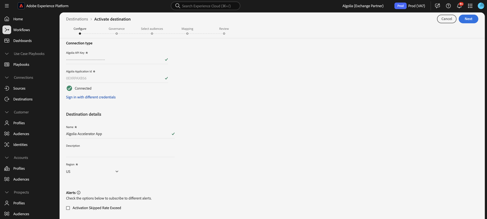

# [!DNL Algolia] 連線

## 概觀 {#overview}

>[!IMPORTANT]
>
>[!DNL Algolia]目的地聯結器和檔案頁面是由Algolia Integration Services團隊建立和維護的。 如需查詢或更新要求，請透過[adobe-algolia-solutions@algolia.com](mailto:adobe-algolia-solutions@algolia.com)聯絡他們。

使用[!DNL Algolia]目的地連線將[!DNL Adobe Experience Platform]個對象傳送至Algolia進行個人化搜尋與建議。 您必須先設定[!DNL Algolia]來源聯結器，才能使用[[!DNL Algolia User Profiles]](/help/sources/connectors/data-partners/algolia-user-profiles.md)目的地聯結器。 在來源聯結器設定教學課程中，您將建立Algoria使用者權杖身分。 當您設定目的地聯結器時，對應需要此身分。

本教學課程提供使用[!DNL Algolia]使用者介面建立[!DNL Adobe Experience Platform]目的地連線和資料流的步驟。

## 使用案例 {#use-cases}

為協助您更清楚瞭解您應如何及何時使用[!DNL Algolia]目的地，以下是[!DNL Adobe Experience Platform]客戶可以使用此目的地解決的範例使用案例。

### Personalization一致性 {#personalization-consistency}

使用此目的地聯結器，從首頁跨您的網站提供一致的個人化內容以進行搜尋。

例如，身為行銷人員，您可能想要從多個使用者資料來源（包括Algoria）在[!DNL Adobe Experience Platform]中建立豐富的對象。 您可以使用[!DNL Algolia]目的地聯結器來共用目標定位策略的對象，進而提高行銷活動的個人化和轉換。

若要實作此使用案例，您必須同時使用[[!DNL Algolia User Profiles]](/help/sources/connectors/data-partners/algolia-user-profiles.md)來源和[!DNL Algolia]目的地聯結器。

您應該先將現有的[!DNL Algolia]使用者設定檔匯入至[!DNL Adobe Experience Platform] [!DNL Real-Time CDP]和其他來源，以開始使用來源聯結器建立豐富受眾。 行銷人員會使用可傳送至演演算法以供搜尋及建議個人化的設定檔資料來建立對象。

然後，使用對應的[[!DNL Algolia User Profiles]](/help/sources/connectors/data-partners/algolia-user-profiles.md)來源聯結器將客戶設定檔擷取並擴大回[!DNL Real-Time CDP]。

## 先決條件 {#prerequisites}

>[!IMPORTANT]
>
>* 若要連線到目的地，您需要&#x200B;**[!UICONTROL View Destinations]**&#x200B;和&#x200B;**[!UICONTROL Manage Destinations]**、**[!UICONTROL Activate Destinations]**、**[!UICONTROL View Profiles]**&#x200B;和&#x200B;**[!UICONTROL View Segments]** [存取控制許可權](/help/access-control/home.md#permissions)。 閱讀[存取控制總覽](/help/access-control/ui/overview.md)或連絡您的產品管理員以取得必要的許可權。
>* 若要匯出&#x200B;*身分*，您需要&#x200B;**[!UICONTROL View Identity Graph]** [存取控制許可權](/help/access-control/home.md#permissions)。  {width="100" zoomable="yes"}

## 支援的身分 {#supported-identities}

[!DNL Algolia]支援下表所述的身分啟用。 深入瞭解[身分](https://experienceleague.adobe.com/zh-hant/docs/experience-platform/identity/features/namespaces)。

| 目標身分 | 說明 | 考量事項 |
|---------|---------|----------|
| userId | [!DNL Algolia]使用者權杖 | 選取此目標識別以將`AlgoliaUserToken`來源識別對應到`userToken`平台中的[!DNL Algolia]。 |

{style="table-layout:auto"}

## 支援的對象 {#supported-audiences}

本節說明您可以將哪些型別的對象匯出至此目的地。

| 對象來源 | 支援 | 說明 |
|---------|---------|----------|
| [!DNL Segmentation Service] | 是 | 透過Experience Platform [細分服務](../../../segmentation/home.md)產生的對象。 |
| 所有其他受眾來源 | 是 | 此類別包含透過[!DNL Segmentation Service]產生的對象以外的所有對象來源。 閱讀[各種對象來源](/help/segmentation/ui/audience-portal.md#customize)。 部分範例包括： <ul><li> 自訂上傳對象[從CSV檔案匯入](../../../segmentation/ui/audience-portal.md#import-audience)至Experience Platform，</li><li> 相似受眾， </li><li> 同盟對象， </li><li> 其他Experience Platform應用程式中產生的對象，例如[!DNL Adobe Journey Optimizer]、 </li><li> 及更多內容。 </li></ul> |

{style="table-layout:auto"}

依受眾資料型別支援的受眾：

| 對象資料型別 | 支援 | 說明 | 使用案例 |
|--------------------|-----------|-------------|-----------|
| [人員對象](/help/segmentation/types/people-audiences.md) | 是 | 根據客戶設定檔，可讓您針對行銷活動的特定人群進行定位。 | 經常購買者、購物車放棄者 |
| [帳戶對象](/help/segmentation/types/account-audiences.md) | 無 | 針對帳戶型行銷策略，鎖定特定組織內的個人。 | B2B行銷 |
| [潛在客戶對象](/help/segmentation/types/prospect-audiences.md) | 無 | 將目標定位為尚未成為客戶但與目標受眾具有相同特性的個人。 | 使用第三方資料進行勘探 |
| [資料集匯出](/help/catalog/datasets/overview.md) | 無 | 儲存在[!DNL Adobe Experience Platform]資料湖中的結構化資料集合。 | 報告、資料科學工作流程 |

{style="table-layout:auto"}

## 匯出型別和頻率 {#export-type-frequency}

請參閱下表以取得目的地匯出型別和頻率的資訊。

| 項目 | 類型 | 附註 |
|---------|----------|---------|
| 匯出類型 | **[!DNL Audience export]** | 您正在匯出具有[!DNL Algolia]目的地中所使用識別碼（名稱、電話號碼或其他）的對象的所有成員。 |
| 匯出頻率 | **[!UICONTROL Streaming]** | 串流目的地是「一律開啟」的API型連線。 根據對象評估在Experience Platform中更新設定檔後，聯結器會立即將更新傳送至下游的目標平台。 深入瞭解[串流目的地](/help/destinations/destination-types.md#streaming-destinations)。 |

{style="table-layout:auto"}

## 連線到目標 {#connect}

>[!IMPORTANT]
>
>若要連線到目的地，您需要&#x200B;**[!UICONTROL View Destinations]**&#x200B;和&#x200B;**[!UICONTROL Manage and Activate Dataset Destinations]** [存取控制許可權](/help/access-control/home.md#permissions)。 閱讀[存取控制總覽](/help/access-control/ui/overview.md)或連絡您的產品管理員以取得必要的許可權。

若要連線到此目的地，請依照[目的地組態教學課程](../../ui/connect-destination.md)中所述的步驟進行。 在目標設定工作流程中，填寫以下兩個區段中列出的欄位。

### 驗證目標 {#authenticate}

若要驗證到目的地，請填寫必填欄位並選取&#x200B;**[!UICONTROL Connect to destination]**。

* **[!UICONTROL Application ID]**： [!DNL Algolia]應用程式識別碼是指派給您[!DNL Algolia]帳戶的唯一識別碼。
* **[!UICONTROL API Key]**： [!DNL Algolia] API金鑰是用來向[!DNL Algolia]的搜尋和索引服務驗證及授權API要求的認證。

如需這些認證的詳細資訊，請參閱[!DNL Algolia] [驗證檔案](https://www.algolia.com/doc/tools/cli/get-started/authentication/)。

### 填寫目標詳細資訊 {#destination-details}

若要設定目的地的詳細資訊，請填寫下方的必填和選用欄位。 UI中欄位旁的星號表示該欄位為必填欄位。

* **[!UICONTROL Name]**：填寫此目的地的偏好名稱。
* **[!UICONTROL Description]**：目的地的簡短說明。
* **[!UICONTROL Region]**：選項為&#x200B;**US**&#x200B;或&#x200B;**EU**。 選取儲存客戶資料的區域。

### 啟用警示 {#enable-alerts}

您可以啟用警報以接收有關傳送到您目的地的資料流狀態的通知。 從清單中選取警報以訂閱接收有關資料流狀態的通知。 如需警示的詳細資訊，請參閱[使用UI訂閱目的地警示](../../ui/alerts.md)的指南。

當您完成提供目的地連線的詳細資訊時，請選取&#x200B;**[!UICONTROL Next]**。

## 啟動此目標的對象 {#activate}

>[!IMPORTANT]
>
>* 若要啟用資料，您需要&#x200B;**[!UICONTROL View Destinations]**、**[!UICONTROL Activate Destinations]**、**[!UICONTROL View Profiles]**&#x200B;和&#x200B;**[!UICONTROL View Segments]** [存取控制許可權](/help/access-control/home.md#permissions)。 閱讀[存取控制總覽](/help/access-control/ui/overview.md)或連絡您的產品管理員以取得必要的許可權。
>* 若要匯出身分，您需要檢視身分圖表[存取控制許可權](https://experienceleague.adobe.com/zh-hant/docs/experience-platform/access-control/home#permissions)。

閱讀[將設定檔和對象啟用至串流對象匯出目的地](https://experienceleague.adobe.com/zh-hant/docs/experience-platform/destinations/ui/activate/activate-segment-streaming-destinations)，以瞭解啟用此目的地對象的指示。

### 對應屬性和身分 {#mapping-attributes-identities}

在[!UICONTROL Mapping step]期間，您必須將AlgoliaUserToken來源識別對應到userId目標識別。

## 驗證資料匯出 {#exported-data}

若要確認對象是否已成功匯出至使用者設定檔，請檢查您的[!DNL Algolia]儀表板，並導覽至&#x200B;**[!UICONTROL Advanced Personalization]**&#x200B;並按一下&#x200B;**[!UICONTROL User Inspector]**。 尋找與匯出的[!DNL Adobe Experience Platform]對象相關聯的使用者設定檔，並在使用者檢查器中搜尋它。 您會在區段區段中看到對象ID。

## 資料使用與控管 {#data-usage-governance}

處理您的資料時，所有[!DNL Adobe Experience Platform]目的地都符合資料使用原則。 如需[!DNL Adobe Experience Platform]如何強制資料控管的詳細資訊，請閱讀[資料控管概觀](https://experienceleague.adobe.com/docs/experience-platform/data-governance/home.html?lang=zh-Hant)。

## 其他資源 {#additional-resources}

如需詳細資訊，請參閱下列[!DNL Algolia]檔案：

* [什麼是Advanced Personalization？](https://www.algolia.com/doc/guides/personalization/advanced-personalization/what-is-advanced-personalization/)
* [使用者設定檔](https://www.algolia.com/doc/guides/personalization/advanced-personalization/what-is-advanced-personalization/concepts/user-profiles/)
* [具有規則內容的使用者區段](https://www.algolia.com/doc/guides/personalization/advanced-personalization/implement/guides/segment-users-with-rule-contexts/#assign-a-segment-context-at-query-time)

## 後續步驟 {#next-steps}

依照本教學課程所述，您已成功建立資料流，以將對象從Experience Platform匯出至您的[!DNL Algolia]應用程式。 如需[!DNL Algolia]平台的詳細資訊，請參閱[Algolia檔案](https://www.algolia.com/doc/)。
