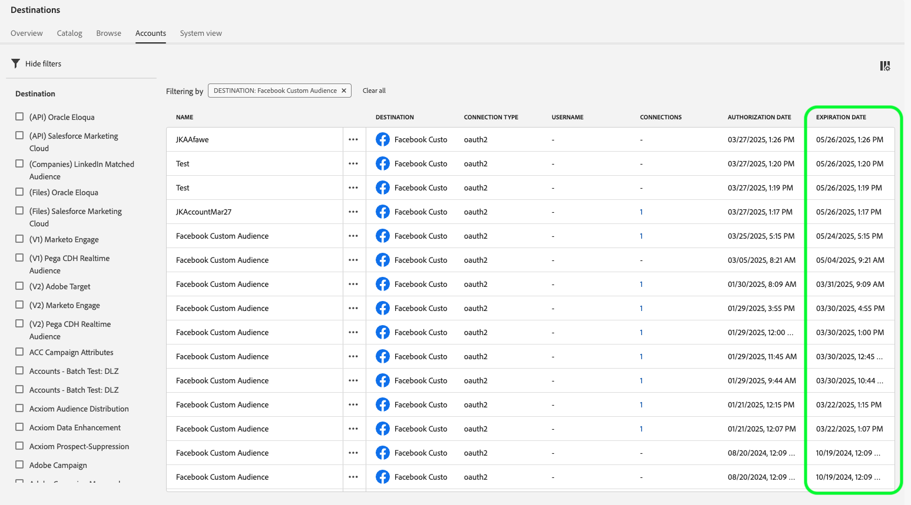

# [!DNL Facebook]個連線

## 概觀 {#overview}

為您的[!DNL Facebook]行銷活動啟用設定檔，以根據雜湊電子郵件進行對象目標定位、個人化和隱藏。

您可以將此目的地用於[!DNL Custom Audiences]所支援之[!DNL Facebook's]系列應用程式的對象目標定位，包括[!DNL Facebook]、[!DNL Instagram]、[!DNL Audience Network]和[!DNL Messenger]。 在[!DNL Facebook Ads Manager]中的版位層級會指出您選擇針對哪個應用程式執行行銷活動。

在Adobe Experience Platform UI中的

## 使用案例

為協助您更清楚瞭解如何使用[!DNL Facebook]目的地，以下是Adobe Experience Platform客戶可以使用此功能解決的兩個範例使用案例。

### 使用案例#1

線上retailer想要透過社交平台觸及現有客戶，並根據他們先前的訂單向他們顯示個人化優惠。 線上retailer可從自己的CRM擷取電子郵件地址至Adobe Experience Platform，從自己的離線資料建立對象，並將這些對象傳送至[!DNL Facebook]社交平台，以最佳化其廣告支出。

### 使用案例#2

航空公司有不同的客戶層級（銅、銀和金），並想要透過社交平台為每個層級提供個人化優惠。 不過，並非所有客戶都使用航空公司的行動應用程式，其中部分客戶尚未登入公司網站。 公司對這些客戶擁有的唯一識別碼是會員ID和電子郵件地址。

若要透過社群媒體鎖定他們，他們可以使用電子郵件地址作為識別碼，將客戶資料從其CRM上線到Adobe Experience Platform。

接著，他們可以使用離線資料（包括相關聯的會籍ID和客戶階層）建立可透過[!DNL Facebook]目的地鎖定的新對象。

## 支援的身分 {#supported-identities}

[!DNL Facebook Custom Audiences]支援下表所述的身分啟用。 深入瞭解[身分](/help/identity-service/features/namespaces.md)。

| 目標身分 | 說明 | 考量事項 |
|---|---|---|
| `GAID` | GOOGLE ADVERTISING ID | 當您的來源身分是GAID名稱空間時，請選取GAID目標身分。 |
| `IDFA` | 廣告商適用的Apple ID | 當您的來源身分是IDFA名稱空間時，請選取IDFA目標身分。 |
| `phone_sha256` | 使用SHA256演演算法雜湊的電話號碼 | Adobe Experience Platform同時支援純文字和SHA256雜湊電話號碼。 請依照[識別碼符合需求](#id-matching-requirements-id-matching-requirements)區段中的指示操作，分別使用適當的名稱空間來使用純文字和雜湊電話號碼。 當您的來源欄位包含未雜湊的屬性時，請核取&#x200B;**[!UICONTROL 套用轉換]**&#x200B;選項，讓[!DNL Experience Platform]在啟用時自動雜湊資料。 |
| `email_lc_sha256` | 使用SHA256演演算法雜湊的電子郵件地址 | Adobe Experience Platform同時支援純文字和SHA256雜湊電子郵件地址。 請依照[識別碼符合需求](#id-matching-requirements-id-matching-requirements)區段中的指示操作，針對純文字和雜湊電子郵件地址分別使用適當的名稱空間。 當您的來源欄位包含未雜湊的屬性時，請核取&#x200B;**[!UICONTROL 套用轉換]**&#x200B;選項，讓[!DNL Experience Platform]在啟用時自動雜湊資料。 |
| `extern_id` | 自訂使用者ID | 當您的來源身分是自訂名稱空間時，請選取此目標身分。 |
| `gender` | 性別 | 接受的值： <ul><li>男性`m`</li><li>女性`f`</li></ul> Experience Platform **在將此值傳送至Facebook之前，會自動雜湊**。 這種自動雜湊是遵守Facebook安全性和隱私權需求所需。 請&#x200B;**不要**&#x200B;為此欄位提供預先雜湊值，因為這會造成比對程式失敗。 |
| `date_of_birth` | 出生日期 | 接受的格式： `yyyy-MM-DD`。  Experience Platform **在將此值傳送至Facebook之前，會自動雜湊**。 這種自動雜湊是遵守Facebook安全性和隱私權需求所需。 請&#x200B;**不要**&#x200B;為此欄位提供預先雜湊值，因為這會造成比對程式失敗。 |
| `last_name` | 姓氏 | 接受的格式：小寫、僅限`a-z`個字元、無標點符號。 對於特殊字元使用UTF-8編碼。   Experience Platform **在將此值傳送至Facebook之前，會自動雜湊**。 這種自動雜湊是遵守Facebook安全性和隱私權需求所需。 請&#x200B;**不要**&#x200B;為此欄位提供預先雜湊值，因為這會造成比對程式失敗。 |
| `first_name` | 名字 | 接受的格式：小寫、僅限`a-z`個字元、無標點符號、無空格。 對於特殊字元使用UTF-8編碼。   Experience Platform **在將此值傳送至Facebook之前，會自動雜湊**。 這種自動雜湊是遵守Facebook安全性和隱私權需求所需。 請&#x200B;**不要**&#x200B;為此欄位提供預先雜湊值，因為這會造成比對程式失敗。 |
| `first_name_initial` | 名字初始 | 接受的格式：小寫，僅限`a-z`個字元。 對於特殊字元使用UTF-8編碼。   Experience Platform **在將此值傳送至Facebook之前，會自動雜湊**。 這種自動雜湊是遵守Facebook安全性和隱私權需求所需。 請&#x200B;**不要**&#x200B;為此欄位提供預先雜湊值，因為這會造成比對程式失敗。 |
| `state` | 狀態 | 使用小寫的[2字元ANSI縮寫代碼](https://en.wikipedia.org/wiki/Federal_Information_Processing_Standard_state_code)。 對於非美國州，請使用小寫字元、無標點符號、無特殊字元及無空格。   Experience Platform **在將此值傳送至Facebook之前，會自動雜湊**。 這種自動雜湊是遵守Facebook安全性和隱私權需求所需。 請&#x200B;**不要**&#x200B;為此欄位提供預先雜湊值，因為這會造成比對程式失敗。 |
| `city` | 城市 | 接受的格式：小寫、僅限`a-z`個字元、無標點符號、無特殊字元、無空格。   Experience Platform **在將此值傳送至Facebook之前，會自動雜湊**。 這種自動雜湊是遵守Facebook安全性和隱私權需求所需。 請&#x200B;**不要**&#x200B;為此欄位提供預先雜湊值，因為這會造成比對程式失敗。 |
| `zip` | 郵遞區號 | 接受的格式：小寫，無空格。 若是美國郵遞區號，僅使用前5位數。 在英國，請使用`Area/District/Sector`格式。   Experience Platform **在將此值傳送至Facebook之前，會自動雜湊**。 這種自動雜湊是遵守Facebook安全性和隱私權需求所需。 請&#x200B;**不要**&#x200B;為此欄位提供預先雜湊值，因為這會造成比對程式失敗。 |
| `country` | 國家/地區 | 接受的格式： [ISO 3166-1 alpha-2](https://en.wikipedia.org/wiki/ISO_3166-1_alpha-2)格式的小寫、雙字母國碼。   Experience Platform **在將此值傳送至Facebook之前，會自動雜湊**。 這種自動雜湊是遵守Facebook安全性和隱私權需求所需。 請&#x200B;**不要**&#x200B;為此欄位提供預先雜湊值，因為這會造成比對程式失敗。 |

## 支援的對象 {#supported-audiences}

本節說明您可以將哪些型別的對象匯出至此目的地。

| 對象來源 | 支援 | 說明 |
|---------|----------|----------|
| [!DNL Segmentation Service] | ✓ | 透過Experience Platform [細分服務](../../../segmentation/home.md)產生的對象。 |
| 自訂上傳 | ✓ | 對象[從CSV檔案匯入](../../../segmentation/ui/audience-portal.md#import-audience)至Experience Platform。 |

{style="table-layout:auto"}

## 匯出型別和頻率 {#export-type-frequency}

請參閱下表以取得目的地匯出型別和頻率的資訊。

| 項目 | 類型 | 附註 |
---------|----------|---------|
| 匯出類型 | **[!UICONTROL 對象匯出]** | 您正在匯出具有Facebook目的地中所使用識別碼（名稱、電話號碼或其他）的對象的所有成員。 |
| 匯出頻率 | **[!UICONTROL 串流]** | 串流目的地是「一律開啟」的API型連線。 根據對象評估在Experience Platform中更新設定檔後，聯結器會立即將更新傳送至下游的目標平台。 深入瞭解[串流目的地](/help/destinations/destination-types.md#streaming-destinations)。 |

{style="table-layout:auto"}

## Facebook帳戶必要條件 {#facebook-account-prerequisites}

在將您的對象傳送至[!DNL Facebook]之前，請確定您符合下列要求：

* 您的[!DNL Facebook]使用者帳戶必須擁有擁有您正在使用之廣告帳戶的[!DNL Facebook Business Account]的完整存取權。
* 您的[!DNL Facebook]使用者帳戶必須針對您計畫使用的廣告帳戶啟用&#x200B;**[!DNL Manage campaigns]**&#x200B;許可權。
* **Adobe Experience Cloud**&#x200B;商業帳戶必須新增為您[!DNL Facebook Ad Account]的廣告合作夥伴。 使用`business ID=206617933627973`。 如需詳細資訊，請參閱Facebook檔案中的[新增合作夥伴至您的Business Manager](https://www.facebook.com/business/help/1717412048538897)。

  >[!IMPORTANT]
  >
  > 設定Adobe Experience Cloud的許可權時，您必須啟用&#x200B;**管理行銷活動**&#x200B;許可權。 [!DNL Adobe Experience Platform]整合需要許可權。

* 閱讀並簽署[!DNL Facebook Custom Audiences]服務條款。 若要這麼做，請移至`https://business.facebook.com/ads/manage/customaudiences/tos/?act=[accountID]&business_id=206617933627973`，其中`accountID`是您的[!DNL Facebook Ad Account ID]。 簽署服務條款時，請確定URL中有`business_id=206617933627973`區段。

  >[!IMPORTANT]
  >
  >簽署[!DNL Facebook Custom Audiences]服務條款時，請務必使用您在Facebook API中驗證時所用的相同使用者帳戶。

## ID比對要求 {#id-matching-requirements}

[!DNL Facebook]要求未明確傳送任何個人識別資訊(PII)。 因此，啟用至[!DNL Facebook]的對象可以從&#x200B;*雜湊*&#x200B;識別碼中中斷連線，例如電子郵件地址或電話號碼。

根據您擷取至Adobe Experience Platform的ID型別，您必須遵守其對應的要求。

## 最大化對象匹配率 {#match-rates}

若要在[!DNL Facebook]中達到最高的對象符合率，強烈建議使用`phone_sha256`和`email_lc_sha256`目標身分。

這些識別碼是[!DNL Facebook]用來跨其平台比對對象的主要識別碼。 確保您的來源資料正確對應到這些目標身分識別，並遵守[!DNL Facebook's]雜湊需求。

## 電話號碼雜湊需求 {#phone-number-hashing-requirements}

在[!DNL Facebook]中啟用電話號碼的方法有兩種：

* **擷取原始電話號碼**：您可以將[!DNL E.164]格式的原始電話號碼擷取至[!DNL Experience Platform]。 它們會在啟動時自動執行雜湊處理。 如果選擇此選項，請務必將原始電話號碼擷取到`Phone_E.164`名稱空間。
* **擷取雜湊電話號碼**：您可以在擷取至[!DNL Experience Platform]之前預先雜湊電話號碼。 如果選擇此選項，請務必將雜湊電話號碼擷取到`Phone_SHA256`名稱空間。

>[!NOTE]
>
>無法在[!DNL Facebook]中啟用擷取至`Phone`名稱空間的電話號碼。

## 電子郵件雜湊需求 {#email-hashing-requirements}

您可以將電子郵件地址雜湊後再擷取至Adobe Experience Platform，或在Experience Platform中清楚使用電子郵件地址，並在啟用時將[!DNL Experience Platform]個電子郵件地址雜湊。

若要瞭解如何在Experience Platform中擷取電子郵件地址，請參閱[批次擷取總覽](/help/ingestion/batch-ingestion/overview.md)和[串流擷取總覽](/help/ingestion/streaming-ingestion/overview.md)。

如果您選擇自行雜湊電子郵件地址，請務必遵守下列要求：

* 修剪電子郵件字串中所有開頭和結尾的空格；範例： `johndoe@example.com`，而非`<space>johndoe@example.com<space>`；
* 雜湊電子郵件字串時，請務必雜湊小寫字串；
   * 範例： `example@email.com`，而非`EXAMPLE@EMAIL.COM`；
* 確認雜湊字串全部為小寫
   * 範例： `55e79200c1635b37ad31a378c39feb12f120f116625093a19bc32fff15041149`，而非`55E79200C1635B37AD31A378C39FEB12F120F116625093A19bC32FFF15041149`；
* 請勿對字串執行Salt處理。

>[!NOTE]
>
>來自未雜湊名稱空間的資料在啟用時由[!DNL Experience Platform]自動雜湊。
>> 屬性來源資料不會自動雜湊。 當您的來源欄位包含未雜湊的屬性時，請核取&#x200B;**[!UICONTROL 套用轉換]**&#x200B;選項，讓[!DNL Experience Platform]在啟用時自動雜湊資料。
>> **[!UICONTROL 套用轉換]**&#x200B;選項只有在您選取屬性做為來源欄位時才會顯示。 選擇名稱空間時不會顯示。

## 使用自訂名稱空間 {#custom-namespaces}

在使用`Extern_ID`名稱空間傳送資料給[!DNL Facebook]之前，請確定您使用[!DNL Facebook Pixel]同步處理自己的識別碼。 如需詳細資訊，請參閱[Facebook官方檔案](https://developers.facebook.com/docs/marketing-api/audiences/guides/custom-audiences/#external_identifiers)。

## 連線到目標 {#connect}

>[!IMPORTANT]
> 
>若要連線到目的地，您需要&#x200B;**[!UICONTROL 檢視目的地]**&#x200B;和&#x200B;**[!UICONTROL 管理目的地]** [存取控制許可權](/help/access-control/home.md#permissions)。 閱讀[存取控制總覽](/help/access-control/ui/overview.md)或連絡您的產品管理員以取得必要的許可權。

若要連線到此目的地，請依照[目的地組態教學課程](../../ui/connect-destination.md)中所述的步驟進行。 在設定目標工作流程中，填寫以下兩個區段中列出的欄位。

以下影片也會示範設定[!DNL Facebook]目的地及啟用對象的步驟。

>[!VIDEO](https://video.tv.adobe.com/v/332599/?quality=12&learn=on&captions=eng)

>[!NOTE]
>
>Experience Platform使用者介面經常更新，自從錄製此影片後，可能已經變更。 如需最新資訊，請參閱[目的地設定教學課程](../../ui/connect-destination.md)。

### 驗證目標 {#authenticate}

1. 在目的地目錄中尋找Facebook目的地，並選取&#x200B;**[!UICONTROL 設定]**。
2. 選取&#x200B;**[!UICONTROL 連線到目的地]**。
   
3. 輸入您的Facebook認證，然後選取&#x200B;**登入**。

### 重新整理驗證認證 {#refresh-authentication-credentials}

Facebook驗證權杖每60天過期一次。 代號過期後，將資料匯出至目的地時即停止運作。

您可以從&#x200B;**[!UICONTROL 帳戶]**&#x200B;或&#x200B;**[!UICONTROL 瀏覽]**&#x200B;索引標籤中的&#x200B;**[!UICONTROL 帳戶到期日]**&#x200B;欄監視您的權杖到期日。

在[瀏覽]索引標籤中的

在[帳戶]索引標籤中的

若要避免權杖過期導致啟動資料流中斷，請執行以下步驟以重新驗證：

1. 導覽至&#x200B;**[!UICONTROL 目的地]** > **[!UICONTROL 帳戶]**
2. （選用）使用頁面上可用的篩選器，以僅顯示Facebook帳戶。
   
3. 選取您要重新整理的帳戶，選取省略符號並選取&#x200B;**[!UICONTROL 編輯詳細資料]**。
   ![選取[編輯詳細資料]控制項](/help/destinations/assets/catalog/social/facebook/refresh-oauth-edit-details.png)
4. 在強制回應視窗中，選取&#x200B;**[!UICONTROL 重新連線OAuth]**並使用您的Facebook認證重新驗證。
   使用Reconnect OAuth選項的

>[!SUCCESS]
> 
>您的驗證認證已更新，其到期時間已重設為60天。

### 填寫目標詳細資訊 {#destination-details}

>[!CONTEXTUALHELP]
>id="platform_destinations_connect_facebook_accountid"
>title="帳戶 ID"
>abstract="您的 Facebook 廣告帳戶 ID。您可以在您的 Facebook 廣告管理員帳戶中找到此 ID。輸入此 ID 時，都必須加上首碼 `act_`。"

若要設定目的地的詳細資訊，請填寫下方的必填和選用欄位。 UI中欄位旁的星號表示該欄位為必填欄位。

* **[!UICONTROL 名稱]**：您日後可辨識此目的地的名稱。
* **[!UICONTROL 描述]**：可協助您日後識別此目的地的描述。
* **[!UICONTROL 帳戶識別碼]**：您的[!DNL Facebook Ad Account ID]。 您可以在您的[!DNL Facebook Ads Manager]帳戶中找到此ID。 輸入此 ID 時，都必須加上首碼 `act_`。

### 啟用警示 {#enable-alerts}

您可以啟用警報以接收有關傳送到您目的地的資料流狀態的通知。 從清單中選取警報以訂閱接收有關資料流狀態的通知。 如需警示的詳細資訊，請參閱[使用UI訂閱目的地警示](../../ui/alerts.md)的指南。

當您完成提供目的地連線的詳細資訊後，請選取&#x200B;**[!UICONTROL 下一步]**。

## 啟動此目標的對象 {#activate}

>[!CONTEXTUALHELP]
>id="platform_destinations_activate_facebook_originofaudience"
>title="對象來源"
>abstract="選擇最初如何在對象中收集客戶資料。當區段以使用者為目標時，資料會顯示在 Facebook 中"

>[!CONTEXTUALHELP]
>id="platform_destinations_activate_facebook_originofaudience_customers"
>title="對象來源"
>abstract="廣告商直接從客戶那裡收集到資料了。"

>[!CONTEXTUALHELP]
>id="platform_destinations_activate_facebook_originofaudience_partners"
>title="對象來源"
>abstract="廣告商直接從他們的合作夥伴那裡收集到資料了。"

>[!CONTEXTUALHELP]
>id="platform_destinations_activate_facebook_originofaudience_customersandpartners"
>title="對象來源"
>abstract="廣告商直接從他們的客戶和合作夥伴那裡收集到資料了。"

>[!IMPORTANT]
> 
>* 若要啟用資料，您需要&#x200B;**[!UICONTROL 檢視目的地]**、**[!UICONTROL 啟用目的地]**、**[!UICONTROL 檢視設定檔]**&#x200B;和&#x200B;**[!UICONTROL 檢視區段]** [存取控制許可權](/help/access-control/home.md#permissions)。 閱讀[存取控制總覽](/help/access-control/ui/overview.md)或連絡您的產品管理員以取得必要的許可權。
>* 若要匯出&#x200B;*身分*，您需要&#x200B;**[!UICONTROL 檢視身分圖表]** [存取控制許可權](/help/access-control/home.md#permissions)。  {width="100" zoomable="yes"}

如需啟用此目的地的對象的指示，請參閱[啟用串流對象匯出目的地的對象資料](../../ui/activate-segment-streaming-destinations.md)。

在&#x200B;**[!UICONTROL 區段排程]**&#x200B;步驟中，將對象傳送至[!DNL Facebook Custom Audiences]時，您必須提供[!UICONTROL 對象來源]。

### 對應範例：在[!DNL Facebook Custom Audience]中啟用對象資料 {#example-facebook}

以下是在[!DNL Facebook Custom Audience]中啟用對象資料時的正確身分對應範例。

選取來源欄位：

* 如果您使用的電子郵件地址未進行雜湊處理，請選取`Email`名稱空間作為來源身分。
* 如果您根據[!DNL Facebook] [電子郵件雜湊需求](#email-hashing-requirements)將資料擷取的客戶電子郵件地址雜湊至[!DNL Experience Platform]，請選取`Email_LC_SHA256`名稱空間作為來源身分。
* 如果您的資料包含非雜湊電話號碼，請選取`PHONE_E.164`名稱空間作為來源身分。 [!DNL Experience Platform]將雜湊電話號碼以符合[!DNL Facebook]要求。
* 如果您根據[!DNL Facebook] [電話號碼雜湊需求](#phone-number-hashing-requirements)，將資料擷取中的電話號碼雜湊至[!DNL Experience Platform]，請選取`Phone_SHA256`名稱空間作為來源身分。
* 如果您的資料包含[!DNL Apple]個裝置識別碼，請選取`IDFA`名稱空間作為來源識別碼。
* 如果您的資料包含[!DNL Android]個裝置識別碼，請選取`GAID`名稱空間作為來源識別碼。
* 如果您的資料包含其他型別的識別碼，請選取`Custom`名稱空間作為來源識別碼。

選取目標欄位：

* 當來源名稱空間為`Email`或`Email_LC_SHA256`時，請選取`Email_LC_SHA256`名稱空間作為目標身分。
* 當來源名稱空間為`PHONE_E.164`或`Phone_SHA256`時，請選取`Phone_SHA256`名稱空間作為目標身分。
* 當來源名稱空間為`IDFA`或`GAID`時，請選取`IDFA`或`GAID`名稱空間作為目標身分。
* 當您的來源名稱空間是自訂名稱空間時，請選取`Extern_ID`名稱空間作為目標身分。

>[!IMPORTANT]
>
>來自未雜湊名稱空間的資料在啟用時由[!DNL Experience Platform]自動雜湊。
> 
>屬性來源資料不會自動雜湊。 當您的來源欄位包含未雜湊的屬性時，請核取&#x200B;**[!UICONTROL 套用轉換]**&#x200B;選項，讓[!DNL Experience Platform]在啟用時自動雜湊資料。

## 匯出的資料 {#exported-data}

對於[!DNL Facebook]，成功啟用表示將在[[!DNL Facebook Ads Manager]](https://www.facebook.com/adsmanager/manage/)中以程式設計方式建立[!DNL Facebook]自訂對象。 當使用者符合或不符合啟用的對象的資格時，將會新增及移除對象成員資格。

>[!TIP]
>
>Adobe Experience Platform與[!DNL Facebook]之間的整合支援歷史受眾回填。 當您對目的地啟用對象時，所有歷史對象資格都會傳送到[!DNL Facebook]。

## 疑難排解 {#troubleshooting}

### 400錯誤請求錯誤訊息 {#bad-request}

設定此目的地時，您可能會收到下列錯誤：

`{"message":"Facebook Error: Permission error","code":"400 BAD_REQUEST"}`

當客戶使用新建立的帳戶，且[!DNL Facebook]許可權尚未啟用時，就會發生此錯誤。

>[!IMPORTANT]
>
>請確定您接受`business ID 206617933627973`底下的[!DNL Facebook Custom Audience Terms of Service]，如[帳戶必要條件](#facebook-account-prerequisites)區段中的URL範本所示。

如果您在遵循[Facebook帳戶必要條件](#facebook-account-prerequisites)中的步驟之後收到`400 Bad Request`錯誤訊息，請等幾天讓[!DNL Facebook]許可權生效。

