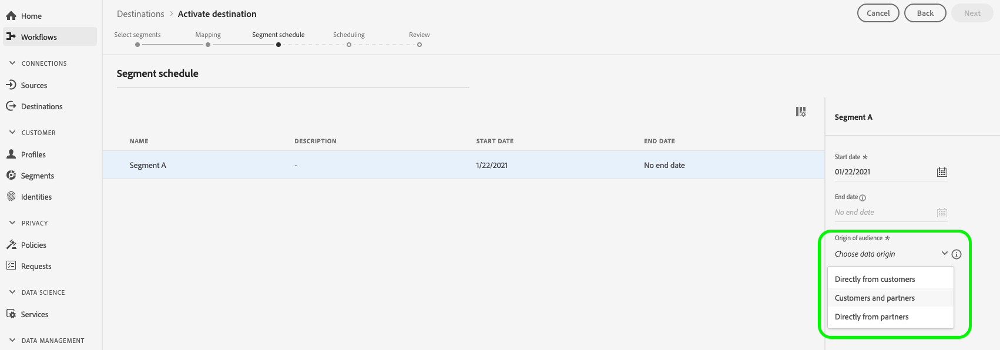

# [!DNL Facebook] 連線

## 概觀 {#overview}

為您的啟動設定檔 [!DNL Facebook] 根據雜湊電子郵件進行對象目標定位、個人化和抑制的促銷活動。

您可以使用此目的地來針對以下各項設定對象目標： [!DNL Facebook's] 所支援的應用程式系列 [!DNL Custom Audiences]，包括 [!DNL Facebook]， [!DNL Instagram]， [!DNL Audience Network]、和 [!DNL Messenger]. 在中的廣告版位層級會指出您選擇針對哪個應用程式執行行銷活動 [!DNL Facebook Ads Manager].

## 使用案例

協助您更清楚瞭解使用的方法和時機 [!DNL Facebook] 目的地，以下是Adobe Experience Platform客戶可以使用此功能解決的兩個範例使用案例。

### 使用案例#1

線上零售商想要透過社交平台觸及現有客戶，並根據他們先前的訂單向他們顯示個人化優惠。 線上零售商可以從自己的CRM擷取電子郵件地址至Adobe Experience Platform，從自己的離線資料建立受眾，並將這些受眾傳送至 [!DNL Facebook] 社交平台，最佳化廣告支出。

### 使用案例#2

航空公司有不同的客戶層級（銅、銀和金），並想要透過社交平台為每個層級提供個人化優惠。 不過，並非所有客戶都使用航空公司的行動應用程式，其中部分客戶尚未登入公司網站。 公司對這些客戶擁有的唯一識別碼是會員ID和電子郵件地址。

若要透過社群媒體鎖定他們，他們可以使用電子郵件地址作為識別碼，將客戶資料從其CRM上線到Adobe Experience Platform。

接著，他們可以使用離線資料（包括相關聯的會籍ID和客戶層級），建立可透過鎖定目標的新對象。 [!DNL Facebook] 目的地。

## 支援的身分 {#supported-identities}

[!DNL Facebook Custom Audiences] 支援下表所述的身分啟用。 進一步瞭解 [身分](/help/identity-service/features/namespaces.md).

| 目標身分 | 說明 | 考量事項 |
|---|---|---|
| GAID | GOOGLE ADVERTISING ID | 當您的來源身分是GAID名稱空間時，請選取GAID目標身分。 |
| IDFA | 廣告商適用的Apple ID | 當您的來源身分是IDFA名稱空間時，請選取IDFA目標身分。 |
| phone_sha256 | 使用SHA256演演算法雜湊的電話號碼 | Adobe Experience Platform同時支援純文字和SHA256雜湊電話號碼。 請依照 [ID比對要求](#id-matching-requirements-id-matching-requirements) 區段，並針對純文字和雜湊電話號碼分別使用適當的名稱空間。 當來源欄位包含未雜湊屬性時，請核取 **[!UICONTROL 套用轉換]** 選項，擁有 [!DNL Platform] 啟動時自動雜湊資料。 |
| email_lc_sha256 | 使用SHA256演演算法雜湊的電子郵件地址 | Adobe Experience Platform同時支援純文字和SHA256雜湊電子郵件地址。 請依照 [ID比對要求](#id-matching-requirements-id-matching-requirements) 區段，並針對純文字和雜湊電子郵件地址分別使用適當的名稱空間。 當來源欄位包含未雜湊屬性時，請核取 **[!UICONTROL 套用轉換]** 選項，擁有 [!DNL Platform] 啟動時自動雜湊資料。 |
| extern_id | 自訂使用者ID | 當您的來源身分是自訂名稱空間時，請選取此目標身分。 |

## 支援的對象 {#supported-audiences}

本節說明您可以將哪些型別的對象匯出至此目的地。

| 對象來源 | 支援 | 說明 |
|---------|----------|----------|
| [!DNL Segmentation Service] | ✓ (A) | 透過Experience Platform產生的對象 [分段服務](../../../segmentation/home.md). |
| 自訂上傳 | ✓ (A) | 受眾 [已匯入](../../../segmentation/ui/audience-portal.md#import-audience) 從CSV檔案Experience Platform為。 |

{style="table-layout:auto"}

## 匯出型別和頻率 {#export-type-frequency}

請參閱下表以取得目的地匯出型別和頻率的資訊。

| 項目 | 類型 | 附註 |
---------|----------|---------|
| 匯出類型 | **[!UICONTROL 對象匯出]** | 您正在匯出具有Facebook目的地所使用識別碼（名稱、電話號碼或其他）的對象所有成員。 |
| 匯出頻率 | **[!UICONTROL 串流]** | 串流目的地是「一律開啟」的API型連線。 一旦根據對象評估在Experience Platform中更新了設定檔，聯結器就會將更新傳送至下游的目的地平台。 深入瞭解 [串流目的地](/help/destinations/destination-types.md#streaming-destinations). |

{style="table-layout:auto"}

## facebook帳戶必要條件 {#facebook-account-prerequisites}

將受眾傳送至之前 [!DNL Facebook]，確定您符合下列需求：

* 您的 [!DNL Facebook] 使用者帳戶必須擁有 [!DNL Facebook Business Account] 擁有您正在使用的廣告帳戶。
* 您的 [!DNL Facebook] 使用者帳戶必須具有 **[!DNL Manage campaigns]** 已為您計畫使用的廣告帳戶啟用許可權。
* 此 **Adobe Experience Cloud** 企業帳戶必須新增為廣告合作夥伴，才能在您的 [!DNL Facebook Ad Account]. 使用 `business ID=206617933627973`. 另請參閱 [新增合作夥伴至您的Business Manager](https://www.facebook.com/business/help/1717412048538897) 詳細資訊，請參閱Facebook檔案。
  >[!IMPORTANT]
  >
  > 設定Adobe Experience Cloud的許可權時，您必須啟用 **管理行銷活動** 許可權。 以下專案需要許可權： [!DNL Adobe Experience Platform] 整合。
* 閱讀並簽署 [!DNL Facebook Custom Audiences] 服務條款。 若要這麼做，請前往 `https://business.facebook.com/ads/manage/customaudiences/tos/?act=[accountID]`，其中 `accountID` 是您的 [!DNL Facebook Ad Account ID].
  >[!IMPORTANT]
  >
  >簽署時 [!DNL Facebook Custom Audiences] 服務條款，請務必使用您在Facebook API中驗證時所用的相同使用者帳戶。

## ID比對要求 {#id-matching-requirements}

[!DNL Facebook] 需要未明確傳送任何個人識別資訊(PII)。 因此，啟用的對象 [!DNL Facebook] 鍵可關閉 *雜湊* 識別碼，例如電子郵件地址或電話號碼。

根據您擷取至Adobe Experience Platform的ID型別，您必須遵守其對應的要求。

## 電話號碼雜湊需求 {#phone-number-hashing-requirements}

啟用電話號碼的方法有兩種 [!DNL Facebook]：

* **擷取原始電話號碼**：您可以將原始電話號碼擷取至 [!DNL E.164] 格式至 [!DNL Platform]. 它們會在啟動時自動執行雜湊處理。 如果選擇此選項，請務必將原始電話號碼擷取到 `Phone_E.164` 名稱空間。
* **擷取雜湊電話號碼**：您可以預先雜湊電話號碼，然後再擷取至 [!DNL Platform]. 如果您選取此選項，請務必將雜湊電話號碼擷取至 `Phone_SHA256` 名稱空間。

>[!NOTE]
>
>擷取至「 」的電話號碼 `Phone` 無法在中啟用名稱空間 [!DNL Facebook].

## 電子郵件雜湊需求 {#email-hashing-requirements}

您可以將電子郵件地址雜湊再擷取至Adobe Experience Platform，或使用Experience Platform中清楚的電子郵件地址，並擁有 [!DNL Platform] 啟用時雜湊這些專案。

若要瞭解如何在Experience Platform中擷取電子郵件地址，請參閱 [批次擷取概觀](/help/ingestion/batch-ingestion/overview.md) 和 [串流擷取概觀](/help/ingestion/streaming-ingestion/overview.md).

如果您選擇自行雜湊電子郵件地址，請務必遵守下列要求：

* 修剪電子郵件字串中所有開頭和結尾的空格；範例： `johndoe@example.com`，非 `<space>johndoe@example.com<space>`；
* 雜湊電子郵件字串時，請務必雜湊小寫字串；
   * 範例： `example@email.com`，非 `EXAMPLE@EMAIL.COM`；
* 確認雜湊字串全部為小寫
   * 範例： `55e79200c1635b37ad31a378c39feb12f120f116625093a19bc32fff15041149`，非 `55E79200C1635B37AD31A378C39FEB12F120F116625093A19bC32FFF15041149`；
* 請勿對字串執行Salt處理。

>[!NOTE]
>
>非雜湊名稱空間中的資料會自動透過雜湊處理 [!DNL Platform] 啟用時。
> 屬性來源資料不會自動雜湊。 當來源欄位包含未雜湊屬性時，請核取 **[!UICONTROL 套用轉換]** 選項，擁有 [!DNL Platform] 啟動時自動雜湊資料。
> 此 **[!UICONTROL 套用轉換]** 選項只有在您選取屬性作為來源欄位時才會顯示。 選擇名稱空間時不會顯示。

## 使用自訂名稱空間 {#custom-namespaces}

開始使用 `Extern_ID` 要傳送資料的名稱空間 [!DNL Facebook]，確定您使用下列專案同步處理自己的識別碼： [!DNL Facebook Pixel]. 請參閱 [facebook正式檔案](https://developers.facebook.com/docs/marketing-api/audiences/guides/custom-audiences/#external_identifiers) 以取得詳細資訊。

## 連線到目標 {#connect}

>[!IMPORTANT]
> 
>若要連線到目的地，您需要 **[!UICONTROL 檢視目的地]** 和 **[!UICONTROL 管理目的地]** [存取控制許可權](/help/access-control/home.md#permissions). 閱讀 [存取控制總覽](/help/access-control/ui/overview.md) 或聯絡您的產品管理員以取得必要許可權。

若要連線至此目的地，請遵循以下說明的步驟： [目的地設定教學課程](../../ui/connect-destination.md). 在設定目標工作流程中，填寫以下兩個區段中列出的欄位。

以下影片也會示範設定 [!DNL Facebook] 目的地並啟用對象。

>[!VIDEO](https://video.tv.adobe.com/v/332599/?quality=12&learn=on&captions=eng)

>[!NOTE]
>
>Experience Platform使用者介面經常更新，自從錄製此影片後，該介面可能已經變更。 如需最新資訊，請參閱 [目的地設定教學課程](../../ui/connect-destination.md).

### 驗證目標 {#authenticate}

1. 在目標目錄中尋找Facebook目標，然後選取 **[!UICONTROL 設定]**.
2. 選取 **[!UICONTROL 連線到目的地]**.
   
3. 輸入您的Facebook認證，然後選取 **登入**.

### 填寫目標詳細資訊 {#destination-details}

>[!CONTEXTUALHELP]
>id="platform_destinations_connect_facebook_accountid"
>title="帳戶 ID"
>abstract="您的 Facebook 廣告帳戶 ID。您可以在您的 Facebook 廣告管理員帳戶中找到此 ID。輸入此 ID 時，都必須加上首碼 `act_`。"

若要設定目的地的詳細資訊，請填寫下方的必填和選用欄位。 UI中欄位旁的星號表示該欄位為必填欄位。

* **[!UICONTROL 名稱]**：您日後可辨識此目的地的名稱。
* **[!UICONTROL 說明]**：可協助您日後識別此目的地的說明。
* **[!UICONTROL 帳戶ID]**：您的 [!DNL Facebook Ad Account ID]. 此ID可在 [!DNL Facebook Ads Manager] 帳戶。 輸入此 ID 時，都必須加上首碼 `act_`。

### 啟用警示 {#enable-alerts}

您可以啟用警報以接收有關傳送到您目的地的資料流狀態的通知。 從清單中選取警報以訂閱接收有關資料流狀態的通知。 如需警示的詳細資訊，請參閱以下指南： [使用UI訂閱目的地警報](../../ui/alerts.md).

當您完成提供目的地連線的詳細資訊時，請選取「 」 **[!UICONTROL 下一個]**.

## 啟動此目標的對象 {#activate}

>[!CONTEXTUALHELP]
>id="platform_destinations_activate_facebook_originofaudience"
>title="對象來源"
>abstract="選擇最初如何在對象中收集客戶資料。當區段以使用者為目標時，資料會顯示在 Facebook 中"

>[!CONTEXTUALHELP]
>id="platform_destinations_activate_facebook_originofaudience_customers"
>title="對象來源"
>abstract="廣告商直接從客戶那裡收集到資料了。"

>[!CONTEXTUALHELP]
>id="platform_destinations_activate_facebook_originofaudience_partners"
>title="對象來源"
>abstract="廣告商直接從他們的合作夥伴那裡收集到資料了。"

>[!CONTEXTUALHELP]
>id="platform_destinations_activate_facebook_originofaudience_customersandpartners"
>title="對象來源"
>abstract="廣告商直接從他們的客戶和合作夥伴那裡收集到資料了。"

>[!IMPORTANT]
> 
>* 若要啟用資料，您需要 **[!UICONTROL 檢視目的地]**， **[!UICONTROL 啟用目的地]**， **[!UICONTROL 檢視設定檔]**、和 **[!UICONTROL 檢視區段]** [存取控制許可權](/help/access-control/home.md#permissions). 閱讀 [存取控制總覽](/help/access-control/ui/overview.md) 或聯絡您的產品管理員以取得必要許可權。
>* 要匯出 *身分*，您需要 **[!UICONTROL 檢視身分圖表]** [存取控制許可權](/help/access-control/home.md#permissions).   {width="100" zoomable="yes"}

另請參閱 [啟用受眾資料至串流受眾匯出目的地](../../ui/activate-segment-streaming-destinations.md) 以取得啟用此目的地對象的指示。

在 **[!UICONTROL 區段排程]** 步驟，您必須提供 [!UICONTROL 對象來源] 將受眾傳送至 [!DNL Facebook Custom Audiences].

### 對應範例：啟用對象資料於 [!DNL Facebook Custom Audience] {#example-facebook}

以下是在中啟用對象資料時的正確身分對應範例 [!DNL Facebook Custom Audience].

選取來源欄位：

* 選取 `Email` 如果您使用的電子郵件地址未進行雜湊處理，則名稱空間會作為來源身分。
* 選取 `Email_LC_SHA256` 如果您在資料擷取時已將客戶電子郵件地址雜湊至 [!DNL Platform]，根據 [!DNL Facebook] [電子郵件雜湊需求](#email-hashing-requirements).
* 選取 `PHONE_E.164` 如果資料包含非雜湊電話號碼，則以名稱空間作為來源身分。 [!DNL Platform] 將雜湊電話號碼以符合 [!DNL Facebook] 需求。
* 選取 `Phone_SHA256` 如果您在資料擷取時已將電話號碼雜湊到 [!DNL Platform]，根據 [!DNL Facebook] [電話號碼雜湊需求](#phone-number-hashing-requirements).
* 選取 `IDFA` 作為來源身分的名稱空間(如果您的資料包含 [!DNL Apple] 裝置ID。
* 選取 `GAID` 作為來源身分的名稱空間(如果您的資料包含 [!DNL Android] 裝置ID。
* 選取 `Custom` 名稱空間作為來源身分（如果您的資料包含其他型別的識別碼）。

選取目標欄位：

* 選取 `Email_LC_SHA256` 當來源名稱空間為以下任一情況時，將名稱空間作為目標身分 `Email` 或 `Email_LC_SHA256`.
* 選取 `Phone_SHA256` 當來源名稱空間為以下任一情況時，將名稱空間作為目標身分 `PHONE_E.164` 或 `Phone_SHA256`.
* 選取 `IDFA` 或 `GAID` 當來源名稱空間為 `IDFA` 或 `GAID`.
* 選取 `Extern_ID` 當來源名稱空間是自訂名稱空間時，將名稱空間作為目標身分。

>[!IMPORTANT]
>
>非雜湊名稱空間中的資料會自動透過雜湊處理 [!DNL Platform] 啟用時。
> 
>屬性來源資料不會自動雜湊。 當來源欄位包含未雜湊屬性時，請核取 **[!UICONTROL 套用轉換]** 選項，擁有 [!DNL Platform] 啟動時自動雜湊資料。

## 匯出的資料 {#exported-data}

的 [!DNL Facebook]，成功啟用意味著 [!DNL Facebook] 自訂對象將以程式設計方式建立於 [[!DNL Facebook Ads Manager]](https://www.facebook.com/adsmanager/manage/). 當使用者符合或不符合啟用的對象的資格時，將會新增及移除對象成員資格。

>[!TIP]
>
>Adobe Experience Platform與之間的整合 [!DNL Facebook] 支援歷史對象回填。 所有歷史對象資格都會傳送至 [!DNL Facebook] 當您對目的地啟用對象時。

## 疑難排解 {#troubleshooting}

### 400錯誤請求錯誤訊息 {#bad-request}

設定此目的地時，您可能會收到下列錯誤：

`{"message":"Facebook Error: Permission error","code":"400 BAD_REQUEST"}`

當客戶使用新建立的帳戶時，以及 [!DNL Facebook] 許可權尚未啟用。

如果您收到 `400 Bad Request` 執行中的步驟後的錯誤訊息 [facebook帳戶必要條件](#facebook-account-prerequisites)，請留出幾天時間 [!DNL Facebook] 許可權將生效。
