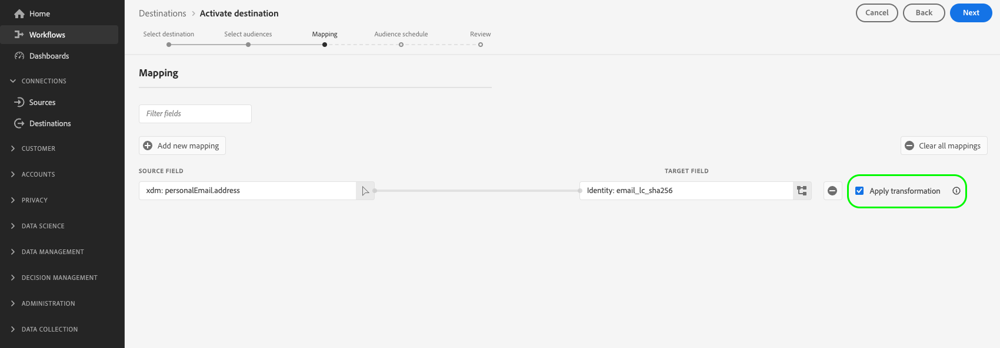

# [!DNL Facebook] 連接

## 總覽 {#overview}

為您的 [!DNL Facebook] 根據雜湊電子郵件鎖定目標、個人化和隱藏的對象促銷活動。

您可以將此目的地用於 [!DNL Facebook’s] 支援的應用程式系列 [!DNL Custom Audiences]，包括 [!DNL Facebook], [!DNL Instagram], [!DNL Audience Network]，和 [!DNL Messenger]. 在 [!DNL Facebook Ads Manager] 中的廣告版位層級會指出您選擇針對哪個應用程式執行行銷活動。

## 使用案例

協助您更清楚了解如何及何時使用 [!DNL Facebook] 目的地，以下是Adobe Experience Platform客戶可透過此功能解決的兩個範例使用案例。

### 使用案例#1

線上零售商想要透過社交平台觸及現有客戶，並根據先前的訂單顯示個人化優惠方案。 線上零售商可將其CRM的電子郵件地址擷取至Adobe Experience Platform、從其離線資料建立區段，並將這些區段傳送至 [!DNL Facebook] 社交平台，最佳化其廣告支出。

### 使用案例#2

航空公司有不同的客戶層級（銅、銀和金），並想透過社交平台為每個層級提供個人化優惠方案。 不過，並非所有客戶都使用航空公司的行動應用程式，其中有些客戶尚未登入公司網站。 公司唯一與這些客戶有關的識別碼是會籍ID和電子郵件地址。

若要跨社交媒體鎖定客戶，他們可以將客戶資料從CRM上線至Adobe Experience Platform，使用電子郵件地址做為識別碼。

接下來，他們可以使用離線資料（包括相關聯的會籍ID和客戶層級）來建立新的受眾區段，以便透過 [!DNL Facebook] 目的地。

## 支援的身分 {#supported-identities}

[!DNL Facebook Custom Audiences] 支援啟用下表所述的身分。 深入了解 [身分](/help/identity-service/namespaces.md).

| Target身分 | 說明 | 考量事項 |
|---|---|---|
| GAID | Google Advertising ID | 當源標識為GAID命名空間時，選擇GAID目標標識。 |
| IDFA | Apple ID for Advertisers | 如果來源識別為IDFA命名空間，請選取IDFA目標識別。 |
| phone_sha256 | 使用SHA256演算法雜湊的電話號碼 | Adobe Experience Platform支援純文字和SHA256雜湊電話號碼。 遵循 [ID比對需求](#id-matching-requirements-id-matching-requirements) 區段，並分別使用純文字和雜湊電話號碼的適當命名空間。 當來源欄位包含未雜湊屬性時，請檢查 **[!UICONTROL 套用轉換]** 選項，必須 [!DNL Platform] 啟動時自動雜湊資料。 |
| email_lc_sha256 | 使用SHA256演算法雜湊的電子郵件地址 | Adobe Experience Platform支援純文字和SHA256雜湊電子郵件地址。 遵循 [ID比對需求](#id-matching-requirements-id-matching-requirements) 區段，並分別使用純文字和雜湊電子郵件地址的適當命名空間。 當來源欄位包含未雜湊屬性時，請檢查 **[!UICONTROL 套用轉換]** 選項，必須 [!DNL Platform] 啟動時自動雜湊資料。 |
| extern_id | 自訂使用者ID | 當源標識為自定義命名空間時，選擇此目標標識。 |

## 匯出類型和頻率 {#export-type-frequency}

有關目標導出類型和頻率的資訊，請參閱下表。

| 項目 | 類型 | 附註 |
---------|----------|---------|
| 匯出類型 | **[!UICONTROL 區段匯出]** | 您正在匯出區段（對象）的所有成員，以及Facebook目的地所使用的識別碼（名稱、電話號碼或其他）。 |
| 匯出頻率 | **[!UICONTROL 串流]** | 串流目的地是「一律開啟」API型連線。 一旦根據區段評估在Experience Platform中更新設定檔，連接器就會將更新傳送至下游的目的地平台。 深入了解 [串流目的地](/help/destinations/destination-types.md#streaming-destinations). |

{style="table-layout:auto"}

## Facebook帳戶必要條件 {#facebook-account-prerequisites}

將受眾區段傳送至之前 [!DNL Facebook]，請確定您符合下列需求：

* 您的 [!DNL Facebook] 使用者帳戶必須具有 **[!DNL Manage campaigns]** 已為您打算使用的廣告帳戶啟用權限。
* 此 **Adobe Experience Cloud** 業務帳戶必須新增為您 [!DNL Facebook Ad Account]. 使用 `business ID=206617933627973`. 請參閱 [將合作夥伴添加到您的業務經理](https://www.facebook.com/business/help/1717412048538897) 在Facebook檔案中取得詳細資訊。
   >[!IMPORTANT]
   >
   > 設定Adobe Experience Cloud的權限時，您必須啟用 **管理行銷活動** 權限。 需要權限才能 [!DNL Adobe Experience Platform] 整合。
* 閱讀並簽署 [!DNL Facebook Custom Audiences] 服務條款。 若要這麼做，請前往 `https://business.facebook.com/ads/manage/customaudiences/tos/?act=[accountID]`，其中 `accountID` 是 [!DNL Facebook Ad Account ID].
   >[!IMPORTANT]
   >
   >簽署 [!DNL Facebook Custom Audiences] 服務條款，請務必使用您在Facebook API中用來驗證的相同使用者帳戶。

## ID比對需求 {#id-matching-requirements}

[!DNL Facebook] 需要清楚傳送任何個人識別資訊(PII)。 因此，對象已啟動至 [!DNL Facebook] 可以砍掉 *雜湊* 識別碼，例如電子郵件地址或電話號碼。

視您擷取至Adobe Experience Platform的ID類型而定，您必須遵守其對應要求。

## 電話號碼雜湊要求 {#phone-number-hashing-requirements}

在中啟用電話號碼的方法有兩種 [!DNL Facebook]:

* **擷取原始電話號碼**:您可以在 [!DNL E.164] 格式 [!DNL Platform]. 啟動時會自動雜湊。 如果您選擇此選項，請務必一律將原始電話號碼內嵌至 `Phone_E.164` 命名空間。
* **擷取雜湊電話號碼**:您可以先預先雜湊電話號碼，再擷取至 [!DNL Platform]. 如果您選擇此選項，請務必一律將雜湊電話號碼內嵌至 `Phone_SHA256` 命名空間。

>[!NOTE]
>
>擷取到 `Phone` 命名空間無法在中啟用 [!DNL Facebook].

## 電子郵件雜湊要求 {#email-hashing-requirements}

您可以先雜湊電子郵件地址再將其擷取至Adobe Experience Platform，或在Experience Platform中清除使用電子郵件地址，並 [!DNL Platform] 激活時將其哈希。

若要了解如何在Experience Platform中擷取電子郵件地址，請參閱 [批次匯入概觀](/help/ingestion/batch-ingestion/overview.md) 和 [串流獲取概觀](/help/ingestion/streaming-ingestion/overview.md).

如果您選取自行雜湊電子郵件地址，請務必符合下列要求：

* 修剪電子郵件字串中的所有開頭和結尾空格；範例： `johndoe@example.com`，而非 `<space>johndoe@example.com<space>`;
* 對電子郵件字串進行雜湊處理時，請務必將小寫字串雜湊；
   * 範例： `example@email.com`，而非 `EXAMPLE@EMAIL.COM`;
* 確認雜湊字串全部為小寫
   * 範例： `55e79200c1635b37ad31a378c39feb12f120f116625093a19bc32fff15041149`，而非 `55E79200C1635B37AD31A378C39FEB12F120F116625093A19bC32FFF15041149`;
* 別給繩子加鹽。

>[!NOTE]
>
>來自未雜湊命名空間的資料會由 [!DNL Platform] 啟動後。
> 屬性來源資料不會自動雜湊。 當來源欄位包含未雜湊屬性時，請檢查 **[!UICONTROL 套用轉換]** 選項，必須 [!DNL Platform] 啟動時自動雜湊資料。
> 此 **[!UICONTROL 套用轉換]** 選擇「屬性」作為源欄位時，才會顯示「選項」。 當您選擇命名空間時，不會顯示。

## 使用自訂命名空間 {#custom-namespaces}

您可以使用 `Extern_ID` 將資料傳送至的命名空間 [!DNL Facebook]，請確定您使用 [!DNL Facebook Pixel]. 請參閱 [Facebook官方檔案](https://developers.facebook.com/docs/marketing-api/audiences/guides/custom-audiences/#external_identifiers) 以取得詳細資訊。

## 連接到目標 {#connect}

>[!IMPORTANT]
> 
>若要連線至目的地，您需要 **[!UICONTROL 管理目的地]** [存取控制權限](/help/access-control/home.md#permissions). 閱讀 [存取控制概觀](/help/access-control/ui/overview.md) 或聯絡您的產品管理員以取得所需的權限。

若要連線至此目的地，請依照 [目的地設定教學課程](../../ui/connect-destination.md). 在設定目標工作流程中，填寫下列兩節所列的欄位。

以下影片也示範設定 [!DNL Facebook] 目的地和啟用區段。

>[!VIDEO](https://video.tv.adobe.com/v/332599/?quality=12&learn=on&captions=eng)

>[!NOTE]
>
>Experience Platform使用者介面經常更新，且自此視訊錄制以來可能已變更。 如需最新資訊，請參閱 [目的地設定教學課程](../../ui/connect-destination.md).

### 驗證到目標 {#authenticate}

1. 在目的地目錄中尋找Facebook目的地，然後選取 **[!UICONTROL 設定]**.
2. 選擇 **[!UICONTROL 連接到目標]**.
   
3. 輸入您的Facebook憑證並選取 **登入**.

### 填寫目的地詳細資訊 {#destination-details}

>[!CONTEXTUALHELP]
>id="platform_destinations_connect_facebook_accountid"
>title="帳戶 ID"
>abstract="您的 Facebook 廣告帳戶 ID。您可以在您的 Facebook 廣告管理員帳戶中找到此 ID。輸入此 ID 時，都必須加上首碼 `act_`。"

若要設定目的地的詳細資訊，請填寫下方的必填和選填欄位。 UI中欄位旁的星號表示該欄位為必要欄位。

* **[!UICONTROL 名稱]**:日後您將透過此名稱識別此目的地。
* **[!UICONTROL 說明]**:未來可協助您識別此目的地的說明。
* **[!UICONTROL 帳戶ID]**:您的 [!DNL Facebook Ad Account ID]. 您可以在 [!DNL Facebook Ads Manager] 帳戶。 輸入此 ID 時，都必須加上首碼 `act_`。

### 啟用警報 {#enable-alerts}

您可以啟用警報，接收有關資料流到目標狀態的通知。 從清單中選擇要訂閱的警報，以接收有關資料流狀態的通知。 如需警報的詳細資訊，請參閱 [使用UI訂閱目的地警報](../../ui/alerts.md).

完成提供目標連接的詳細資訊後，請選擇 **[!UICONTROL 下一個]**.

## 啟用此目的地的區段 {#activate}

>[!CONTEXTUALHELP]
>id="platform_destinations_activate_facebook_originofaudience"
>title="對象來源"
>abstract="選擇最初如何在區段中收集客戶資料。當區段以使用者為目標時，資料會顯示在 Facebook 中"

>[!CONTEXTUALHELP]
>id="platform_destinations_activate_facebook_originofaudience_customers"
>title="對象來源"
>abstract="廣告商直接從客戶那裡收集到資料了。"

>[!CONTEXTUALHELP]
>id="platform_destinations_activate_facebook_originofaudience_partners"
>title="對象來源"
>abstract="廣告商直接從他們的合作夥伴那裡收集到資料了。"

>[!CONTEXTUALHELP]
>id="platform_destinations_activate_facebook_originofaudience_customersandpartners"
>title="對象來源"
>abstract="廣告商直接從他們的客戶和合作夥伴那裡收集到資料了。"

>[!IMPORTANT]
> 
>若要啟用資料，您需要 **[!UICONTROL 管理目的地]**, **[!UICONTROL 啟動目的地]**, **[!UICONTROL 檢視設定檔]**，和 **[!UICONTROL 檢視區段]** [存取控制權限](/help/access-control/home.md#permissions). 閱讀 [存取控制概觀](/help/access-control/ui/overview.md) 或聯絡您的產品管理員以取得所需的權限。

請參閱 [對串流區段匯出目的地啟用受眾資料](../../ui/activate-segment-streaming-destinations.md) 以取得啟用受眾區段至此目的地的指示。

在 **[!UICONTROL 區段排程]** 步驟，您必須提供 [!UICONTROL 受眾來源] 將區段傳送至 [!DNL Facebook Custom Audiences].

### 對應範例：在 [!DNL Facebook Custom Audience] {#example-facebook}

以下是在中啟用受眾資料時正確身分對應的範例 [!DNL Facebook Custom Audience].

選擇源欄位：

* 選取 `Email` 如果您使用的電子郵件地址未雜湊，則命名空間作為來源身分。
* 選取 `Email_LC_SHA256` 如果您在將資料匯入至時雜湊客戶電子郵件地址，則命名空間設為來源身分 [!DNL Platform]，根據 [!DNL Facebook] [電子郵件雜湊要求](#email-hashing-requirements).
* 選取 `PHONE_E.164` 命名空間作為來源識別（如果您的資料包含非雜湊電話號碼）。 [!DNL Platform] 會雜湊電話號碼以符合 [!DNL Facebook] 需求。
* 選取 `Phone_SHA256` 將命名空間作為來源識別(如果您在資料擷取時將電話號碼雜湊至 [!DNL Platform]，根據 [!DNL Facebook] [電話號碼雜湊要求](#phone-number-hashing-requirements).
* 選取 `IDFA` 命名空間作為來源識別（如果您的資料包含） [!DNL Apple] 裝置ID。
* 選取 `GAID` 命名空間作為來源識別（如果您的資料包含） [!DNL Android] 裝置ID。
* 選取 `Custom` 命名空間作為來源識別（如果您的資料包含其他類型的識別碼）。

選擇目標欄位：

* 選取 `Email_LC_SHA256` 命名空間作為目標識別(當您的來源命名空間為 `Email` 或 `Email_LC_SHA256`.
* 選取 `Phone_SHA256` 命名空間作為目標識別(當您的來源命名空間為 `PHONE_E.164` 或 `Phone_SHA256`.
* 選取 `IDFA` 或 `GAID` 來源命名空間時，命名空間會設為目標身分識別 `IDFA` 或 `GAID`.
* 選取 `Extern_ID` 當您的來源命名空間為自訂命名空間時，命名空間做為目標身分。

>[!IMPORTANT]
>
>來自未雜湊命名空間的資料會由 [!DNL Platform] 啟動後。
> 
>屬性來源資料不會自動雜湊。 當來源欄位包含未雜湊屬性時，請檢查 **[!UICONTROL 套用轉換]** 選項，必須 [!DNL Platform] 啟動時自動雜湊資料。

## 匯出的資料 {#exported-data}

針對 [!DNL Facebook]，成功啟動表示 [!DNL Facebook] 自訂對象會以程式設計方式建立於 [[!DNL Facebook Ads Manager]](https://www.facebook.com/adsmanager/manage/). 當使用者符合已啟動區段的資格或取消資格時，會新增及移除對象中的區段成員資格。

>[!TIP]
>
>Adobe Experience Platform與 [!DNL Facebook] 支援歷史受眾回填。 所有歷史區段資格都會傳送至 [!DNL Facebook] 將區段啟用至目的地時。

## 疑難排解 {#troubleshooting}

### 400錯誤請求錯誤消息 {#bad-request}

設定此目的地時，您可能會收到下列錯誤：

`{"message":"Facebook Error: Permission error","code":"400 BAD_REQUEST"}`

當客戶使用新建立的帳戶時，會發生此錯誤， [!DNL Facebook] 權限尚未啟用。

如果您收到 `400 Bad Request` 依照 [Facebook帳戶必要條件](#facebook-account-prerequisites)，請為 [!DNL Facebook] 權限生效。
