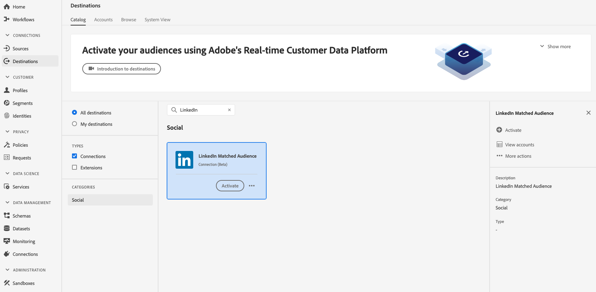

# [!DNL LinkedIn Matched Audiences] 連接

根據雜湊的電子郵件和行動ID，啟用[!DNL LinkedIn]促銷活動的個人檔案，以鎖定受眾、個人化和抑制受眾。

## 使用案例

為協助您進一步瞭解應如何及何時使用[!DNL LinkedIn Matched Audiences]目的地，以下是Adobe Experience Platform客戶可使用此功能解決的使用案例。

軟體公司會組織會議，並希望與與會者保持聯絡，並根據與會者的出席狀況向他們展示個人化優惠。 公司可將其[!DNL CRM]的電子郵件位址或行動裝置ID從自己的內嵌至Adobe Experience Platform，從自己的離線資料建立區段，並將這些區段傳送至[!DNL LinkedIn]社交平台，以最佳化其廣告支出。

## 目標詳細資訊{#destination-specs}

[!DNL LinkedIn Matched Audiences] 支援啟用下列身分：雜湊的電子 [!DNL GAID]郵件和 [!DNL IDFA]。

### 支援的身份{#supported-identities}

[!DNL LinkedIn Matched Audiences] 支援啟用下表所述的身分。進一步瞭解[identities](/help/identity-service/namespaces.md)。

| 目標識別 | 說明 | 考量事項 |
|---|---|---|
| GAID | Google廣告ID | 當您的來源識別為GAID命名空間時，請選取此目標識別。 |
| IDFA | 廣告商的Apple ID | 當您的來源識別為IDFA命名空間時，請選取此目標識別。 |
| email_lc_sha256 | 使用SHA256演算法雜湊的電子郵件地址 | Adobe Experience Platform支援純文字和SHA256雜湊電子郵件地址。 請依照[ID符合要求](#id-matching-requirements-id-matching-requirements)區段中的指示，分別針對純文字和雜湊電子郵件使用適當的名稱空間。 當來源欄位包含未雜湊屬性時，請勾選&#x200B;**[!UICONTROL Apply transformation]**&#x200B;選項，讓[!DNL Platform]在啟動時自動雜湊資料。 |

### 導出類型{#export-type}

**區段匯出** -您正匯出區段（對象）的所有成員，並包含識別碼（名稱、電話號碼等）用於[!DNL LinkedIn Matched Audiences]目標。

### LinkedIn帳戶的先決條件{#LinkedIn-account-prerequisites}

使用[!UICONTROL LinkedIn Matched Audience]目標之前，請確定您的[!DNL LinkedIn Campaign Manager]帳戶具有[!DNL Creative Manager]權限級別或更高級別。

如要瞭解如何編輯[!DNL LinkedIn Campaign Manager]使用者權限，請參閱LinkedIn檔案中的[新增、編輯和移除廣告帳戶的使用者權限](https://www.linkedin.com/help/lms/answer/5753)。

### ID匹配要求{#id-matching-requirements}

[!DNL LinkedIn Matched Audiences] 要求不會傳送任何個人識別資訊(PII)。因此，激活至[!DNL LinkedIn Matched Audiences]的觀眾可以鍵入&#x200B;*雜湊*&#x200B;識別碼，例如電子郵件地址或行動裝置ID。

根據您收錄至Adobe Experience Platform的ID類型，您必須符合其相應需求。

#### 電子郵件散列要求{#email-hashing-requirements}

您可以選擇先將電子郵件地址雜湊，再將其匯入Adobe Experience Platform，或選擇以清楚的Experience Platform方式處理電子郵件地址，並讓我們的演算法在啟動時雜湊這些地址。

若要瞭解如何在Experience Platform中擷取電子郵件地址，請參閱[批次擷取概觀](/help/ingestion/batch-ingestion/overview.md)和[串流擷取概觀](/help/ingestion/streaming-ingestion/overview.md)。

如果您選擇自行排列電子郵件地址，請務必符合下列要求：

- 從電子郵件字串修剪所有前導和尾隨空格。 例如：`johndoe@example.com`，而非`<space>johndoe@example.com<space>`;
- 在對電子郵件字串進行散列時，請務必對小寫字串進行散列；
   - 範例：`example@email.com`，而非`EXAMPLE@EMAIL.COM`;
- 請確定雜湊字串全部為小寫
   - 範例：`55e79200c1635b37ad31a378c39feb12f120f116625093a19bc32fff15041149`，而非`55E79200C1635B37AD31A378C39FEB12F120F116625093A19bC32FFF15041149`;
- 別用鹽鹽。

>[!NOTE]
>
>啟動後，[!DNL Platform]會自動雜湊來自未雜湊名稱空間的資料。
> 屬性來源資料不會自動雜湊。
> 
> 在[身分對應](../../ui/activate-destinations.md#identity-mapping)步驟中，當您的來源欄位包含未雜湊屬性時，請勾選&#x200B;**[!UICONTROL Apply transformation]**&#x200B;選項，讓[!DNL Platform]在啟動時自動雜湊資料。
> 
> **[!UICONTROL Apply transformation]**&#x200B;選項僅在選擇屬性作為源欄位時顯示。 當您選擇名稱空間時，不會顯示它。

## 連接到目標{#connect-destination}

若要連線至[!DNL LinkedIn Matched Audiences]目的地，請參閱[社交網路目的地驗證工作流程](./workflow.md)。

## 啟用區段至[!DNL LinkedIn Matched Audiences] {#activate-segments}

如需如何啟用區段至[!DNL LinkedIn Matched Audiences]的指示，請參閱[啟用資料至目標](../../ui/activate-destinations.md)。

## 導出資料{#exported-data}

成功的啟動表示[!DNL LinkedIn]自訂對象會以程式設計方式在[[!DNL LinkedIn Campaign Manager]](https://www.linkedin.com/campaignmanager/login)中建立。 當使用者符合已啟用區段的資格或被取消資格時，會新增及移除觀眾中的區段成員資格。

>[!TIP]
>
>Adobe Experience Platform與[!DNL LinkedIn Matched Audiences]之間的整合支援歷史讀者回填。 當您將區段啟動至目標時，所有歷史區段資格都會傳送至[!DNL LinkedIn]。