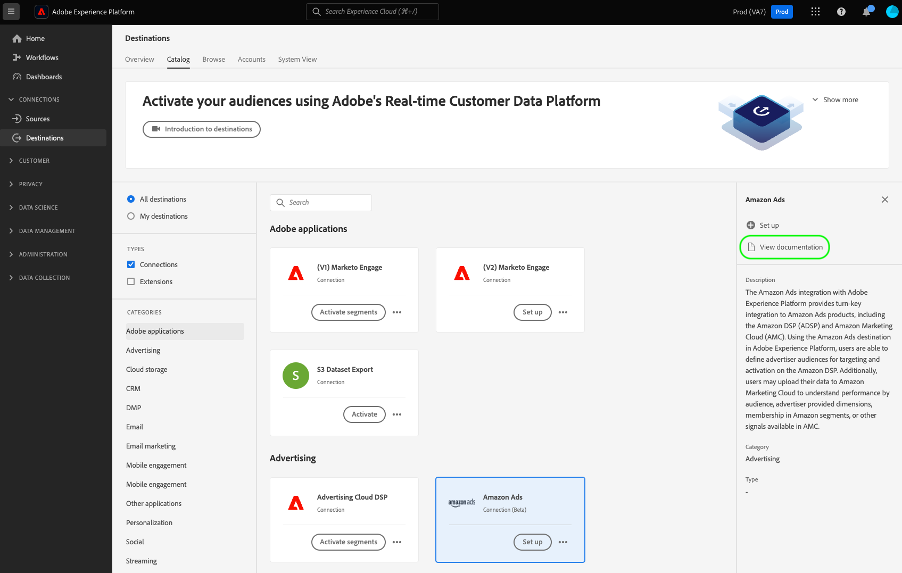

# 建立目的地設定

此頁面以範例說明API要求與裝載，您可使用`/authoring/destinations` API端點建立自己的目的地組態。

如需可透過此端點設定的功能的詳細說明，請參閱以下文章：

* [客戶驗證設定](../../functionality/destination-configuration/customer-authentication.md)
* [OAuth2授權](../../functionality/destination-configuration/oauth2-authorization.md)
* [客戶資料欄位](../../functionality/destination-configuration/customer-data-fields.md)
* [UI屬性](../../functionality/destination-configuration/ui-attributes.md)
* [結構描述設定](../../functionality/destination-configuration/schema-configuration.md)
* [身分名稱空間設定](../../functionality/destination-configuration/identity-namespace-configuration.md)
* [目的地傳遞](../../functionality/destination-configuration/destination-delivery.md)
* [對象中繼資料設定](../../functionality/destination-configuration/audience-metadata-configuration.md)
* [對象中繼資料設定](../../functionality/destination-configuration/audience-metadata-configuration.md)
* [彙總原則](../../functionality/destination-configuration/aggregation-policy.md)
* [批次設定](../../functionality/destination-configuration/batch-configuration.md)
* [歷史設定檔資格](../../functionality/destination-configuration/historical-profile-qualifications.md)

>[!IMPORTANT]
>
>Destination SDK支援的所有引數名稱和值都會區分大小寫&#x200B;**&#x200B;**。 為避免區分大小寫錯誤，請完全依照檔案中所示使用引數名稱和值。

## 目的地設定API操作快速入門 {#get-started}

繼續之前，請檢閱[快速入門手冊](../../getting-started.md)以取得重要資訊，您必須瞭解這些資訊才能成功呼叫API，包括如何取得必要的目的地撰寫許可權和必要的標頭。

## 建立目的地設定 {#create}

您可以對`/authoring/destinations`端點發出POST要求，以建立新的目的地設定。

>[!TIP]
>
>**API端點**： `platform.adobe.io/data/core/activation/authoring/destinations`

**API格式**

```http
POST /authoring/destinations
```

下列要求會建立新的[!DNL Amazon S3]目的地組態，由承載中提供的引數設定。 以下承載包含`/authoring/destinations`端點接受的檔案型目的地的所有引數。

請注意，您不需要將所有引數新增至API呼叫，而且裝載可以根據您的API需求自訂。

+++要求

```shell
curl -X POST https://platform.adobe.io/data/core/activation/authoring/destinations \
 -H 'Authorization: Bearer {ACCESS_TOKEN}' \
 -H 'Content-Type: application/json' \
 -H 'x-gw-ims-org-id: {ORG_ID}' \
 -H 'x-api-key: {API_KEY}' \
 -H 'x-sandbox-name: {SANDBOX_NAME}' \
 -d '
{
   "name":"Amazon S3 destination with predefined CSV formatting options",
   "description":"Amazon S3 destination with predefined CSV formatting options",
   "status":"TEST",
   "customerAuthenticationConfigurations":[
      {
         "authType":"S3"
      }
   ],
   "customerDataFields":[
      {
         "name":"bucket",
         "title":"Enter the name of your Amazon S3 bucket",
         "description":"Amazon S3 bucket name",
         "type":"string",
         "isRequired":true,
         "readOnly":false,
         "hidden":false
      },
      {
         "name":"path",
         "title":"Enter the path to your S3 bucket folder",
         "description":"Enter the path to your S3 bucket folder",
         "type":"string",
         "isRequired":true,
         "pattern":"^[A-Za-z]+$",
         "readOnly":false,
         "hidden":false
      },
      {
         "name":"compression",
         "title":"Compression format",
         "description":"Select the desired file compression format.",
         "type":"string",
         "isRequired":true,
         "readOnly":false,
         "enum":[
            "SNAPPY",
            "GZIP",
            "DEFLATE",
            "NONE"
         ]
      },
      {
         "name":"fileType",
         "title":"Select a fileType",
         "description":"Select fileType",
         "type":"string",
         "isRequired":true,
         "readOnly":false,
         "hidden":false,
         "enum":[
            "csv",
            "json",
            "parquet"
         ],
         "default":"csv"
      }
   ],
   "uiAttributes":{
      "documentationLink":"https://www.adobe.com/go/destinations-amazon-s3-en",
      "category":"cloudStorage",
      "icon":{
         "key":"amazonS3"
      },
      "connectionType":"S3",
      "frequency":"Batch"
   },
   "destinationDelivery":[
      {
         "deliveryMatchers":[
            {
               "type":"SOURCE",
               "value":[
                  "batch"
               ]
            }
         ],
         "authenticationRule":"CUSTOMER_AUTHENTICATION",
         "destinationServerId":"{{destinationServerId}}"
      }
   ],
   "schemaConfig":{
      "profileRequired":true,
      "segmentRequired":true,
      "identityRequired":true
   },
   "batchConfig":{
      "allowMandatoryFieldSelection":true,
      "allowDedupeKeyFieldSelection":true,
      "defaultExportMode":"DAILY_FULL_EXPORT",
      "allowedExportMode":[
         "DAILY_FULL_EXPORT",
         "FIRST_FULL_THEN_INCREMENTAL"
      ],
      "allowedScheduleFrequency":[
         "DAILY",
         "EVERY_3_HOURS",
         "EVERY_6_HOURS",
         "EVERY_8_HOURS",
         "EVERY_12_HOURS",
         "ONCE"
      ],
      "defaultFrequency":"DAILY",
      "defaultStartTime":"00:00",
      "filenameConfig":{
         "allowedFilenameAppendOptions":[
            "SEGMENT_NAME",
            "DESTINATION_INSTANCE_ID",
            "DESTINATION_INSTANCE_NAME",
            "ORGANIZATION_NAME",
            "SANDBOX_NAME",
            "DATETIME",
            "CUSTOM_TEXT"
         ],
         "defaultFilenameAppendOptions":[
            "DATETIME"
         ],
         "defaultFilename":"%DESTINATION%_%SEGMENT_ID%"
      },
      "backfillHistoricalProfileData":true
   }
}'
```

| 參數 | 類型 | 說明 |
|---------|----------|------|
| `name` | 字串 | 在Experience Platform目錄中指出您目的地的標題。 |
| `description` | 字串 | 提供將Adobe用於目的地卡片Experience Platform目的地目錄中的說明。 目標不超過4到5個句子。 {width="100" zoomable="yes"} |
| `status` | 字串 | 表示目的地卡片的生命週期狀態。 接受的值為`TEST`、`PUBLISHED`和`DELETED`。 第一次設定目的地時使用`TEST`。 |
| `customerAuthenticationConfigurations.authType` | 字串 | 指出用來向目的地伺服器驗證Experience Platform客戶的設定。 請參閱[客戶驗證組態](../../functionality/destination-configuration/customer-authentication.md)，以取得有關支援的驗證型別的詳細資訊。 |
| `customerDataFields.name` | 字串 | 為您要介紹的自訂欄位提供名稱。 <br/><br/>如需這些設定的詳細資訊，請參閱[客戶資料欄位](../../functionality/destination-configuration/customer-data-fields.md)。 {width="100" zoomable="yes"} |
| `customerDataFields.type` | 字串 | 指出您要介紹的自訂欄位型別。 接受的值為`string`、`object`、`integer`。 <br/><br/>如需這些設定的詳細資訊，請參閱[客戶資料欄位](../../functionality/destination-configuration/customer-data-fields.md)。 |
| `customerDataFields.title` | 字串 | 表示欄位名稱，如客戶在Experience Platform使用者介面中所見。 <br/><br/>如需這些設定的詳細資訊，請參閱[客戶資料欄位](../../functionality/destination-configuration/customer-data-fields.md)。 |
| `customerDataFields.description` | 字串 | 提供自訂欄位的說明。 如需這些設定的詳細資訊，請參閱[客戶資料欄位](../../functionality/destination-configuration/customer-data-fields.md)。 |
| `customerDataFields.isRequired` | 布林值 | 指出目的地設定工作流程中是否需要此欄位。 <br/><br/>如需這些設定的詳細資訊，請參閱[客戶資料欄位](../../functionality/destination-configuration/customer-data-fields.md)。 |
| `customerDataFields.enum` | 字串 | 將自訂欄位呈現為下拉式功能表，並列出使用者可用的選項。 <br/><br/>如需這些設定的詳細資訊，請參閱[客戶資料欄位](../../functionality/destination-configuration/customer-data-fields.md)。 |
| `customerDataFields.default` | 字串 | 從`enum`清單定義預設值。 |
| `customerDataFields.pattern` | 字串 | 如有需要，強制自訂欄位使用模式。 使用規則運算式強制執行模式。 例如，如果您的客戶ID不包含數字或底線，請在此欄位中輸入`^[A-Za-z]+$`。 <br/><br/>如需這些設定的詳細資訊，請參閱[客戶資料欄位](../../functionality/destination-configuration/customer-data-fields.md)。 |
| `uiAttributes.documentationLink` | 字串 | 請參閱您目的地的[目的地目錄](https://experienceleague.adobe.com/docs/experience-platform/destinations/catalog/overview.html#catalog)中的檔案頁面。 使用`https://www.adobe.com/go/destinations-YOURDESTINATION-en`，其中`YOURDESTINATION`是您目的地的名稱。 對於名為Moviestar的目的地，您可以使用`https://www.adobe.com/go/destinations-moviestar-en`。 請注意，此連結只有在Adobe將您的目的地設定為上線並發佈檔案後才能運作。 <br/><br/>如需這些設定的詳細資訊，請參閱[UI屬性](../../functionality/destination-configuration/ui-attributes.md)。 {width="100" zoomable="yes"} |
| `uiAttributes.category` | 字串 | 是指在Adobe Experience Platform中指派給您的目的地的類別。 如需詳細資訊，請閱讀[目的地類別](https://experienceleague.adobe.com/docs/experience-platform/rtcdp/destinations/destination-types.html#destination-categories)。 使用下列其中一個值： `adobeSolutions, advertising, analytics, cdp, cloudStorage, crm, customerSuccess, database, dmp, ecommerce, email, emailMarketing, enrichment, livechat, marketingAutomation, mobile, personalization, protocols, social, streaming, subscriptions, surveys, tagManagers, voc, warehouses, payments`。 <br/><br/>如需這些設定的詳細資訊，請參閱[UI屬性](../../functionality/destination-configuration/ui-attributes.md)。 |
| `uiAttributes.connectionType` | 字串 | 連線的型別（視目的地而定）。 支援的值： <ul><li>`Server-to-server`</li><li>`Cloud storage`</li><li>`Azure Blob`</li><li>`Azure Data Lake Storage`</li><li>`S3`</li><li>`SFTP`</li><li>`DLZ`</li></ul> |
| `uiAttributes.frequency` | 字串 | 是指目的地支援的資料匯出型別。 針對以API為基礎的整合設定為`Streaming`，或當您匯出檔案至目的地時設定為`Batch`。 |
| `identityNamespaces.externalId.acceptsAttributes` | 布林值 | 指出客戶是否可將標準設定檔屬性對應至您正在設定的身分。 |
| `identityNamespaces.externalId.acceptsCustomNamespaces` | 布林值 | 表示客戶是否可將屬於[自訂名稱空間](/help/identity-service/features/namespaces.md#manage-namespaces)的身分對應到您正在設定的身分。 |
| `identityNamespaces.externalId.transformation` | 字串 | _未顯示在範例組態中_。 例如，當[!DNL Experience Platform]客戶將純電子郵件地址作為屬性且您的平台僅接受雜湊電子郵件時使用。 您可以在此處提供需要套用的轉換（例如，將電子郵件轉換為小寫，然後進行雜湊）。 |
| `identityNamespaces.externalId.acceptedGlobalNamespaces` | - | 指出客戶可以將哪些[標準身分名稱空間](/help/identity-service/features/namespaces.md#standard) （例如IDFA）對應到您正在設定的身分。 <br>當您使用`acceptedGlobalNamespaces`時，可以使用`"requiredTransformation":"sha256(lower($))"`來小寫和雜湊電子郵件地址或電話號碼。 |
| `destinationDelivery.authenticationRule` | 字串 | 指示[!DNL Experience Platform]客戶如何連線至您的目的地。 接受的值為`CUSTOMER_AUTHENTICATION`、`PLATFORM_AUTHENTICATION`、`NONE`。<br> <ul><li>如果Experience Platform客戶透過使用者名稱和密碼、持有人權杖或其他驗證方法登入您的系統，請使用`CUSTOMER_AUTHENTICATION`。 例如，如果您也在`customerAuthenticationConfigurations`中選取`authType: OAUTH2`或`authType:BEARER`，則應該選取此選項。 </li><li> 如果Adobe與您的目的地之間有全域驗證系統，且[!DNL Experience Platform]客戶不需要提供任何驗證認證即可連線至您的目的地，請使用`PLATFORM_AUTHENTICATION`。 在此情況下，您必須使用[認證API](../../credentials-api/create-credential-configuration.md)設定來建立認證物件。 </li><li>如果不需要驗證即可將資料傳送至您的目的地平台，請使用`NONE`。 </li></ul> |
| `destinationDelivery.destinationServerId` | 字串 | [目的地伺服器範本](../destination-server/create-destination-server.md)的`instanceId`用於此目的地。 |
| `backfillHistoricalProfileData` | 布林值 | 控制將受眾啟動至目的地時，是否匯出歷史設定檔資料。 一律設定為`true`。 |
| `segmentMappingConfig.mapUserInput` | 布林值 | 控制使用者是否輸入目的地啟用工作流程中的對象對應ID。 |
| `segmentMappingConfig.mapExperiencePlatformSegmentId` | 布林值 | 控制目的地啟用工作流程中的對象對應ID是否為Experience Platform對象ID。 |
| `segmentMappingConfig.mapExperiencePlatformSegmentName` | 布林值 | 控制目的地啟用工作流程中的對象對應ID是否為Experience Platform對象名稱。 |
| `segmentMappingConfig.audienceTemplateId` | 字串 | 用於此目的地的[對象中繼資料範本](../../metadata-api/create-audience-template.md)的`instanceId`。 |
| `schemaConfig.profileFields` | 陣列 | 當您新增預先定義的`profileFields`時（如上述組態所示），使用者可以選擇將Experience Platform屬性對應至您目的地端的預先定義屬性。 |
| `schemaConfig.profileRequired` | 布林值 | 如果使用者應該能夠從Experience Platform將設定檔屬性對應到您目的地端的自訂屬性，請使用`true`，如上面的設定範例所示。 |
| `schemaConfig.segmentRequired` | 布林值 | 一律使用`segmentRequired:true`。 |
| `schemaConfig.identityRequired` | 布林值 | 如果使用者應該能夠從Experience Platform將身分識別名稱空間對應到您想要的結構描述，請使用`true`。 |

{style="table-layout:auto"}

+++

+++回應

成功的回應會傳回HTTP狀態200以及您新建立的目的地組態的詳細資料。

+++

## API錯誤處理

Destination SDK API端點遵循一般Experience Platform API錯誤訊息原則。 請參閱Experience Platform疑難排解指南中的[API狀態碼](../../../../landing/troubleshooting.md#api-status-codes)和[請求標頭錯誤](../../../../landing/troubleshooting.md#request-header-errors)。

## 後續步驟

閱讀本檔案後，您現在知道如何透過Destination SDK `/authoring/destinations` API端點建立新的目的地設定。

若要深入瞭解您可以使用此端點的功能，請參閱下列文章：

* [擷取目的地設定](retrieve-destination-configuration.md)
* [更新目的地設定](update-destination-configuration.md)
* [刪除目的地設定](delete-destination-configuration.md)

若要瞭解此端點適用於目標製作程式的位置，請參閱下列文章：

* [使用Destination SDK設定串流目的地](../../guides/configure-destination-instructions.md#create-destination-configuration)
* [使用Destination SDK設定以檔案為基礎的目的地](../../guides/configure-file-based-destination-instructions.md#create-destination-configuration)
