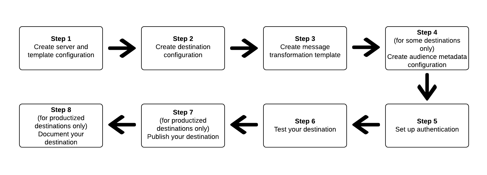

# 如何使用目的地SDK來設定您的目的地

## 概覽 {#overview}

本頁說明如何使用目標SDK](./configuration-options.md)中的[設定選項中的參考資訊來設定您的目標。 步驟依序排列如下。

## 先決條件 {#prerequisites}

在前進至下列步驟之前，請參閱[目標SDK快速入門](./getting-started.md)頁面，以取得使用目標SDK API的必要Adobe I/O驗證憑證和其他必要條件的相關資訊。

## 使用目標SDK中設定選項來設定目標的步驟 {#steps}



## 步驟1:建立伺服器和範本配置 {#create-server-template-configuration}

首先，使用`/destinations-server`端點建立伺服器和範本配置（讀取[API參考](./destination-server-api.md)）。 有關伺服器和模板配置的詳細資訊，請參閱參考部分的[伺服器和模板規格](./configuration-options.md#server-and-template)。

以下是設定範例。 請注意，`requestBody.value`參數中的訊息轉換範本在步驟3, [建立轉換範本](./configure-destination-instructions.md#create-transformation-template)中定址。

```json
POST platform.adobe.io/data/core/activation/authoring/destination-servers

{
   "name":"Moviestar destination server",
   "destinationServerType":"URL_BASED",
   "urlBasedDestination":{
      "url":{
         "templatingStrategy":"PEBBLE_V1",
         "value":"https://api.moviestar.com/data/{{endpoint.region}}/items"
      }
   },
   "httpTemplate":{
      "httpMethod":"POST",
      "requestBody":{
         "templatingStrategy":"PEBBLE_V1",
         "value":"insert after you create a template in step 3"
      },
      "contentType":"application/json"
   }
}
```

## 步驟2:建立目標配置 {#create-destination-configuration}

以下是使用`/destinations` API端點建立之目標範本的設定範例。 有關此模板的詳細資訊，請參閱[目標配置](./destination-configuration.md)。

```json
POST platform.adobe.io/data/core/activation/authoring/destinations
 
{
   "name":"Moviestar",
   "description":"Moviestar is a fictional destination, used for this example.",
   "status":"TEST",
   "customerAuthenticationConfigurations":[
      {
         "authType":"BEARER"
      }
   ],
   "customerDataFields":[
      {
         "name":"endpointsInstance",
         "type":"string",
         "title":"Select Endpoint",
         "description":"Moviestar manages several instances across the globe for REST endpoints that our customers are provisioned for. Select your endpoint in the dropdown list.",
         "isRequired":true,
         "enum":[
            "US",
            "EU",
            "APAC",
            "NZ"
         ]
      },
      {
         "name":"customerID",
         "type":"string",
         "title":"Moviestar Customer ID",
         "description":"Your customer ID in the Moviestar destination (e.g. abcdef).",
         "isRequired":true,
         "pattern":""
      }
   ],
   "uiAttributes":{
      "documentationLink":"http://www.adobe.com/go/destinations-moviestar-en",
      "category":"mobile",
      "connectionType":"Server-to-server",
      "frequency":"Streaming"
   },
   "identityNamespaces":{
      "external_id":{
         "acceptsAttributes":true,
         "acceptsCustomNamespaces":true
      },
      "another_id":{
         "acceptsAttributes":true,
         "acceptsCustomNamespaces":true
      }
   },
   "aggregation":{
      "aggregationType":"CONFIGURABLE_AGGREGATION",
      "configurableAggregation":{
         "aggregationPolicyId":null,
         "aggregationKey":{
            "includeSegmentId":true,
            "includeSegmentStatus":true,
            "includeIdentity":true,
            "oneIdentityPerGroup":true,
            "groups":null
         },
         "splitUserById":true,
         "maxBatchAgeInSecs":360,
         "maxNumEventsInBatch":100
      }
   },
   "destinationDelivery":[
      {
         "authenticationRule":"CUSTOMER_AUTHENTICATION",
         "destinationServerId":"9c77000a-4559-40ae-9119-a04324a3ecd4"
      }
   ],
   "inputSchemaId":"cc8621770a9243b98aba4df79898b1ed"
}
```

## 步驟3:建立消息轉換模板 — 使用模板語言指定消息輸出格式 {#create-transformation-template}

您必鬚根據目的地支援的裝載，建立範本，將匯出資料的格式從AdobeXDM格式轉換為目的地支援的格式。 請參閱[使用模板語言進行身份、屬性和段成員轉換](./message-format.md#using-templating)中的模板示例，並使用Adobe提供的[模板創作工具](./create-template.md)。

## 步驟4:建立對象中繼資料設定 {#create-audience-metadata-configuration}

針對某些目的地，目的地SDK需要您設定對象中繼資料範本，以程式設計方式建立、更新或刪除您目的地的對象。 如需您何時需要設定此設定以及如何設定的相關資訊，請參閱[對象中繼資料管理](./audience-metadata-management.md)。

## 步驟5:建立憑據配置/設定身份驗證 {#set-up-authentication}

根據您是在上述目標配置中指定`"authenticationRule": "CUSTOMER_AUTHENTICATION"`還是`"authenticationRule": "PLATFORM_AUTHENTICATION"`，您可以使用`/destination`或`/credentials`端點來設定目標的驗證。

* **最常見的案例**:如果您選取 `"authenticationRule": "CUSTOMER_AUTHENTICATION"` 且目的地支援OAuth 2驗證方法，請閱 [讀OAuth 2驗證](./oauth2-authentication.md)。
* 如果您選取了`"authenticationRule": "PLATFORM_AUTHENTICATION"`，請參閱參考檔案中的[憑證設定](./credentials-configuration.md)。

## 步驟6:測試您的目的地 {#test-destination}

使用先前步驟中的範本設定您的目的地後，您可以使用[目的地測試工具](./create-template.md)來測試Adobe Experience Platform與您目的地之間的整合。

在測試目的地的程式中，您必須使用Experience PlatformUI來建立區段，以便您對目的地啟用區段。 如需如何在Experience Platform中建立區段的指示，請參閱以下兩個資源：

* [建立區段檔案頁面](https://experienceleague.adobe.com/docs/experience-platform/segmentation/ui/overview.html?lang=en#create-segment)
* [建立區段視訊逐步說明](https://experienceleague.adobe.com/docs/platform-learn/tutorials/segments/create-segments.html?lang=en)


## 步驟7:發佈您的目的地 {#publish-destination}

設定並測試您的目的地後，請使用[目的地發佈API](./destination-publish-api.md)將您的設定提交給Adobe以供審核。

## 步驟8:記錄您的目的地 {#document-destination}

如果您是建立[產品化整合](./overview.md#productized-custom-integrations)的獨立軟體供應商(ISV)或系統整合商(SI)，請使用[自助文檔流程](./docs-framework/documentation-instructions.md)為[Experience League目標目錄](/help/destinations/catalog/overview.md)中的目標建立產品文檔頁。
