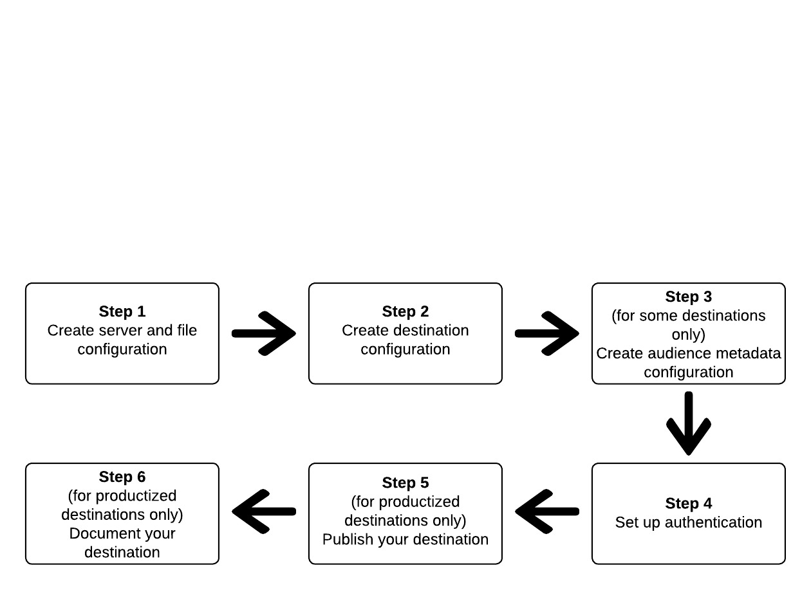

# 使用Destination SDK配置基於檔案的目標

## 總覽 {#overview}

>[!IMPORTANT]
>
>使用Adobe Experience Platform Destination SDK設定及提交檔案式目的地的功能目前仍在測試中。 檔案和功能可能會有所變更。

本頁面說明如何使用 [目的地SDK中的設定選項](./configuration-options.md) 和其他Destination SDK功能及API參考檔案中，以設定 [檔案型目的地](../../destinations/destination-types.md#file-based). 步驟依序排列如下。

## 先決條件 {#prerequisites}

在前進到下面所示的步驟之前，請閱讀 [Destination SDK快速入門](./getting-started.md) 頁面，以取得使用Adobe I/OAPI所需的Destination SDK驗證憑證和其他必要條件的相關資訊。

## 使用Destination SDK中設定選項來設定目的地的步驟 {#steps}



## 步驟1:建立伺服器和檔案配置 {#create-server-file-configuration}

首先，使用 `/destinations-server` 端點（讀取） [API參考](./destination-server-api.md))。

以下是 [!DNL Amazon S3] 目的地。 若要設定其他類型的檔案型目的地，請參閱其對應的 [伺服器配置](server-and-file-configuration.md).

**API格式**

```http
POST platform.adobe.io/data/core/activation/authoring/destination-servers
```

```json
{
    "name": "S3 destination",
    "destinationServerType": "FILE_BASED_S3",
    "fileBasedS3Destination": {
        "bucket": {
            "templatingStrategy": "PEBBLE_V1",
            "value": "{{customerData.bucket}}"
        },
        "path": {
            "templatingStrategy": "PEBBLE_V1",
            "value": "{{customerData.path}}"
        }
    },
    "fileConfigurations": {
        "compression": {
            "templatingStrategy": "PEBBLE_V1",
            "value": "{{customerData.compression}}"
        },
        "fileType": {
            "templatingStrategy": "PEBBLE_V1",
            "value": "{{customerData.fileType}}"
        },
        "csvOptions": {
            "quote": {
                "templatingStrategy": "NONE",
                "value": "\""
            },
            "quoteAll": {
                "templatingStrategy": "NONE",
                "value": "false"
            },
            "escape": {
                "templatingStrategy": "NONE",
                "value": "\\"
            },
            "escapeQuotes": {
                "templatingStrategy": "NONE",
                "value": "true"
            },
            "header": {
                "templatingStrategy": "NONE",
                "value": "true"
            },
            "ignoreLeadingWhiteSpace": {
                "templatingStrategy": "NONE",
                "value": "true"
            },
            "ignoreTrailingWhiteSpace": {
                "templatingStrategy": "NONE",
                "value": "true"
            },
            "nullValue": {
                "templatingStrategy": "NONE",
                "value": ""
            },
            "dateFormat": {
                "templatingStrategy": "NONE",
                "value": "yyyy-MM-dd"
            },
            "timestampFormat": {
                "templatingStrategy": "NONE",
                "value": "yyyy-MM-dd'T':mm:ss[.SSS][XXX]"
            },
            "charToEscapeQuoteEscaping": {
                "templatingStrategy": "NONE",
                "value": "\\"
            },
            "emptyValue": {
                "templatingStrategy": "NONE",
                "value": ""
            }
        }
    }
}
```

## 步驟2:建立目標配置 {#create-destination-configuration}

以下是目標設定的範例，建立方法為使用 `/destinations` API端點。 有關此配置的詳細資訊，請參閱 [目標配置](./file-based-destination-configuration.md).

要將步驟1中的伺服器和檔案配置連接到此目標配置，請將伺服器和模板配置的實例ID添加為 `destinationServerId` 這裡。

**API格式**

```http
POST platform.adobe.io/data/core/activation/authoring/destinations
```

```json
{
    "name": "Amazon S3 destination",
    "description": "Amazon S3 destination is a fictional destination, used for this example.",
    "releaseNotes": "Test",
    "status": "Test",
    "customerAuthenticationConfigurations": [
        {
            "authType": "S3"
        }
    ],
    "customerEncryptionConfigurations": [],
    "customerDataFields": [
        {
            "name": "bucket",
            "title": "Amazon S3 bucket name",
            "description": "Enter the Amazon S3 Bucket name that will host the exported files.",
            "type": "string",
            "isRequired": true,
            "readOnly": false,
            "hidden": false
        },
        {
            "name": "path",
            "title": "Amazon S3 path",
            "description": "Enter Amazon S3 folder path",
            "type": "string",
            "isRequired": true,
            "pattern": "^[A-Za-z]+$",
            "readOnly": false,
            "hidden": false
        },
        {
            "name": "compression",
            "title": "Select compression type",
            "description": "Select the file compression type used by the exported files.",
            "type": "string",
            "isRequired": true,
            "readOnly": false,
            "enum": [
                "GZIP",
                "NONE",
                "bzip2",
                "lz4",
                "snappy",
                "deflate"
            ]
        },
        {
            "name": "fileType",
            "title": "Select a file format",
            "description": "Select the file format to be used by the exported files.",
            "type": "string",
            "isRequired": true,
            "readOnly": false,
            "hidden": false,
            "enum": [
                "csv",
                "json",
                "parquet"
            ],
            "default": "csv"
        }
    ],
    "uiAttributes": {
        "documentationLink": "https://www.adobe.io/apis/experienceplatform.html",
        "category": "S3",
        "iconUrl": "https://dc5tqsrhldvnl.cloudfront.net/2/90048/da276e30c730ce6cd666c8ca78360df21.png",
        "connectionType": "S3",
        "flowRunsSupported": true,
        "monitoringSupported": true,
        "frequency": "Batch"
    },
    "destinationDelivery": [
        {
            "deliveryMatchers": [
                {
                    "type": "SOURCE",
                    "value": [
                        "batch"
                    ]
                }
            ],
            "authenticationRule": "CUSTOMER_AUTHENTICATION",
            "destinationServerId": "eec25bde-4f56-4c02-a830-9aa9ec73ee9d"
        }
    ],
    "schemaConfig": {
        "profileRequired": true,
        "segmentRequired": true,
        "identityRequired": true
    },
    "batchConfig": {
        "allowMandatoryFieldSelection": true,
        "allowDedupeKeyFieldSelection": true,
        "defaultExportMode": "DAILY_FULL_EXPORT",
        "allowedExportMode": [
            "DAILY_FULL_EXPORT",
            "FIRST_FULL_THEN_INCREMENTAL"
        ],
        "allowedScheduleFrequency": [
            "DAILY",
            "EVERY_3_HOURS",
            "EVERY_6_HOURS",
            "EVERY_8_HOURS",
            "EVERY_12_HOURS",
            "ONCE"
        ],
        "defaultFrequency": "DAILY",
        "defaultStartTime": "00:00"
    },
    "backfillHistoricalProfileData": true
}
```

## 步驟3:建立對象中繼資料設定 {#create-audience-metadata-configuration}

對於某些目的地，Destination SDK需要您設定對象中繼資料設定，以程式設計方式建立、更新或刪除目標中的對象。 請參閱 [對象中繼資料管理](./audience-metadata-management.md) 以了解您何時需要設定此設定及如何設定。

如果您使用對象中繼資料設定，則必須將其連線至您在步驟2建立的目的地設定。 將對象中繼資料設定的例項ID新增至目的地設定，作為 `audienceTemplateId`.

## 步驟4:設定驗證 {#set-up-authentication}

視您是否指定 `"authenticationRule": "CUSTOMER_AUTHENTICATION"` 或 `"authenticationRule": "PLATFORM_AUTHENTICATION"` 在上述的目的地設定中，您可以使用 `/destination` 或 `/credentials` 端點。

* 如果您選取 `"authenticationRule": "CUSTOMER_AUTHENTICATION"` 在目標設定中，請參閱下列章節，了解Destination SDK支援的檔案式目的地驗證類型：

   * [Amazon S3驗證](authentication-configuration.md#s3)
   * [Azure Blob](authentication-configuration.md#blob)
   * [Azure資料湖儲存](authentication-configuration.md#adls)
   * [Google雲端儲存空間](authentication-configuration.md#gcs)
   * [使用SSH金鑰進行SFTP驗證](authentication-configuration.md#sftp-ssh)
   * [使用密碼進行SFTP驗證](authentication-configuration.md#sftp-password)

* 如果您選取 `"authenticationRule": "PLATFORM_AUTHENTICATION"`，請參閱 [驗證配置](./authentication-configuration.md#when-to-use).


<!-- ## Step 5: Test your destination {#test-destination}

After setting up your destination using the configuration endpoints in the previous steps, you can use the [destination testing tool](./create-template.md) to test the integration between Adobe Experience Platform and your destination.

As part of the process to test your destination, you must use the Experience Platform UI to create segments, which you will activate to your destination. Refer to the two resources below for instructions how to create segments in Experience Platform:

* [Create a segment documentation page](https://experienceleague.adobe.com/docs/experience-platform/segmentation/ui/overview.html?lang=en#create-segment)
* [Create a segment video walkthrough](https://experienceleague.adobe.com/docs/platform-learn/tutorials/segments/create-segments.html?lang=en) -->

## 步驟5:發佈您的目的地 {#publish-destination}

>[!NOTE]
>
>如果您要建立私人目的地以供自己使用，且不想將其發佈至目的地目錄以供其他客戶使用，則不需要執行此步驟。

設定並測試您的目的地後，請使用 [目的地發佈API](./destination-publish-api.md) 將配置提交到Adobe以供審核。

## 步驟6:記錄您的目的地 {#document-destination}

>[!NOTE]
>
>如果您要建立私人目的地以供自己使用，且不想將其發佈至目的地目錄以供其他客戶使用，則不需要執行此步驟。

如果您是獨立軟體供應商(ISV)或系統整合商(SI)，則建立 [產品化整合](./overview.md#productized-custom-integrations)，請使用 [自助服務檔案程式](./docs-framework/documentation-instructions.md) 若要為您的目的地建立產品檔案頁面，請在 [Experience Platform目的地目錄](/help/destinations/catalog/overview.md).
