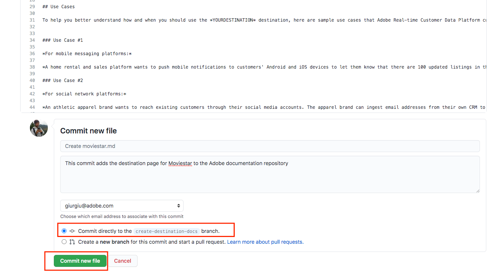

# 使用GitHub Web介面建立目標文檔頁 {#github-interface}

下面的說明說明如何使用GitHub Web介面編寫文檔並提交拉入請求(PR)。 在完成此處指定的步驟之前，請確保您已閱讀 [在Adobe Experience Platform目標中記錄目標](./documentation-instructions.md)。

>[!TIP]
>
>另請參閱《Adobe貢獻者指南》中的支援文檔：
>* [安裝Git和Markdown創作工具](https://experienceleague.adobe.com/docs/contributor/contributor-guide/setup/install-tools.html?lang=en)
>* [在本機設定供文件使用的 Git 存放庫](https://experienceleague.adobe.com/docs/contributor/contributor-guide/setup/local-repo.html?lang=en)
>* [適用於重大變更的 GitHub 貢獻工作流程](https://experienceleague.adobe.com/docs/contributor/contributor-guide/setup/full-workflow.html?lang=en).

## 設定GitHub創作環境 {#set-up-environment}

1. 在瀏覽器中，導航到 `https://github.com/AdobeDocs/experience-platform.en`。
2. 至 [叉](https://experienceleague.adobe.com/docs/contributor/contributor-guide/setup/local-repo.html?lang=en#fork-the-repository) 儲存庫，按一下 **叉** 如下所示。 這將在您自己的GitHub帳戶中建立Experience Platform儲存庫的副本。

   

3. 在儲存庫的分叉中，為項目建立新分支，如下所示。 將此新分支用於您的工作。

   

4. 在已分類儲存庫的GitHub資料夾結構中，導航到 `experience-platform.en/help/destinations/catalog/[...]`，也請參見Wiki頁。 `[...]` 是目標的所需類別。 例如，如果要將個性化目標添加到Experience Platform，請選擇 `personalization` 的子菜單。 選擇 **「添加檔案」>「建立新檔案」**。

   

5. 命名目標 `YOURDESTINATION.md`，其中YOURDESTINATION是您在Adobe Experience Platform的目標名稱。 例如，如果您的公司叫做Moviestar，您會將檔案命名為 `moviestar.md`。

## 為目標建立文檔頁面 {#author-documentation}

1. 您將根據 [文檔自助服務模板](./self-service-template.md)。 **[下載](../assets/docs-framework/yourdestination-template.zip)** 將模板解壓縮以提取 `.md` 檔案模板。
2. 在聯機標籤編輯器中貼上和編輯模板內容，其中包含目標的相關資訊，如 [dillinger.io](https://dillinger.io/)。 請按照模板中的說明了解您應填寫的內容以及可以刪除哪些段落的詳細資訊。

   >[!TIP]
   >
   >您可以隨時關閉瀏覽器窗口，稍後重新開啟。 您的工作將自動保存，並在您重新開啟瀏覽器時等待您。
3. 將內容從標籤編輯器複製到GitHub中的新檔案中。
4. 對於計畫使用的任何螢幕截圖或影像，請使用GitHub介面將檔案上載到 `experience-platform.en/help/destinations/assets/catalog/[...]`，也請參見Wiki頁。 `[...]` 是目標的所需類別。 例如，如果要將個性化目標添加到Experience Platform，請選擇 `personalization` 的子菜單。 您需要從正在創作的頁面連結到影像。 請參閱 [說明如何連結到影像](https://experienceleague.adobe.com/docs/contributor/contributor-guide/writing-essentials/linking.html?lang=en#link-to-images)。

   

5. 準備好後，將檔案保存到分支中。

## 提交文檔以供審閱 {#submit-review}

>[!TIP]
>
>注意，這裡沒有你能破的。 按照本節中的說明，您只是建議進行文檔更新。 您建議的更新將由Adobe Experience Platform文檔小組批准或編輯。

1. 保存檔案並上傳所需映像後，可以開啟拉入請求(PR)，將工作分支合併到Adobe文檔儲存庫的主分支中。 確保已選擇您所處理的分支並選擇 **Contribute >開啟拉式請求**。

1. 確保基分支和比較分支正確。 向PR添加註釋，描述更新，然後選擇 **建立拉入請求**。 這將開啟一個PR，將叉的工作分支合併到Adobe儲存庫的主分支中。

   >[!TIP]
   >
   >離開 **允許維護人員編輯** 複選框，以便Adobe文檔團隊可以編輯PR。

   

1. 此時，將出現一條通知，提示您簽署Adobe參與者許可協定(CLA)。 這是必須的步驟。 簽署CLA後，刷新PR頁並提交拉入請求。

1. 您可以通過檢查 **拉取請求** 頁籤 `https://github.com/AdobeDocs/experience-platform.en`。

   

1. 感謝支持！Adobe文檔團隊將在需要進行任何編輯時在PR中聯繫，並告知您文檔將在何時發佈。

>[!TIP]
>
>要向文檔添加影像和連結，以及有關Markdown的任何其他問題，請閱讀 [使用Markdown](https://experienceleague.adobe.com/docs/contributor/contributor-guide/writing-essentials/markdown.html?lang=en) 在Adobe的合作寫作指南中。
