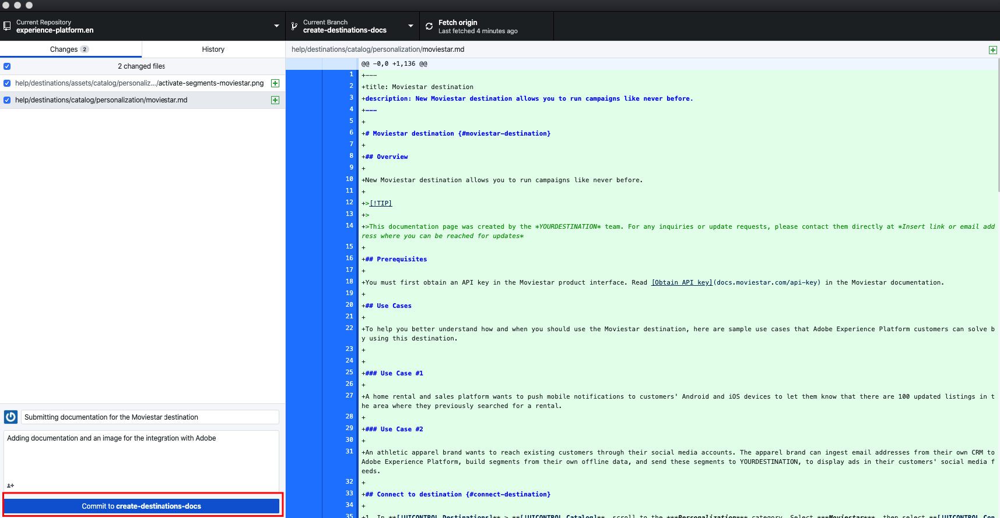

# 在本機環境中使用文字編輯器來建立目的地檔案頁面 {#local-authoring}

本頁的指示會示範如何使用文字編輯器，在您的本機環境中運作，以編寫檔案並提交提取請求(PR)。 執行此處指示的步驟之前，請務必閱讀 [在Adobe Experience Platform目的地中記錄您的目的地](./documentation-instructions.md).

>[!TIP]
>
>另請參閱Adobe貢獻者指南中的支援檔案：
>* [安裝Git與Markdown編寫工具](https://experienceleague.adobe.com/docs/contributor/contributor-guide/setup/install-tools.html?lang=en)
>* [在本機設定供文件使用的 Git 存放庫](https://experienceleague.adobe.com/docs/contributor/contributor-guide/setup/local-repo.html?lang=en)
>* [適用於重大變更的 GitHub 貢獻工作流程](https://experienceleague.adobe.com/docs/contributor/contributor-guide/setup/full-workflow.html?lang=en).

## 連線至GitHub並設定本機製作環境 {#set-up-environment}

1. 在您的瀏覽器中，導覽至 `https://github.com/AdobeDocs/experience-platform.en`
2. 結束日期 [分叉](https://experienceleague.adobe.com/docs/contributor/contributor-guide/setup/local-repo.html?lang=en#fork-the-repository) 儲存庫，按一下 **分支** 如下所示。 如此會在您自己的GitHub帳戶中建立Experience Platform存放庫復本。

   

3. 將存放庫複製到本機電腦. 選擇 **程式碼> HTTPS >使用GitHub Desktop開啟**，如下所示。 請確定您 [GitHub案頭版](https://desktop.github.com/) 已安裝。 如需進一步參考，請參閱 [建立存放庫的本機複製](https://experienceleague.adobe.com/docs/contributor/contributor-guide/setup/local-repo.html?lang=en#create-a-local-clone-of-the-repository) (在Adobe貢獻者指南中)。

   

4. 在本機檔案結構中，導覽至 `experience-platform.en/help/destinations/catalog/[...]`，其中 `[...]` 是您目的地的所需類別。 例如，如果您要新增個人化目的地至Experience Platform，請選取 `personalization` 檔案夾。

## 編寫您目的地的檔案頁面 {#author-documentation}

1. 您的檔案頁面以 [自助服務目的地範本](../docs-framework/self-service-template.md). 下載 [目的地範本](../assets/docs-framework/yourdestination-template.zip). 將其解壓縮並解壓縮檔案 `yourdestination-template.md` 至上述步驟4中提及的目錄。  重新命名檔案 `YOURDESTINATION.md`，其中YOURDESTINATION是Adobe Experience Platform中的目的地名稱。 例如，如果您的公司稱為Moviestar，您可將檔案命名為 `moviestar.md`.
2. 在 [選擇的文本編輯器](https://experienceleague.adobe.com/docs/contributor/contributor-guide/setup/install-tools.html?lang=en#understand-markdown-editors). Adobe建議您使用 [Visual Studio代碼](https://code.visualstudio.com/) 並安裝AdobeMarkdown編寫擴充功能。 若要安裝擴充功能，請開啟Visual Studio Code，選取 **[!DNL Extensions]** 標籤，然後搜尋 `adobe markdown authoring`. 選取擴充功能，然後按一下 **[!DNL Install]**.
   
3. 編輯範本並附上目的地的相關資訊。 遵循範本中的指示。
4. 如需您打算新增至檔案的任何螢幕擷取畫面或影像，請前往 `GitHub/experience-platform.en/help/destinations/assets/catalog/[...]`，其中 `[...]` 是您目的地的所需類別。 例如，如果您要新增個人化目的地至Experience Platform，請選取 `personalization` 檔案夾。 為目的地建立新資料夾，並將影像儲存在此處。 您必須從編寫的頁面連結至這些頁面。 請參閱 [說明如何連結至影像](https://experienceleague.adobe.com/docs/contributor/contributor-guide/writing-essentials/linking.html?lang=en#link-to-images).
5. 準備就緒後，儲存您正在使用的檔案。

## 提交您的檔案以供審核 {#submit-review}

>[!TIP]
>
>請注意，這裡沒有什麼可以打破的。 依照本節中的指示，您只是建議進行檔案更新。 您建議的更新將由Adobe Experience Platform檔案團隊核准或編輯。

1. 在GitHub Desktop中，為更新建立工作分支並選取 **發佈分支** 將分支發佈至GitHub。

1. 在GitHub案頭中， [提交](https://docs.github.com/en/free-pro-team@latest/github/getting-started-with-github/github-glossary#commit) 您的工作，如下所示。

   

1. 在GitHub案頭中， [推送](https://docs.github.com/en/free-pro-team@latest/github/getting-started-with-github/github-glossary#push) 你的工作 [遠端](https://docs.github.com/en/free-pro-team@latest/github/getting-started-with-github/github-glossary#remote) 分支，如下所示。

   

1. 在GitHub網頁介面中，開啟提取請求(PR)，將您的工作分支合併至Adobe檔案存放庫的主分支。 確定已選取您所使用的分支，並選取 **貢獻>開啟提取請求**.

   

1. 請確定基分支和比較分支正確。 新增附註至PR，說明您的更新，然後選取 **建立提取請求**. 這會開啟PR，將復本的工作分支合併至Adobe存放庫的主分支。
   >[!TIP]
   >
   >保留 **允許維護者編輯** 核取方塊已選取，讓Adobe檔案團隊可以編輯PR。

   

1. 此時會出現通知，提示您簽署Adobe貢獻者授權合約(CLA)。 這是必要步驟。 簽署CLA後，請重新整理PR頁面並提交提取請求。

1. 您可以檢查 **提取請求** 標籤 `https://github.com/AdobeDocs/experience-platform.en`.

1. 感謝支持！Adobe檔案團隊會在PR中聯絡，以備您需要任何編輯作業時使用，並通知您檔案將於何時發佈。

>[!TIP]
>
>若要新增影像和連結至您的檔案，以及如需Markdown的其他問題，請閱讀 [使用Markdown](https://experienceleague.adobe.com/docs/contributor/contributor-guide/writing-essentials/markdown.html?lang=en) 在Adobe的協作撰寫指南中。
