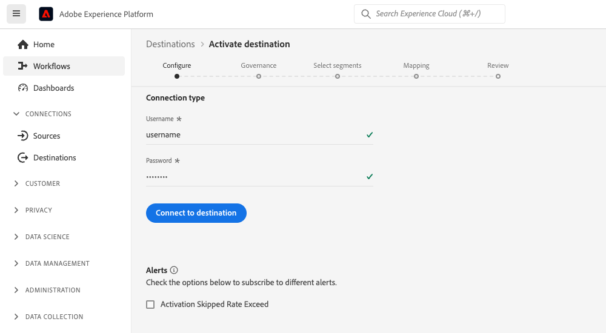

# 客戶驗證設定

Experience Platform在提供給合作夥伴和客戶的驗證通訊協定方面提供極大的彈性。 您可以將目的地設定為支援任何業界標準的驗證方法，例如[!DNL OAuth2]、持有人權杖驗證、密碼驗證等等。

此頁面說明如何使用您偏好的驗證方法來設定目的地。 根據您建立目的地時使用的驗證設定，客戶在Experience Platform UI中連線至目的地時，將會看到不同型別的驗證頁面。

若要瞭解此元件在何處適合使用Destination SDK建立的整合，請參閱[設定選項](../configuration-options.md)檔案中的圖表，或檢視以下目的地設定概觀頁面：

* [使用Destination SDK設定串流目的地](../../guides/configure-destination-instructions.md#create-destination-configuration)
* [使用Destination SDK設定以檔案為基礎的目的地](../../guides/configure-file-based-destination-instructions.md#create-destination-configuration)

客戶必須先依照[目的地連線](../../../ui/connect-destination.md)教學課程中所述的步驟，在Experience Platform和您的目的地之間建立新連線，才能將資料從Experience Platform匯出至您的目的地。

當[透過Destination SDK建立目的地](../../authoring-api/destination-configuration/create-destination-configuration.md)時，`customerAuthenticationConfigurations`區段會定義客戶在[驗證畫面](../../../ui/connect-destination.md#authenticate)中看到的內容。 根據目的地驗證型別，客戶必須提供各種驗證詳細資訊，例如：

* 對於使用[基本驗證](#basic)的目的地，使用者必須直接在Experience Platform UI驗證頁面中提供使用者名稱和密碼。
* 對於使用[持有者驗證](#bearer)的目的地，使用者必須提供持有者權杖。
* 針對使用[OAuth2授權](#oauth2)的目的地，系統會將使用者重新導向至您目的地的登入頁面，使用者可在此使用認證登入。
* 針對[Amazon S3](#s3)目的地，使用者必須提供其[!DNL Amazon S3]存取金鑰和秘密金鑰。
* 針對[Azure Blob](#blob)目的地，使用者必須提供其[!DNL Azure Blob]連線字串。

您可以透過`/authoring/destinations`端點設定客戶驗證詳細資料。 請參閱下列API參考頁面，以取得詳細的API呼叫範例，您可在此範例設定本頁面中顯示的元件。

* [建立目的地設定](../../authoring-api/destination-configuration/create-destination-configuration.md)
* [更新目的地設定](../../authoring-api/destination-configuration/update-destination-configuration.md)

本文會說明您可用於目的地的所有支援客戶驗證設定，並顯示根據您為目的地設定的驗證方法，客戶將在Experience Platform UI中看到的內容。

>[!IMPORTANT]
>
>客戶驗證設定不需要您設定任何引數。 當[建立](../../authoring-api/destination-configuration/create-destination-configuration.md)或[更新](../../authoring-api/destination-configuration/update-destination-configuration.md)目的地組態時，您可以複製並貼上您API呼叫中此頁面顯示的程式碼片段，而您的使用者將會在Experience Platform UI中看到對應的驗證畫面。

>[!IMPORTANT]
>
>Destination SDK支援的所有引數名稱和值都會區分大小寫&#x200B;**&#x200B;**。 為避免區分大小寫錯誤，請完全依照檔案中所示使用引數名稱和值。

## 支援的整合型別 {#supported-integration-types}

如需瞭解哪些型別的整合支援本頁面所述功能的詳細資訊，請參閱下表。

| 整合型別 | 支援功能 |
|---|---|
| 即時（串流）整合 | 是 |
| 檔案式（批次）整合 | 是 |

## 驗證規則設定 {#authentication-rule}

使用本頁所述的任何客戶驗證設定時，請一律將[目的地傳遞](destination-delivery.md)中的`authenticationRule`引數設為`"CUSTOMER_AUTHENTICATION"`，如下所示。

```json {line-numbers="true" highlight="4"
{
   "destinationDelivery":[
      {
         "authenticationRule":"CUSTOMER_AUTHENTICATION",
         "destinationServerId":"{{destinationServerId}}"
      }
   ]
}
```

## 基本驗證 {#basic}

Experience Platform中的即時（串流）整合支援基本驗證。

當您設定基本驗證型別時，使用者必須輸入使用者名稱和密碼，才能連線到您的目的地。



若要設定目的地的基本驗證，請透過`/destinations`端點設定`customerAuthenticationConfigurations`區段，如下所示：

```json
"customerAuthenticationConfigurations":[
   {
      "authType":"BASIC"
   }
]
```

## 持有人驗證 {#bearer}

當您設定持有者驗證型別時，使用者必須輸入他們從您的目的地取得的持有者權杖。


若要設定您目的地的持有者型別驗證，請透過`/destinations`端點設定`customerAuthenticationConfigurations`區段，如下所示：

```json
"customerAuthenticationConfigurations":[
   {
      "authType":"BEARER"
   }
]
```

## OAuth 2驗證 {#oauth2}

使用者選取「**[!UICONTROL 連線到目的地]**」以觸發到您目的地的OAuth 2驗證流程，如以下適用於Twitter自訂對象目的地的範例所示。 如需針對目的地端點設定OAuth 2驗證的詳細資訊，請閱讀專用的[Destination SDK OAuth 2驗證頁面](oauth2-authorization.md)。


若要設定目的地的[!DNL OAuth2]驗證，請透過`/destinations`端點設定`customerAuthenticationConfigurations`區段，如下所示：

```json
"customerAuthenticationConfigurations":[
   {
      "authType":"OAUTH2"
   }
]
```

## Amazon S3驗證 {#s3}

Experience Platform中檔案型目的地支援[!DNL Amazon S3]驗證。

設定Amazon S3驗證型別時，使用者必須輸入其S3認證。

使用S3驗證的

若要設定目的地的[!DNL Amazon S3]驗證，請透過`/destinations`端點設定`customerAuthenticationConfigurations`區段，如下所示：

```json
"customerAuthenticationConfigurations":[
   {
      "authType":"S3"
   }
]
```

## Azure Blob驗證  {#blob}

Experience Platform中檔案型目的地支援[!DNL Azure Blob Storage]驗證。

設定Azure Blob驗證型別時，使用者必須輸入連線字串。

使用Blob驗證的

若要設定目的地的[!DNL Azure Blob]驗證，請設定`/destinations`端點中的`customerAuthenticationConfigurations`引數，如下所示：

```json
"customerAuthenticationConfigurations":[
   {
      "authType":"AZURE_CONNECTION_STRING"
   }
]
```

## [!DNL Azure Data Lake Storage]驗證 {#adls}

Experience Platform中檔案型目的地支援[!DNL Azure Data Lake Storage]驗證。

當您設定[!DNL Azure Data Lake Storage]驗證型別時，使用者必須輸入Azure服務主體認證及其租使用者資訊。

![具有[!DNL Azure Data Lake Storage]驗證的UI轉譯](../../assets/functionality/destination-configuration/adls-authentication-ui.png)

若要設定目的地的[!DNL Azure Data Lake Storage] (ADLS)驗證，請設定`/destinations`端點中的`customerAuthenticationConfigurations`引數，如下所示：

```json
"customerAuthenticationConfigurations":[
   {
      "authType":"AZURE_SERVICE_PRINCIPAL"
   }
]
```

## 使用密碼驗證的SFTP

Experience Platform中的檔案型目的地支援使用密碼的[!DNL SFTP]驗證。

當您使用密碼驗證型別設定SFTP時，使用者需要輸入SFTP使用者名稱和密碼，以及SFTP網域和連線埠（預設連線埠為22）。


若要設定您目的地之密碼的SFTP驗證，請在`/destinations`端點中設定`customerAuthenticationConfigurations`引數，如下所示：

```json
"customerAuthenticationConfigurations":[
   {
      "authType":"SFTP_WITH_PASSWORD"
   }
]
```

## 使用SSH金鑰驗證的SFTP

Experience Platform中的檔案型目的地支援使用[!DNL SSH]金鑰的[!DNL SFTP]驗證。

當您設定具有SSH金鑰驗證型別的SFTP時，使用者需要輸入SFTP使用者名稱和SSH金鑰，以及SFTP網域和連線埠（預設連線埠為22）。


若要設定您目的地的SFTP驗證（使用SSH金鑰），請在`/destinations`端點中設定`customerAuthenticationConfigurations`引數，如下所示：

```json
"customerAuthenticationConfigurations":[
   {
      "authType":"SFTP_WITH_SSH_KEY"
   }
]
```

## [!DNL Google Cloud Storage]驗證 {#gcs}

Experience Platform中檔案型目的地支援[!DNL Google Cloud Storage]驗證。

當您設定[!DNL Google Cloud Storage]驗證型別時，使用者必須輸入其[!DNL Google Cloud Storage] [!UICONTROL 存取金鑰識別碼]和[!UICONTROL 秘密存取金鑰]。


若要設定目的地的[!DNL Google Cloud Storage]驗證，請設定`/destinations`端點中的`customerAuthenticationConfigurations`引數，如下所示：

```json
"customerAuthenticationConfigurations":[
   {
      "authType":"GOOGLE_CLOUD_STORAGE"
   }
]
```

## 後續步驟 {#next-steps}

閱讀本文後，您應該更瞭解如何設定目的地平台的使用者驗證。

若要深入瞭解其他目的地元件，請參閱下列文章：

* [OAuth2授權](oauth2-authorization.md)
* [客戶資料欄位](customer-data-fields.md)
* [UI屬性](ui-attributes.md)
* [結構描述設定](schema-configuration.md)
* [身分名稱空間設定](identity-namespace-configuration.md)
* [支援的對應設定](supported-mapping-configurations.md)
* [目的地傳遞](destination-delivery.md)
* [對象中繼資料設定](audience-metadata-configuration.md)
* [彙總原則](aggregation-policy.md)
* [批次設定](batch-configuration.md)
* [歷史設定檔資格](historical-profile-qualifications.md)
