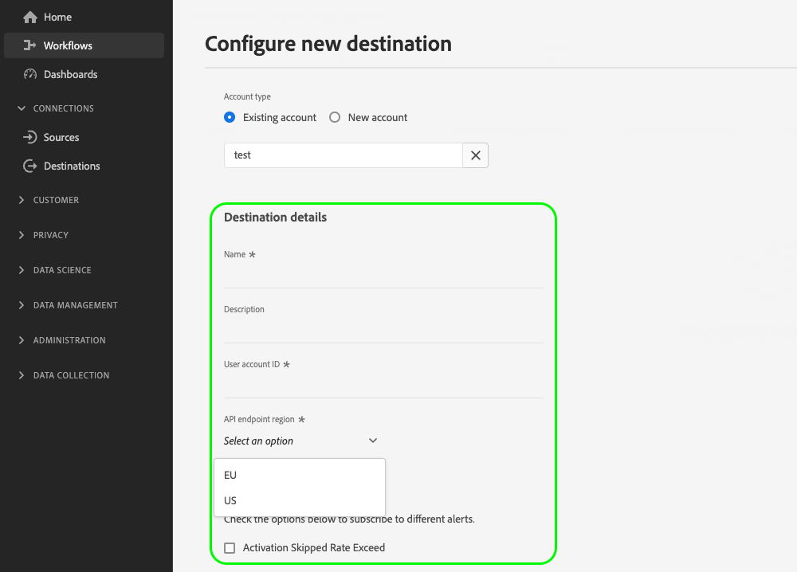

# 透過客戶資料欄位設定使用者輸入

在Experience Platform UI中連線到您的目的地時，您可能需要使用者提供特定設定詳細資訊，或選取您向他們提供的特定選項。 在Destination SDK中，這些選項稱為客戶資料欄位。

若要瞭解此元件在何處適合使用Destination SDK建立的整合，請參閱[設定選項](../configuration-options.md)檔案中的圖表，或檢視以下目的地設定概觀頁面：

* [使用Destination SDK設定串流目的地](../../guides/configure-destination-instructions.md#create-destination-configuration)
* [使用Destination SDK設定以檔案為基礎的目的地](../../guides/configure-file-based-destination-instructions.md#create-destination-configuration)

## 客戶資料欄位的使用案例 {#use-cases}

若您需要使用者將資料輸入至Experience Platform UI，請針對各種使用案例使用客戶資料欄位。 例如，當使用者需要提供以下內容時，請使用客戶資料欄位：

* 適用於檔案型目的地的雲端儲存貯體名稱和路徑。
* 客戶資料欄位接受的格式。
* 使用者可選擇的可用檔案壓縮型別。
* 即時（串流）整合的可用端點清單。

您可以透過`/authoring/destinations`端點設定客戶資料欄位。 請參閱下列API參考頁面，以取得詳細的API呼叫範例，您可在此範例設定本頁面中顯示的元件。

* [建立目的地設定](../../authoring-api/destination-configuration/create-destination-configuration.md)
* [更新目的地設定](../../authoring-api/destination-configuration/update-destination-configuration.md)

本文說明可用於目的地的所有支援客戶資料欄位設定型別，並顯示客戶在Experience Platform UI中會看到的內容。

>[!IMPORTANT]
>
>Destination SDK支援的所有引數名稱和值都會區分大小寫&#x200B;****。 為避免區分大小寫錯誤，請完全依照檔案中所示使用引數名稱和值。

## 支援的整合型別 {#supported-integration-types}

如需瞭解哪些型別的整合支援本頁面所述功能的詳細資訊，請參閱下表。

| 整合型別 | 支援功能 |
|---|---|
| 即時（串流）整合 | 是 |
| 檔案式（批次）整合 | 是 |

## 支援的引數 {#supported-parameters}

建立您自己的客戶資料欄位時，您可以使用下表所述的引數來設定其行為。

| 參數 | 類型 | 必要/選用 | 說明 |
|---------|----------|------|---|
| `name` | 字串 | 必要 | 為您要介紹的自訂欄位提供名稱。 此名稱在Experience Platform UI中不可見，除非`title`欄位空白或遺失。 |
| `type` | 字串 | 必要 | 表示您要引入的自訂欄位的型別。 接受的值： <ul><li>`string`</li><li>`object`</li><li>`integer`</li></ul> |
| `title` | 字串 | 選填 | 表示欄位名稱，如客戶在Experience Platform UI中所見。 如果此欄位空白或遺失，UI會繼承`name`值的欄位名稱。 |
| `description` | 字串 | 選填 | 提供自訂欄位的說明。 此說明不會顯示在Experience Platform UI中。 |
| `isRequired` | 布林值 | 選填 | 指出是否要求使用者在目的地設定工作流程中提供此欄位的值。 |
| `pattern` | 字串 | 選填 | 如有需要，強制自訂欄位使用模式。 使用規則運算式強制執行模式。 例如，如果您的客戶ID不包含數字或底線，請在此欄位中輸入`^[A-Za-z]+$`。 |
| `enum` | 字串 | 選填 | 將自訂欄位呈現為下拉式功能表，並列出使用者可用的選項。 |
| `default` | 字串 | 選填 | 從`enum`清單定義預設值。 |
| `hidden` | 布林值 | 選填 | 指出客戶資料欄位是否顯示在UI中。 |
| `unique` | 布林值 | 選填 | 當您需要建立客戶資料欄位時，使用此引數，該欄位的值在使用者的組織設定的所有目的地資料流中必須是唯一的。 例如，[自訂Personalization](../../../catalog/personalization/custom-personalization.md)目的地中的&#x200B;**[!UICONTROL 整合別名]**&#x200B;欄位必須是唯一的，這表示此目的地的兩個個別資料流不能在此欄位中有相同的值。 |
| `readOnly` | 布林值 | 選填 | 指出客戶是否可以變更欄位的值。 |

{style="table-layout:auto"}

在以下範例中，`customerDataFields`區段定義使用者在連線至目的地時必須在Experience Platform UI中輸入的兩個欄位：

* `Account ID`：您目的地平台的使用者帳戶識別碼。
* `Endpoint region`：它們要連線的API區域端點。 `enum`區段會建立下拉式功能表，其中包含定義於中的值，可供使用者選取。

```json
"customerDataFields":[
   {
      "name":"accountID",
      "title":"User account ID",
      "description":"User account ID for the destination platform.",
      "type":"string",
      "isRequired":true
   },
   {
      "name":"region",
      "title":"API endpoint region",
      "description":"The API endpoint region that the user should connect to.",
      "type":"string",
      "isRequired":true,
      "enum":[
         "EU"
         "US",
      ],
      "readOnly":false,
      "hidden":false
   }
]
```

產生的UI體驗如下圖所示。



## 目的地連線名稱和說明 {#names-description}

建立新目的地時，Destination SDK會自動將&#x200B;**[!UICONTROL 名稱]**&#x200B;和&#x200B;**[!UICONTROL 描述]**&#x200B;欄位新增到Experience Platform UI中的目的地連線畫面。 如上述範例所示，**[!UICONTROL Name]**&#x200B;和&#x200B;**[!UICONTROL Description]**&#x200B;欄位會在UI中轉譯，而不會包含在客戶資料欄位設定中。

>[!IMPORTANT]
>
>如果您在客戶資料欄位設定中新增&#x200B;**[!UICONTROL Name]**&#x200B;和&#x200B;**[!UICONTROL Description]**&#x200B;欄位，使用者會在UI中看到這些欄位重複。

## 訂購客戶資料欄位 {#ordering}

您在目的地設定中新增客戶資料欄位的順序，會反映在Experience Platform UI中。

例如，下列組態會相應反映在UI中，選項會依序顯示&#x200B;**[!UICONTROL Name]**、**[!UICONTROL Description]**、**[!UICONTROL Bucket名稱]**、**[!UICONTROL 資料夾路徑]**、**[!UICONTROL 檔案型別]**、**[!UICONTROL 壓縮格式]**。

```json
"customerDataFields":[
{
   "name":"bucketName",
   "title":"Bucket name",
   "description":"Amazon S3 bucket name",
   "type":"string",
   "isRequired":true,
   "pattern":"(?=^.{3,63}$)(?!^(\\d+\\.)+\\d+$)(^(([a-z0-9]|[a-z0-9][a-z0-9\\-]*[a-z0-9])\\.)*([a-z0-9]|[a-z0-9][a-z0-9\\-]*[a-z0-9])$)",
   "readOnly":false,
   "hidden":false
},
{
   "name":"path",
   "title":"Folder path",
   "description":"Enter the path to your S3 bucket folder",
   "type":"string",
   "isRequired":true,
   "pattern":"^[0-9a-zA-Z\\/\\!\\-_\\.\\*\\''\\(\\)]*((\\%SEGMENT_(NAME|ID)\\%)?\\/?)+$",
   "readOnly":false,
   "hidden":false
},
{
   "name":"fileType",
   "title":"File Type",
   "description":"Select the exported file type.",
   "type":"string",
   "isRequired":true,
   "readOnly":false,
   "hidden":false,
   "enum":[
      "csv",
      "json",
      "parquet"
   ],
   "default":"csv"
},
{
   "name":"compression",
   "title":"Compression format",
   "description":"Select the desired file compression format.",
   "type":"string",
   "isRequired":true,
   "readOnly":false,
   "enum":[
      "SNAPPY",
      "GZIP",
      "DEFLATE",
      "NONE"
   ]
}
]
```


## 群組客戶資料欄位 {#grouping}

您可以將數個客戶資料欄位分組在一個區段中。 在UI中設定與目的地的連線時，使用者可以看到類似欄位的視覺化分組並從中受益。

若要這麼做，請使用`"type": "object"`建立群組，並在`properties`物件中收集所需的客戶資料欄位，如下圖所示，其中群組&#x200B;**[!UICONTROL CSV選項]**&#x200B;已反白顯示。

```json {line-numbers="true" highlight="6-28"}
"customerDataFields":[
   {
      "name":"csvOptions",
      "title":"CSV Options",
      "description":"Select your CSV options",
      "type":"object",
      "properties":[
         {
            "name":"delimiter",
            "title":"Delimiter",
            "description":"Select your Delimiter",
            "type":"string",
            "isRequired":false,
            "default":",",
            "namedEnum":[
               {
                  "name":"Comma (,)",
                  "value":","
               },
               {
                  "name":"Tab (\\t)",
                  "value":"\t"
               }
            ],
            "readOnly":false,
            "hidden":false
         }
      ]
   }
]
```


## 建立客戶資料欄位的下拉式選取器 {#dropdown-selectors}

若您希望允許使用者選取數個選項的情況（例如應使用哪個字元來分隔CSV檔案中的欄位），您可以將下拉欄位新增到UI。

若要這麼做，請使用如下所示的`namedEnum`物件，並為使用者可選取的選項設定`default`值。

```json {line-numbers="true" highlight="15-24"}
"customerDataFields":[
   {
      "name":"csvOptions",
      "title":"CSV Options",
      "description":"Select your CSV options",
      "type":"object",
      "properties":[
         {
            "name":"delimiter",
            "title":"Delimiter",
            "description":"Select your Delimiter",
            "type":"string",
            "isRequired":false,
            "default":",",
            "namedEnum":[
               {
                  "name":"Comma (,)",
                  "value":","
               },
               {
                  "name":"Tab (\\t)",
                  "value":"\t"
               }
            ],
            "readOnly":false,
            "hidden":false
         }
      ]
   }
]
```


## 為客戶資料欄位建立動態下拉式選取器 {#dynamic-dropdown-selectors}

若您希望動態呼叫API並使用回應來動態填入下拉式選單中的選項，您可以使用動態下拉式選取器。

動態下拉式清單選取器看起來與UI中的[一般下拉式清單選取器](#dropdown-selectors)相同。 唯一的差異是值會從API動態擷取。

若要建立動態下拉式選取器，您必須設定兩個元件：

**步驟1。** [使用動態API呼叫的`responseFields`範本建立目的地伺服器](../../authoring-api/destination-server/create-destination-server.md#dynamic-dropdown-servers)，如下所示。

```json
{
   "name":"Server for dynamic dropdown",
   "destinationServerType":"URL_BASED",
   "urlBasedDestination":{
      "url":{
         "templatingStrategy":"PEBBLE_V1",
         "value":" <--YOUR-API-ENDPOINT-PATH--> "
      }
   },
   "httpTemplate":{
      "httpMethod":"GET",
      "headers":[
         {
            "header":"Authorization",
            "value":{
               "templatingStrategy":"PEBBLE_V1",
               "value":"My Bearer Token"
            }
         },
         {
            "header":"x-integration",
            "value":{
               "templatingStrategy":"PEBBLE_V1",
               "value":"{{customerData.integrationId}}"
            }
         },
         {
            "header":"Accept",
            "value":{
               "templatingStrategy":"NONE",
               "value":"application/json"
            }
         }
      ]
   },
   "responseFields":[
      {
         "templatingStrategy":"PEBBLE_V1",
         "value":"   {{ {'list': list} | toJson | raw }}",
         "name":"list"
      }
   ]
}
```

**步驟2。**&#x200B;使用`dynamicEnum`物件，如下所示。 在下列範例中，`User`下拉式清單是使用動態伺服器擷取。


```json {line-numbers="true" highlight="13-21"}
"customerDataFields": [
  {
    "name": "integrationId",
    "title": "Integration ID",
    "type": "string",
    "isRequired": true
  },
  {
    "name": "userId",
    "title": "User",
    "type": "string",
    "isRequired": true,
    "dynamicEnum": {
      "queryParams": [
        "integrationId"
      ],
      "destinationServerId": "<~dynamic-field-server-id~>",
      "authenticationRule": "CUSTOMER_AUTHENTICATION",
      "value": "$.list",
      "responseFormat": "NAME_VALUE"
    }
  }
]
```

將`destinationServerId`引數設定為您在步驟1建立的目的地伺服器識別碼。 您可以在[擷取目的地伺服器組態](../../authoring-api/destination-server/retrieve-destination-server.md) API呼叫的回應中看到目的地伺服器識別碼。

## 建立巢狀客戶資料欄位 {#nested-fields}

您可以為複雜的整合模式建立巢狀客戶資料欄位。 這可讓您為客戶鏈結一系列選擇。

例如，您可以新增巢狀客戶資料欄位，要求客戶選取與您目的地的整合型別，然後立即選取另一個專案。 第二個選取專案是整合型別內的巢狀欄位。

若要新增巢狀欄位，請使用`properties`引數，如下所示。 在下列設定範例中，您可以在&#x200B;**您的目的地 — 整合特定設定**&#x200B;客戶資料欄位中看到三個個別的巢狀欄位。

>[!TIP]
>
>從2024年4月發行版本開始，您可以在巢狀欄位上設定`isRequired`引數。 例如，在下方的設定程式碼片段中，前兩個巢狀欄位會標示為必要（醒目提示第xxx行），而客戶除非為欄位選取值，否則無法繼續。 深入瞭解[支援的引數](#supported-parameters)區段中的必要欄位。

```json {line-numbers="true" highlight="11,20"}
    {
      "name": "yourdestination",
      "title": "Yourdestination - Integration Specific Settings",
      "type": "object",
      "properties": [
        {
          "name": "agreement",
          "title": "Advertiser data destination terms agreement. Enter I AGREE.",
          "type": "string",
          "isRequired": true,
          "pattern": "I AGREE",
          "readOnly": false,
          "hidden": false
        },
        {
          "name": "account-name",
          "title": "Account name",
          "type": "string",
          "isRequired": true,
          "readOnly": false,
          "hidden": false
        },
        {
          "name": "email",
          "title": "Email address",
          "type": "string",
          "isRequired": false,
          "pattern": "^[\\w-\\.]+@([\\w-]+\\.)+[\\w-]{2,4}$",
          "readOnly": false,
          "hidden": false
        }
      ],
      "isRequired": false,
      "readOnly": false,
      "hidden": false,
```

## 建立條件式客戶資料欄位 {#conditional-options}

您可以建立條件式客戶資料欄位，這些欄位僅在使用者選取特定選項時才會顯示在啟動工作流程中。

例如，您可以建立條件檔案格式選項，以便在使用者選取特定檔案匯出型別時才會顯示。

下列設定會為CSV檔案格式選項建立條件式群組。 只有當使用者選取CSV作為匯出的所需檔案型別時，才會顯示CSV檔案選項。

若要將欄位設為條件式，請使用`conditional`引數，如下所示：

```json
"conditional": {
   "field": "fileType",
   "operator": "EQUALS",
   "value": "CSV"
}
```

在更廣大的內容中，您可以看到下列目的地設定中正在使用`conditional`欄位，以及`fileType`字串和在其中定義它的`csvOptions`物件。 條件欄位是在`properties`引數中定義。

```json {line-numbers="true" highlight="3-15, 21-25"}
"customerDataFields":[
   {
      "name":"fileType",
      "title":"File Type",
      "description":"Select your file type",
      "type":"string",
      "isRequired":true,
      "enum":[
         "PARQUET",
         "CSV",
         "JSON"
      ],
      "readOnly":false,
      "hidden":false
   },
   {
      "name":"csvOptions",
      "title":"CSV Options",
      "description":"Select your CSV options",
      "type":"object",
      "conditional":{
         "field":"fileType",
         "operator":"EQUALS",
         "value":"CSV"
      },
      "properties":[
         {
            "name":"delimiter",
            "title":"Delimiter",
            "description":"Select your Delimiter",
            "type":"string",
            "isRequired":false,
            "default":",",
            "namedEnum":[
               {
                  "name":"Comma (,)",
                  "value":","
               },
               {
                  "name":"Tab (\\t)",
                  "value":"\t"
               }
            ],
            "readOnly":false,
            "hidden":false
         },
         {
            "name":"quote",
            "title":"Quote Character",
            "description":"Select your Quote character",
            "type":"string",
            "isRequired":false,
            "default":"",
            "namedEnum":[
               {
                  "name":"Double Quotes (\")",
                  "value":"\""
               },
               {
                  "name":"Null Character (\u0000)",
                  "value":"\u0000"
               }
            ],
            "readOnly":false,
            "hidden":false
         },
         {
            "name":"escape",
            "title":"Escape Character",
            "description":"Select your Escape character",
            "type":"string",
            "isRequired":false,
            "default":"\\",
            "namedEnum":[
               {
                  "name":"Back Slash (\\)",
                  "value":"\\"
               },
               {
                  "name":"Single Quote (')",
                  "value":"'"
               }
            ],
            "readOnly":false,
            "hidden":false
         },
         {
            "name":"emptyValue",
            "title":"Empty Value",
            "description":"Select the output value of blank fields",
            "type":"string",
            "isRequired":false,
            "default":"",
            "namedEnum":[
               {
                  "name":"Empty String",
                  "value":""
               },
               {
                  "name":"\"\"",
                  "value":"\"\""
               },
               {
                  "name":"null",
                  "value":"null"
               }
            ],
            "readOnly":false,
            "hidden":false
         },
         {
            "name":"nullValue",
            "title":"Null Value",
            "description":"Select the output value of 'null' fields",
            "type":"string",
            "isRequired":false,
            "default":"null",
            "namedEnum":[
               {
                  "name":"Empty String",
                  "value":""
               },
               {
                  "name":"\"\"",
                  "value":"\"\""
               },
               {
                  "name":"null",
                  "value":"null"
               }
            ],
            "readOnly":false,
            "hidden":false
         }
      ],
      "isRequired":false,
      "readOnly":false,
      "hidden":false
   }
]
```

您可以在下方根據上述設定檢視產生的UI畫面。 當使用者選擇檔案型別CSV時，參考CSV檔案型別的其他檔案格式選項會顯示在UI中。


## 存取範本化客戶資料欄位 {#accessing-templatized-fields}

當您的目的地需要使用者輸入時，您必須向使用者提供一系列客戶資料欄位，讓使用者可透過Experience Platform UI填寫這些欄位。 然後，您必須設定目的地伺服器，以從客戶資料欄位正確讀取使用者輸入。 這是透過範本化欄位完成的。

範本化欄位使用格式`{{customerData.fieldName}}`，其中`fieldName`是您正在讀取資訊的客戶資料欄位名稱。 所有範本化的客戶資料欄位前面都有`customerData.`，並括在雙大括弧`{{ }}`內。

例如，我們考慮下列Amazon S3目的地設定：

```json
"customerDataFields":[
   {
      "name":"bucketName",
      "title":"Enter the name of your Amazon S3 bucket",
      "description":"Amazon S3 bucket name",
      "type":"string",
      "isRequired":true,
      "pattern":"(?=^.{3,63}$)(?!^(\\d+\\.)+\\d+$)(^(([a-z0-9]|[a-z0-9][a-z0-9\\-]*[a-z0-9])\\.)*([a-z0-9]|[a-z0-9][a-z0-9\\-]*[a-z0-9])$)",
      "readOnly":false,
      "hidden":false
   },
   {
      "name":"path",
      "title":"Enter the path to your S3 bucket folder",
      "description":"Enter the path to your S3 bucket folder",
      "type":"string",
      "isRequired":true,
      "pattern":"^[0-9a-zA-Z\\/\\!\\-_\\.\\*\\''\\(\\)]*((\\%SEGMENT_(NAME|ID)\\%)?\\/?)+$",
      "readOnly":false,
      "hidden":false
   }
]
```

此設定會提示您的使用者在各自的客戶資料欄位中輸入其[!DNL Amazon S3]貯體名稱和資料夾路徑。

若要Experience Platform正確連線至[!DNL Amazon S3]，您的目的地伺服器必須設定為從這兩個客戶資料欄位讀取值，如下所示：

```json
 "fileBasedS3Destination":{
      "bucketName":{
         "templatingStrategy":"PEBBLE_V1",
         "value":"{{customerData.bucketName}}"
      },
      "path":{
         "templatingStrategy":"PEBBLE_V1",
         "value":"{{customerData.path}}"
      }
   }
```

範本化值`{{customerData.bucketName}}`和`{{customerData.path}}`會讀取使用者提供的值，以便Experience Platform可以成功連線到目的地平台。

如需有關如何設定目的地伺服器以讀取範本化欄位的詳細資訊，請參閱有關[硬式編碼與範本化欄位](../destination-server/server-specs.md#templatized-fields)的檔案。

## 後續步驟 {#next-steps}

閱讀本文後，您應該更加瞭解如何允許使用者透過客戶資料欄位在Experience Platform UI中輸入資訊。 您現在也知道如何針對使用案例選取正確的客戶資料欄位，以及如何在Experience Platform UI中設定、訂購和分組客戶資料欄位。

若要深入瞭解其他目的地元件，請參閱下列文章：

* [客戶驗證](customer-authentication.md)
* [OAuth2授權](oauth2-authorization.md)
* [UI屬性](ui-attributes.md)
* [結構描述設定](schema-configuration.md)
* [身分名稱空間設定](identity-namespace-configuration.md)
* [支援的對應設定](supported-mapping-configurations.md)
* [目的地傳遞](destination-delivery.md)
* [對象中繼資料設定](audience-metadata-configuration.md)
* [彙總原則](aggregation-policy.md)
* [批次設定](batch-configuration.md)
* [歷史設定檔資格](historical-profile-qualifications.md)
