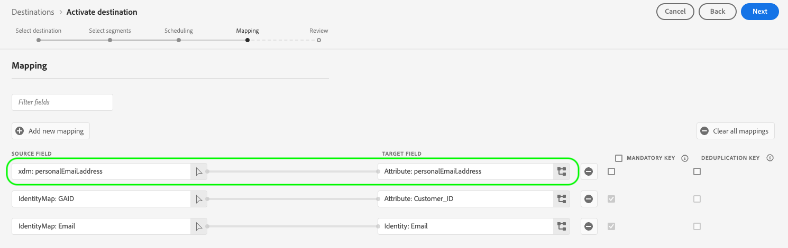

# 支援的對應設定

以Destination SDK建置的目的地會根據目的地型別，支援特定的身分名稱空間和屬性對應設定。

本文會說明在設定目的地時，可以使用的所有支援對應設定。

>[!WARNING]
>
>Destination SDK不支援本文中未說明的任何對應設定。

在建立目的地時，請根據此頁面中說明的其中一個對應設定，設定您的結構描述和身分識別名稱空間。

>[!IMPORTANT]
>
>Destination SDK支援的所有引數名稱和值如下 **區分大小寫**. 為避免區分大小寫錯誤，請完全依照檔案中所示使用引數名稱和值。

## 串流目的地支援的對應 {#streaming-mappings}

以Destination SDK建立的即時（串流）目的地可支援下表所述的對應設定。

| 來源欄位 | 目標欄位 |
| --- | --- |
| XDM屬性 | 自訂屬性 |
| 身分命名空間 | 身分命名空間 |

以下設定範例可讓客戶使用上表中這兩種對應。

```json
"schemaConfig":{
   "profileRequired":true,
   "segmentRequired":true,
   "identityRequired":true
},
"identityNamespaces":{
   "Customer_contact":{
      "acceptsAttributes":false,
      "acceptsCustomNamespaces":true,
      "acceptedGlobalNamespaces":{
         "Email":{
            
         },
         "Phone":{
            
         }
      }
   }
},
```

### 將XDM屬性對應至自訂屬性 {#streaming-xdm-to-custom}

使用者可將來源XDM設定檔中的屬性對應到目的地側的自訂屬性。

使用者在選取目標欄位對應時，必須手動輸入目標自訂屬性的名稱。


產生的UI體驗如下圖所示。


### 將身分識別名稱空間對應至合作夥伴身分識別名稱空間 {#streaming-identity-to-identity}

使用者可以將來自Platform的自訂或全域身分識別名稱空間對應到您定義的身分識別名稱空間。

產生的UI體驗如下圖所示。


## 檔案型目的地支援的對應 {#batch-mappings}

以Destination SDK建立的檔案型目的地可支援下表所述的對應設定。 如需詳細的對應範例，請參閱下一節。

| 來源欄位 | 目標欄位 |
| --- | --- |
| XDM屬性 | 屬性/自訂屬性 |
| 身分命名空間 | 屬性/自訂屬性 |
| 身分命名空間 | 身分命名空間 |

以下設定範例可讓客戶使用上表中的所有對應。

```json
"schemaConfig":{
   "profileRequired":true,
   "segmentRequired":true,
   "identityRequired":true
},
"identityNamespaces":{
   "Customer_contact":{
      "acceptsAttributes":false,
      "acceptsCustomNamespaces":true,
      "acceptedGlobalNamespaces":{
         "Email":{
         },
         "Phone":{
         }
      }
   }
},
```

### 將XDM屬性對應至自訂屬性 {#batch-xdm-to-custom}

使用者可將來源XDM設定檔中的屬性對應到目的地側的自訂屬性。

對於以檔案為基礎的目的地，目標欄位會自動填入與來源欄位名稱相同的預設屬性。

產生的UI體驗如下圖所示。



使用者可以保留預設名稱，或在目標欄位選擇畫面中輸入自訂屬性名稱。


### 將身分識別名稱空間對應至自訂屬性 {#batch-identity-to-custom}

使用者可將自訂或全域身分名稱空間從Platform對應到目的地側的自訂屬性。

選取身分名稱空間作為來源欄位時，目標欄位會自動填入等效的身分名稱空間。 若要使用自訂屬性取代目標欄位，使用者必須在目標欄位選擇畫面中輸入自訂屬性名稱。


產生的UI體驗如下圖所示。


### 將身分識別名稱空間對應至合作夥伴身分識別名稱空間 {#batch-identity-to-identity}

使用者可以將自訂或全域身分名稱空間從Platform對應到等同的身分名稱空間。

選取身分名稱空間作為來源欄位時，目標欄位會自動填入等效的身分名稱空間。

產生的UI體驗如下圖所示。


## 後續步驟 {#next-steps}

閱讀本文後，您應該更加瞭解使用Destination SDK建立的目的地支援哪些對應。

若要深入瞭解其他目的地元件，請參閱下列文章：

* [客戶驗證](customer-authentication.md)
* [OAuth2授權](oauth2-authorization.md)
* [客戶資料欄位](customer-data-fields.md)
* [UI屬性](ui-attributes.md)
* [綱要設定](schema-configuration.md)
* [身分名稱空間設定](identity-namespace-configuration.md)
* [目的地傳遞](destination-delivery.md)
* [對象中繼資料設定](audience-metadata-configuration.md)
* [彙總原則](aggregation-policy.md)
* [批次設定](batch-configuration.md)
* [歷史設定檔資格](historical-profile-qualifications.md)
