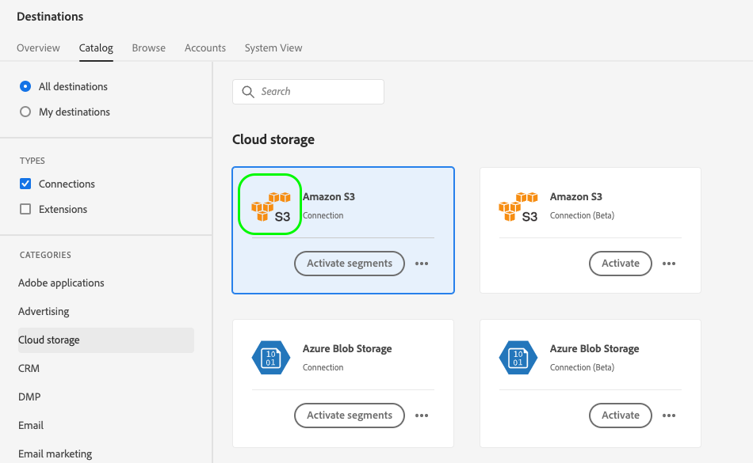

# UI屬性

UI屬性會定義Adobe在Adobe Experience Platform使用者介面中應針對目的地卡片顯示的視覺元素，例如標誌、檔案頁面的連結、目的地說明及其類別和型別。

若要瞭解此元件在何處適合使用Destination SDK建立的整合，請參閱 [設定選項](../configuration-options.md) 檔案或請參閱下列目的地設定總覽頁面：

* [使用Destination SDK設定串流目的地](../../guides/configure-destination-instructions.md#create-destination-configuration)
* [使用Destination SDK來設定以檔案為基礎的目的地](../../guides/configure-file-based-destination-instructions.md#create-destination-configuration)

時間 [建立目的地](../../authoring-api/destination-configuration/create-destination-configuration.md) 透過Destination SDK， `uiAttributes` 區段會定義目的地卡片的下列視覺屬性：

* 您在中的目的地檔案頁面URL [目的地目錄](../../../catalog/overview.md).
* Platform UI中顯示您目的地的類別。
* 您目的地的資料匯出頻率。
* 目的地連線型別，例如Amazon S3、Azure Blob等。
* 您託管要在目的地目錄卡片中顯示之圖示的URL。

您可以透過以下方式設定UI屬性 `/authoring/destinations` 端點。 請參閱下列API參考頁面，以取得詳細的API呼叫範例，您可在此範例設定本頁面中顯示的元件。

* [建立目的地設定](../../authoring-api/destination-configuration/create-destination-configuration.md)
* [更新目的地設定](../../authoring-api/destination-configuration/update-destination-configuration.md)

本文說明可用於目的地的所有受支援UI屬性，並顯示客戶將在Experience PlatformUI中看到的內容。


>[!IMPORTANT]
>
>Destination SDK支援的所有引數名稱和值如下 **區分大小寫**. 為避免區分大小寫錯誤，請完全依照檔案中所示使用引數名稱和值。

## 支援的整合型別 {#supported-integration-types}

如需瞭解哪些型別的整合支援本頁面所述功能的詳細資訊，請參閱下表。

| 整合型別 | 支援功能 |
|---|---|
| 即時（串流）整合 | 是 |
| 檔案式（批次）整合 | 是 |

## 支援的引數 {#supported-parameters}

```json
"uiAttributes":{
      "documentationLink":"http://www.adobe.com/go/YOURDESTINATION-en",
      "category":"cloudStorage",
      "connectionType":"S3",
      "frequency":"batch",
      "isBeta":"true"
   }
```

### `documentationLink` {#documentation-link}

`documentationLink` 是字串引數，會參照 [目的地目錄](../../../catalog/overview.md) 以取得您的目的地。 Adobe Experience Platform中每個產品化的目的地都必須有對應的檔案頁面。 [瞭解如何建立目的地檔案頁面](../../docs-framework/documentation-instructions.md) 以取得您的目的地。 請注意，私人/自訂目的地不需要此資訊。

使用以下格式： `http://www.adobe.com/go/destinations-YOURDESTINATION-en`，其中 `YOURDESTINATION` 是您目的地的名稱。 針對名為Moviestar的目的地，您可以使用 `http://www.adobe.com/go/destinations-moviestar-en`.

使用者可以從UI中的目的地目錄頁面檢視和瀏覽您的檔案連結。 他們必須瀏覽至您的目的地卡片，然後選取「 」 **[!UICONTROL 更多動作]**，然後 **[!UICONTROL 檢視檔案]**，如下圖所示。


>[!NOTE]
>
>只有在Adobe將您的目的地設定為上線並發佈檔案後，此連結才有效。

### `category` {#category}

`category` 是字串引數，會參照在Adobe Experience Platform中指派給您的目的地的類別。 如需詳細資訊，請閱讀 [目的地類別](../../../destination-types.md). 使用下列其中一個值： `adobeSolutions, advertising, analytics, cdp, cloudStorage, crm, customerSuccess, database, dmp, ecommerce, email, emailMarketing, enrichment, livechat, marketingAutomation, mobile, personalization, protocols, social, streaming, subscriptions, surveys, tagManagers, voc, warehouses, payments`.

使用者可在目的地目錄的畫面左側看到目的地類別清單，如下圖所示。


### `connectionType` {#connection-type}

`connectionType` 是字串引數，根據目的地而定，會參照連線的型別。 支援的值： <ul><li>`Server-to-server`</li><li>`Cloud storage`</li><li>`Azure Blob`</li><li>`Azure Data Lake Storage`</li><li>`S3`</li><li>`SFTP`</li><li>`DLZ`</li></ul>

使用者可以在以下位置檢視目的地連線型別： [瀏覽](../../../ui/destinations-workspace.md#browse) 目的地工作區的索引標籤。


### `frequency` {#frequency}

`frequency` 是字串引數，參考您的目的地支援的資料匯出型別。 將設為 `Streaming` 針對API型整合，或 `Batch` 將檔案匯出至目的地時。

使用者可以在以下位置檢視頻率型別： **[!UICONTROL 資料流執行]** 每個目的地連線的頁面。


### `isBeta` {#isbeta}

如果您透過Destination SDK建立的目的地可供有限數量的客戶使用，您可能會想要將目的地目錄中的目的地卡片標示為測試版。

若要這麼做，您可以使用 `isBeta: "true"` 目的地設定的UI屬性區段中的引數，以適當地標示目的地卡片。


### `icon` {#icon}

您可以新增標誌圖示至您的目的地，如下圖所示。



若要將標誌新增至目的地卡片，您需要在以下情況下與Adobe團隊共用所需的影像 [提交目的地以供檢閱](../../guides/submit-destination.md#logo).

## 後續步驟 {#next-steps}

閱讀本文後，您應該更加瞭解您可以為目的地設定哪些UI屬性，以及使用者將在Platform UI中的何處看到這些屬性。

若要深入瞭解其他目的地元件，請參閱下列文章：

* [客戶驗證](customer-authentication.md)
* [OAuth2授權](oauth2-authorization.md)
* [客戶資料欄位](customer-data-fields.md)
* [綱要設定](schema-configuration.md)
* [身分名稱空間設定](identity-namespace-configuration.md)
* [目的地傳遞](destination-delivery.md)
* [對象中繼資料設定](audience-metadata-configuration.md)
* [彙總原則](aggregation-policy.md)
* [批次設定](batch-configuration.md)
* [歷史設定檔資格](historical-profile-qualifications.md)
