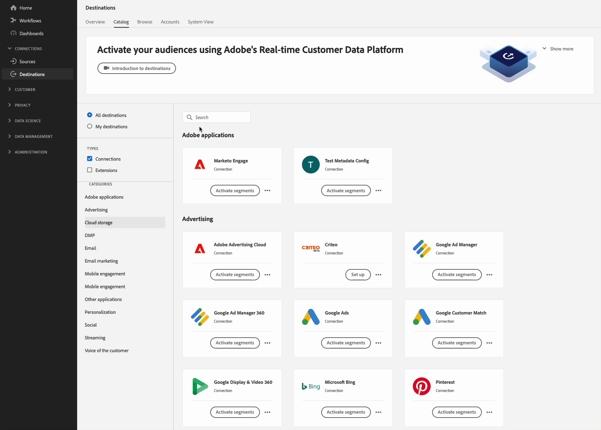

# 設定 [!DNL Azure Blob Storage] 具有自訂檔案格式選項和自訂檔案名稱設定的目的地

## 總覽 {#overview}

此頁面說明如何使用Destination SDK來設定 [!DNL Azure Blob Storage] 具有自訂功能的目的地 [檔案格式選項](configure-file-formatting-options.md) 和自訂 [檔案名稱設定](../../functionality/destination-configuration/batch-configuration.md#file-name-configuration).

此頁面顯示Azure Blob儲存體目的地可用的所有設定選項。 您可以視需要編輯下列步驟中顯示的配置，或刪除配置的某些部分。

如需以下所使用引數的詳細說明，請參閱 [目的地SDK中的設定選項](../../functionality/configuration-options.md).

## 先決條件 {#prerequisites}

在繼續進行下列步驟之前，請閱讀 [Destination SDK快速入門](../../getting-started.md) 頁面以取得必要的Adobe I/O驗證認證，以及使用Destination SDKAPI的其他先決條件。

## 步驟1：建立伺服器和檔案組態 {#create-server-file-configuration}

首先使用 `/destination-server` 端點至 [建立伺服器和檔案組態](../../authoring-api/destination-server/create-destination-server.md).

**API格式**

```http
POST platform.adobe.io/data/core/activation/authoring/destination-servers
```

**要求**

以下請求會建立新的目的地伺服器設定，由承載中提供的引數設定。
以下承載包含具有自訂功能的通用Azure Blob設定 [CSV檔案格式設定](../../functionality/destination-server/file-formatting.md) 使用者可在Experience PlatformUI中定義的設定引數。

```shell
curl -X POST https://platform.adobe.io/data/core/activation/authoring/destination-server \
 -H 'Authorization: Bearer {ACCESS_TOKEN}' \
 -H 'Content-Type: application/json' \
 -H 'x-gw-ims-org-id: {ORG_ID}' \
 -H 'x-api-key: {API_KEY}' \
 -H 'x-sandbox-name: {SANDBOX_NAME}' \ 
 -d '
{
   "name":"Azure Blob server with custom file formatting options and custom file name configuration",
   "description":"Azure Blob server with custom file formatting options and custom file name configuration",
   "destinationServerType":"FILE_BASED_AZURE_BLOB",
   "fileBasedAzureBlobDestination":{
      "path":{
         "templatingStrategy":"PEBBLE_V1",
         "value":"{{customerData.path}}"
      },
      "container":{
         "templatingStrategy":"PEBBLE_V1",
         "value":"{{customerData.container}}"
      }
   },
   "fileConfigurations":{
      "compression":{
         "templatingStrategy":"PEBBLE_V1",
         "value":"{{customerData.compression}}"
      },
      "fileType":{
         "templatingStrategy":"PEBBLE_V1",
         "value":"{{customerData.fileType}}"
      },
      "csvOptions":{
         "sep":{
            "templatingStrategy":"PEBBLE_V1",
            "value":"{{customerData.sep}}"
         },
         "encoding":{
            "templatingStrategy":"PEBBLE_V1",
            "value":"{{customerData.encoding}}"
         },
         "quote":{
            "templatingStrategy":"PEBBLE_V1",
            "value":"{{customerData.quote}}"
         },
         "quoteAll":{
            "templatingStrategy":"PEBBLE_V1",
            "value":"{{customerData.quoteAll}}"
         },
         "escape":{
            "templatingStrategy":"PEBBLE_V1",
            "value":"{{customerData.escape}}"
         },
         "escapeQuotes":{
            "templatingStrategy":"PEBBLE_V1",
            "value":"{{customerData.escapeQuotes}}"
         },
         "header":{
            "templatingStrategy":"PEBBLE_V1",
            "value":"{{customerData.header}}"
         },
         "ignoreLeadingWhiteSpace":{
            "templatingStrategy":"PEBBLE_V1",
            "value":"{{customerData.ignoreLeadingWhiteSpace}}"
         },
         "nullValue":{
            "templatingStrategy":"PEBBLE_V1",
            "value":"{{customerData.nullValue}}"
         },
         "dateFormat":{
            "templatingStrategy":"PEBBLE_V1",
            "value":"{{customerData.dateFormat}}"
         },
         "charToEscapeQuoteEscaping":{
            "templatingStrategy":"PEBBLE_V1",
            "value":"{{customerData.charToEscapeQuoteEscaping}}"
         },
         "emptyValue":{
            "templatingStrategy":"PEBBLE_V1",
            "value":"{{customerData.dateFormat}}"
         }
      }
   }
}'
```

成功的回應會傳回新的目的地伺服器設定，包括唯一識別碼(`instanceId`)。 將此值儲存為下一個步驟所需的值。

## 步驟2：建立目的地設定 {#create-destination-configuration}

在上一步中建立目的地伺服器和檔案格式設定後，您現在可以使用 `/destinations` API端點以建立目的地設定。

若要在中連線伺服器組態 [步驟1](#create-server-file-configuration) 對於此目的地設定，將 `destinationServerId` 值放入下列API請求中，並使用在中建立您的目的地伺服器時獲得的值 [步驟1](#create-server-file-configuration).

**API格式**

```http
POST platform.adobe.io/data/core/activation/authoring/destinations
```

**要求**

```shell
curl -X POST https://platform.adobe.io/data/core/activation/authoring/destinations \
 -H 'Authorization: Bearer {ACCESS_TOKEN}' \
 -H 'Content-Type: application/json' \
 -H 'x-gw-ims-org-id: {ORG_ID}' \
 -H 'x-api-key: {API_KEY}' \
 -H 'x-sandbox-name: {SANDBOX_NAME}' \
 -d ' {
   "name":"Azure Blob Storage destination with custom file formatting options and custom file name configuration",
   "description":"Azure Blob Storage destination with custom file formatting options and custom file name configuration",
   "status":"TEST",
   "customerAuthenticationConfigurations":[
      {
         "authType":"AZURE_CONNECTION_STRING"
      }
   ],
   "customerDataFields":[
      {
         "name":"path",
         "title":"Folder path",
         "description":"Enter your Azure Blob folder path",
         "type":"string",
         "isRequired":true,
         "readOnly":false,
         "hidden":false
      },
      {
         "name":"container",
         "title":"Azure Blob container name",
         "description":"Enter your Azure Blob container name",
         "type":"string",
         "isRequired":true,
         "readOnly":false,
         "hidden":false
      },
      {
         "name":"sep",
         "title":"Enter your desired separator for each field and value",
         "description":"Enter your desired separator for each field and value",
         "type":"string",
         "isRequired":false,
         "readOnly":false,
         "hidden":false
      },
      {
         "name":"encoding",
         "title":"Select the desired CSV file encoding",
         "description":"Select the desired CSV file encoding",
         "type":"string",
         "enum":[
            "UTF-8",
            "UTF-16"
         ],
         "isRequired":false,
         "readOnly":false,
         "hidden":false
      },
      {
         "name":"quote",
         "title":"Quoted values escape character",
         "description":"Enter the desired character to be used for escaping quoted values.",
         "type":"string",
         "isRequired":false,
         "readOnly":false,
         "hidden":false
      },
      {
         "name":"quoteAll",
         "title":"Escape all quoted values",
         "description":"Select whether to escape all quoted values.",
         "type":"string",
         "enum":[
            "true",
            "false"
         ],
         "default":"true",
         "isRequired":true,
         "readOnly":false,
         "hidden":false
      },
      {
         "name":"escape",
         "title":"Quote escaping character",
         "description":"Enter the desired character to be used for escaping quotes inside an already quoted value.",
         "type":"string",
         "isRequired":false,
         "readOnly":false,
         "hidden":false
      },
      {
         "name":"escapeQuotes",
         "title":"Enclose quoted values within quotes",
         "description":"Select whether values containing quotes should always be enclosed in quotes.",
         "type":"string",
         "enum":[
            "true",
            "false"
         ],
         "isRequired":false,
         "default":"true",
         "readOnly":false,
         "hidden":false
      },
      {
         "name":"header",
         "title":"Generate file header.",
         "description":"Select whether to write the names of columns as the first line of the exported files.",
         "type":"string",
         "isRequired":false,
         "enum":[
            "true",
            "false"
         ],
         "readOnly":false,
         "default":"true",
         "hidden":false
      },
      {
         "name":"ignoreLeadingWhiteSpace",
         "title":"Ignore leading white space",
         "description":"Select whether leading whitespaces should be trimmed from exported values.",
         "type":"string",
         "isRequired":false,
         "enum":[
            "true",
            "false"
         ],
         "readOnly":false,
         "default":"true",
         "hidden":false
      },
      {
         "name":"nullValue",
         "title":"NULL value string format",
         "description":"Enter the string representation of a NULL value. ",
         "type":"string",
         "isRequired":false,
         "readOnly":false,
         "hidden":false
      },
      {
         "name":"dateFormat",
         "title":"Date format",
         "description":"Enter the desired date format. ",
         "type":"string",
         "default":"yyyy-MM-dd",
         "isRequired":false,
         "readOnly":false,
         "hidden":false
      },
      {
         "name":"charToEscapeQuoteEscaping",
         "title":"Quote escaping escape character",
         "description":"Enter the desired character to be used for escaping the escaping of a quote character.",
         "type":"string",
         "isRequired":false,
         "readOnly":false,
         "hidden":false
      },
      {
         "name":"emptyValue",
         "title":"Empty value string format",
         "description":"Enter the string representation of an empty value.",
         "type":"string",
         "isRequired":false,
         "readOnly":false,
         "default":"",
         "hidden":false
      },
      {
         "name":"compression",
         "title":"Compression format",
         "description":"Select the desired file compression format.",
         "type":"string",
         "isRequired":true,
         "readOnly":false,
         "enum":[
            "SNAPPY",
            "GZIP",
            "DEFLATE",
            "NONE"
         ]
      },
      {
         "name":"fileType",
         "title":"File type",
         "description":"Select the exported file type.",
         "type":"string",
         "isRequired":true,
         "readOnly":false,
         "hidden":false,
         "enum":[
            "csv",
            "json",
            "parquet"
         ],
         "default":"csv"
      }
   ],
   "uiAttributes":{
      "documentationLink":"https://www.adobe.com/go/destinations-blob-connection-parameters-en",
      "category":"cloudStorage",
      "connectionType":"Azure Blob",
      "frequency":"Batch",
      "flowRunsSupported":true,
      "monitoringSupported":true
   },
   "destinationDelivery":[
      {
         "deliveryMatchers":[
            {
               "type":"SOURCE",
               "value":[
                  "batch"
               ]
            }
         ],
         "authenticationRule":"CUSTOMER_AUTHENTICATION",
         "destinationServerId":"{{instanceID of your destination server}}"
      }
   ],
   "schemaConfig":{
      "profileRequired":true,
      "segmentRequired":true,
      "identityRequired":true
   },
   "batchConfig":{
      "allowMandatoryFieldSelection":true,
      "allowJoinKeyFieldSelection":true,
      "defaultExportMode":"DAILY_FULL_EXPORT",
      "allowedExportMode":[
         "DAILY_FULL_EXPORT",
         "FIRST_FULL_THEN_INCREMENTAL"
      ],
      "allowedScheduleFrequency":[
         "DAILY",
         "EVERY_3_HOURS",
         "EVERY_6_HOURS",
         "EVERY_8_HOURS",
         "EVERY_12_HOURS",
         "ONCE",
         "EVERY_HOUR"
      ],
      "defaultFrequency":"DAILY",
      "defaultStartTime":"00:00",
      "filenameConfig":{
         "allowedFilenameAppendOptions":[
            "SEGMENT_NAME",
            "DESTINATION_INSTANCE_ID",
            "DESTINATION_INSTANCE_NAME",
            "ORGANIZATION_NAME",
            "SANDBOX_NAME",
            "DATETIME",
            "CUSTOM_TEXT"
         ],
         "defaultFilenameAppendOptions":[
            "DATETIME"
         ],
         "defaultFilename":"%DESTINATION%_%SEGMENT_ID%"
      },
      "backfillHistoricalProfileData":true
   }
}'
```

成功的回應會傳回新的目的地設定，包括唯一識別碼(`instanceId`)。 如果您需要進一步提出HTTP請求來更新您的目的地設定，請視需要儲存此值。

## 步驟3：驗證Experience PlatformUI {#verify-ui}

根據上述設定，Experience Platform目錄現在會顯示新的私人目的地卡供您使用。



在以下影像和錄製中，請注意中的選項 [檔案型目的地的啟用工作流程](/help/destinations/ui/activate-batch-profile-destinations.md) 符合您在目的地設定中選取的選項。

填寫有關目的地的詳細資料時，請注意顯示的欄位是您在設定中設定的自訂資料欄位。

>[!TIP]
>
>您新增自訂資料欄位至目的地設定的順序不會反映在UI中。 自訂資料欄位一律會以下方熒幕錄製中顯示的順序顯示。


排程匯出間隔時，請注意欄位顯示方式為您在中設定的欄位 `batchConfig` 設定。


檢視檔案名稱組態選項時，請注意出現的欄位如何表示 `filenameConfig` 您在設定中設定的選項。


如果您想要調整任何上述欄位，請重複 [步驟一](#create-server-file-configuration) 和 [二](#create-destination-configuration) 以根據您的需求修改設定。

## 步驟4： （選用）發佈您的目的地 {#publish-destination}

>[!NOTE]
>
>如果您要建立私人目的地以供您自己使用，且不想將其發佈到目的地目錄以供其他客戶使用，則不需要執行此步驟。

設定目的地後，請使用 [目的地發佈API](../../publishing-api/create-publishing-request.md) 以將您的設定提交至Adobe以供檢閱。

## 步驟5：（選擇性）記錄您的目的地 {#document-destination}

>[!NOTE]
>
>如果您要建立私人目的地以供您自己使用，且不想將其發佈到目的地目錄以供其他客戶使用，則不需要執行此步驟。

如果您是獨立軟體廠商(ISV)或系統整合商(SI)，請建立 [產品化整合](../../overview.md#productized-custom-integrations)，使用 [自助服務檔案程式](../../docs-framework/documentation-instructions.md) 若要在中建立您目的地的產品檔案頁面 [Experience Platform目的地目錄](../../../catalog/overview.md).

## 後續步驟 {#next-steps}

閱讀本文章，您現在瞭解如何撰寫自訂 [!DNL Azure Blob Storage] 目的地使用Destination SDK。 接下來，您的團隊可以使用 [檔案型目的地的啟用工作流程](../../../ui/activate-batch-profile-destinations.md) 將資料匯出至目的地。
