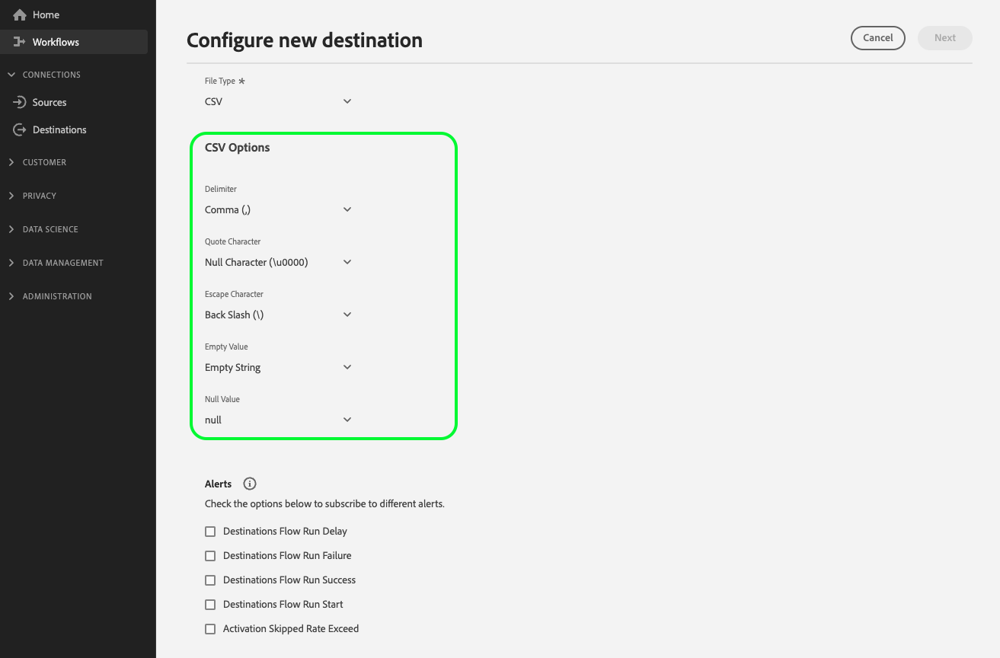

# 為基於檔案的目標配置檔案格式選項

## 總覽 {#overview}

Destination SDK允許您廣泛調整導出檔案的格式設定和壓縮選項，以滿足儲存位置中的任何下游要求。

本頁介紹如何使用Destination SDK為基於檔案的目標配置檔案格式選項。

## 先決條件 {#prerequisites}

在前進到下面概述的步驟之前，請閱讀 [Destination SDK入門](../../getting-started.md) 頁，以獲取使用Adobe I/OAPI的必要Destination SDK身份驗證憑據和其他先決條件。

Adobe還建議您在繼續之前閱讀並熟悉以下文檔：

* 每個可用的檔案格式選項都將在 [檔案格式配置](../../functionality/destination-server/file-formatting.md) 的子菜單。
* 完成步驟 [配置基於檔案的目標](../../guides/configure-file-based-destination-instructions.md) 使用Destination SDK。

## 建立伺服器和檔案配置 {#create-server-file-configuration}

開始使用 `/destination-server` 終結點，以確定要為導出的檔案設定的檔案格式配置選項。

下面是一個目標伺服器配置示例 [!DNL Amazon S3] 目標，並選擇了多個檔案格式選項。

**API格式**

```http
POST platform.adobe.io/data/core/activation/authoring/destination-servers
```

**要求**

```shell
curl -X POST https://platform.adobe.io/data/core/activation/authoring/destination-server \
 -H 'Authorization: Bearer {ACCESS_TOKEN}' \
 -H 'Content-Type: application/json' \
 -H 'x-gw-ims-org-id: {ORG_ID}' \
 -H 'x-api-key: {API_KEY}' \
 -H 'x-sandbox-name: {SANDBOX_NAME}' \
 -d '
{
{
  "name": "Amazon S3 Server with several CSV Options",
  "destinationServerType": "FILE_BASED_S3",
  "fileBasedS3Destination": {
    "bucket": {
      "templatingStrategy": "PEBBLE_V1",
      "value": "{{customerData.bucket}}"
    },
    "path": {
      "templatingStrategy": "PEBBLE_V1",
      "value": "{{customerData.path}}"
    }
  },
  "fileConfigurations": {
    "compression": {
      "templatingStrategy": "PEBBLE_V1",
      "value": "{{customerData.compression}}NONE"
    },
    "fileType": {
      "templatingStrategy": "PEBBLE_V1",
      "value": "{{customerData.fileType}}"
    },
    "csvOptions": {
      "sep": {
        "templatingStrategy": "PEBBLE_V1",
        "value": "{{customerData.csvOptions.delimiter}},"
      },
      "quote": {
        "templatingStrategy": "PEBBLE_V1",
        "value": "{{customerData.csvOptions.quote}}\""
      },
      "escape": {
        "templatingStrategy": "PEBBLE_V1",
        "value": "{{customerData.csvOptions.escape}}\\"
      },
      "nullValue": {
        "templatingStrategy": "PEBBLE_V1",
        "value": "{{customerData.csvOptions.nullValue}}null"
      },
      "emptyValue": {
        "templatingStrategy": "PEBBLE_V1",
        "value": "{{customerData.csvOptions.emptyValue}}"
      }
    }
  }
}
}'
```

## 將檔案格式選項添加到目標配置 {#create-destination-configuration}

>[!TIP]
>
>**驗證Experience PlatformUI**。 在配置檔案格式選項時，應使用下面各節中說明的配置，檢查Experience PlatformUI以瞭解如何呈現這些選項。

將所需的檔案格式選項添加到目標伺服器中，並在上一步中添加檔案格式配置後，現在可以使用 `/destinations` API終結點，將所需欄位作為客戶資料欄位添加到目標配置。

>[!IMPORTANT]
>
>此步驟是可選的，它只確定應在Experience PlatformUI中向用戶呈現哪些檔案格式選項。 如果未將檔案格式設定選項設定為客戶資料欄位，則檔案導出將繼續使用中配置的預設值 [伺服器和檔案配置](#create-server-file-configuration)。

在此步驟中，您可以按所需的任何順序對顯示的選項進行分組，也可以根據所選檔案類型建立自定義分組、下拉欄位和條件分組。 所有這些設定都顯示在錄制和下面的部分。


### 排序檔案格式選項 {#ordering}

在目標配置中將檔案格式選項作為客戶資料欄位添加到UI中的順序。 例如，下面的配置會相應地反映在UI中，選項按順序顯示 **[!UICONTROL 分隔符]**。 **[!UICONTROL 引號字元]**。 **[!UICONTROL 轉義字元]**。 **[!UICONTROL 空值]**。 **[!UICONTROL 空值]**。



```json
        {
            "name": "csvOptions",
            "title": "CSV Options",
            "description": "Select your CSV options",
            "type": "object",
            "properties": [
                {
                    "name": "delimiter",
                    "title": "Delimiter",
                    "description": "Select your Delimiter",
                    "type": "string",
                    "isRequired": false,
                    "default": ",",
                    "namedEnum": [
                        {
                            "name": "Comma (,)",
                            "value": ","
                        },
                        {
                            "name": "Tab (\\t)",
                            "value": "\t"
                        }
                    ],
                    "readOnly": false,
                    "hidden": false
                },
                {
                    "name": "quote",
                    "title": "Quote Character",
                    "description": "Select your Quote character",
                    "type": "string",
                    "isRequired": false,
                    "default": "\u0000",
                    "namedEnum": [
                        {
                            "name": "Double Quotes (\")",
                            "value": "\""
                        },
                        {
                            "name":"Null Character (\u0000)",
                            "value": ""
                        }
                    ],
                    "readOnly": false,
                    "hidden": false
                },
                {
                    "name": "escape",
                    "title": "Escape Character",
                    "description": "Select your Escape character",
                    "type": "string",
                    "isRequired": false,
                    "default": "\\",
                    "namedEnum": [
                        {
                            "name": "Back Slash (\\)",
                            "value": "\\"
                        },
                        {
                            "name": "Single Quote (')",
                            "value": "'"
                        }
                    ],
                    "readOnly": false,
                    "hidden": false
                },
                {
                    "name": "emptyValue",
                    "title": "Empty Value",
                    "description": "Select the output value of blank fields",
                    "type": "string",
                    "isRequired": false,
                    "default": "",
                    "namedEnum": [
                        {
                            "name": "Empty String",
                            "value": ""
                        },
                        {
                            "name": "\"\"",
                            "value": "\"\""
                        },
                        {
                            "name": "null",
                            "value": "null"
                        }
                    ],
                    "readOnly": false,
                    "hidden": false
                },
                {
                    "name": "nullValue",
                    "title": "Null Value",
                    "description": "Select the output value of 'null' fields",
                    "type": "string",
                    "isRequired": false,
                    "default": "null",
                    "namedEnum": [
                        {
                            "name": "Empty String",
                            "value": ""
                        },
                        {
                            "name": "\"\"",
                            "value": "\"\""
                        },
                        {
                            "name": "null",
                            "value": "null"
                        }
                    ],
                    "readOnly": false,
                    "hidden": false
                }
```

### 將檔案格式選項分組 {#grouping}

可以在一個節中對多個檔案格式選項進行分組。 在UI中設定到目標的連接時，用戶可以看到類似欄位的可視分組並從中受益。

要執行此操作，請使用 `"type": "object"` 建立組，並收集 `properties` 參數，如下例所示，其中分組 **[!UICONTROL CSV選項]** 的子菜單。

```json {line-numbers="true" start-number="100" highlight="106-128"}
"customerDataFields":[
[...]
{
   "name":"csvOptions",
   "title":"CSV Options",
   "description":"Select your CSV options",
   "type":"object",
   "properties":[
      {
         "name":"delimiter",
         "title":"Delimiter",
         "description":"Select your Delimiter",
         "type":"string",
         "isRequired":false,
         "default":",",
         "namedEnum":[
            {
               "name":"Comma (,)",
               "value":","
            },
            {
               "name":"Tab (\\t)",
               "value":"\t"
            }
         ],
         "readOnly":false,
         "hidden":false
      },
      [...]
   ]
}
[...]
]
```


### 為檔案格式選項建立下拉選擇器 {#dropdown-selectors}

對於希望允許用戶在多個選項之間進行選擇的情況，例如，應使用哪個字元來分隔CSV檔案中的欄位，可以向UI中添加下拉欄位。

要執行此操作，請使用 `namedEnum` 如下所示對象並配置 `default` 選項的值。

```json {line-numbers="true" start-number="100" highlight="114-124"}
[...]
"customerDataFields":[
[...]
{
   "name":"csvOptions",
   "title":"CSV Options",
   "description":"Select your CSV options",
   "type":"object",
   "properties":[
      {
         "name":"delimiter",
         "title":"Delimiter",
         "description":"Select your Delimiter",
         "type":"string",
         "isRequired":false,
         "default":",",
         "namedEnum":[
            {
               "name":"Comma (,)",
               "value":","
            },
            {
               "name":"Tab (\\t)",
               "value":"\t"
            }
         ],
         "readOnly":false,
         "hidden":false
      },
      [...]
   ]
}
[...]
]
```


### 建立條件檔案格式選項 {#conditional-options}

您可以建立條件檔案格式設定選項，這些選項僅在用戶選擇特定檔案類型進行導出時才顯示在激活工作流中。 例如，以下配置為CSV檔案選項建立條件分組。 僅當用戶選擇CSV作為所需的檔案類型以進行導出時，才顯示CSV檔案選項。

要將欄位設定為條件，請使用 `conditional` 參數，如下所示：

```json
            "conditional": {
                "field": "fileType",
                "operator": "EQUALS",
                "value": "CSV"
            }
```

在更廣的上下文中，您可以 `conditional` 在下面的目標配置中使用的欄位 `fileType` 字串和 `csvOptions` 定義對象。

```json
        {
            "name": "fileType",
            "title": "File Type",
            "description": "Select your file type",
            "type": "string",
            "isRequired": true,
            "enum": [
                "PARQUET",
                "CSV",
                "JSON"
            ],
            "readOnly": false,
            "hidden": false
        },
        {
            "name": "csvOptions",
            "title": "CSV Options",
            "description": "Select your CSV options",
            "type": "object",
            "conditional": {
                "field": "fileType",
                "operator": "EQUALS",
                "value": "CSV"
            },            
            "properties": [
                {
                    "name": "delimiter",
                    "title": "Delimiter",
                    "description": "Select your Delimiter",
                    "type": "string",
                    "isRequired": false,
                    "default": ",",
                    "namedEnum": [
                        {
                            "name": "Comma (,)",
                            "value": ","
                        },
                        {
                            "name": "Tab (\\t)",
                            "value": "\t"
                        }
                    ],
                    "readOnly": false,
                    "hidden": false
                },
                {
                    "name": "quote",
                    "title": "Quote Character",
                    "description": "Select your Quote character",
                    "type": "string",
                    "isRequired": false,
                    "default": "",
                    "namedEnum": [
                        {
                            "name": "Double Quotes (\")",
                            "value": "\""
                        },
                        {
                            "name":"Null Character (\u0000)",
                            "value": "\u0000"
                        }
                    ],
                    "readOnly": false,
                    "hidden": false
                },
                {
                    "name": "escape",
                    "title": "Escape Character",
                    "description": "Select your Escape character",
                    "type": "string",
                    "isRequired": false,
                    "default": "\\",
                    "namedEnum": [
                        {
                            "name": "Back Slash (\\)",
                            "value": "\\"
                        },
                        {
                            "name": "Single Quote (')",
                            "value": "'"
                        }
                    ],
                    "readOnly": false,
                    "hidden": false
                },
                {
                    "name": "emptyValue",
                    "title": "Empty Value",
                    "description": "Select the output value of blank fields",
                    "type": "string",
                    "isRequired": false,
                    "default": "",
                    "namedEnum": [
                        {
                            "name": "Empty String",
                            "value": ""
                        },
                        {
                            "name": "\"\"",
                            "value": "\"\""
                        },
                        {
                            "name": "null",
                            "value": "null"
                        }
                    ],
                    "readOnly": false,
                    "hidden": false
                },
                {
                    "name": "nullValue",
                    "title": "Null Value",
                    "description": "Select the output value of 'null' fields",
                    "type": "string",
                    "isRequired": false,
                    "default": "null",
                    "namedEnum": [
                        {
                            "name": "Empty String",
                            "value": ""
                        },
                        {
                            "name": "\"\"",
                            "value": "\"\""
                        },
                        {
                            "name": "null",
                            "value": "null"
                        }
                    ],
                    "readOnly": false,
                    "hidden": false
                }
            ],
            "isRequired": false,
            "readOnly": false,
            "hidden": false
        }
```

在下面，您可以根據上述配置看到生成的UI螢幕。 當用戶選擇檔案類型CSV時，UI中將顯示引用CSV檔案類型的其他檔案格式選項。


### 完成API請求，包括上面顯示的所有選項

下面的API請求將上述各節中描述的所有選項組合到一個配置中。

**要求**

```shell
curl -X POST https://platform.adobe.io/data/core/activation/authoring/destinations \
 -H 'Authorization: Bearer {ACCESS_TOKEN}' \
 -H 'Content-Type: application/json' \
 -H 'x-gw-ims-org-id: {ORG_ID}' \
 -H 'x-api-key: {API_KEY}' \
 -H 'x-sandbox-name: {SANDBOX_NAME}' \
 -d '
{
  "name": "My S3 Destination",
  "description": "Test destination",
  "status": "TEST",
  "sources": [
    "UNIFIED_PROFILE"
  ],
  "customerAuthenticationConfigurations": [
    {
      "authType": "S3"
    }
  ],
  "customerDataFields": [
    {
      "name": "bucket",
      "type": "string",
      "title": "Bucket",
      "description": "Enter your S3 Bucket",
      "isRequired": true
    },
    {
      "name": "path",
      "type": "string",
      "title": "Path",
      "description": "Enter your S3 Path",
      "isRequired": true
    },
    {
      "name": "fileType",
      "type": "string",
      "enum": [
        "CSV",
        "JSON",
        "PARQUET"
      ],
      "title": "File Type",
      "description": "Select your file type",
      "isRequired": true
    },
    {
      "name": "csvOptions",
      "type": "object",
      "title": "CSV Options",
      "description": "Select your CSV options",
      "conditional": {
        "field": "fileType",
        "operator": "EQUALS",
        "value": "CSV"
      },
      "properties": [
        {
          "name": "delimiter",
          "type": "string",
          "title": "Delimiter",
          "description": "Select your Delimiter",
          "namedEnum": [
            {
              "name": "Comma (,)",
              "value": ","
            },
            {
              "name": "Tab (\\t)",
              "value": "\t"
            }
          ],
          "default": ","
        },
        {
          "name": "quote",
          "type": "string",
          "title": "Quote Character",
          "description": "Select your Quote character",
          "namedEnum": [
            {
              "name": "Double Quotes (\")",
              "value": "\""
            },
            {
              "name": "Null Character (\\u0000)",
              "value": "\u0000"
            }
          ],
          "default": "\u0000"
        },
        {
          "name": "escape",
          "type": "string",
          "title": "Escape Character",
          "description": "Select your Escape character",
          "namedEnum": [
            {
              "name": "Back Slash (\\)",
              "value": "\\"
            },
            {
              "name": "Single Quote (')",
              "value": "'"
            }
          ],
          "default": "\\"
        },
        {
          "name": "emptyValue",
          "type": "string",
          "title": "Empty Value",
          "description": "Select the output value of blank fields",
          "namedEnum": [
            {
              "name": "null",
              "value": "null"
            },
            {
              "name": "Empty String",
              "value": ""
            },
            {
              "name": "\"\"",
              "value": "\"\""
            }
          ],
          "default": ""
        },
        {
          "name": "nullValue",
          "type": "string",
          "title": "Null Value",
          "description": "Select the output value of 'null' fields",
          "namedEnum": [
            {
              "name": "null",
              "value": "null"
            },
            {
              "name": "Empty String",
              "value": ""
            },
            {
              "name": "\"\"",
              "value": "\"\""
            }
          ],
          "default": "null"
        }
      ]
    }
  ],
  "uiAttributes": {
    "documentationLink": "https://www.adobe.com/go/aep",
    "category": "cloudStorage",
    "connectionType": "Server-to-server",
    "frequency": "Batch",
    "monitoringSupported": true,
    "flowRunsSupported": true
  },
  "schemaConfig": {
    "profileRequired": true,
    "segmentRequired": true,
    "identityRequired": true
  },
  "batchConfig": {
    "allowMandatoryFieldSelection": true,
    "allowDedupeKeyFieldSelection": true,
    "defaultExportMode": "DAILY_FULL_EXPORT",
    "allowedExportMode": [
      "DAILY_FULL_EXPORT",
      "FIRST_FULL_THEN_INCREMENTAL"
    ],
    "allowedScheduleFrequency": [
      "DAILY",
      "EVERY_3_HOURS",
      "EVERY_6_HOURS",
      "EVERY_8_HOURS",
      "EVERY_12_HOURS",
      "ONCE"
    ],
    "defaultFrequency": "DAILY",
    "defaultStartTime": "00:00",
    "filenameConfig": {
      "allowedFilenameAppendOptions": [
        "SEGMENT_NAME",
        "DESTINATION_INSTANCE_ID",
        "DESTINATION_INSTANCE_NAME",
        "ORGANIZATION_NAME",
        "SANDBOX_NAME",
        "DATETIME",
        "CUSTOM_TEXT"
      ],
      "defaultFilenameAppendOptions": [
        "DATETIME"
      ],
      "defaultFilename": "%DESTINATION%_%SEGMENT_ID%"
    }
  },
  "destinationDelivery": [
    {
      "deliveryMatchers": [
        {
          "type": "SOURCE",
          "value": [
            "batch"
          ]
        }
      ],
      "authenticationRule": "CUSTOMER_AUTHENTICATION",
      "destinationServerId": "<server-id>"
    }
  ]
}'
```

成功的響應返回目標配置，包括唯一標識符(`instanceId`)。

## 已知限制 {#known-limitations}

某些檔案格式選項組合可能會導致不希望的檔案導出結果。
Adobe建議不要選擇以下CSV選項組合：

```
nullValue -> ""
quote -> "
emptyValue -> ""
```

要說明限制，請考慮導出具有以下值的檔案：

| 名字 | lastname | 鄉 | state |
|---------|----------|---------|--------|
| 麥克 | 玫瑰 | 美國 | 尼 |
| 詹姆斯 | Smith |  | null |

{style="table-layout:auto"}

這將產生如下所示的輸出。 注意表中的null值如何錯誤地導出為轉義引號。

```csv
Michael,Rose,USA,NY 
James,Smith,"","\"\""
```

## 後續步驟 {#next-steps}

通過閱讀本文，您現在知道如何使用Destination SDK為導出的檔案設定自定義檔案格式選項。 接下來，您的團隊可以 [用於基於檔案的目標的激活工作流](../../../ui/activate-batch-profile-destinations.md) 將資料導出到目標。
