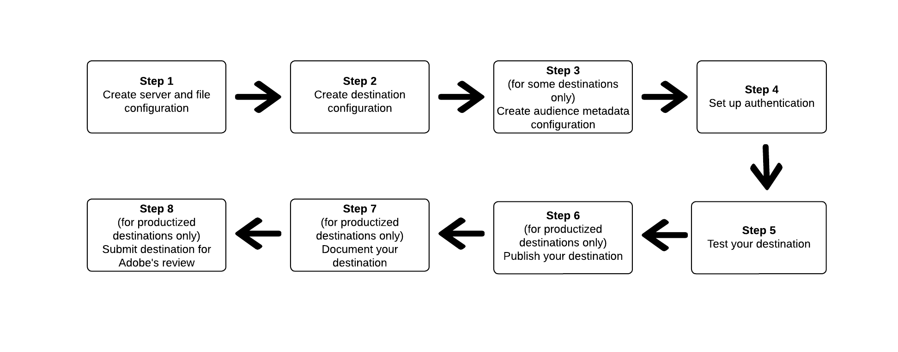

# 使用Destination SDK配置基於檔案的目標

## 總覽 {#overview}

本頁介紹如何使用中的資訊 [目標SDK中的配置選項](../functionality/configuration-options.md) 和其他Destination SDK功能和API參考文檔中 [基於檔案的目標](../../destination-types.md#file-based)。 這些步驟按如下順序排列。

## 先決條件 {#prerequisites}

在前進到下面所示的步驟之前，請閱讀 [Destination SDK入門](../getting-started.md) 頁，以獲取使用Adobe I/OAPI的必要Destination SDK身份驗證憑據和其他先決條件。

## 使用Destination SDK中的配置選項設定目標的步驟 {#steps}



## 步驟1:建立伺服器和檔案配置 {#create-server-file-configuration}

開始於 [建立伺服器和檔案配置](../authoring-api/destination-server/create-destination-server.md) 使用 `/destinations-server` 端點。

下面顯示的是 [!DNL Amazon S3] 目標。 要配置其他類型的基於檔案的目標，請參見其相應的 [伺服器配置](../functionality/destination-server/server-specs.md)。

**API格式**

```shell
POST platform.adobe.io/data/core/activation/authoring/destination-servers
```

```json
{
    "name": "S3 destination",
    "destinationServerType": "FILE_BASED_S3",
    "fileBasedS3Destination": {
        "bucketName": {
            "templatingStrategy": "PEBBLE_V1",
            "value": "{{customerData.bucketName}}"
        },
        "path": {
            "templatingStrategy": "PEBBLE_V1",
            "value": "{{customerData.path}}"
        }
    },
    "fileConfigurations": {
        "compression": {
            "templatingStrategy": "PEBBLE_V1",
            "value": "{{customerData.compression}}"
        },
        "fileType": {
            "templatingStrategy": "PEBBLE_V1",
            "value": "{{customerData.fileType}}"
        },
        "csvOptions": {
            "quote": {
                "templatingStrategy": "NONE",
                "value": "\""
            },
            "quoteAll": {
                "templatingStrategy": "NONE",
                "value": "false"
            },
            "escape": {
                "templatingStrategy": "NONE",
                "value": "\\"
            },
            "escapeQuotes": {
                "templatingStrategy": "NONE",
                "value": "true"
            },
            "header": {
                "templatingStrategy": "NONE",
                "value": "true"
            },
            "ignoreLeadingWhiteSpace": {
                "templatingStrategy": "NONE",
                "value": "true"
            },
            "ignoreTrailingWhiteSpace": {
                "templatingStrategy": "NONE",
                "value": "true"
            },
            "nullValue": {
                "templatingStrategy": "NONE",
                "value": ""
            },
            "dateFormat": {
                "templatingStrategy": "NONE",
                "value": "yyyy-MM-dd"
            },
            "timestampFormat": {
                "templatingStrategy": "NONE",
                "value": "yyyy-MM-dd'T':mm:ss[.SSS][XXX]"
            },
            "charToEscapeQuoteEscaping": {
                "templatingStrategy": "NONE",
                "value": "\\"
            },
            "emptyValue": {
                "templatingStrategy": "NONE",
                "value": ""
            }
        }
    }
}
```

## 步驟2:建立目標配置 {#create-destination-configuration}

下面是目標配置的示例，使用 `/destinations` API終結點。

要將步驟1中的伺服器和檔案配置連接到此目標配置，請將伺服器和模板配置的實例ID添加為 `destinationServerId` 給。

**API格式**

```http
POST platform.adobe.io/data/core/activation/authoring/destinations
```

```json {line-numbers="true" highlight="84"}
{
    "name": "Amazon S3 destination",
    "description": "Amazon S3 destination is a fictional destination, used for this example.",
    "status": "Test",
    "customerAuthenticationConfigurations": [
        {
            "authType": "S3"
        }
    ],
    "customerEncryptionConfigurations": [],
    "customerDataFields": [
        {
            "name": "bucketName",
            "title": "Amazon S3 bucket name",
            "description": "Enter the Amazon S3 Bucket name that will host the exported files.",
            "type": "string",
            "isRequired": true,
            "pattern": "(?=^.{3,63}$)(?!^(\\d+\\.)+\\d+$)(^(([a-z0-9]|[a-z0-9][a-z0-9\\-]*[a-z0-9])\\.)*([a-z0-9]|[a-z0-9][a-z0-9\\-]*[a-z0-9])$)",
            "readOnly": false,
            "hidden": false
        },
        {
            "name": "path",
            "title": "Amazon S3 path",
            "description": "Enter Amazon S3 folder path",
            "type": "string",
            "isRequired": true,
            "pattern": "^[0-9a-zA-Z\\/\\!\\-_\\.\\*\\''\\(\\)]*((\\%SEGMENT_(NAME|ID)\\%)?\\/?)+$",
            "readOnly": false,
            "hidden": false
        },
        {
            "name": "compression",
            "title": "Select compression type",
            "description": "Select the file compression type used by the exported files.",
            "type": "string",
            "isRequired": true,
            "readOnly": false,
            "enum": [
                "GZIP",
                "NONE",
                "bzip2",
                "lz4",
                "snappy",
                "deflate"
            ]
        },
        {
            "name": "fileType",
            "title": "Select a file format",
            "description": "Select the file format to be used by the exported files.",
            "type": "string",
            "isRequired": true,
            "readOnly": false,
            "hidden": false,
            "enum": [
                "csv",
                "json",
                "parquet"
            ],
            "default": "csv"
        }
    ],
    "uiAttributes": {
        "documentationLink": "https://www.adobe.io/apis/experienceplatform.html",
        "category": "S3",
        "connectionType": "S3",
        "flowRunsSupported": true,
        "monitoringSupported": true,
        "frequency": "Batch"
    },
    "destinationDelivery": [
        {
            "deliveryMatchers": [
                {
                    "type": "SOURCE",
                    "value": [
                        "batch"
                    ]
                }
            ],
            "authenticationRule": "CUSTOMER_AUTHENTICATION",
            "destinationServerId": "eec25bde-4f56-4c02-a830-9aa9ec73ee9d"
        }
    ],
    "schemaConfig": {
        "profileRequired": true,
        "segmentRequired": true,
        "identityRequired": true
    },
    "batchConfig": {
        "allowMandatoryFieldSelection": true,
        "allowDedupeKeyFieldSelection": true,
        "defaultExportMode": "DAILY_FULL_EXPORT",
        "allowedExportMode": [
            "DAILY_FULL_EXPORT",
            "FIRST_FULL_THEN_INCREMENTAL"
        ],
        "allowedScheduleFrequency": [
            "DAILY",
            "EVERY_3_HOURS",
            "EVERY_6_HOURS",
            "EVERY_8_HOURS",
            "EVERY_12_HOURS",
            "ONCE"
        ],
        "defaultFrequency": "DAILY",
        "defaultStartTime": "00:00"
    },
    "backfillHistoricalProfileData": true
}
```

## 第3步：建立受眾元資料配置 {#create-audience-metadata-configuration}

對於某些目標，Destination SDK要求您配置訪問群體元資料配置，以寫程式方式在目標中建立、更新或刪除訪問群體。 請參閱 [受眾元資料管理](../functionality/audience-metadata-management.md) 有關您何時需要設定此配置以及如何進行配置的資訊。

如果使用訪問群體元資料配置，則必須將其連接到您在步驟2中建立的目標配置。 將受眾元資料配置的實例ID添加到目標配置中，作為 `audienceTemplateId`。

```json {line-numbers="true" highlight="91"}
{
    "name": "Amazon S3 destination",
    "description": "Amazon S3 destination is a fictional destination, used for this example.",
    "status": "Test",
    "customerAuthenticationConfigurations": [
        {
            "authType": "S3"
        }
    ],
    "customerEncryptionConfigurations": [],
    "customerDataFields": [
        {
            "name": "bucketName",
            "title": "Amazon S3 bucket name",
            "description": "Enter the Amazon S3 Bucket name that will host the exported files.",
            "type": "string",
            "isRequired": true,
            "pattern": "(?=^.{3,63}$)(?!^(\\d+\\.)+\\d+$)(^(([a-z0-9]|[a-z0-9][a-z0-9\\-]*[a-z0-9])\\.)*([a-z0-9]|[a-z0-9][a-z0-9\\-]*[a-z0-9])$)",
            "readOnly": false,
            "hidden": false
        },
        {
            "name": "path",
            "title": "Amazon S3 path",
            "description": "Enter Amazon S3 folder path",
            "type": "string",
            "isRequired": true,
            "pattern": "^[0-9a-zA-Z\\/\\!\\-_\\.\\*\\''\\(\\)]*((\\%SEGMENT_(NAME|ID)\\%)?\\/?)+$",
            "readOnly": false,
            "hidden": false
        },
        {
            "name": "compression",
            "title": "Select compression type",
            "description": "Select the file compression type used by the exported files.",
            "type": "string",
            "isRequired": true,
            "readOnly": false,
            "enum": [
                "GZIP",
                "NONE",
                "bzip2",
                "lz4",
                "snappy",
                "deflate"
            ]
        },
        {
            "name": "fileType",
            "title": "Select a file format",
            "description": "Select the file format to be used by the exported files.",
            "type": "string",
            "isRequired": true,
            "readOnly": false,
            "hidden": false,
            "enum": [
                "csv",
                "json",
                "parquet"
            ],
            "default": "csv"
        }
    ],
    "uiAttributes": {
        "documentationLink": "https://www.adobe.io/apis/experienceplatform.html",
        "category": "S3",
        "connectionType": "S3",
        "flowRunsSupported": true,
        "monitoringSupported": true,
        "frequency": "Batch"
    },
    "destinationDelivery": [
        {
            "deliveryMatchers": [
                {
                    "type": "SOURCE",
                    "value": [
                        "batch"
                    ]
                }
            ],
            "authenticationRule": "CUSTOMER_AUTHENTICATION",
            "destinationServerId": "eec25bde-4f56-4c02-a830-9aa9ec73ee9d"
        }
    ],
    "audienceMetadataConfig":{
    "mapExperiencePlatformSegmentName":false,
    "mapExperiencePlatformSegmentId":false,
    "mapUserInput":false,
    "audienceTemplateId":"cbf90a70-96b4-437b-86be-522fbdaabe9c"
    },   
    "schemaConfig": {
        "profileRequired": true,
        "segmentRequired": true,
        "identityRequired": true
    },
    "batchConfig": {
        "allowMandatoryFieldSelection": true,
        "allowDedupeKeyFieldSelection": true,
        "defaultExportMode": "DAILY_FULL_EXPORT",
        "allowedExportMode": [
            "DAILY_FULL_EXPORT",
            "FIRST_FULL_THEN_INCREMENTAL"
        ],
        "allowedScheduleFrequency": [
            "DAILY",
            "EVERY_3_HOURS",
            "EVERY_6_HOURS",
            "EVERY_8_HOURS",
            "EVERY_12_HOURS",
            "ONCE"
        ],
        "defaultFrequency": "DAILY",
        "defaultStartTime": "00:00"
    },
    "backfillHistoricalProfileData": true
}
```

## 第4步：設定身份驗證 {#set-up-authentication}

取決於是否指定 `"authenticationRule": "CUSTOMER_AUTHENTICATION"` 或 `"authenticationRule": "PLATFORM_AUTHENTICATION"` 在上面的目標配置中，您可以使用 `/destination` 或 `/credentials` 端點。

* 如果已選擇 `"authenticationRule": "CUSTOMER_AUTHENTICATION"` 在目標配置中，有關基於檔案的目標的Destination SDK支援的驗證類型，請參見以下各節：

   * [AmazonS3驗證](../functionality/destination-configuration/customer-authentication.md#s3)
   * [Azure Blob](../functionality/destination-configuration/customer-authentication.md#blob)
   * [Azure資料湖儲存](../functionality/destination-configuration/customer-authentication.md#adls)
   * [Google雲儲存](../functionality/destination-configuration/customer-authentication.md#gcs)
   * [使用SSH密鑰進行SFTP驗證](../functionality/destination-configuration/customer-authentication.md#sftp-ssh)
   * [使用密碼進行SFTP驗證](../functionality/destination-configuration/customer-authentication.md#sftp-password)

* 如果已選擇 `"authenticationRule": "PLATFORM_AUTHENTICATION"`，請參閱 [憑據配置API文檔](../credentials-api/create-credential-configuration.md#when-to-use)。


## 第5步：Test目標 {#test-destination}

使用前面步驟中的配置端點設定目標後，可以使用 [目標測試工具](../testing-api/batch-destinations/file-based-destination-testing-overview.md) testAdobe Experience Platform和你目的地的融合。

在test目標的過程中，必須使用Experience PlatformUI建立段，您將激活這些段到目標。 有關如何在Experience Platform中建立段的說明，請參閱以下兩種資源：

* [建立段文檔頁面](/help/segmentation/ui/overview.md#create-segment)
* [建立段視頻穿透](https://experienceleague.adobe.com/docs/platform-learn/tutorials/segments/create-segments.html?lang=en)

## 步驟6:發佈目標 {#publish-destination}

>[!NOTE]
>
>如果您要建立專用目標供自己使用，並且不想將其發佈到目標目錄中以供其他客戶使用，則無需執行此步驟。

配置和測試目標後，使用 [目標發佈API](../publishing-api/create-publishing-request.md) 將您的配置提交給Adobe以供審閱。

## 第7步：記錄目標 {#document-destination}

>[!NOTE]
>
>如果您要建立專用目標供自己使用，並且不想將其發佈到目標目錄中以供其他客戶使用，則無需執行此步驟。

如果您是獨立軟體供應商(ISV)或系統整合商(SI)，則 [產品化整合](../overview.md#productized-custom-integrations)，使用 [自助文檔處理](../docs-framework/documentation-instructions.md) 為目標建立產品文檔頁面 [Experience Platform目標目錄](/help/destinations/catalog/overview.md)。

## 第8步：提交目標供Adobe審閱 {#submit-for-review}

>[!NOTE]
>
>如果您要建立專用目標供自己使用，並且不想將其發佈到目標目錄中以供其他客戶使用，則無需執行此步驟。

最後，在目標可以發佈到Experience Platform目錄中並且所有Experience Platform客戶都能看到之前，您需要正式提交目標供Adobe審查。 查找有關如何 [提交以審閱在Destination SDK中創作的已生產化目標](../guides/submit-destination.md)。
