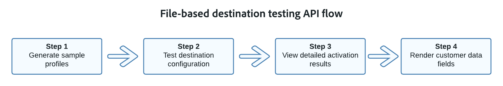

# 檔案型目的地測試API概觀

檔案型目的地測試API是一組端點，可用來驗證透過Destination SDK建立的檔案型目的地的設定。

建議您先使用這些工具驗證您的設定，然後再執行 [提交](../../guides/submit-destination.md) 您的Adobe檢閱目的地。

為獲得最佳測試結果，我們建議根據下列流程圖使用此API。

請參閱以下各節，以取得每個端點的功能簡介。

## 產生範例設定檔 {#generate-sample-profiles}

使用 `/sample-profiles` API端點可根據您現有的來源結構描述產生範例設定檔。

範例設定檔可協助您瞭解設定檔的JSON結構。 此外，它們也會提供您預設值，讓您可使用自己的設定檔資料進行自訂，以便進行進一步的目的地測試。

請參閱 [專屬檔案](file-based-sample-profile-generation-api.md) 以瞭解如何產生範例設定檔。

## 測試目的地設定 {#test-destination-configuration}

使用 `/testing/destinationInstance` API端點，用於測試您的檔案型目的地是否已正確設定，以及驗證流向您設定之目的地的資料流的完整性。

您可以向測試端點提出請求，無論是否新增 [範例設定檔](file-based-sample-profile-generation-api.md) 至通話。 如果您未在請求上傳送任何設定檔，API會自動產生範例設定檔，並將其新增至請求。

請參閱 [專屬檔案](file-based-destination-testing-api.md) 以瞭解如何使用範例設定檔測試目的地設定。

## 檢視詳細的啟用結果 {#view-detailed-activation-results}

使用 `/testing/destinationInstance` API端點可讓您檢視檔案式目的地測試結果的完整詳細資訊。

此API端點傳回的結果與使用時獲得的結果相同。 [流程服務API](../../../api/update-destination-dataflows.md) 以監視資料流。

請參閱 [專屬檔案](file-based-destination-results-api.md) 以瞭解如何檢視詳細的啟用結果。

## 呈現客戶資料欄位 {#render-customer-data-fields}

使用 `/authoring/testing/template/render` API端點可將範本化方式加以視覺化 [客戶資料欄位](../../functionality/destination-configuration/customer-data-fields.md) 目的地設定中定義的變數會很類似。

API端點會為您的客戶資料欄位產生隨機值，並在回應中傳回這些值。 這可協助您驗證客戶資料欄位（例如儲存貯體名稱或資料夾路徑）的語意結構。

請參閱 [專屬檔案](file-based-render-template-api.md) 以瞭解如何產生和視覺化客戶資料欄位的值。
