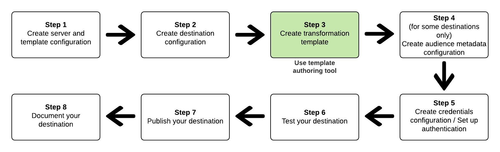

# 建立和test消息轉換模板 {#create-template}

## 總覽 {#overview}

作為Destination SDK的一部分，Adobe提供開發人員工具，幫助您配置和測試目標。 此頁介紹如何建立和test消息轉換模板。 有關如何test目標的資訊，請閱讀 [Test目標配置](streaming-destination-testing-overview.md)。

至 **建立和test消息轉換模板** 在Adobe Experience Platform的目標架構和目標支援的消息格式之間，使用 *模板創作工具* 詳見下文。  閱讀有關中源架構和目標架構之間資料轉換的詳細資訊 [消息格式文檔](../../functionality/destination-server/message-format.md#using-templating)。

下面說明了如何建立和測試消息轉換模板 [目標配置工作流](../../guides/configure-destination-instructions.md) Destination SDK:



## 為什麼需要建立和test消息轉換模板 {#why-create-message-transformation-template}

在Destination SDK中建立目標的第一步是考慮在從Adobe Experience Platform導出到目標時如何轉換段成員身份、標識和配置檔案屬性的資料格式。 查找有關AdobeXDM架構與目標架構之間轉換的資訊， [消息格式文檔](../../functionality/destination-server/message-format.md#using-templating)。

要使轉換成功，必須提供一個轉換模板，與以下示例類似： [建立發送段、標識和配置檔案屬性的模板](../../functionality/destination-server/message-format.md#segments-identities-attributes)。

Adobe提供了一個模板工具，允許您建立和test消息模板，該消息模板將資料從AdobeXDM格式轉換為目標支援的格式。 該工具有兩個API端點，可以使用：

* 使用 *示例模板API* 獲取示例模板。
* 使用 *呈現模板API* 以呈現示例模板，以便將結果與目標的預期資料格式進行比較。 將導出的資料與目標所需的資料格式進行比較後，可以編輯模板。 這樣，您生成的導出資料與目標預期的資料格式匹配。

## 建立模板之前要完成的步驟 {#prerequisites}

在準備好建立模板之前，請確保完成以下步驟：

1. [建立目標伺服器配置](../../authoring-api/destination-server/create-destination-server.md)。 根據為 `maxUsersPerRequest` 的下界。
   * 使用 `maxUsersPerRequest=1` 如果希望目標的API調用包括單個配置檔案及其段資格、標識和配置檔案屬性。
   * 使用 `maxUsersPerRequest` 如果希望到目標的API調用包括多個配置式，以及其段資格、標識和配置式屬性，則值大於1。
2. [建立目標配置](../../authoring-api/destination-configuration/create-destination-configuration.md) 並在中添加目標伺服器配置的ID `destinationDelivery.destinationServerId`。
3. [獲取目標配置的ID](../../authoring-api/destination-configuration/retrieve-destination-configuration.md) 建立的模板，以便在模板建立工具中使用。
4. 瞭解 [可以使用的函式和篩選器](../../functionality/destination-server/supported-functions.md) 中。

## 如何使用示例模板API和呈現模板API為目標建立模板 {#iterative-process}

>[!TIP]
>
>在編製和編輯消息轉換模板之前，您可以先調用 [呈現模板API終結點](../../testing-api/streaming-destinations/render-template-api.md#render-exported-data) 使用一個簡單模板導出原始配置檔案，而不應用任何轉換。 簡單模板的語法為： <br> `"template": "{{profile|raw}}}"`

獲取和test模板的過程是迭代的。 重複以下步驟，直到導出的配置檔案與目標的預期資料格式匹配。

1. 首先， [獲取示例模板](../../testing-api/streaming-destinations/create-template.md#sample-template-api)。
2. 使用示例模板作為起點建立自己的草稿。
3. 呼叫 [呈現模板API終結點](../../testing-api/streaming-destinations/create-template.md#render-template-api) 使用您自己的模板。 Adobe根據您的方案生成示例配置檔案並返回結果或遇到的任何錯誤。
4. 將導出的資料與目標預期的資料格式進行比較。 如果需要，請編輯模板。
5. 重複此過程，直到導出的配置檔案與目標的預期資料格式匹配。

## 使用示例模板API獲取示例模板 {#sample-template-api}

>[!NOTE]
>
>有關完整的API參考文檔，請閱讀 [獲取示例模板API操作](../../testing-api/streaming-destinations/sample-template-api.md)。

將目標ID添加到調用中，如下所示，響應將返回與目標ID對應的模板示例。

```shell
curl --location --request GET 'https://platform.adobe.io/data/core/activation/authoring/testing/template/sample/5114d758-ce71-43ba-b53e-e2a91d67b67f' \
--header 'Content-Type: application/json' \
--header 'Accept: application/json' \
--header 'x-api-key: {API_KEY}' \
--header 'Authorization: Bearer {ACCESS_TOKEN}' \
--header 'x-gw-ims-org-id: {ORG_ID}' \
--header 'x-sandbox-name: {SANDBOX_NAME}' \
```

如果提供的目標ID與目標配置相對應，則 [最佳工作聚合](../../functionality/destination-configuration/aggregation-policy.md#best-effort-aggregation) 和 `maxUsersPerRequest=1` 在聚合策略中，請求返回與以下模板類似的示例模板：

```python
{#- THIS is an example template for a single profile -#}
{#- A '-' at the beginning or end of a tag removes all whitespace on that side of the tag. -#}
{
    "identities": [
    
    
        
        {
            "type": "{{ namespace }}",
            "id": "{{ identity.id }}"
        },
        ,
    
    ],
    "AdobeExperiencePlatformSegments": {
        "add": [
        
            "{{ segment.key }}",
        
        ],
        "remove": [
        {#- Alternative syntax for filtering segments by status: -#}
        
            "{{ segment.key }}",
        
        ]
    }
}
```

如果您提供的目標ID與目標伺服器模板對應， [可配置聚合](../../functionality/destination-configuration/aggregation-policy.md#configurable-aggregation) 或 [最佳工作聚合](../../functionality/destination-configuration/aggregation-policy.md#best-effort-aggregation) 與 `maxUsersPerRequest` 大於1時，請求返回與此類似的示例模板：

```python
{#- THIS is an example template for multiple profiles -#}
{#- A '-' at the beginning or end of a tag removes all whitespace on that side of the tag. -#}
{
    "profiles": [
    
        {
            "identities": [
            
            
                
                {
                    "type": "{{ namespace }}",
                    "id": "{{ identity.id }}"
                },
                ,
            
            ],
            "AdobeExperiencePlatformSegments": {
                "add": [
                
                    "{{ segment.key }}",
                
                ],
                "remove": [
                {#- Alternative syntax for filtering segments by status: -#}
                
                    "{{ segment.key }}",
                
                ]
            }
        },
    
    ]
}
```

## 字元轉義模板 {#character-escape-template}

使用模板呈現與目標預期格式匹配的配置檔案之前，必須對模板進行字元轉義，如下面的螢幕錄制所示。


可以使用聯機字元轉義工具。 以上演示使用 [JSON轉義格式化程式](https://jsonformatter.org/json-escape)。

## 呈現模板API {#render-template-api}

在使用 [示例模板API](create-template.md#sample-template-api), [呈現模板](render-template-api.md) 生成導出資料。 這允許您驗證Adobe Experience Platform將導出到目標的配置檔案是否與目標的預期格式匹配。

有關可以進行的調用示例，請參閱API參考：

* [呈現沒有正文中發送的配置檔案的模板](render-template-api.md#multiple-profiles-no-body)
* [呈現模板，其中配置檔案以正文形式發送](render-template-api.md#multiple-profiles-with-body)

編輯模板並調用呈現模板API終結點，直到導出的配置檔案與目標的預期資料格式匹配。

## 將字元轉義模板添加到目標伺服器配置

一旦您對郵件轉換模板感到滿意，請將其添加到 [目標伺服器配置](../../authoring-api/destination-server/create-destination-server.md), `httpTemplate.requestBody.value`。
