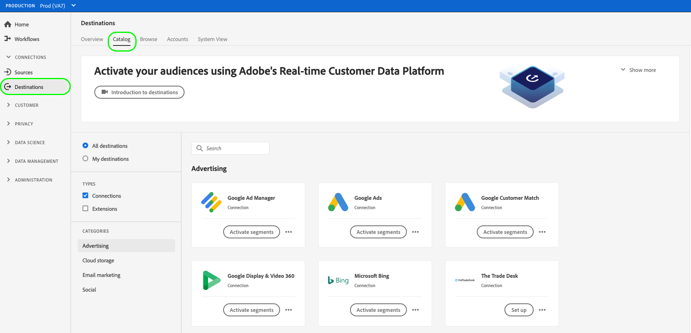
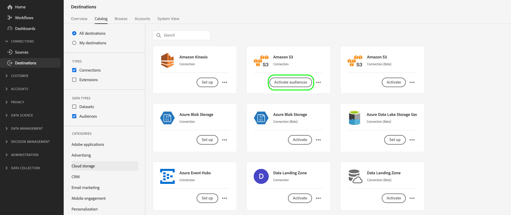

# 啟用對象以批次設定檔匯出目的地

>[!IMPORTANT]
> 
> * 若要啟用對象並啟用工作流程的[對應步驟](#mapping)，您需要&#x200B;**[!UICONTROL 檢視目的地]**、**[!UICONTROL 啟用目的地]**、**[!UICONTROL 檢視設定檔]**&#x200B;以及&#x200B;**[!UICONTROL 檢視區段]** [存取控制許可權](/help/access-control/home.md#permissions)。
> * 若要在不進行工作流程的[對應步驟](#mapping)的情況下啟用對象，您需要&#x200B;**[!UICONTROL 檢視目的地]**、**[!UICONTROL 啟用沒有對應的區段]**、**[!UICONTROL 檢視設定檔]**&#x200B;以及&#x200B;**[!UICONTROL 檢視區段]** [存取控制許可權](/help/access-control/home.md#permissions)。
>* 若要匯出&#x200B;*身分*，您需要&#x200B;**[!UICONTROL 檢視身分圖表]** [存取控制許可權](/help/access-control/home.md#permissions)。<br> {width="100" zoomable="yes"}
> 
> 閱讀[存取控制總覽](/help/access-control/ui/overview.md)或連絡您的產品管理員以取得必要的許可權。

## 概觀 {#overview}

本文說明在Adobe Experience Platform中啟用受眾以批次設定檔為基礎的目的地（例如雲端儲存空間與電子郵件行銷目的地）所需的工作流程。

## 先決條件 {#prerequisites}

若要啟用目的地的對象，您必須已成功[連線到目的地](./connect-destination.md)。 如果您尚未這麼做，請前往[目的地目錄](../catalog/overview.md)，瀏覽支援的目的地，並設定您要使用的目的地。

## 支援的匯出檔案格式 {#supported-file-formats-export}

匯出對象時，支援下列檔案格式：

* CSV
* JSON
* Parquet

請注意，匯出CSV檔案可讓您在要如何建構匯出的檔案方面擁有更大的彈性。 深入瞭解CSV檔案的[檔案格式設定](/help/destinations/ui/batch-destinations-file-formatting-options.md#file-configuration)。

在[建立以檔案為基礎的目的地](/help/destinations/ui/connect-destination.md)的連線時，選取您想要的檔案格式以進行匯出。

## 選取您的目的地 {#select-destination}

1. 移至&#x200B;**[!UICONTROL 連線>目的地]**，然後選取&#x200B;**[!UICONTROL 目錄]**&#x200B;標籤。

   

1. 在您要啟用對象之目的地的對應卡片上，選取&#x200B;**[!UICONTROL 啟用對象]**，如下圖所示。

   

1. 選取您想要用來啟用對象的目的地連線，然後選取[下一步] ****。

   

1. 移至下一個區段以[選取您的對象](#select-audiences)。

## 選取您的對象 {#select-audiences}

若要選取您要啟用至目的地的對象，請使用對象名稱左邊的核取方塊，然後選取&#x200B;**[!UICONTROL 下一步]**。

您可以根據對象的來源，從多種對象型別中進行選取：

* **[!UICONTROL 細分服務]**：細分服務在Experience Platform中產生的對象。 如需詳細資訊，請參閱[分段檔案](../../segmentation/ui/overview.md)。
* **[!UICONTROL 自訂上傳]**：對象是在Experience Platform外部產生，並以CSV檔案形式上傳至Experience Platform。 若要深入瞭解外部對象，請參閱有關[匯入對象](../../segmentation/ui/audience-portal.md#import-audience)的檔案。 選取源自&#x200B;**[!UICONTROL 自訂上傳]**&#x200B;的對象會自動啟用[選取擴充屬性](#select-enrichment-attributes)步驟。
* 其他型別的對象，源自其他Adobe解決方案，例如[!DNL Audience Manager]。

>[!IMPORTANT]
>
>將自訂上傳對象啟用至批次檔案型目的地時，您可以在資料流中啟用10個這類對象的限制。


>[!TIP]
>
>若要從現有的啟用流程移除對象，請使用&#x200B;**[!UICONTROL 啟用資料]**&#x200B;頁面。 閱讀有關如何[從啟用流程](../ui/destination-details-page.md#bulk-remove)移除多個對象的章節，以取得詳細資料。

## 排程對象匯出 {#scheduling}

>[!CONTEXTUALHELP]
>id="platform_destinations_activate_schedule"
>title="排程"
>abstract="使用鉛筆圖示設定檔案匯出類型 (完整檔案或增量檔案) 和匯出頻率。"

>[!CONTEXTUALHELP]
>id="platform_destinations_activate_schedule_weekly_messaging"
>title="每週匯出"
>abstract="<sup>*</sup>選取開始日期，而後續匯出將在那一週的那一天進行，直到選取的結束日期為止。"

>[!CONTEXTUALHELP]
>id="platform_destinations_activate_schedule_monthly_messaging"
>title="每月匯出"
>abstract="<sup>*</sup>選取開始日期，而後續匯出將在那個月的那一天進行，直到選取的結束日期為止。對於少於 30 或 31 天的月份，匯出將在該月的最後一天進行。"

[!DNL Adobe Experience Platform]會將電子郵件行銷和雲端儲存空間的資料匯出為[不同的檔案型別](#supported-file-formats-export)。 在&#x200B;**[!UICONTROL 排程]**&#x200B;頁面中，您可以設定排程和要匯出之每個對象的檔案名稱。

Experience Platform會自動設定每個檔案匯出的預設排程。 您可以視需要修改預設排程，方法是選取每個排程旁的鉛筆圖示，並定義自訂排程。


若要同時編輯多個排程，請使用畫面左側的核取方塊來選取對象，然後選取&#x200B;**[!UICONTROL 編輯排程]**。 然後，您設定的排程將套用至所選對象的所有匯出檔案。


>[!TIP]
>
>您可以從&#x200B;**[!UICONTROL 啟用資料]**&#x200B;頁面，編輯現有啟用流程的對象啟用排程。 如需詳細資訊，請參閱有關[大量編輯啟動排程](../ui/destination-details-page.md#bulk-edit-schedule)的檔案。

>[!IMPORTANT]
>
>[!DNL Adobe Experience Platform]會自動分割匯出檔案，每個檔案為500萬筆記錄（列）。 每一列代表一個設定檔。
>
>分割檔案名稱會附加一個數字，表示檔案是較大匯出的一部分，例如： `filename.csv`、`filename_2.csv`、`filename_3.csv`。

### 匯出完整檔案 {#export-full-files}

>[!CONTEXTUALHELP]
>id="platform_destinations_activate_exportoptions"
>title="檔案匯出選項 "
>abstract="選取&#x200B;**匯出完整檔案**&#x200B;以匯出符合對象資格的所有設定檔的完整快照。選取&#x200B;**匯出增量檔案**，僅匯出上次匯出後符合對象資格的設定檔。<br> 第一個增量檔案匯出包括符合對象資格的所有設定檔，以充當回填。未來的增量檔案僅包括第一次增量檔案匯出後符合對象資格的設定檔。"
>additional-url="https://experienceleague.adobe.com/docs/experience-platform/destinations/ui/activate/activate-batch-profile-destinations.html#export-incremental-files" text="匯出增量檔案"

>[!CONTEXTUALHELP]
>id="platform_destinations_activationchaining_aftersegmentevaluation"
>title="對象評估後啟動"
>abstract="<p>每日分段作業完成後立即執行啟動。這可確保匯出最新的設定檔。</p><p>對象評估後匯出設定檔的選項是<i>不</i>可用於每週和每月匯出頻率。</p>"

>[!CONTEXTUALHELP]
>id="platform_destinations_activationchaining_scheduled"
>title="排程啟動"
>abstract="在一天中的固定時間執行啟動。"

選取&#x200B;**[!UICONTROL 匯出完整檔案]**，以觸發匯出包含所選對象所有設定檔資格的完整快照的檔案。


1. 使用&#x200B;**[!UICONTROL 頻率]**&#x200B;選擇器來選取匯出頻率：

   * **[!UICONTROL 一次]**：排程一次隨選完整檔案匯出。
   * **[!UICONTROL 每日]**：排程每天一次在您指定的時間匯出完整檔案。
   * **[!UICONTROL 每週]**：選取開始日期，後續的匯出將發生在一週的該日，直到選取的結束日期為止。
   * **[!UICONTROL 每月]**：選取開始日期，後續的匯出會在該月的該日期發生，直到選取的結束日期為止。 對於少於 30 或 31 天的月份，匯出將在該月的最後一天進行。

2. 使用&#x200B;**[!UICONTROL 時間]**&#x200B;切換功能來選取匯出應該在對象評估後立即執行，還是在指定的時間依排程執行。 選取&#x200B;**[!UICONTROL 已排程]**&#x200B;選項時，您可以使用選取器來選取一天中應該進行匯出時的時間（格式為[!DNL UTC]）。

   使用&#x200B;**[!UICONTROL 區段評估之後]**&#x200B;選項，讓啟動工作在每日Experience Platform批次分段工作完成後立即執行。 此選項可確保當啟動工作執行時，最新的設定檔會匯出至您的目的地。 這可能會導致根據您的動作，一天匯出對象多次。

   >[!IMPORTANT]
   >
   >若您對原已設定為在區段評估後啟用的客群，執行[彈性客群評估](../../segmentation/ui/audience-portal.md#flexible-audience-evaluation)，則一旦彈性客群評估工作完成，無論先前的每日啟用工作為何，這些客群都會立即啟用。這可能會導致根據您的動作，一天匯出對象多次。

   <!-- Batch segmentation currently runs at {{insert time of day}} and lasts for an average {{x hours}}. Adobe reserves the right to modify this schedule. -->

   
使用**[!UICONTROL 已排程]**&#x200B;選項，讓啟動工作以固定時間執行。 此選項可確保每天的相同時間匯出Experience Platform設定檔資料。 不過，您匯出的設定檔可能不是最新的，這取決於批次分段工作是否在啟動工作開始之前完成。

   

   >[!IMPORTANT]
   >
   >對映過去24小時內建立並透過[批次分段](../../segmentation/methods/batch-segmentation.md)評估的受眾時，請將每日匯出排程設定為最早從次日開始。 這可確保每日批次評估工作會先執行，而且您正在匯出完整的對象資料。

3. 使用&#x200B;**[!UICONTROL 日期]**&#x200B;選擇器來選擇匯出應該發生的日期或間隔。 對於每日匯出，最佳實務是設定您的開始和結束日期，以符合下游平台中行銷活動的持續時間。

   >[!IMPORTANT]
   >
   > 選取匯出間隔時，間隔的最後一天不包含在匯出中。 例如，如果您選取1月4日至11日的間隔，則最後的檔案匯出將於1月10日進行。

4. 選取&#x200B;**[!UICONTROL 建立]**&#x200B;以儲存排程。

### 匯出增量檔案

>[!CONTEXTUALHELP]
>id="platform_destinations_activate_something"
>title="設定檔案名稱"
>abstract="若為檔案型目的地，會對每個對象產生唯一的檔案名稱。使用檔案名稱編輯器建立和編輯唯一的檔案名稱或保留預設名稱。"

選取&#x200B;**[!UICONTROL 匯出增量檔案]**&#x200B;以觸發匯出，其中第一個檔案是所選對象所有設定檔資格的完整快照，而後續檔案則是自上次匯出以來的增量設定檔資格。

>[!IMPORTANT]
>
>第一個匯出的增量檔案包含符合對象資格的所有設定檔，可作為回填。


1. 使用&#x200B;**[!UICONTROL 頻率]**&#x200B;選擇器來選取匯出頻率：

   * **[!UICONTROL 每日]**：排程增量檔案匯出一次，每天一次，在您指定的時間。
   * **[!UICONTROL 每小時]**：排程每3、6、8或12小時匯出一次增量檔案。


2. 使用&#x200B;**[!UICONTROL Time]**&#x200B;選擇器來選擇要進行匯出的時間（格式為[!DNL UTC]）。

3. 使用&#x200B;**[!UICONTROL 日期]**&#x200B;選擇器來選擇匯出發生的間隔。 最佳實務建議將您的開始和結束日期設定為您在下游平台中的行銷活動持續時間。

   >[!IMPORTANT]
   >
   >間隔的最後一天不包含在匯出中。 例如，如果您選取1月4日至11日的間隔，則最後的檔案匯出將於1月10日進行。

4. 選取&#x200B;**[!UICONTROL 建立]**&#x200B;以儲存排程。

### 設定檔案名稱 {#configure-file-names}

>[!CONTEXTUALHELP]
>id="platform_destinations_activate_filename"
>title="設定檔案名稱"
>abstract="若為檔案型目的地，會對每個對象產生唯一的檔案名稱。使用檔案名稱編輯器建立和編輯唯一的檔案名稱或保留預設名稱。"

對於大多數目的地，預設檔案名稱會包含目的地名稱、對象ID以及日期和時間指示器。 例如，您可以編輯匯出的檔案名稱，以區分不同的促銷活動，或將資料匯出時間附加至檔案。 請注意，某些目的地開發人員可能會選擇為其目的地顯示不同的預設檔案名稱附加選項。

若要開啟模型視窗並編輯檔案名稱，請選取鉛筆圖示。 檔案名稱上限為255個字元。

>[!NOTE]
>
>下圖顯示如何編輯[!DNL Amazon S3]目的地的檔案名稱，但所有批次目的地的處理程式都相同（例如SFTP、[!DNL Azure Blob Storage]或[!DNL Google Cloud Storage]）。


在檔案名稱編輯器中，您可以選取不同的元件以新增至檔案名稱。


無法從檔案名稱中移除目的地名稱和對象ID。 除了這些選項以外，您還可以新增下列選項：

| 檔案名稱選項 | 說明 |
|---------|----------|
| **[!UICONTROL 對象名稱]** | 匯出的對象名稱。 |
| **[!UICONTROL 日期和時間]** | 選擇新增`MMDDYYYY_HHMMSS`格式或產生檔案時的UNIX 10位數時間戳記。 如果您希望檔案在每次增量匯出時產生動態檔案名稱，請選擇其中一個選項。 |
| **[!UICONTROL 自訂文字]** | 您要新增至檔案名稱的任何自訂文字。 |
| **[!UICONTROL 目的地識別碼]** | 用來匯出對象的目的地資料流的ID。 |
| **[!UICONTROL 目的地名稱]** | 用來匯出對象的目的地資料流名稱。 |
| **[!UICONTROL 組織名稱]** | Experience Platform中的組織名稱。 |
| **[!UICONTROL 沙箱名稱]** | 您用來匯出對象的沙箱的ID。 |

{style="table-layout:auto"}

若要同時編輯多個檔案名稱，請使用畫面左側的核取方塊來選取對象，然後選取&#x200B;**[!UICONTROL 編輯檔案名稱]**。 然後，您設定的檔案名稱選項將套用至所選對象的所有匯出檔案。


選取&#x200B;**[!UICONTROL 套用變更]**&#x200B;以確認您的選擇。

>[!IMPORTANT]
> 
>如果您未選取&#x200B;**[!UICONTROL 日期與時間]**&#x200B;元件，檔案名稱將會是靜態的，而且新的匯出檔案將會以每次匯出覆寫您儲存位置中的上一個檔案。 從儲存位置執行週期性匯入工作至電子郵件行銷平台時，這是建議的選項。

完成所有對象的設定後，請選取[下一步] **[!UICONTROL 以繼續。]**

## 對應 {#mapping}

在此步驟中，您必須選取要新增至匯出至目標目的地之檔案的設定檔屬性。 若要選取要匯出的設定檔屬性和身分：

1. 在&#x200B;**[!UICONTROL 對應]**&#x200B;頁面中，選取&#x200B;**[!UICONTROL 新增對應]**。

   

1. 選取&#x200B;**[!UICONTROL Source欄位]**&#x200B;專案右側的箭頭。

   

1. 在&#x200B;**[!UICONTROL 選取來源欄位]**&#x200B;頁面中，選取要包含在匯出至目的地的檔案中的設定檔屬性和身分，然後選擇&#x200B;**[!UICONTROL 選取]**。

   >[!TIP]
   > 
   >您可以使用搜尋欄位來縮小選取範圍，如下圖所示。

   使用&#x200B;**[!UICONTROL 僅顯示含有資料的欄位]**&#x200B;切換按鈕，僅顯示填入值的結構描述欄位。 依預設，只會顯示填入的結構欄位。

   


1. 您選取要匯出的欄位現在會出現在對應檢視中。 如果需要，您可以編輯匯出檔案中標題的名稱。 若要這麼做，請選取目標欄位上的圖示。

   

1. 在&#x200B;**[!UICONTROL 選取目標欄位]**&#x200B;頁面中，輸入匯出檔案中標題的所需名稱，然後選擇&#x200B;**[!UICONTROL 選取]**。

   

1. 您選取要匯出的欄位現在會出現在對應檢視中，並在匯出的檔案中顯示編輯的標頭。

   

1. （選擇性） UI中對應欄位的順序反映了匯出CSV檔案中欄的順序（從上到下），而上列是CSV檔案中最左側的欄。 您可以拖放對應列，以任何想要的方式重新排序對應欄位，如下所示。

   >[!NOTE]
   >
   >此功能為測試版，僅供特定客戶使用。 若要請求此功能的存取權，請聯絡您的 Adobe 代表。

   

1. （選擇性）您可以選取匯出的欄位為[必要索引鍵](#mandatory-keys)或[重複資料刪除索引鍵](#deduplication-keys)。

   

1. 若要新增更多欄位以供匯出，請重複上述步驟。

### 強制屬性 {#mandatory-attributes}

>[!CONTEXTUALHELP]
>id="platform_destinations_activate_mandatorykey"
>title="關於強制屬性"
>abstract="選取所有匯出的設定檔應包含的 XDM 結構描述屬性。沒有強制金鑰的設定檔不會匯出到目的地。若未選取強制金鑰，則會匯出所有合格的設定檔，無論其屬性如何。"

強制屬性是使用者啟用的核取方塊，可確保所有設定檔記錄都包含選取的屬性。 例如：所有匯出的設定檔都包含電子郵件地址&#x200B;。

您可以將屬性標籤為必要，以確保[!DNL Experience Platform]僅匯出包含特定屬性的設定檔。 因此，可作為其他篩選形式使用。 將屬性標籤為必要是&#x200B;**不需要**。

若未選取強制屬性，會匯出所有合格的設定檔，無論其屬性為何。

建議其中一個屬性是結構描述中的[唯一識別碼](../../destinations/catalog/email-marketing/overview.md#identity)。 如需強制屬性的詳細資訊，請參閱[電子郵件行銷目的地](../../destinations/catalog/email-marketing/overview.md#identity)檔案中的身分一節。

### 去重複化索引鍵 {#deduplication-keys}

>[!CONTEXTUALHELP]
>id="platform_destinations_activate_deduplicationkey"
>title="關於去重複化索引鍵"
>abstract="選取去重複化金鑰，以消除匯出檔案中同一設定檔的多筆記錄。選取單一命名空間或最多兩個 XDM 結構描述屬性作為去重複化索引鍵。未選取去重複化金鑰可能會導致匯出檔案中出現重複的設定檔項目。"

重複資料刪除索引鍵是使用者定義的主索引鍵，可決定使用者要透過哪個身分來為其設定檔進行重複資料刪除重複資料刪除&#x200B;。

重複資料刪除索引鍵可排除一個匯出檔案中有多個相同設定檔記錄的可能性。

有三種方式可以在[!DNL Experience Platform]中使用重複資料刪除索引鍵：

* 使用單一身分名稱空間做為[!UICONTROL 重複資料刪除索引鍵]
* 使用[!DNL XDM]設定檔中的單一設定檔屬性做為[!UICONTROL 重複資料刪除索引鍵]
* 使用[!DNL XDM]設定檔中的兩個設定檔屬性組合作為複合索引鍵

>[!IMPORTANT]
>
> 您可以將單一身分名稱空間匯出至目的地，該名稱空間會自動設定為重複資料刪除索引鍵。 不支援傳送多個名稱空間至目的地。
> 
> 您無法使用身分識別名稱空間和設定檔屬性的組合作為重複資料刪除索引鍵。

### 重複資料刪除範例 {#deduplication-example}

此範例說明重複資料刪除的運作方式，視選取的重複資料刪除索引鍵而定。

讓我們考慮以下兩個設定檔。

**設定檔A**

```json
{
  "identityMap": {
    "Email": [
      {
        "id": "johndoe_1@example.com"
      },
      {
        "id": "doejohn_1@example.com"
      }
    ]
  },
  "segmentMembership": {
    "ups": {
      "fa5c4622-6847-4199-8dd4-8b7c7c7ed1d6": {
        "status": "realized",
        "lastQualificationTime": "2021-03-10 10:03:08"
      }
    }
  },
  "person": {
    "name": {
      "lastName": "Doe",
      "firstName": "John"
    }
  },
  "personalEmail": {
    "address": "johndoe@example.com"
  }
}
```

**設定檔B**

```json
{
  "identityMap": {
    "Email": [
      {
        "id": "johndoe_2@example.com"
      },
      {
        "id": "doejohn_2@example.com"
      }
    ]
  },
  "segmentMembership": {
    "ups": {
      "fa5c4622-6847-4199-8dd4-8b7c7c7ed1d6": {
        "status": "realized",
        "lastQualificationTime": "2021-04-10 11:33:28"
      }
    }
  },
  "person": {
    "name": {
      "lastName": "D",
      "firstName": "John"
    }
  },
  "personalEmail": {
    "address": "johndoe@example.com"
  }
}
```

### 重複資料刪除使用案例1：無重複資料刪除 {#deduplication-use-case-1}

若不使用重複資料刪除，匯出檔案會包含以下專案。

| 個人電子郵件 | 名字 | 姓氏 |
|---|---|---|
| johndoe@example.com | John | 完成 |
| johndoe@example.com | John | D |


### 重複資料刪除使用案例2：根據身分名稱空間重複資料刪除 {#deduplication-use-case-2}

假設以[!DNL Email]名稱空間刪除重複資料，匯出檔案會包含以下專案。 設定檔B是符合對象資格的最新設定檔，因此是唯一匯出的設定檔。

| 電子郵件* | 個人電子郵件 | 名字 | 姓氏 |
|---|---|---|---|
| johndoe_2@example.com | johndoe@example.com | John | D |
| doejohn_2@example.com | johndoe@example.com | John | D |

### 重複資料刪除使用案例3：根據單一設定檔屬性重複資料刪除 {#deduplication-use-case-3}

假設重複資料刪除是以`personal Email`屬性執行，匯出檔案會包含下列專案。 設定檔B是符合對象資格的最新設定檔，因此是唯一匯出的設定檔。

| 個人電子郵件* | 名字 | 姓氏 |
|---|---|---|
| johndoe@example.com | John | D |


### 重複資料刪除使用案例4：根據兩個設定檔屬性重複資料刪除 {#deduplication-use-case-4}

假設複合索引鍵`personalEmail + lastName`執行重複資料刪除，匯出檔案會包含下列專案。

| 個人電子郵件* | 姓氏* | 名字 |
|---|---|---|
| johndoe@example.com | D | John |
| johndoe@example.com | 完成 | John |

Adobe建議選取身分名稱空間（例如[!DNL CRM ID]或電子郵件地址）作為重複資料刪除索引鍵，以確保所有設定檔記錄都可唯一識別。

### 具有相同時間戳記之設定檔的重複資料刪除行為 {#deduplication-same-timestamp}

將設定檔匯出至檔案型目標時，如果有多個設定檔共用相同的去重複化金鑰和相同的參考時間戳記，重複資料刪除的功能可確保僅匯出一個設定檔。此時間戳記代表設定檔的對象成員資格或身分圖表上次更新的時間。 如需如何更新及匯出設定檔的詳細資訊，請參閱[設定檔匯出行為](https://experienceleague.adobe.com/en/docs/experience-platform/destinations/how-destinations-work/profile-export-behavior#what-determines-a-data-export-and-what-is-included-in-the-export-2)檔案。

#### 主要考量事項

* **確定性選擇**：當多個設定檔具有相同的重複資料刪除索引鍵和相同的參考時間戳記時，重複資料刪除邏輯會藉由排序其他選取欄的值（排除陣列、對應或物件等複雜型別）來決定要匯出的設定檔。 排序的值會依字典順序計算，且會選取第一個設定檔。

* **範例情境**

請考量下列資料，其中重複資料刪除索引鍵是`Email`欄：

| 電子郵件* | 名字 | last_name | 時間戳記 |
|---|---|---|---|  
| `test1@test.com` | John | Morris | 2024-10-12T09:50 |
| `test1@test.com` | John | 完成 | 2024-10-12T09:50 |
| `test2@test.com` | Frank | Smith | 2024-10-12T09:50 |

{style="table-layout:auto"}

重複資料刪除後，匯出檔案將包含：

| 電子郵件* | 名字 | last_name | 時間戳記 |
|---|---|---|---|  
| `test1@test.com` | John | 完成 | 2024-10-12T09:50 |
| `test2@test.com` | Frank | Smith | 2024-10-12T09:50 |

{style="table-layout:auto"}

**說明**：對於`test1@test.com`，兩個設定檔共用相同的重複資料刪除索引鍵和時間戳記。 演演算法會以字典方式排序`first_name`和`last_name`資料行值。 由於名字相同，因此使用`last_name`欄來解析領帶，其中「Doe」在「Morris」之前。

**提升可靠性**：此更新的重複資料刪除程式可確保使用相同座標連續執行將一律產生相同的結果，提升一致性。

### 透過計算欄位執行資料轉換 {#calculated-fields}

您可以使用[計算欄位](/help/destinations/ui/data-transformations-calculated-fields.md)控制項，對匯出至檔案型目的地的資料執行各種資料轉換。

### 已知限制 {#known-limitations}

新&#x200B;**[!UICONTROL 對應]**&#x200B;頁面有下列已知限制：

#### 無法透過對應工作流程選取對象成員資格屬性

由於已知的限制，您目前無法使用&#x200B;**[!UICONTROL 選取欄位]**&#x200B;視窗將`segmentMembership.seg_namespace.seg_id.status`新增至您的檔案匯出。 相反地，您需要手動將值`xdm: segmentMembership.seg_namespace.seg_id.status`貼到結構描述欄位中，如下所示。


>[!NOTE]
>
>對於雲端儲存空間目的地，下列屬性會預設新增至對應：
>
>* `segmentMembership.seg_namespace.seg_id.status`
>* `segmentMembership.seg_namespace.seg_id.lastQualificationTime`

視是否選取`segmentMembership.seg_namespace.seg_id.status`而定，檔案匯出會依下列方式而有所不同：

* 如果選取`segmentMembership.seg_namespace.seg_id.status`欄位，匯出的檔案會在初始完整快照中包含&#x200B;**[!UICONTROL Active]**&#x200B;成員，並在後續的增量匯出中包含&#x200B;**[!UICONTROL Active]**&#x200B;和&#x200B;**[!UICONTROL Expired]**&#x200B;成員。
* 如果未選取`segmentMembership.seg_namespace.seg_id.status`欄位，則匯出的檔案在初始完整快照和後續的增量匯出中僅包含&#x200B;**[!UICONTROL Active]**&#x200B;成員。

深入瞭解檔案型目的地](/help/destinations/how-destinations-work/profile-export-behavior.md#file-based-destinations)的[設定檔匯出行為。

#### 目前無法選取身分名稱空間進行匯出

目前不支援選取要匯出的身分名稱空間（如下圖所示）。 選取任何要匯出的身分名稱空間將會導致&#x200B;**[!UICONTROL 檢閱]**&#x200B;步驟中的錯誤。


作為臨時解決方法，如果您在Beta版期間需要將身分識別名稱空間新增到匯出的檔案，您可以：
* 針對您要在匯出中包含身分名稱空間的資料流，使用舊版雲端儲存空間目的地
* 將身分作為屬性上傳到Experience Platform，然後匯出到您的雲端儲存空間目標。

## 選取設定檔屬性 {#select-attributes}

>[!IMPORTANT]
> 
>目錄中的所有雲端儲存空間目的地都可以檢視已改善的[[!UICONTROL 對應]步驟](#mapping)，以取代本節中說明的&#x200B;**[!UICONTROL 選取屬性]**&#x200B;步驟。
>
>此&#x200B;**[!UICONTROL 選取屬性]**&#x200B;步驟仍會針對Adobe Campaign、Oracle Responsys、Oracle Eloqua和Salesforce Marketing Cloud電子郵件行銷目標顯示。

針對以設定檔為基礎的目的地，您必須選取要傳送至目標目的地的設定檔屬性。

1. 在&#x200B;**[!UICONTROL 選取屬性]**&#x200B;頁面中，選取&#x200B;**[!UICONTROL 新增欄位]**。

   ![影像醒目提示[新增欄位]按鈕。](../assets/ui/activate-batch-profile-destinations/add-new-field.png)

2. 選取&#x200B;**[!UICONTROL 結構描述欄位]**&#x200B;專案右側的箭頭。

   

3. 在&#x200B;**[!UICONTROL 選取欄位]**&#x200B;頁面中，選取您要傳送至目的地的XDM屬性或身分識別名稱空間，然後選擇&#x200B;**[!UICONTROL 選取]**。

   

4. 若要新增更多對應，請重複步驟1到3。

>[!NOTE]
>
> Adobe Experience Platform會使用結構描述中四個建議且常用的屬性來預先填入您的選取範圍： `person.name.firstName`、`person.name.lastName`、`personalEmail.address`、`segmentMembership.seg_namespace.seg_id.status`。


>[!IMPORTANT]
>
>由於已知的限制，您目前無法使用&#x200B;**[!UICONTROL 選取欄位]**&#x200B;視窗將`segmentMembership.seg_namespace.seg_id.status`新增至您的檔案匯出。 相反地，您必須手動將值`xdm: segmentMembership.seg_namespace.seg_id.status`貼到結構描述欄位中，如下所示。
>
>

視是否選取`segmentMembership.seg_namespace.seg_id.status`而定，檔案匯出會依下列方式而有所不同：
* 如果選取`segmentMembership.seg_namespace.seg_id.status`欄位，匯出的檔案會在初始完整快照中包含&#x200B;**[!UICONTROL Active]**&#x200B;成員，並在後續的增量匯出中包含&#x200B;**[!UICONTROL Active]**&#x200B;和&#x200B;**[!UICONTROL Expired]**&#x200B;成員。
* 如果未選取`segmentMembership.seg_namespace.seg_id.status`欄位，則匯出的檔案在初始完整快照和後續的增量匯出中僅包含&#x200B;**[!UICONTROL Active]**&#x200B;成員。

## 選取擴充屬性 {#select-enrichment-attributes}

>[!CONTEXTUALHELP]
>id="platform_destinations_activate_exclude_enrichment_attributes"
>title="排除擴充屬性"
>abstract="啟用此選項可從選取的自訂已上傳對象匯出設定檔至您的目的地，同時排除其所有屬性。"

>[!IMPORTANT]
>
>只有當您在[對象選取](#select-audiences)步驟期間選取&#x200B;**[!UICONTROL 自訂上傳]**&#x200B;對象時，才會顯示此步驟。

擴充屬性對應至Experience Platform中擷取的自訂上傳對象，做為&#x200B;**[!UICONTROL 自訂上傳]**。 在此步驟中，您可以為每個選取的外部對象選取要匯出至目的地的屬性。


請依照下列步驟，為每個外部對象選取擴充屬性：

1. 在&#x200B;**[!UICONTROL 擴充屬性]**&#x200B;欄中，選取 （編輯）按鈕。
1. 選取&#x200B;**[!UICONTROL 新增擴充屬性]**。 隨即顯示新的空白結構描述欄位。
   
1. 選取空白欄位右側的按鈕，以開啟欄位選取畫面。
1. 選取您要為對象匯出的屬性。
   
1. 新增所有要匯出的屬性之後，請選取&#x200B;**[!UICONTROL 儲存並關閉]**。
1. 對每個外部對象重複這些步驟。

如果您想要在不匯出任何屬性的情況下對目的地啟用外部對象，請啟用&#x200B;**[!UICONTROL 排除擴充屬性]**&#x200B;切換按鈕。 此選項會從外部對象匯出設定檔，但其對應的屬性不會傳送至您的目的地。


選取&#x200B;**[!UICONTROL 下一步]**&#x200B;以移至[檢閱](#review)步驟。

## 審核 {#review}

>[!NOTE]
> 
>如果有任何資料使用標籤套用至資料集內的特定欄位（而非整個資料集），則會在下列條件下在啟用時強制執行這些欄位層級標籤：
>
>* 這些欄位會用於對象定義中。
>* 這些欄位會設定為目標目的地的投影屬性。
>
> 例如，如果欄位`person.name.firstName`的某些資料使用標籤與目的地的行銷動作衝突，您會在檢閱步驟中看到資料使用原則違規。 如需詳細資訊，請參閱[Adobe Experience Platform中的資料控管](../../rtcdp/privacy/data-governance-overview.md#destinations)。

在&#x200B;**[!UICONTROL 檢閱]**&#x200B;頁面上，您可以看到選取專案的摘要。 選取&#x200B;**[!UICONTROL 取消]**&#x200B;以中斷流程，**[!UICONTROL 上一步]**&#x200B;以修改您的設定，或選取&#x200B;**[!UICONTROL 完成]**&#x200B;以確認您的選擇並開始傳送資料到目的地。


### 同意原則評估 {#consent-policy-evaluation}

>[!CONTEXTUALHELP]
>id="platform_governance_policies_viewApplicableConsentPolicies"
>title="檢視適用的同意原則"
>abstract="如果您的組織購買了 **Adobe Healthcare Shield** 或 **Adobe Privacy &amp; Security Shield**，請選取&#x200B;**[!UICONTROL 檢視適用的同意原則]**，以查看套用了哪些同意原則以及由於這些原則啟動中包含了多少個設定檔。如果您的公司無權存取上述 SKU，則會停用此控制項。"

如果您的組織購買了 **Adobe Healthcare Shield** 或 **Adobe Privacy &amp; Security Shield**，請選取&#x200B;**[!UICONTROL 檢視適用的同意原則]**，以查看套用了哪些同意原則以及由於這些原則啟動中包含了多少個設定檔。如需詳細資訊，請參閱[同意原則評估](/help/data-governance/enforcement/auto-enforcement.md#consent-policy-evaluation)。

### 資料使用原則檢查 {#data-usage-policy-checks}

在&#x200B;**[!UICONTROL 檢閱]**&#x200B;步驟中，Experience Platform也會檢查是否有任何資料使用原則違規。 以下是違反原則的範例。 在解決違規之前，您無法完成對象啟用工作流程。 如需有關如何解決原則違規的資訊，請參閱資料治理檔案一節中的關於[資料使用原則違規](/help/data-governance/enforcement/auto-enforcement.md#data-usage-violation)。


### 篩選對象 {#filter-audiences}

此外，在此步驟中，您可以使用頁面上的可用篩選器，只顯示其排程或對應已隨著此工作流程而更新的對象。 您也可以切換要檢視的表格欄。


如果您對您的選擇感到滿意，並且未偵測到任何原則違規，請選取[完成] **[!UICONTROL 以確認您的選擇，並開始將資料傳送到目的地。]**

## 驗證受眾啟用 {#verify}

將對象匯出至雲端儲存空間目的地時，Adobe Experience Platform會在您提供的儲存位置中建立`.csv`、`.json`或`.parquet`檔案。 預期會根據您在工作流程中設定的排程，在您的儲存位置中建立新檔案。 預設檔案格式如下所示，但您可以[編輯檔案名稱的元件](#file-names)：
`<destinationName>_segment<segmentID>_<timestamp-yyyymmddhhmmss>.csv`

例如，如果您選取每日匯出頻率，您連續三天收到的檔案可能會如下所示：

```console
Salesforce_Marketing_Cloud_segment12341e18-abcd-49c2-836d-123c88e76c39_20200408061804.csv
Salesforce_Marketing_Cloud_segment12341e18-abcd-49c2-836d-123c88e76c39_20200409052200.csv
Salesforce_Marketing_Cloud_segment12341e18-abcd-49c2-836d-123c88e76c39_20200410061130.csv
```

這些檔案是否存在於您的儲存位置即表示啟用成功。 若要瞭解匯出的檔案結構方式，您可以[下載範例.csv檔案](../assets/common/sample_export_file_segment12341e18-abcd-49c2-836d-123c88e76c39_20200408061804.csv)。 此範例檔案包含設定檔屬性`person.firstname`、`person.lastname`、`person.gender`、`person.birthyear`和`personalEmail.address`。
