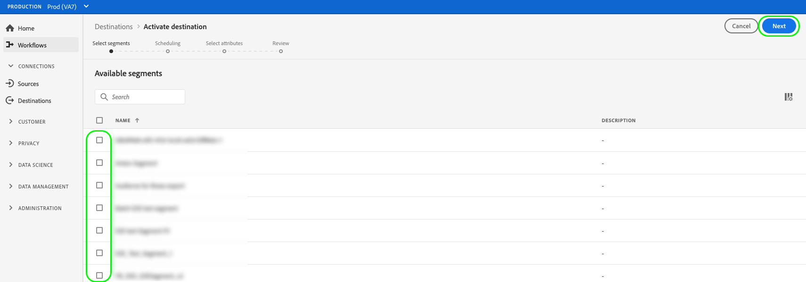

# 將受眾資料激活到批配置檔案導出目標

>[!IMPORTANT]
> 
>要激活資料，您需要 **[!UICONTROL 管理目標]**。 **[!UICONTROL 激活目標]**。 **[!UICONTROL 查看配置檔案]**, **[!UICONTROL 查看段]** [訪問控制權限](/help/access-control/home.md#permissions)。 閱讀 [訪問控制概述](/help/access-control/ui/overview.md) 或聯繫您的產品管理員以獲取所需權限。

## 總覽 {#overview}

本文介紹在基於Adobe Experience Platform批配置檔案的目標（如雲儲存和電子郵件營銷目標）中激活受眾資料所需的工作流。

## 先決條件 {#prerequisites}

要將資料激活到目標，必須已成功 [連接到目標](./connect-destination.md)。 如果尚未執行此操作，請轉至 [目標目錄](../catalog/overview.md)，瀏覽支援的目標，並配置要使用的目標。

## 選擇目標 {#select-destination}

1. 轉到 **[!UICONTROL 連接>目標]**，然後選擇 **[!UICONTROL 目錄]** 頁籤。

   

1. 選擇 **[!UICONTROL 激活段]** 在與要激活段的目標相對應的卡上，如下圖所示。

   

1. 選擇要用於激活段的目標連接，然後選擇 **[!UICONTROL 下一個]**。

   

1. 移至下一節 [選擇段](#select-segments)。

## 選擇段 {#select-segments}

使用段名稱左側的複選框選擇要激活到目標的段，然後選擇 **[!UICONTROL 下一個]**。




## 計畫段導出 {#scheduling}

>[!CONTEXTUALHELP]
>id="platform_destinations_activate_schedule"
>title="排程"
>abstract="使用鉛筆表徵圖可設定檔案導出類型（完整檔案或增量檔案）和導出頻率。"

[!DNL Adobe Experience Platform] 以以下形式導出資料以用於電子郵件營銷和雲儲存目標 [!DNL CSV] 的子菜單。 在 **[!UICONTROL 計畫]** 頁中，您可以配置要導出的每個段的調度和檔案名。 配置計畫是必需的，但配置檔案名是可選的。

>[!IMPORTANT]
> 
>[!DNL Adobe Experience Platform] 自動拆分每個檔案500萬條記錄（行）的導出檔案。 每行代表一個配置檔案。
>
>拆分檔案名後附加一個數字，表示檔案是較大導出的一部分，如下所示： `filename.csv`。 `filename_2.csv`。 `filename_3.csv`。

選擇 **[!UICONTROL 建立計畫]** 按鈕。


### 導出完整檔案 {#export-full-files}

>[!CONTEXTUALHELP]
>id="platform_destinations_activate_exportoptions"
>title="檔案導出選項"
>abstract="選擇 **導出完整檔案** 導出所有符合段條件的配置檔案的完整快照。 選擇 **導出增量檔案** 只導出自上次導出後符合段條件的配置檔案。 <br> 第一個增量檔案導出包括所有符合段條件的配置檔案，用作回填。 將來的增量檔案僅包括自第一次增量檔案導出後限定段的配置檔案。"
>additional-url="https://experienceleague.adobe.com/docs/experience-platform/destinations/ui/activate/activate-batch-profile-destinations.html#export-incremental-files" text="導出增量檔案"

>[!CONTEXTUALHELP]
>id="platform_destinations_activationchaining_aftersegmentevaluation"
>title="段評估後激活"
>abstract="激活在每日分段作業完成後立即運行。 這可確保導出最新的配置檔案。"

>[!CONTEXTUALHELP]
>id="platform_destinations_activationchaining_scheduled"
>title="計畫激活"
>abstract="激活在一天中的固定時間運行。"

選擇 **[!UICONTROL 導出完整檔案]** 觸發檔案導出，該檔案包含選定段的所有配置檔案資格的完整快照。


1. 使用 **[!UICONTROL 頻率]** 選擇器以選擇導出頻率：

   * **[!UICONTROL 一次]**:安排一次按需完整檔案導出。
   * **[!UICONTROL 每日]**:在您指定的時間每天安排一次完整檔案導出。

1. 使用 **[!UICONTROL 時間]** 切換以選擇導出應在段評估後立即進行還是在指定時間按計畫進行。 選擇 **[!UICONTROL 計畫]** 選項，可使用選擇器選擇一天中的時間，在 [!DNL UTC] 格式。

   >[!NOTE]
   >
   >的 **[!UICONTROL 段評估後]** 下面描述的選項當前僅可用於選擇測試版客戶。

   使用 **[!UICONTROL 段評估後]** 選項，使激活作業在每日平台批處理分段作業完成後立即運行。 這可確保在激活作業運行時，最新的配置檔案會導出到目標。

   <!-- Batch segmentation currently runs at {{insert time of day}} and lasts for an average {{x hours}}. Adobe reserves the right to modify this schedule. -->

   
使用 **[!UICONTROL 計畫]** 選項，使激活作業在固定時間運行。 這可確保每天同時導出Experience Platform配置檔案資料，但導出的配置檔案可能不是最新的，具體取決於激活作業啟動之前批分段作業是否已完成。

   

   >[!IMPORTANT]
   >
   >由於內部Experience Platform進程的配置方式，第一次增量或完整檔案導出可能不包含所有回填資料。 <br> <br> 為確保完整檔案和增量檔案都能進行完整且最新的回填資料導出，Adobe建議在次日的12 PM（格林威治標準時間）後設定第一次檔案導出時間。 這一限制將在今後的版本中解決。

1. 使用 **[!UICONTROL 日期]** 選擇器，以選擇導出發生的日期或間隔。 對於每日出口，最佳做法是設定起始日期和終止日期，以與下游平台中的市場活動持續時間保持一致。

   >[!IMPORTANT]
   >
   > 選擇導出間隔時，該間隔的最後一天不包括在導出中。 例如，如果選擇的時間間隔為1月4日–11日，最後一次檔案導出將在1月10日進行。

1. 選擇 **[!UICONTROL 建立]** 來修改標籤元素的屬性。

### 導出增量檔案 {#export-incremental-files}

選擇 **[!UICONTROL 導出增量檔案]** 觸發導出，其中第一個檔案是選定段的所有配置檔案資格的完整快照，而後續檔案是自上次導出以來的增量配置檔案資格。

>[!IMPORTANT]
>
>第一個導出的增量檔案包括所有符合段條件的配置檔案，這些配置檔案可用作回填。


1. 使用 **[!UICONTROL 頻率]** 選擇器以選擇導出頻率：

   * **[!UICONTROL 每日]**:在您指定的時間每天安排增量檔案導出一次。
   * **[!UICONTROL 每小時]**:計畫每3、6、8或12小時導出一次增量檔案。

1. 使用 **[!UICONTROL 時間]** 選擇器，選擇一天中的時間，在 [!DNL UTC] 格式。

   >[!IMPORTANT]
   >
   >由於內部Experience Platform進程的配置方式，第一次增量或完整檔案導出可能不包含所有回填資料。 <br> <br> 為確保完整檔案和增量檔案都能進行完整且最新的回填資料導出，Adobe建議在次日的12 PM（格林威治標準時間）後設定第一次檔案導出時間。 這一限制將在今後的版本中解決。

1. 使用 **[!UICONTROL 日期]** 選擇器，以選擇應進行導出的時間間隔。 最佳做法是設定起始日期和終止日期，以與下游平台中的活動持續時間保持一致。

   >[!IMPORTANT]
   >
   >導出中不包括間隔的最後一天。 例如，如果選擇的時間間隔為1月4日–11日，最後一次檔案導出將在1月10日進行。

1. 選擇 **[!UICONTROL 建立]** 來修改標籤元素的屬性。

### 配置檔案名 {#file-names}

>[!CONTEXTUALHELP]
>id="platform_destinations_activate_filename"
>title="配置檔案名"
>abstract="對於基於檔案的目標，每個段生成唯一的檔案名。 使用檔案名編輯器建立和編輯唯一檔案名或保留預設名稱。"

預設檔案名包括目標名稱、段ID以及日期和時間指示器。 例如，您可以編輯導出的檔案名以區分不同的市場活動或將資料導出時間附加到檔案。

選取鉛筆表徵圖以開啟模式窗口並編輯檔案名。 檔案名限制為255個字元。

>[!NOTE]
>
>下圖顯示了如何為AmazonS3目標編輯檔案名，但所有批處理目標（例如SFTP或Azure Blob儲存）的進程相同。


在檔案名編輯器中，可以選擇要添加到檔案名中的不同元件。


無法從檔案名中刪除目標名稱和段ID。 除這些外，還可以添加以下內容：

* **[!UICONTROL 段名稱]**:可將段名稱追加到檔案名。
* **[!UICONTROL 日期和時間]**:在添加 `MMDDYYYY_HHMMSS` 格式或生成檔案時的Unix 10位時間戳。 如果希望檔案在每次增量導出時生成動態檔案名，請選擇以下選項之一。
* **[!UICONTROL 自定義文本]**:將自定義文本添加到檔案名。

選擇 **[!UICONTROL 應用更改]** 確認您的選擇。

>[!IMPORTANT]
> 
>如果未選擇 **[!UICONTROL 日期和時間]** 檔案名為靜態，新導出的檔案將用每個導出覆蓋儲存位置中以前的檔案。 在將定期導入作業從儲存位置運行到電子郵件營銷平台時，建議使用此選項。

配置完所有段後，選擇 **[!UICONTROL 下一個]** 繼續。

## 選擇配置檔案屬性 {#select-attributes}

對於基於配置檔案的目標，必須選擇要發送到目標目標的配置檔案屬性。


1. 在 **[!UICONTROL 選擇屬性]** ，選擇 **[!UICONTROL 添加新欄位]**。

   

1. 選擇右側的箭頭 **[!UICONTROL 架構欄位]** 的子菜單。

   

1. 在 **[!UICONTROL 選擇欄位]** 頁，選擇要發送到目標的XDM屬性，然後選擇 **[!UICONTROL 選擇]**。

   

1. 要添加更多映射，請重複步驟1至3。

>[!NOTE]
>
> Adobe Experience Platform用您的架構中的四個推薦的常用屬性來預先填充您的選擇： `person.name.firstName`。 `person.name.lastName`。 `personalEmail.address`。 `segmentMembership.status`。

檔案導出方式將因以下方式而異，具體取決於 `segmentMembership.status` 已選中：
* 如果 `segmentMembership.status` 欄位，導出的檔案包括 **[!UICONTROL 活動]** 初始完整快照中的成員和 **[!UICONTROL 活動]** 和 **[!UICONTROL 已過期]** 後續增量導出中的成員。
* 如果 `segmentMembership.status` 欄位未選中，導出的檔案僅包括 **[!UICONTROL 活動]** 初始完整快照和後續增量導出中的成員。


### 必需屬性 {#mandatory-attributes}

>[!CONTEXTUALHELP]
>id="platform_destinations_activate_mandatorykey"
>title="關於必備屬性"
>abstract="選擇所有導出的配置檔案應包括的XDM架構屬性。 沒有強制鍵的配置檔案不會導出到目標。 不選擇強制鍵將導出所有限定的配置檔案，而不管其屬性如何。"

強制屬性是啟用用戶的複選框，可確保所有配置檔案記錄都包含所選屬性。 例如：所有導出的配置檔案都包含電子郵件地址&#x200B;。

您可以將屬性標籤為必需，以確保 [!DNL Platform] 僅導出包含特定屬性的配置檔案。 因此，它可以用作附加形式的過濾。 將屬性標籤為必需屬性 **不** 。

不選擇強制屬性會導出所有限定的配置檔案，而不考慮其屬性。

建議其中一個屬性是 [唯一標識符](../../destinations/catalog/email-marketing/overview.md#identity) 從您的架構中。 有關強制屬性的詳細資訊，請參閱 [電子郵件營銷目標](../../destinations/catalog/email-marketing/overview.md#identity) 文檔。

### 重複資料消除密鑰 {#deduplication-keys}

>[!CONTEXTUALHELP]
>id="platform_destinations_activate_deduplicationkey"
>title="關於重複資料消除密鑰"
>abstract="通過選擇重複資料消除密鑰，消除導出檔案中同一配置檔案的多個記錄。 選擇單個命名空間或最多兩個XDM架構屬性作為重複資料消除鍵。 不選擇重複資料消除密鑰可能會導致導出檔案中出現重複的配置檔案條目。"

重複資料消除密鑰是用戶定義的主密鑰，它確定用戶希望對其配置檔案進行重複資料消除的標識&#x200B;。

重複資料消除鍵消除了在一個導出檔案中有多個相同配置檔案的記錄的可能性。

有三種方法可以在 [!DNL Platform]:

* 將單個標識命名空間用作 [!UICONTROL 重複資料消除密鑰]
* 使用來自 [!DNL XDM] 配置檔案 [!UICONTROL 重複資料消除密鑰]
* 使用來自 [!DNL XDM] 配置檔案作為複合鍵

>[!IMPORTANT]
>
> 可以將單個標識命名空間導出到目標，並且該命名空間將自動設定為重複資料消除鍵。 不支援向目標發送多個命名空間。
> 
> 不能將標識命名空間和配置檔案屬性的組合用作重複資料消除鍵。

### 重複資料消除示例 {#deduplication-example}

此示例說明了重複資料消除如何工作，具體取決於選定的重複資料消除鍵。

讓我們考慮以下兩個配置檔案。

**配置檔案A**

```json
{
  "identityMap": {
    "Email": [
      {
        "id": "johndoe_1@example.com"
      },
      {
        "id": "johndoe_2@example.com"
      }
    ]
  },
  "segmentMembership": {
    "ups": {
      "fa5c4622-6847-4199-8dd4-8b7c7c7ed1d6": {
        "status": "existing",
        "lastQualificationTime": "2021-03-10 10:03:08"
      }
    }
  },
  "person": {
    "name": {
      "lastName": "Doe",
      "firstName": "John"
    }
  },
  "personalEmail": {
    "address": "johndoe@example.com"
  }
}
```

**配置檔案B**

```json
{
  "identityMap": {
    "Email": [
      {
        "id": "johndoe_1@example.com"
      },
      {
        "id": "johndoe_2@example.com"
      }
    ]
  },
  "segmentMembership": {
    "ups": {
      "fa5c4622-6847-4199-8dd4-8b7c7c7ed1d6": {
        "status": "existing",
        "lastQualificationTime": "2021-04-10 11:33:28"
      }
    }
  },
  "person": {
    "name": {
      "lastName": "D",
      "firstName": "John"
    }
  },
  "personalEmail": {
    "address": "johndoe@example.com"
  }
}
```

### 重複資料消除使用案例1:無重複 {#deduplication-use-case-1}

如果不使用重複資料消除，導出檔案將包含以下條目。

| 個人電子郵件 | 名字 | 姓氏 |
|---|---|---|
| johndoe@example.com | 約翰 | 多伊 |
| johndoe@example.com | 約翰 | D |


### 重複資料消除使用情形2:基於身份命名空間的重複資料消除 {#deduplication-use-case-2}

假設 [!DNL Email] 命名空間中，導出檔案將包含以下條目。 配置檔案B是符合該段條件的最新檔案，因此它是唯一導出的檔案。

| 電子郵件* | 個人電子郵件 | 名字 | 姓氏 |
|---|---|---|---|
| johndoe_1@example.com | johndoe@example.com | 約翰 | D |
| johndoe_2@example.com | johndoe@example.com | 約翰 | D |

### 重複資料消除使用情形3:基於單個配置檔案屬性的重複資料消除 {#deduplication-use-case-3}

假設 `personal Email` 屬性，導出檔案將包含以下條目。 配置檔案B是符合該段條件的最新檔案，因此它是唯一導出的檔案。

| 個人電子郵件* | 名字 | 姓氏 |
|---|---|---|
| johndoe@example.com | 約翰 | D |


### 重複資料消除使用情形4:基於兩個配置檔案屬性的重複資料消除 {#deduplication-use-case-4}

假設複合密鑰執行重複資料消除 `personalEmail + lastName`，導出檔案將包含以下條目。

| 個人電子郵件* | 姓氏* | 名字 |
|---|---|---|
| johndoe@example.com | D | 約翰 |
| johndoe@example.com | 多伊 | 約翰 |


Adobe建議選擇標識命名空間，如 [!DNL CRM ID] 或電子郵件地址作為重複資料消除密鑰，以確保所有配置檔案記錄都被唯一標識。

>[!NOTE]
> 
>如果任何資料使用標籤已應用於資料集（而不是整個資料集）中的某些欄位，則在以下情況下將執行激活這些欄位級別標籤：
>
>* 欄位用於段定義。
>* 這些欄位被配置為目標目標的投影屬性。
>
> 例如，如果 `person.name.firstName` 具有與目標的市場營銷操作衝突的某些資料使用標籤，在審閱步驟中將顯示資料使用策略違規。 有關詳細資訊，請參見 [Adobe Experience Platform的資料治理](../../rtcdp/privacy/data-governance-overview.md#destinations)。

## 審閱 {#review}

在 **[!UICONTROL 審閱]** 的子菜單。 選擇 **[!UICONTROL 取消]** 分解流， **[!UICONTROL 後退]** 修改設定，或 **[!UICONTROL 完成]** 確認選擇並開始向目標發送資料。

>[!IMPORTANT]
>
>在此步驟中，Adobe Experience Platform檢查資料使用策略違規。 下面顯示的示例違反了策略。 在解決違規之前，無法完成段激活工作流。 有關如何解決策略違規的資訊，請參見 [策略執行](../../rtcdp/privacy/data-governance-overview.md#enforcement) 資料治理文檔部分。


如果未檢測到任何策略違規，請選擇 **[!UICONTROL 完成]** 確認選擇並開始向目標發送資料。


## 驗證段激活 {#verify}


對於電子郵件營銷目標和雲儲存目標，Adobe Experience Platform建立 `.csv` 檔案。 希望每天在您的儲存位置建立新檔案。 預設檔案格式為：
`<destinationName>_segment<segmentID>_<timestamp-yyyymmddhhmmss>.csv`

您連續三天接收的檔案可能如下所示：

```console
Salesforce_Marketing_Cloud_segment12341e18-abcd-49c2-836d-123c88e76c39_20200408061804.csv
Salesforce_Marketing_Cloud_segment12341e18-abcd-49c2-836d-123c88e76c39_20200409052200.csv
Salesforce_Marketing_Cloud_segment12341e18-abcd-49c2-836d-123c88e76c39_20200410061130.csv
```

這些檔案在您的儲存位置中的存在是成功激活的確認。 要瞭解導出的檔案的結構，您可以 [下載示例.csv檔案](../assets/common/sample_export_file_segment12341e18-abcd-49c2-836d-123c88e76c39_20200408061804.csv)。 此示例檔案包括配置檔案屬性 `person.firstname`。 `person.lastname`。 `person.gender`。 `person.birthyear`, `personalEmail.address`。
