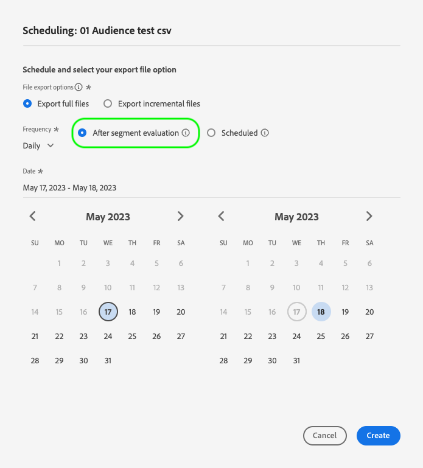
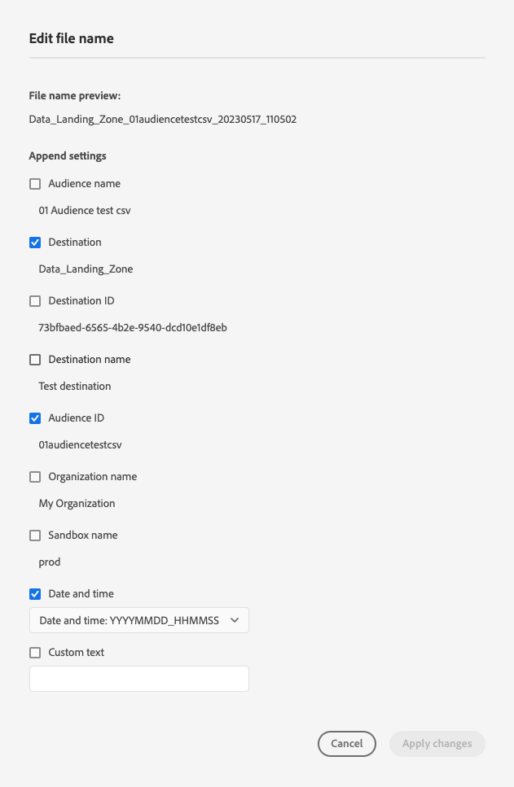
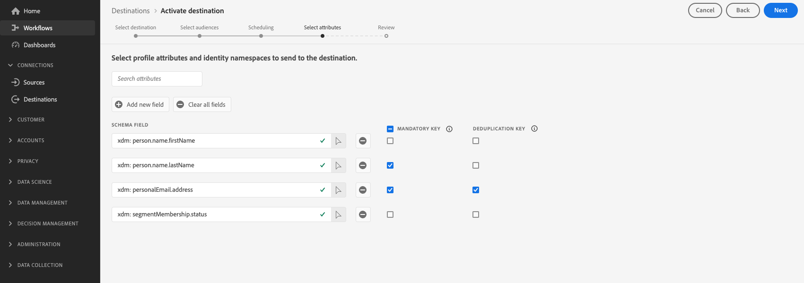
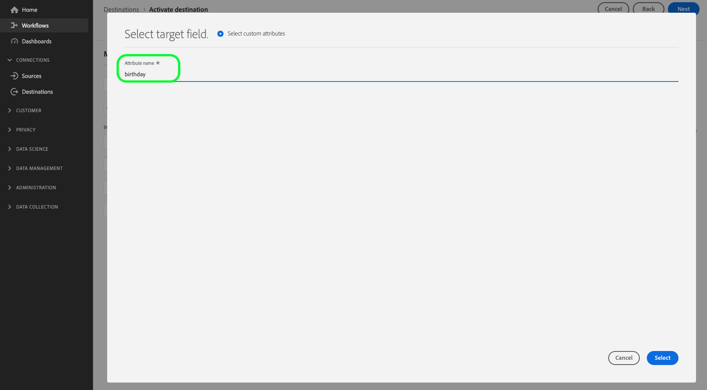

# 啟用對象以批次設定檔匯出目的地

>[!IMPORTANT]
> 
> * 若要啟用對象並啟用 [對應步驟](#mapping) 的工作流程中，您需要 **[!UICONTROL 管理目的地]**， **[!UICONTROL 啟用目的地]**， **[!UICONTROL 檢視設定檔]**、和 **[!UICONTROL 檢視區段]** [存取控制許可權](/help/access-control/home.md#permissions).
> * 若要啟用對象，請不透過 [對應步驟](#mapping) 的工作流程中，您需要 **[!UICONTROL 管理目的地]**， **[!UICONTROL 啟用區段而不進行對應]**， **[!UICONTROL 檢視設定檔]**、和 **[!UICONTROL 檢視區段]** [存取控制許可權](/help/access-control/home.md#permissions).
> 
> 閱讀 [存取控制總覽](/help/access-control/ui/overview.md) 或聯絡您的產品管理員以取得必要許可權。
>
> 部分參與改善的檔案匯出功能測試版計畫的客戶看到了新的 **[!UICONTROL 對應]** 步驟作為其啟動工作流程的一部分，移至 [全新測試版雲端儲存空間目的地](/help/release-notes/2022/october-2022.md#destinations). 考慮 [已知限制](#known-limitations) 做為發行版本的一部分。

## 概觀 {#overview}

本文說明在Adobe Experience Platform批次設定檔型目的地（例如雲端儲存空間與電子郵件行銷目的地）中啟用對象所需的工作流程。

## 先決條件 {#prerequisites}

若要啟用目的地的對象，您必須已成功 [已連線至目的地](./connect-destination.md). 如果您尚未這麼做，請前往 [目的地目錄](../catalog/overview.md)，瀏覽支援的目的地並設定您要使用的目的地。

## 選取您的目的地 {#select-destination}

1. 前往 **[!UICONTROL 連線>目的地]**，然後選取 **[!UICONTROL 目錄]** 標籤。

   

1. 選取 **[!UICONTROL 啟用對象]** 位於對應您要啟用對象之目的地的卡片上，如下圖所示。

   

1. 選取您要用來啟用對象的目的地連線，然後選取 **[!UICONTROL 下一個]**.

   

1. 移至下一區段至 [選取您的對象](#select-audiences).

## 選取您的對象 {#select-audiences}

若要選取您想要啟用至目的地的對象，請使用對象名稱左邊的核取方塊，然後選取 **[!UICONTROL 下一個]**.

您可以根據對象的來源，從多種對象型別中進行選取：

* **[!UICONTROL 細分服務]**：細分服務在Experience Platform中產生的對象。 請參閱 [細分檔案](../../segmentation/ui/overview.md) 以取得更多詳細資料。
* **[!UICONTROL 自訂上傳]**：在Experience Platform外部產生的對象，並以CSV檔案的形式上傳至Platform。 若要進一步瞭解外部對象，請參閱以下檔案： [匯入對象](../../segmentation/ui/overview.md#import-audience).
* 其他型別的對象，源自其他Adobe解決方案，例如 [!DNL Audience Manager].


>[!TIP]
>
>選取源自下列專案的對象： **[!UICONTROL 自訂上傳]** 自動啟用 [選取擴充屬性](#select-enrichment-attributes) 步驟。

## 排程對象匯出 {#scheduling}

>[!CONTEXTUALHELP]
>id="platform_destinations_activate_schedule"
>title="排程"
>abstract="使用鉛筆圖示設定檔案匯出類型 (完整檔案或增量檔案) 和匯出頻率。"

[!DNL Adobe Experience Platform] 以下列形式匯出電子郵件行銷和雲端儲存目的地的資料： [!DNL CSV] 檔案。 在 **[!UICONTROL 排程]** 頁面上，您可以為要匯出的每個對象設定排程和檔案名稱。 必須設定排程，但可選擇是否設定檔案名稱。

>[!IMPORTANT]
>
>[!DNL Adobe Experience Platform] 自動將匯出檔案分割為每個檔案500萬筆記錄（列）。 每一列代表一個設定檔。
>
>分割檔案名稱會附加一個數字，指示檔案是較大匯出的一部分，例如： `filename.csv`， `filename_2.csv`， `filename_3.csv`.

選取 **[!UICONTROL 建立排程]** 與您要傳送至目的地的對象對應的按鈕。


### 匯出完整檔案 {#export-full-files}

>[!CONTEXTUALHELP]
>id="platform_destinations_activate_exportoptions"
>title="檔案匯出選項 "
>abstract="選取&#x200B;**匯出完整檔案**&#x200B;以匯出符合對象資格的所有設定檔的完整快照。選取&#x200B;**匯出增量檔案**，僅匯出上次匯出後符合對象資格的設定檔。<br> 第一個增量檔案匯出包括符合對象資格的所有設定檔，以充當回填。未來的增量檔案僅包括第一次增量檔案匯出後符合對象資格的設定檔。"
>additional-url="https://experienceleague.adobe.com/docs/experience-platform/destinations/ui/activate/activate-batch-profile-destinations.html?lang=zh-Hant#export-incremental-files" text="匯出增量檔案"

>[!CONTEXTUALHELP]
>id="platform_destinations_activationchaining_aftersegmentevaluation"
>title="對象評估後啟動"
>abstract="每日分段作業完成後立即執行啟動。這可確保匯出最新的設定檔。"

>[!CONTEXTUALHELP]
>id="platform_destinations_activationchaining_scheduled"
>title="排程啟動"
>abstract="在一天中的固定時間執行啟動。"

選取 **[!UICONTROL 匯出完整檔案]** 以觸發檔案的匯出，該檔案包含所選對象的所有設定檔資格的完整快照。


1. 使用 **[!UICONTROL 頻率]** 選取器以選取匯出頻率：

   * **[!UICONTROL 一次]**：排程一次性的隨選完整檔案匯出。
   * **[!UICONTROL 每日]**：排程完整檔案匯出，每天一次，時間在您指定的時間。

1. 使用 **[!UICONTROL 時間]** 切換以選取匯出應在對象評估後立即執行，還是依排程在指定時間執行。 選取 **[!UICONTROL 已排程]** 選項時，您可以使用選取器來選取一天中的時間，位置在 [!DNL UTC] 格式，應何時進行匯出。

   >[!NOTE]
   >
   >此 **[!UICONTROL 區段評估後]** 以下所述的選項僅適用於部分Beta版客戶。

   使用 **[!UICONTROL 區段評估後]** 讓啟動工作在每日Platform批次細分工作完成後立即執行的選項。 此選項可確保當啟動工作執行時，最新的設定檔會匯出至您的目的地。

   <!-- Batch segmentation currently runs at {{insert time of day}} and lasts for an average {{x hours}}. Adobe reserves the right to modify this schedule. -->

   
使用 **[!UICONTROL 已排程]** 讓啟動工作在固定時間執行的選項。 此選項可確保每天的相同時間匯出Experience Platform設定檔資料。 不過，您匯出的設定檔可能不是最新的，這取決於批次細分工作是否在啟動工作開始前完成。

   

   >[!IMPORTANT]
   >
   >由於內部Experience Platform程式的設定方式，第一個增量或完整檔案匯出可能不包含所有回填資料。 <br> <br> 為確保完整檔案和增量檔案的回填資料匯出完整且最新，Adobe建議設定檔案匯出時間在次日下午12 PM GMT之後。 此限制將在未來版本中解決。

1. 使用 **[!UICONTROL 日期]** 選擇器來選擇應進行匯出的日期或間隔。 對於每日匯出，最佳實務是設定開始和結束日期，以符合下游平台中的行銷活動持續時間。

   >[!IMPORTANT]
   >
   > 選取匯出間隔時，間隔的最後一天不包含在匯出中。 例如，如果您選取1月4日至11日的間隔，則最後的檔案匯出將於1月10日進行。

1. 選取 **[!UICONTROL 建立]** 以儲存排程。

### 匯出增量檔案 {#export-incremental-files}

選取 **[!UICONTROL 匯出增量檔案]** 觸發匯出，其中第一個檔案是所選對象所有設定檔資格的完整快照，後續檔案是自上次匯出以來的增量設定檔資格。

>[!IMPORTANT]
>
>第一個匯出的增量檔案包含符合對象資格的所有設定檔，可作為回填。


1. 使用 **[!UICONTROL 頻率]** 選取器以選取匯出頻率：

   * **[!UICONTROL 每日]**：排程增量檔案每天於您指定的時間匯出一次。
   * **[!UICONTROL 每小時]**：排程增量檔案每3、6、8或12小時匯出一次。

1. 使用 **[!UICONTROL 時間]** 選擇器以選擇一天中的時間，在 [!DNL UTC] 格式，應何時進行匯出。

   >[!IMPORTANT]
   >
   >由於內部Experience Platform程式的設定方式，第一個增量或完整檔案匯出可能不包含所有回填資料。 <br> <br> 為確保完整檔案和增量檔案的回填資料匯出完整且最新，Adobe建議設定檔案匯出時間在次日下午12 PM GMT之後。 此限制將在未來版本中解決。

1. 使用 **[!UICONTROL 日期]** 選擇器來選擇應進行匯出的間隔。 最佳實務是設定開始和結束日期，以符合下游平台行銷活動的持續時間。

   >[!IMPORTANT]
   >
   >間隔的最後一天不包含在匯出中。 例如，如果您選取1月4日至11日的間隔，則最後的檔案匯出將於1月10日進行。

1. 選取 **[!UICONTROL 建立]** 以儲存排程。

### 設定檔案名稱 {#file-names}

>[!CONTEXTUALHELP]
>id="platform_destinations_activate_filename"
>title="設定檔案名稱"
>abstract="若為檔案型目的地，會對每個對象產生唯一的檔案名稱。使用檔案名稱編輯器建立和編輯唯一的檔案名稱或保留預設名稱。"

對於大多數目的地，預設檔案名稱包含目的地名稱、對象ID以及日期和時間指示器。 例如，您可以編輯匯出的檔案名稱，以區分不同的促銷活動，或將資料匯出時間附加至檔案。 請注意，某些目的地開發人員可能會選擇為其目的地顯示不同的預設檔案名稱附加選項。

若要開啟強制回應視窗並編輯檔案名稱，請選取鉛筆圖示。 檔案名稱上限為255個字元。

>[!NOTE]
>
>下圖顯示如何編輯檔案名稱 [!DNL Amazon S3] 目的地，但所有批次目的地的程式都相同(例如SFTP、 [!DNL Azure Blob Storage]，或 [!DNL Google Cloud Storage])。


在檔案名稱編輯器中，您可以選取不同的元件以新增至檔案名稱。



無法從檔案名稱中移除目的地名稱和對象ID。 除了這些選項外，您還可以新增下列選項：

| 檔案名稱選項 | 說明 |
|---------|----------|
| **[!UICONTROL 對象名稱]** | 匯出的對象名稱。 |
| **[!UICONTROL 日期和時間]** | 在新增之間選取 `MMDDYYYY_HHMMSS` 格式或產生檔案時的UNIX 10位數時間戳記。 如果您希望檔案在每次增量匯出時產生動態檔案名稱，請選擇其中一個選項。 |
| **[!UICONTROL 自訂文字]** | 您要新增至檔案名稱的任何自訂文字。 |
| **[!UICONTROL 目的地ID]** | 用來匯出對象的目的地資料流的ID。 <br> **注意**：此檔案名稱附加選項僅適用於參與改良檔案匯出功能測試版計畫的測試版客戶。 如果您想要存取測試版計畫，請聯絡您的Adobe代表或客戶服務。 |
| **[!UICONTROL 目的地名稱]** | 用來匯出對象的目的地資料流名稱。 <br> **注意**：此檔案名稱附加選項僅適用於參與改良檔案匯出功能測試版計畫的測試版客戶。 如果您想要存取測試版計畫，請聯絡您的Adobe代表或客戶服務。 |
| **[!UICONTROL 組織名稱]** | Experience Platform中的組織名稱。 <br> **注意**：此檔案名稱附加選項僅適用於參與改良檔案匯出功能測試版計畫的測試版客戶。 如果您想要存取測試版計畫，請聯絡您的Adobe代表或客戶服務。 |
| **[!UICONTROL 沙箱名稱]** | 您用來匯出對象的沙箱ID。 <br> **注意**：此檔案名稱附加選項僅適用於參與改良檔案匯出功能測試版計畫的測試版客戶。 如果您想要存取測試版計畫，請聯絡您的Adobe代表或客戶服務。 |

{style="table-layout:auto"}

選取 **[!UICONTROL 套用變更]** 以確認您的選取。

>[!IMPORTANT]
> 
>如果您未選取 **[!UICONTROL 日期與時間]** 元件時，檔案名稱會是靜態的，而新匯出的檔案會以每次匯出覆寫儲存位置中的上一個檔案。 從儲存位置執行週期性匯入工作至電子郵件行銷平台時，建議使用此選項。

完成設定所有對象後，選取 **[!UICONTROL 下一個]** 以繼續。

## 選取設定檔屬性 {#select-attributes}

針對以設定檔為基礎的目的地，您必須選取要傳送至目標目的地的設定檔屬性。

1. 在 **[!UICONTROL 選取屬性]** 頁面，選取 **[!UICONTROL 新增欄位]**.

   

1. 選取右側的箭頭 **[!UICONTROL 結構描述欄位]** 登入點。

   

1. 在 **[!UICONTROL 選取欄位]** 頁面上，選取您要傳送至目的地的XDM屬性或身分名稱空間，然後選擇 **[!UICONTROL 選取]**.

   

1. 若要新增更多對應，請重複步驟1到3。

>[!NOTE]
>
> Adobe Experience Platform會使用結構描述中四個建議且常用的屬性來預先填入您的選取範圍： `person.name.firstName`， `person.name.lastName`， `personalEmail.address`， `segmentMembership.status`.



>[!IMPORTANT]
>
>由於已知限制，您目前無法使用 **[!UICONTROL 選取欄位]** 新增視窗 `segmentMembership.status` 至您的檔案匯出。 您必須手動貼上值 `xdm: segmentMembership.status` 結構描述欄位中，如下所示。
>
>

檔案匯出會依下列方式而有所不同，具體取決於是否 `segmentMembership.status` 已選取：
* 如果 `segmentMembership.status` 欄位已選取，匯出的檔案包括 **[!UICONTROL 作用中]** 初始完整快照中的成員和 **[!UICONTROL 作用中]** 和 **[!UICONTROL 已過期]** 後續增量匯出中的成員。
* 如果 `segmentMembership.status` 未選取欄位，匯出的檔案僅包含 **[!UICONTROL 作用中]** 初始完整快照和後續增量匯出中的成員。

### 必要屬性 {#mandatory-attributes}

>[!CONTEXTUALHELP]
>id="platform_destinations_activate_mandatorykey"
>title="關於強制屬性"
>abstract="選取所有匯出的設定檔應包含的 XDM 方案屬性。沒有強制金鑰的設定檔不會匯出到目的地。若未選取強制金鑰，則會匯出所有合格的設定檔，無論其屬性如何。"

強制屬性是使用者啟用的核取方塊，可確保所有設定檔記錄都包含選取的屬性。 例如：所有匯出的設定檔都包含電子郵件地址&#x200B;。

您可以將屬性標示為必要屬性，以確保 [!DNL Platform] 僅匯出包含特定屬性的設定檔。 因此，可作為其他篩選形式使用。 將屬性標示為必要專案是 **not** 必填。

若未選取強制屬性，將會匯出所有合格的設定檔，無論其屬性為何。

建議其中一個屬性為 [唯一識別碼](../../destinations/catalog/email-marketing/overview.md#identity) 從您的結構描述中。 如需強制屬性的詳細資訊，請參閱 [電子郵件行銷目的地](../../destinations/catalog/email-marketing/overview.md#identity) 說明檔案。

### 重複資料刪除索引鍵 {#deduplication-keys}

>[!CONTEXTUALHELP]
>id="platform_destinations_activate_deduplicationkey"
>title="關於去重複化索引鍵"
>abstract="選取去重複化索引鍵，以消除匯出檔案中同一設定檔的多筆記錄。選取單一命名空間或最多兩個 XDM 方案屬性作為去重複化索引鍵。未選取去重複化索引鍵可能會導致匯出檔案中出現重複的設定檔項目。"

重複資料刪除索引鍵是使用者定義的主索引鍵，可決定使用者要透過哪個身分對其設定檔進行重複資料刪除&#x200B;。

重複資料刪除索引鍵可消除在同一個匯出檔案中有多個相同設定檔記錄的可能性。

有三種方式可以在中使用重複資料刪除索引鍵 [!DNL Platform]：

* 使用單一身分名稱空間做為 [!UICONTROL 重複資料刪除索引鍵]
* 使用來自的單一設定檔屬性 [!DNL XDM] 設定檔as a [!UICONTROL 重複資料刪除索引鍵]
* 使用來自的兩種設定檔屬性的組合 [!DNL XDM] 設定檔作為複合索引鍵

>[!IMPORTANT]
>
> 您可以將單一身分名稱空間匯出至目的地，而該名稱空間會自動設定為重複資料刪除索引鍵。 不支援傳送多個名稱空間至目的地。
> 
> 您無法使用身分名稱空間和設定檔屬性的組合作為重複資料刪除索引鍵。

### 重複資料刪除範例 {#deduplication-example}

此範例說明重複資料刪除的運作方式（視選取的重複資料刪除索引鍵而定）。

讓我們考慮以下兩個設定檔。

**設定檔A**

```json
{
  "identityMap": {
    "Email": [
      {
        "id": "johndoe_1@example.com"
      },
      {
        "id": "johndoe_2@example.com"
      }
    ]
  },
  "segmentMembership": {
    "ups": {
      "fa5c4622-6847-4199-8dd4-8b7c7c7ed1d6": {
        "status": "realized",
        "lastQualificationTime": "2021-03-10 10:03:08"
      }
    }
  },
  "person": {
    "name": {
      "lastName": "Doe",
      "firstName": "John"
    }
  },
  "personalEmail": {
    "address": "johndoe@example.com"
  }
}
```

**設定檔B**

```json
{
  "identityMap": {
    "Email": [
      {
        "id": "johndoe_1@example.com"
      },
      {
        "id": "johndoe_2@example.com"
      }
    ]
  },
  "segmentMembership": {
    "ups": {
      "fa5c4622-6847-4199-8dd4-8b7c7c7ed1d6": {
        "status": "realized",
        "lastQualificationTime": "2021-04-10 11:33:28"
      }
    }
  },
  "person": {
    "name": {
      "lastName": "D",
      "firstName": "John"
    }
  },
  "personalEmail": {
    "address": "johndoe@example.com"
  }
}
```

### 重複資料刪除使用案例1：無重複資料刪除 {#deduplication-use-case-1}

若不使用重複資料刪除，匯出檔案會包含下列專案。

| 個人電子郵件 | 名字 | 姓氏 |
|---|---|---|
| johndoe@example.com | John | 完成 |
| johndoe@example.com | John | D |


### 重複資料刪除使用案例2：根據身分名稱空間重複資料刪除 {#deduplication-use-case-2}

假設重複資料刪除由 [!DNL Email] 名稱空間中，匯出檔案會包含下列專案。 設定檔B是符合對象資格的最新設定檔，因此它是唯一匯出的設定檔。

| 電子郵件* | 個人電子郵件 | 名字 | 姓氏 |
|---|---|---|---|
| johndoe_1@example.com | johndoe@example.com | John | D |
| johndoe_2@example.com | johndoe@example.com | John | D |

### 重複資料刪除使用案例3：根據單一設定檔屬性重複資料刪除 {#deduplication-use-case-3}

假設重複資料刪除由 `personal Email` 屬性，匯出檔案會包含下列專案。 設定檔B是符合對象資格的最新設定檔，因此它是唯一匯出的設定檔。

| 個人電子郵件* | 名字 | 姓氏 |
|---|---|---|
| johndoe@example.com | John | D |


### 重複資料刪除使用案例4：根據兩個設定檔屬性重複資料刪除 {#deduplication-use-case-4}

假設使用複合索引鍵進行重複資料刪除 `personalEmail + lastName`，匯出檔案會包含下列專案。

| 個人電子郵件* | 姓氏* | 名字 |
|---|---|---|
| johndoe@example.com | D | John |
| johndoe@example.com | 完成 | John |


Adobe建議選取身分名稱空間，例如 [!DNL CRM ID] 或電子郵件地址作為重複資料刪除索引鍵，以確保唯一識別所有設定檔記錄。

>[!NOTE]
> 
>如果有任何資料使用標籤套用至資料集內的某些欄位（而非整個資料集），則會在下列條件下在啟動時強制執行這些欄位層級標籤：
>
>* 這些欄位用於對象定義。
>* 這些欄位會設定為目標目的地的投影屬性。
>
> 例如，如果欄位 `person.name.firstName` 具有與目的地行銷動作衝突的特定資料使用標籤，您會在檢閱步驟中看到資料使用原則違規。 如需詳細資訊，請參閱 [Adobe Experience Platform中的資料控管](../../rtcdp/privacy/data-governance-overview.md#destinations).

## （測試版）對應 {#mapping}

>[!IMPORTANT]
> 
>精選Beta版客戶可檢視改善功能 **[!UICONTROL 對應]** 取代 [選取設定檔屬性](#select-attributes) 步驟（如上所述）。 此新 **[!UICONTROL 對應]** 步驟可讓您將匯出的檔案標題編輯為您想要的任何自訂名稱。
> 
> 功能和檔案可能會有所變更。 如果您想要存取此Beta版計畫，請聯絡您的Adobe代表或客戶服務。

在此步驟中，您必須選取要新增至匯出至目標目的地之檔案的設定檔屬性。 若要選取要匯出的設定檔屬性和身分：

1. 在 **[!UICONTROL 對應]** 頁面，選取 **[!UICONTROL 新增欄位]**.

   

1. 選取右側的箭頭 **[!UICONTROL 來源欄位]** 登入點。

   

1. 在 **[!UICONTROL 選取來源欄位]** 頁面，選取要包含在匯出檔案中至目的地的設定檔屬性和身分，然後選擇 **[!UICONTROL 選取]**.

   >[!TIP]
   > 
   >您可以使用搜尋欄位來縮小選取範圍，如下圖所示。

   


1. 您選取要匯出的欄位現在會出現在對應檢視中。 如有需要，您可以編輯匯出檔案中的標頭名稱。 若要這麼做，請選取目標欄位上的圖示。

   

1. 在 **[!UICONTROL 選取目標欄位]** 頁面，在匯出的檔案中輸入所需的標頭名稱，然後選擇 **[!UICONTROL 選取]**.

   

1. 您選取要匯出的欄位現在會出現在對應檢視中，並在匯出的檔案中顯示編輯後的標頭。

   

1. （可選）您可以選取匯出的欄位作為 [必要索引鍵](#mandatory-keys) 或 [重複資料刪除索引鍵](#deduplication-keys).

   

1. 若要新增更多欄位以供匯出，請重複上述步驟。

### 已知限制 {#known-limitations}

新 **[!UICONTROL 對應]** 頁面具有下列已知限制：

#### 無法透過對應工作流程選取對象成員資格屬性

由於已知限制，您目前無法使用 **[!UICONTROL 選取欄位]** 新增視窗 `segmentMembership.status` 至您的檔案匯出。 而是需要手動貼上值 `xdm: segmentMembership.status` 結構描述欄位中，如下所示。


檔案匯出內容會依下列方式而有所不同，具體取決於是否 `segmentMembership.status` 已選取：
* 如果 `segmentMembership.status` 欄位已選取，匯出的檔案包括 **[!UICONTROL 作用中]** 初始完整快照中的成員和 **[!UICONTROL 作用中]** 和 **[!UICONTROL 已過期]** 後續增量匯出中的成員。
* 如果 `segmentMembership.status` 未選取欄位，匯出的檔案僅包含 **[!UICONTROL 作用中]** 初始完整快照和後續增量匯出中的成員。

#### 目前無法選取身分名稱空間進行匯出

目前不支援選取要匯出的身分名稱空間（如下圖所示）。 選取要匯出的任何身分名稱空間都會導致 **[!UICONTROL 檢閱]** 步驟。


在Beta版測試期間，如果您需要將身分識別名稱空間新增至匯出的檔案，暫時解決方法是：
* 針對您要在匯出中包含身分名稱空間的資料流，使用舊版雲端儲存空間目的地
* 將身分作為屬性上傳到Experience Platform，然後將其匯出到您的雲端儲存體目的地。

## 選取擴充屬性 {#select-enrichment-attributes}

>[!CONTEXTUALHELP]
>id="platform_destinations_activate_exclude_enrichment_attributes"
>title="排除擴充屬性"
>abstract="啟用此選項可從選取的自訂已上傳對象匯出設定檔至您的目的地，同時排除其所有屬性。"
>additional-url="https://experienceleague.adobe.com/docs/experience-platform/destinations/ui/activate/activate-batch-profile-destinations.html#select-enrichment-attributes" text="如需了解詳細資訊，請參閱文件"

>[!IMPORTANT]
>
>此步驟只有在您選取時才會顯示 **[!UICONTROL 自訂上傳]** 對象時段 [對象選擇](#select-audiences) 步驟。

擴充屬性對應至Experience Platform中擷取的自訂上傳對象 **[!UICONTROL 自訂上傳]**. 在此步驟中，您可以為每個選取的外部對象選取要匯出至目的地的屬性。


請依照下列步驟，為每個外部對象選取擴充屬性：

1. 在 **[!UICONTROL 擴充屬性]** 欄中，選取  （編輯）按鈕。
2. 選取 **[!UICONTROL 新增擴充屬性]**. 隨即顯示新的空白結構描述欄位。
   
3. 選取空白欄位右側的按鈕，以開啟欄位選取畫面。
4. 選取您要為對象匯出的屬性。
   
5. 新增所有要匯出的屬性後，請選取 **[!UICONTROL 儲存並關閉]**.
6. 對每個外部對象重複這些步驟。

如果您想要在不匯出任何屬性的情況下將外部對象啟用至目的地，請啟用 **[!UICONTROL 排除擴充屬性]** 切換。 此選項會從外部對象匯出設定檔，但其對應的屬性不會傳送至您的目的地。


選取 **[!UICONTROL 下一個]** 移至 [檢閱](#review) 步驟。

## 請檢閱 {#review}

於 **[!UICONTROL 檢閱]** 頁面中，您可以看到選取範圍的摘要。 選取 **[!UICONTROL 取消]** 若要分解流量， **[!UICONTROL 返回]** 修改您的設定，或 **[!UICONTROL 完成]** 以確認您的選擇並開始傳送資料至目的地。


### 同意原則評估 {#consent-policy-evaluation}

>[!CONTEXTUALHELP]
>id="platform_governance_policies_viewApplicableConsentPolicies"
>title="檢視適用的同意原則"
>abstract="如果您的組織購買了 **Adobe Healthcare Shield** 或 **Adobe Privacy &amp; Security Shield**，請選取&#x200B;**[!UICONTROL 檢視適用的同意原則]**，以查看套用了哪些同意原則以及由於這些原則啟動中包含了多少個設定檔。如果您的公司無權存取上述 SKU，則會停用此控制項。"

如果您的組織購買了 **Adobe Healthcare Shield** 或 **Adobe Privacy &amp; Security Shield**，請選取&#x200B;**[!UICONTROL 檢視適用的同意原則]**，以查看套用了哪些同意原則以及由於這些原則啟動中包含了多少個設定檔。閱讀關於 [同意原則評估](/help/data-governance/enforcement/auto-enforcement.md#consent-policy-evaluation) 以取得詳細資訊。

### 資料使用原則檢查 {#data-usage-policy-checks}

在 **[!UICONTROL 檢閱]** 步驟，Experience Platform也會檢查是否有任何資料使用原則違規。 以下是違反原則的範例。 在解決違規之前，您無法完成對象啟用工作流程。 如需有關如何解決原則違規的資訊，請閱讀關於 [資料使用原則違規](/help/data-governance/enforcement/auto-enforcement.md#data-usage-violation) （位於資料控管檔案區段）。


### 篩選對象 {#filter-audiences}

此外，在此步驟中，您可以使用頁面上的可用篩選器，只顯示其排程或對應已隨著此工作流程而更新的對象。 您也可以切換要檢視的表格欄。


如果您對您的選擇感到滿意，並且未偵測到任何原則違規，請選取 **[!UICONTROL 完成]** 以確認您的選擇並開始傳送資料至目的地。

## 驗證受眾啟用 {#verify}

對於電子郵件行銷目標和雲端儲存目標，Adobe Experience Platform會建立 `.csv` 檔案的儲存位置。 預期會根據您在工作流程中設定的排程，在您的儲存位置中建立新檔案。 預設檔案格式如下所示，但您可以 [編輯檔案名稱的元件](#file-names)：
`<destinationName>_segment<segmentID>_<timestamp-yyyymmddhhmmss>.csv`

例如，如果您選取每日匯出頻率，您連續三天收到的檔案可能會如下所示：

```console
Salesforce_Marketing_Cloud_segment12341e18-abcd-49c2-836d-123c88e76c39_20200408061804.csv
Salesforce_Marketing_Cloud_segment12341e18-abcd-49c2-836d-123c88e76c39_20200409052200.csv
Salesforce_Marketing_Cloud_segment12341e18-abcd-49c2-836d-123c88e76c39_20200410061130.csv
```

這些檔案存在於您的儲存位置就是成功啟用的確認。 若要瞭解匯出檔案的結構，您可以 [下載範例.csv檔案](../assets/common/sample_export_file_segment12341e18-abcd-49c2-836d-123c88e76c39_20200408061804.csv). 此範例檔案包含設定檔屬性 `person.firstname`， `person.lastname`， `person.gender`， `person.birthyear`、和 `personalEmail.address`.
