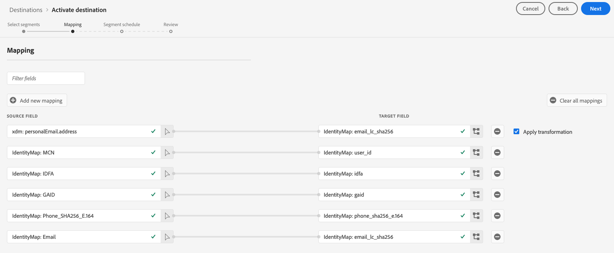

# 將描述檔和區段啟用至目標

將區段對應至目標，以啟動您在[!DNL Adobe Experience Platform]中擁有的資料。 若要完成此作業，請遵循下列步驟。

## 先決條件 {#prerequisites}

要將資料激活到目標，您必須成功地[連接了目標](./connect-destination.md)。 如果您尚未這麼做，請前往[目標目錄](../catalog/overview.md)，瀏覽支援的目標，並設定一或多個目標。

## 激活資料{#activate-data}

啟動工作流程中的步驟依目標類型略有不同。 以下列出所有目標類型的完整工作流程。

### 選擇要將資料激活到{#select-destination}的目標

適用於：所有目標

在Adobe Experience Platform用戶介面中，導覽至&#x200B;**[!UICONTROL 目標]** > **[!UICONTROL 瀏覽]**，然後按一下與您要啟用區段的目的地對應的&#x200B;**[!UICONTROL 啟動]**&#x200B;按鈕，如下圖所示。


請依照下一節的步驟，選取您要啟動的區段。

### [!UICONTROL 選取] 區段步驟  {#select-segments}

適用於：所有目標


在&#x200B;**[!UICONTROL 啟動目標]**&#x200B;工作流程中，在&#x200B;**[!UICONTROL 選擇區段]**&#x200B;頁面上，選取一或多個區段以啟動至目標。 選擇&#x200B;**[!UICONTROL Next]**&#x200B;繼續下一步。


### [!UICONTROL 身份映] 射步驟  {#identity-mapping}

適用於：社交目的地與Google客戶符合廣告目的地


對於社交目標，您必須選擇源屬性或身份名稱空間，以在目標中映射為目標身份。

#### 範例：啟用[!DNL Facebook Custom Audience] {#example-facebook}的觀眾資料

以下是在[!DNL Facebook]中啟用觀眾資料時正確身分對應的範例。

選擇源欄位：

* 如果您使用的電子郵件地址未雜湊，請選取`Email`命名空間作為來源識別。
* 如果您根據[!DNL Facebook] [電子郵件雜湊要求](../catalog/social/facebook.md#email-hashing-requirements)將客戶資料擷取的電子郵件地址雜湊到[!DNL Platform]中，請選取`Email_LC_SHA256`命名空間作為來源識別。
* 如果您的資料包含非雜湊的電話號碼，請選取`PHONE_E.164`命名空間作為來源識別。 [!DNL Platform] 會雜湊電話號碼以符合 [!DNL Facebook] 要求。
* 如果您根據[!DNL Facebook] [電話號碼雜湊要求](../catalog/social/facebook.md#phone-number-hashing-requirements)將資料擷取的電話號碼雜湊到[!DNL Platform]，請選取`Phone_SHA256`命名空間作為來源識別。
* 如果您的資料包含[!DNL Apple]裝置ID，請選取`IDFA`命名空間作為來源識別。
* 如果您的資料包含[!DNL Android]裝置ID，請選取`GAID`命名空間作為來源識別。
* 如果您的資料包含其他類型的識別碼，請選取`Custom`命名空間作為來源識別碼。

選擇目標欄位：

* 當源名稱空間為`Email`或`Email_LC_SHA256`時，選擇`Email_LC_SHA256`名稱空間作為目標標識。
* 當源名稱空間為`PHONE_E.164`或`Phone_SHA256`時，選擇`Phone_SHA256`名稱空間作為目標標識。
* 當源名稱空間為`IDFA`或`GAID`時，選擇`IDFA`或`GAID`名稱空間作為目標標識。
* 當您的來源名稱空間是自訂名稱空間時，請選取`Extern_ID`名稱空間作為目標識別。


啟動後，[!DNL Platform]會自動雜湊來自未雜湊名稱空間的資料。

屬性來源資料不會自動雜湊。 當您的來源欄位包含未雜湊的屬性時，請勾選「套用transformation ]**」選項，讓[!DNL Platform]在啟動時自動雜湊資料。**[!UICONTROL 

 

#### 範例：啟用[!DNL Google Customer Match] {#example-gcm}的觀眾資料

這是在[!DNL Google Customer Match]中啟用觀眾資料時正確身分對應的範例。

選擇源欄位：

* 如果您使用的電子郵件地址未雜湊，請選取`Email`命名空間作為來源識別。
* 如果您根據[!DNL Google Customer Match] [電子郵件雜湊要求](../catalog/social/../advertising/google-customer-match.md)將客戶資料擷取的電子郵件地址雜湊到[!DNL Platform]中，請選取`Email_LC_SHA256`命名空間作為來源識別。
* 如果您的資料包含非雜湊的電話號碼，請選取`PHONE_E.164`命名空間作為來源識別。 [!DNL Platform] 會雜湊電話號碼以符合 [!DNL Google Customer Match] 要求。
* 如果您根據[!DNL Facebook] [電話號碼雜湊要求](../catalog/social/../advertising/google-customer-match.md)將資料擷取的電話號碼雜湊到[!DNL Platform]，請選取`Phone_SHA256_E.164`命名空間作為來源識別。
* 如果您的資料包含[!DNL Apple]裝置ID，請選取`IDFA`命名空間作為來源識別。
* 如果您的資料包含[!DNL Android]裝置ID，請選取`GAID`命名空間作為來源識別。
* 如果您的資料包含其他類型的識別碼，請選取`Custom`命名空間作為來源識別碼。

選擇目標欄位：

* 當您的源名稱空間為`Email`或`Email_LC_SHA256`時，選擇`Email_LC_SHA256`名稱空間作為目標標識。
* 當源名稱空間為`PHONE_E.164`或`Phone_SHA256_E.164`時，選擇`Phone_SHA256_E.164`名稱空間作為目標標識。
* 當源名稱空間為`IDFA`或`GAID`時，選擇`IDFA`或`GAID`名稱空間作為目標標識。
* 當您的來源名稱空間是自訂名稱空間時，請選取`User_ID`名稱空間作為目標識別。



啟動後，[!DNL Platform]會自動雜湊來自未雜湊名稱空間的資料。

屬性來源資料不會自動雜湊。 當您的來源欄位包含未雜湊的屬性時，請勾選「套用transformation ]**」選項，讓[!DNL Platform]在啟動時自動雜湊資料。**[!UICONTROL 

<!-- 
`IDFA` IDs will be mapped to:

* [MADID](https://developers.facebook.com/docs/marketing-api/audiences/guides/custom-audiences#hash) if you are activating audiences in [[!DNL Facebook]](../../destinations/catalog/social/facebook.md).
* [mobileId](https://developers.google.com/adwords/api/docs/reference/v201809/AdwordsUserListService.Member#mobileid) if you are activating audiences in [[!DNL Google Customer Match]](../../destinations/catalog/advertising/google-customer-match.md).

Select `GAID` as target identity if your data consists of Android device IDs. `GAID` IDs will be mapped to:

* [MADID](https://developers.facebook.com/docs/marketing-api/audiences/guides/custom-audiences#hash) if you are activating audiences in [[!DNL Facebook]](../../destinations/catalog/social/facebook.md).
* [mobileId](https://developers.google.com/adwords/api/docs/reference/v201809/AdwordsUserListService.Member#mobileid) if you are activating audiences in [[!DNL Google Customer Match]](../../destinations/catalog/advertising/google-customer-match.md).

If you are using another ID, such as "Rewards ID" or "Loyalty ID", as primary identity in your schema, you need to map it to the following target identities:

* [EXTERN_ID](https://developers.facebook.com/docs/marketing-api/audiences/guides/custom-audiences#external_identifiers) if you are activating audiences in [[!DNL Facebook]](../../destinations/catalog/social/facebook.md).
* [USER_ID](https://developers.google.com/adwords/api/docs/reference/v201809/AdwordsUserListService.Member#userid) if you are activating audiences in [[!DNL Google Customer Match]](../../destinations/catalog/advertising/google-customer-match.md). -->

### **[!UICONTROL Configurestep]**   {#configure}

適用於：電子郵件行銷目的地和雲端儲存空間目的地


[!DNL Adobe Experience Platform] 以檔案形式匯出電子郵件行銷和雲端儲存目的地的 [!DNL CSV] 資料。在&#x200B;**[!UICONTROL Configure]**&#x200B;步驟中，您可以為要導出的每個段配置時間表和檔案名。 配置計畫是強制的，但配置檔案名是可選的。

>[!IMPORTANT]
> 
>[!DNL Adobe Experience Platform] 自動將匯出檔案分割為每個檔案500萬個記錄（列）。每一行代表一個描述檔。
>
>分割檔案名稱會附加一個數字，指出檔案是較大匯出的一部分，例如：`filename.csv`、`filename_2.csv`、`filename_3.csv`。


要添加段的調度，請選擇&#x200B;**[!UICONTROL 建立調度]**。


此時會出現對話方塊，顯示建立區段排程的選項。

* **檔案匯出**:您可以選擇導出完整檔案或增量檔案。匯出完整檔案會發佈符合該區段之所有描述檔的完整快照。 匯出增量檔案會發佈自上次匯出以來符合該區段資格的描述檔增量。
* **頻率**:如果 **[!UICONTROL 選取「]** 匯出完整檔案」，您可以選擇匯出 **** 「Onceor  **[!UICONTROL Daily]**」。如果選擇了「導出增量檔案」**[!UICONTROL ，則您只能導出**[!UICONTROL  Daily ]**。]**&#x200B;導出檔案&#x200B;**[!UICONTROL Once]**&#x200B;一次導出檔案。 導出檔案&#x200B;**[!UICONTROL Daily]**&#x200B;時，如果選擇了完整檔案，則每天從開始日期導出檔案到結束日期(UTC:00 PM EST:7:00)。如果選擇了增量檔案，則每天導出檔案。
* **日期**:如果 **** 選取「一次性」，您可以選取一次性匯出的日期。如果選擇了&#x200B;**[!UICONTROL Daily]**，則可以選擇導出的開始和結束日期。


預設檔案名稱包含目標名稱、區段ID和日期和時間指標。 例如，您可以編輯匯出的檔案名稱，以區分不同的促銷活動，或將資料匯出時間附加至檔案。

選取鉛筆圖示以開啟模式視窗並編輯檔案名稱。 請注意，檔案名稱的限制為255個字元。


在檔案名編輯器中，可以選擇要添加到檔案名中的不同元件。 無法從檔案名稱中移除目標名稱和區段ID。 除了這些外，您還可以新增下列項目：

* **[!UICONTROL 區段名稱]**:您可以將區段名稱附加至檔案名稱。
* **[!UICONTROL 日期和時間]**:選擇添加格 `MMDDYYYY_HHMMSS` 式或生成檔案時的Unix 10位時間戳。如果您希望檔案在每次增量匯出時產生動態檔案名稱，請選擇其中一個選項。
* **[!UICONTROL 自訂文字]**:新增自訂文字至檔案名稱。

選擇&#x200B;**[!UICONTROL 應用更改]**&#x200B;以確認您的選擇。

>[!IMPORTANT]
> 
>如果您未選擇&#x200B;**[!UICONTROL 日期和時間]**&#x200B;元件，則檔案名將是靜態的，新導出的檔案將用每次導出覆蓋儲存位置中的先前檔案。 當從儲存位置將重複匯入工作執行至電子郵件行銷平台時，建議使用此選項。


完成所有區段的設定後，請選取&#x200B;**[!UICONTROL Next]**&#x200B;繼續。

### **[!UICONTROL 區段排]** 程  {#segment-schedule}

適用於：廣告目的地，社交目的地


在&#x200B;**[!UICONTROL 區段排程]**&#x200B;頁面上，您可以設定傳送資料至目的地的開始日期，以及傳送資料至目的地的頻率。

>[!IMPORTANT]
>
>對於社交目的地，您必須在此步驟中選取對象的來源。 您只能在選取下圖中的其中一個選項後，才可繼續下一步。


>[!IMPORTANT]
>
>若是Google客戶符合，在啟動[!DNL IDFA]或[!DNL GAID]區段時，您必須在此步驟中提供[!UICONTROL 應用程式ID]。


### **[!UICONTROL 排]** 程步驟  {#scheduling}

適用於：電子郵件行銷目的地和雲端儲存目的地


在&#x200B;**[!UICONTROL 計畫]**&#x200B;頁面上，您可以看到將資料傳送至目的地的開始日期以及傳送資料至目的地的頻率。 無法編輯這些值。

### **[!UICONTROL 選擇屬]** 性步驟  {#select-attributes}

適用於：電子郵件行銷目的地和雲端儲存目的地


在&#x200B;**[!UICONTROL 選擇屬性]**&#x200B;頁面上，選擇&#x200B;**[!UICONTROL 添加新欄位]**&#x200B;並選擇要發送到目標的屬性。

>[!NOTE]
>
> Adobe Experience Platform在您的選擇中預先填入四個建議、常用的架構屬性：`person.name.firstName`、`person.name.lastName`、`personalEmail.address`、`segmentMembership.status`。

檔案匯出會依下列方式而有所不同，視是否選取`segmentMembership.status`而定：
* 如果選擇了`segmentMembership.status`欄位，則導出的檔案在初始完整快照中包括&#x200B;**[!UICONTROL Active]**&#x200B;成員，在後續增量導出中包括&#x200B;**[!UICONTROL Active]**&#x200B;和&#x200B;**[!UICONTROL Expired]**&#x200B;成員。
* 如果未選擇`segmentMembership.status`欄位，則導出的檔案在初始完整快照和後續增量導出中僅包括&#x200B;**[!UICONTROL Active]**&#x200B;成員。


此外，您可以將不同的屬性標示為必填。 將屬性標示為強制屬性，則會使其變成匯出的區段必須包含該屬性。 因此，它可以用作其他過濾形式。 將屬性標籤為必要屬性是&#x200B;**not**。

建議其中一個屬性是架構中的[唯一標識符](../../destinations/catalog/email-marketing/overview.md#identity)。 如需必要屬性的詳細資訊，請參閱[電子郵件行銷目標](../../destinations/catalog/email-marketing/overview.md#identity)檔案中的識別區段。

>[!NOTE]
> 
>如果任何資料使用標籤已套用至資料集內的特定欄位（而非整個資料集），在啟動時會在下列情況下強制執行這些欄位層級標籤：
>* 欄位會用於區段定義中。
>* 欄位被配置為目標目標的預計屬性。

>
> 
例如，如果欄位`person.name.firstName`具有與目標的市場營銷操作衝突的特定資料使用標籤，則在複查步驟中將顯示資料使用策略違規。 如需詳細資訊，請參閱[Adobe Experience Platform的資料治理](../../rtcdp/privacy/data-governance-overview.md#destinations)。

### **[!UICONTROL 檢]** 視步驟  {#review}

適用於：所有目標


在&#x200B;**[!UICONTROL Review]**&#x200B;頁面上，您可以看到您所選內容的摘要。 選擇&#x200B;**[!UICONTROL 取消]**&#x200B;以劃分流程，選擇&#x200B;**[!UICONTROL 返回]**&#x200B;以修改設定，或選擇&#x200B;**[!UICONTROL 完成]**&#x200B;以確認選擇並開始向目標發送資料。

>[!IMPORTANT]
>
>在此步驟中，Adobe Experience Platform會檢查資料使用政策違規。 以下是違反原則的範例。 除非您解決違規問題，否則無法完成區段啟動工作流程。 有關如何解決策略違規的資訊，請參見資料治理文檔部分中的[策略實施](../../rtcdp/privacy/data-governance-overview.md#enforcement)。


如果未檢測到任何違反策略的情況，請選擇&#x200B;**[!UICONTROL 完成]**&#x200B;以確認選擇並開始向目標發送資料。


## 編輯啟動{#edit-activation}

請依照下列步驟編輯Adobe Experience Platform現有的啟動流程：

1. 在左側導覽列中選擇&#x200B;**[!UICONTROL 目標]**，然後按一下&#x200B;**[!UICONTROL 瀏覽]**&#x200B;標籤，然後按一下目標名稱。
2. 選擇右側導軌中的&#x200B;**[!UICONTROL 編輯啟動]**&#x200B;以變更要傳送至目的地的區段。

## 確認區段啟動成功{#verify-activation}

### 電子郵件行銷目標和雲端儲存空間目標{#esp-and-cloud-storage}

對於電子郵件行銷目標和雲端儲存目標，Adobe Experience Platform會在您提供的儲存位置建立以Tab分隔的`.csv`或`.txt`檔案。 希望每天在您的儲存位置中建立一個新檔案。 預設檔案格式為：
`<destinationName>_segment<segmentID>_<timestamp-yyyymmddhhmmss>.csv|txt`

請注意，您可以編輯檔案格式。 如需詳細資訊，請前往雲端儲存空間目標和電子郵件行銷目標的「設定」步驟。[](#configure)

使用預設檔案格式，您在連續三天收到的檔案可能如下所示：

```console
Salesforce_Marketing_Cloud_segment12341e18-abcd-49c2-836d-123c88e76c39_20200408061804.csv
Salesforce_Marketing_Cloud_segment12341e18-abcd-49c2-836d-123c88e76c39_20200409052200.csv
Salesforce_Marketing_Cloud_segment12341e18-abcd-49c2-836d-123c88e76c39_20200410061130.csv
```

這些檔案在您的儲存位置即表示確認是否成功啟動。 若要瞭解匯出檔案的結構，您可以[下載範例。csv檔案](../assets/common/sample_export_file_segment12341e18-abcd-49c2-836d-123c88e76c39_20200408061804.csv)。 此示例檔案包括配置檔案屬性`person.firstname`、`person.lastname`、`person.gender`、`person.birthyear`和`personalEmail.address`。

### 廣告目的地

在您要啟動資料的各個廣告目的地檢查您的帳戶。 如果啟動成功，您的廣告平台會填入受眾。

### 社交網路目的地

對於[!DNL Facebook]，成功啟動表示[!DNL Facebook]自訂對象將以程式設計方式在[[!UICONTROL Facebook廣告管理員]](https://www.facebook.com/adsmanager/manage/)中建立。 當使用者符合已啟用區段的資格或被取消資格時，會新增及移除觀眾中的區段成員資格。

>[!TIP]
>
>Adobe Experience Platform與[!DNL Facebook]之間的整合支援歷史讀者回填。 當您將區段啟動至目標時，所有歷史區段資格都會傳送至[!DNL Facebook]。

## 停用啟動{#disable-activation}

若要停用現有的啟動流程，請遵循下列步驟：

1. 在左側導覽列中選擇&#x200B;**[!UICONTROL 目標]**，然後按一下&#x200B;**[!UICONTROL 瀏覽]**&#x200B;標籤，然後按一下目標名稱。
2. 按一下右側導軌中的&#x200B;**[!UICONTROL Enabled]**&#x200B;控制項，以變更啟動流程狀態。
3. 在&#x200B;**更新資料流狀態**&#x200B;窗口中，選擇&#x200B;**確認**&#x200B;禁用激活流。
