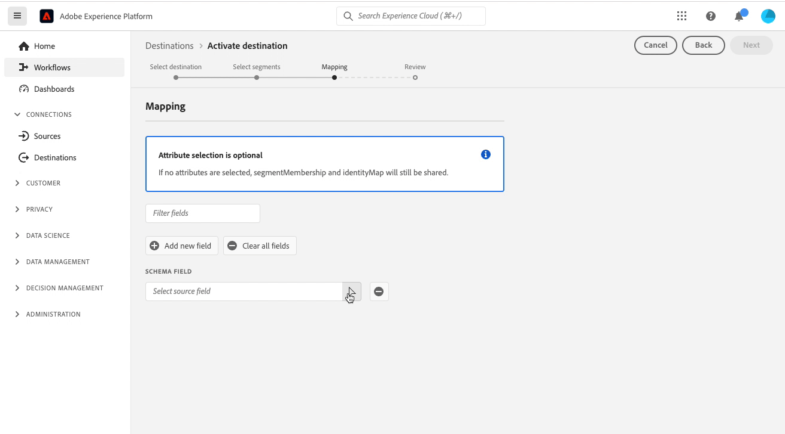

# 對設定檔要求目的地啟用受眾資料

>[!IMPORTANT]
> 
> * 啟用資料並啟用 [對應步驟](#mapping) 工作流程中，您需要 **[!UICONTROL 管理目的地]**, **[!UICONTROL 啟動目的地]**, **[!UICONTROL 檢視設定檔]**，和 **[!UICONTROL 檢視區段]** [存取控制權限](/help/access-control/home.md#permissions).
> * 若要啟動資料，而不要透過 [對應步驟](#mapping) 工作流程中，您需要 **[!UICONTROL 管理目的地]**, **[!UICONTROL 啟用區段而不對應]**, **[!UICONTROL 檢視設定檔]**，和 **[!UICONTROL 檢視區段]** [存取控制權限](/help/access-control/home.md#permissions).
> 
> 閱讀 [存取控制概觀](/help/access-control/ui/overview.md) 或聯絡您的產品管理員以取得所需的權限。

## 總覽 {#overview}

本文說明在Adobe Experience Platform設定檔要求目的地中啟用受眾資料所需的工作流程。 搭配使用時 [邊緣分割](../../segmentation/ui/edge-segmentation.md)，這些目的地可在您的網頁和行動屬性上啟用相同頁面和下一頁個人化使用案例。 深入了解 [啟用同頁和下一頁個人化使用案例](/help/destinations/ui/configure-personalization-destinations.md).

設定檔要求目的地的範例為 [Adobe Target](../../destinations/catalog/personalization/adobe-target-connection.md) 和 [自訂個人化](../../destinations/catalog/personalization/custom-personalization.md) 連線。

## 先決條件 {#prerequisites}

若要將資料啟用至目的地，您必須成功 [連接到目的地](./connect-destination.md). 如果尚未這麼做，請前往 [目的地目錄](../catalog/overview.md)，瀏覽支援的個人化目的地，並設定您要使用的目的地。

### 區段合併原則 {#merge-policy}

目前，設定檔要求目的地僅支援啟用使用 [邊緣活動合併策略](../../segmentation/ui/segment-builder.md#merge-policies) 設為預設值。

## 選取您的目的地 {#select-destination}

1. 前往 **[!UICONTROL 連線>目的地]**，然後選取 **[!UICONTROL 目錄]** 標籤。

   

1. 選擇 **[!UICONTROL 啟用區段]** 在對應至您要啟用區段之個人化目的地的卡片上，如下圖所示。

   

1. 選取您要用來啟用區段的目的地連線，然後選取 **[!UICONTROL 下一個]**.

   

1. 移至下一節，以 [選取區段](#select-segments).

## 選取您的區段 {#select-segments}

使用區段名稱左側的核取方塊，選取您要啟用至目的地的區段，然後選取 **[!UICONTROL 下一個]**.

## （測試版）對應屬性 {#map-attributes}

>[!IMPORTANT]
>
>對應步驟，可針對 [Adobe Target](/help/destinations/catalog/personalization/adobe-target-connection.md) 和 [一般個人化目的地](/help/destinations/catalog/personalization/custom-personalization.md)，目前為測試版，而您的組織可能尚未取得存取權。 本檔案可能會有所變更。

選取您要為使用者啟用個人化使用案例的屬性。 這表示如果屬性值變更，或將屬性新增至設定檔，該設定檔將成為區段的成員，並啟動至個人化目的地。

新增屬性是選用的，您仍可以繼續下一個步驟，並啟用同頁和下一頁個人化，而不需選取屬性。 如果您在此步驟中未新增任何屬性，仍會根據設定檔的區段成員資格和身分對應資格來進行個人化。

### 選擇源屬性 {#select-source-attributes}

要添加源屬性，請選擇 **[!UICONTROL 新增欄位]** 控制 **[!UICONTROL 源欄位]** 欄，並搜尋或導覽至您所需的XDM屬性欄位，如下所示。

### 選擇目標屬性 {#select-target-attributes}

>[!NOTE]
>
>某些目的地只要求您選取來源屬性，而其他目的地則要求同時選取來源屬性和目標屬性。
>
>目前， [Adobe Target V2](../catalog/personalization/adobe-target-connection.md) 目的地僅需要源屬性，而 [使用屬性自訂個人化](../catalog/personalization/custom-personalization.md) 需要源屬性和目標屬性。

若要新增目標屬性，請選取 **[!UICONTROL 新增欄位]** 控制 **[!UICONTROL 目標欄位]** 欄和輸入要映射源屬性的自定義屬性名稱。

## 排程區段匯出 {#scheduling}

依預設， [!UICONTROL 區段排程] 頁面只會顯示您在目前啟動流程中選取的新區段。

若要查看所有要啟動至目的地的區段，請使用篩選選項並停用 **[!UICONTROL 僅顯示新區段]** 篩選。

在 **[!UICONTROL 區段排程]** 頁面，選取每個區段，然後使用 **[!UICONTROL 開始日期]** 和 **[!UICONTROL 結束日期]** 設定傳送資料至目的地的時間間隔的選取器。

選擇 **[!UICONTROL 下一個]** 前往 [!UICONTROL 檢閱] 頁面。

## 請檢閱 {#review}

在 **[!UICONTROL 檢閱]** 頁面，您可以看到您所選內容的摘要。 選擇 **[!UICONTROL 取消]** 來分解流， **[!UICONTROL 返回]** 修改設定，或 **[!UICONTROL 完成]** 確認您的選擇並開始將資料傳送至目的地。

### 同意政策評估 {#consent-policy-evaluation}

如果您的組織購買了 **Adobe Healthcare Shield** 或 **Adobe Privacy &amp; Security Shield**，請選取&#x200B;**[!UICONTROL 檢視適用的同意原則]**，以查看套用了哪些同意原則以及由於這些原則啟動中包含了多少個設定檔。閱讀 [同意政策評估](/help/data-governance/enforcement/auto-enforcement.md#consent-policy-evaluation) 以取得更多資訊。

### 資料使用原則檢查 {#data-usage-policy-checks}

在 **[!UICONTROL 檢閱]** 步驟中，Experience Platform也會檢查是否有任何資料使用策略違規。 以下顯示違反原則的範例。 除非您解決違規，否則無法完成區段啟用工作流程。 有關如何解決策略違規的資訊，請參閱 [資料使用策略違規](/help/data-governance/enforcement/auto-enforcement.md#data-usage-violation) （位於資料控管檔案一節）。

### 篩選區段 {#filter-segments}

此外，在此步驟中，您也可以使用頁面上的可用篩選器，以僅顯示排程或對應已隨此工作流程更新的區段。 您也可以切換要查看的表格欄。

如果您對您的選擇感到滿意，並且未檢測到任何違反策略的情況，請選擇 **[!UICONTROL 完成]** 確認您的選擇並開始將資料傳送至目的地。

<!--

Commenting out this part since destination monitoring is not available currently for the Adobe Target and Custom Personalization destinations.

## Verify segment activation {#verify}

Check the [destination monitoring documentation](../../dataflows/ui/monitor-destinations.md) for detailed information on how to monitor the flow of data to your destinations.

-->